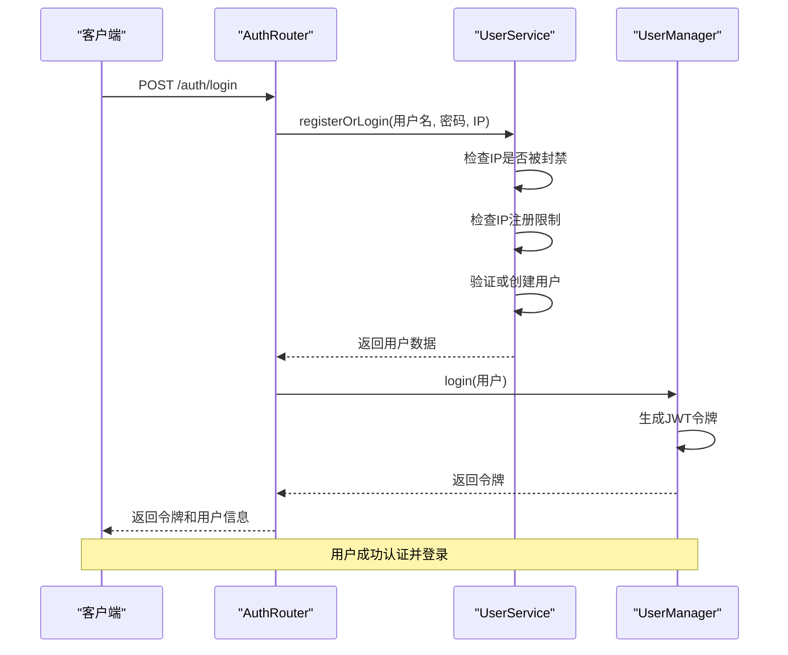
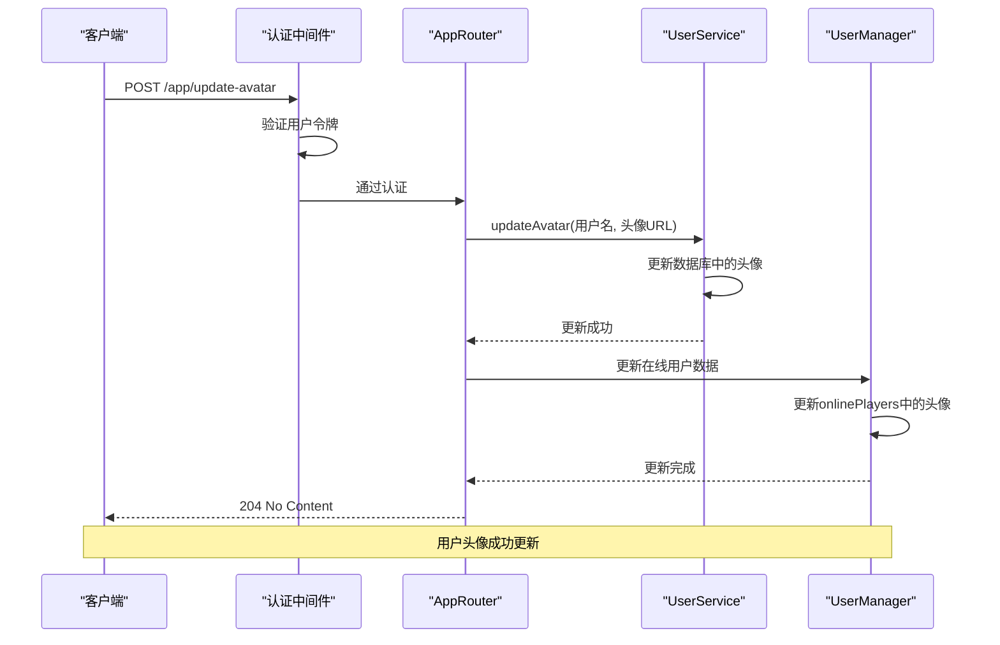
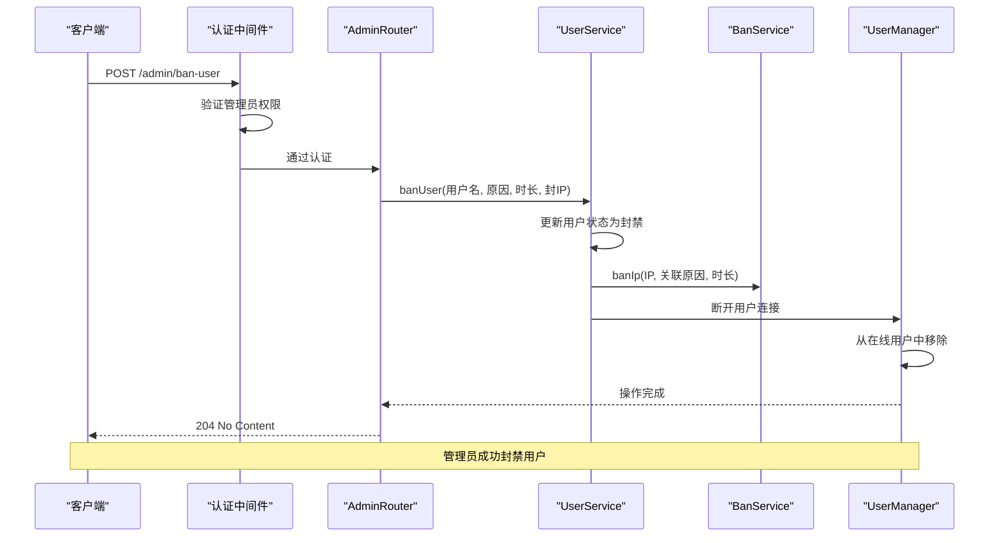

# API参考

<cite>
**本文档引用的文件**  
- [auth.ts](file://server/src/routes/auth.ts)
- [app.ts](file://server/src/routes/app.ts)
- [admin.ts](file://server/src/routes/admin.ts)
- [UserService.ts](file://server/src/db/services/UserService.ts)
- [UserManager.ts](file://server/src/UserManager.ts)
- [BanService.ts](file://server/src/db/services/BanService.ts)
- [auth.ts](file://server/src/middleware/auth.ts)
</cite>

## 目录
1. [简介](#简介)
2. [认证API](#认证api)
3. [应用API](#应用api)
4. [管理API](#管理api)
5. [安全考虑](#安全考虑)
6. [错误码](#错误码)
7. [使用示例](#使用示例)

## 简介
本API参考文档详细介绍了resgsv1项目提供的所有公共接口。系统基于Express框架构建，采用JWT进行身份验证，通过MongoDB存储用户数据和系统配置。API分为三个主要模块：认证API（auth.ts）、应用API（app.ts）和管理API（admin.ts），分别处理用户登录注册、用户资料更新和管理员操作。

**本文档引用的文件**
- [auth.ts](file://server/src/routes/auth.ts)
- [app.ts](file://server/src/routes/app.ts)
- [admin.ts](file://server/src/routes/admin.ts)

## 认证API

认证API负责处理用户的登录和注册流程。所有用户在首次登录时会自动注册，系统会检查IP地址的注册限制和封禁状态。



**图示来源**
- [auth.ts](file://server/src/routes/auth.ts#L15-L55)
- [UserService.ts](file://server/src/db/services/UserService.ts#L10-L85)
- [UserManager.ts](file://server/src/UserManager.ts#L40-L60)

### 登录/注册端点
- **HTTP方法**: POST
- **URL模式**: `/auth/login`
- **请求参数**:
  - `username`: 字符串，用户名
  - `password`: 字符串，密码
  - `client_version`: 字符串，客户端版本号
- **请求体结构**:
```json
{
  "username": "player1",
  "password": "securePassword123",
  "client_version": "1.0.92"
}
```
- **响应格式**:
```json
{
  "token": "jwt_token_string",
  "user": {
    "username": "player1",
    "profile": {
      "avatar": "avatar_url",
      "title": "title_string"
    },
    "privileges": {
      "admin": false,
      "tester": false
    }
  }
}
```
- **可能的错误码**:
  - 401: 客户端版本无效
  - 401: 无效的用户名或密码
  - 401: IP地址已被封禁
  - 401: IP注册达到限制

**本节来源**
- [auth.ts](file://server/src/routes/auth.ts#L15-L55)
- [UserService.ts](file://server/src/db/services/UserService.ts#L10-L85)

## 应用API

应用API提供核心服务功能，允许已认证用户更新其个人资料信息。



**图示来源**
- [app.ts](file://server/src/routes/app.ts#L15-L35)
- [UserService.ts](file://server/src/db/services/UserService.ts#L340-L355)
- [UserManager.ts](file://server/src/UserManager.ts#L10-L20)

### 更新头像端点
- **HTTP方法**: POST
- **URL模式**: `/app/update-avatar`
- **认证要求**: 需要有效的用户令牌
- **请求参数**:
  - `avatar`: 字符串，头像URL
- **请求头**:
  - `x-user-name`: URL编码的用户名
  - `x-user-token`: JWT令牌
- **请求体结构**:
```json
{
  "avatar": "http://example.com/avatar.png"
}
```
- **响应格式**: 204 No Content (无响应体)
- **可能的错误码**:
  - 400: 更新失败
  - 401: 认证必需
  - 403: 用户令牌必需

**本节来源**
- [app.ts](file://server/src/routes/app.ts#L15-L35)
- [UserService.ts](file://server/src/db/services/UserService.ts#L340-L355)

## 管理API

管理API提供管理员专用功能，包括用户和IP的封禁、解封以及系统广播等操作。



**图示来源**
- [admin.ts](file://server/src/routes/admin.ts#L25-L75)
- [UserService.ts](file://server/src/db/services/UserService.ts#L90-L130)
- [BanService.ts](file://server/src/db/services/BanService.ts#L15-L30)
- [UserManager.ts](file://server/src/UserManager.ts#L100-L120)

### 封禁IP
- **HTTP方法**: POST
- **URL模式**: `/admin/ban-ip`
- **认证要求**: 需要管理员权限
- **请求参数**:
  - `ip`: 字符串，要封禁的IP地址
  - `reason`: 字符串，封禁原因
  - `times`: 数字，封禁时长（毫秒）
- **请求体结构**:
```json
{
  "ip": "192.168.1.1",
  "reason": "恶意行为",
  "times": 86400000
}
```
- **响应格式**: 204 No Content (无响应体)
- **可能的错误码**:
  - 400: 操作失败
  - 401: 认证必需
  - 403: 需要管理员权限

### 解封IP
- **HTTP方法**: DELETE
- **URL模式**: `/admin/unban-ip/:ip`
- **认证要求**: 需要管理员权限
- **路径参数**:
  - `ip`: 要解封的IP地址
- **响应格式**: 204 No Content (无响应体)
- **可能的错误码**:
  - 400: 操作失败
  - 401: 认证必需
  - 403: 需要管理员权限

### 封禁用户
- **HTTP方法**: POST
- **URL模式**: `/admin/ban-user`
- **认证要求**: 需要管理员权限
- **请求参数**:
  - `username`: 字符串，用户名
  - `reason`: 字符串，封禁原因
  - `times`: 数字，封禁时长（毫秒）
  - `banIp`: 布尔值，是否连带封禁IP
- **请求体结构**:
```json
{
  "username": "player1",
  "reason": "违反规则",
  "times": 86400000,
  "banIp": true
}
```
- **响应格式**: 204 No Content (无响应体)
- **可能的错误码**:
  - 400: 操作失败
  - 401: 认证必需
  - 403: 需要管理员权限

### 解封用户
- **HTTP方法**: POST
- **URL模式**: `/admin/unban-user`
- **认证要求**: 需要管理员权限
- **请求参数**:
  - `username`: 字符串，用户名
- **请求体结构**:
```json
{
  "username": "player1"
}
```
- **响应格式**: 204 No Content (无响应体)
- **可能的错误码**:
  - 400: 操作失败
  - 401: 认证必需
  - 403: 需要管理员权限

### 禁止用户游戏
- **HTTP方法**: POST
- **URL模式**: `/admin/ban-game`
- **认证要求**: 需要管理员权限
- **请求参数**:
  - `username`: 字符串，用户名
  - `reason`: 字符串，封禁原因
  - `times`: 数字，封禁时长（毫秒）
- **请求体结构**:
```json
{
  "username": "player1",
  "reason": "游戏作弊",
  "times": 86400000
}
```
- **响应格式**: 204 No Content (无响应体)
- **可能的错误码**:
  - 400: 操作失败
  - 401: 认证必需
  - 403: 需要管理员权限

### 解除游戏封禁
- **HTTP方法**: POST
- **URL模式**: `/admin/unban-game`
- **认证要求**: 需要管理员权限
- **请求参数**:
  - `username`: 字符串，用户名
- **请求体结构**:
```json
{
  "username": "player1"
}
```
- **响应格式**: 204 No Content (无响应体)
- **可能的错误码**:
  - 400: 操作失败
  - 401: 认证必需
  - 403: 需要管理员权限

### 禁止用户发言
- **HTTP方法**: POST
- **URL模式**: `/admin/ban-muted`
- **认证要求**: 需要管理员权限
- **请求参数**:
  - `username`: 字符串，用户名
  - `reason`: 字符串，封禁原因
  - `times`: 数字，封禁时长（毫秒）
- **请求体结构**:
```json
{
  "username": "player1",
  "reason": "不当言论",
  "times": 86400000
}
```
- **响应格式**: 204 No Content (无响应体)
- **可能的错误码**:
  - 400: 操作失败
  - 401: 认证必需
  - 403: 需要管理员权限

### 解除用户禁言
- **HTTP方法**: POST
- **URL模式**: `/admin/unban-muted`
- **认证要求**: 需要管理员权限
- **请求参数**:
  - `username`: 字符串，用户名
- **请求体结构**:
```json
{
  "username": "player1"
}
```
- **响应格式**: 204 No Content (无响应体)
- **可能的错误码**:
  - 400: 操作失败
  - 401: 认证必需
  - 403: 需要管理员权限

### 获取IP黑名单
- **HTTP方法**: GET
- **URL模式**: `/admin/ip-blacklist`
- **认证要求**: 需要管理员权限
- **响应格式**:
```json
[
  {
    "ip": "192.168.1.1",
    "reason": "恶意行为",
    "bannedAt": "2023-01-01T00:00:00.000Z",
    "expiresAt": "2023-01-02T00:00:00.000Z"
  }
]
```
- **可能的错误码**:
  - 500: 服务器内部错误
  - 401: 认证必需
  - 403: 需要管理员权限

### 公告广播
- **HTTP方法**: POST
- **URL模式**: `/admin/broadcast`
- **认证要求**: 需要管理员权限
- **请求参数**:
  - `message`: 字符串，广播内容
- **请求体结构**:
```json
{
  "message": "服务器将在10分钟后重启"
}
```
- **响应格式**: 204 No Content (无响应体)
- **可能的错误码**:
  - 400: 操作失败
  - 401: 认证必需
  - 403: 需要管理员权限

**本节来源**
- [admin.ts](file://server/src/routes/admin.ts#L25-L225)
- [UserService.ts](file://server/src/db/services/UserService.ts#L90-L230)
- [BanService.ts](file://server/src/db/services/BanService.ts#L15-L60)
- [UserManager.ts](file://server/src/UserManager.ts#L130-L140)

## 安全考虑

### 认证机制
系统采用多层认证机制确保安全性：
1. **JWT令牌**: 用户登录后生成JWT令牌，有效期为7天
2. **管理员验证**: 管理员操作需要验证用户是否具有管理员权限
3. **IP封禁**: 支持IP级别的封禁，防止恶意用户通过更换账号继续访问

### 数据验证
- 所有用户输入都经过严格验证
- 密码使用bcrypt进行哈希存储
- IP地址注册有限制，防止滥用

### 权限分离
- 普通用户只能更新自己的资料
- 管理员拥有特定权限才能执行管理操作
- 系统自动检查权限并拒绝未授权的请求

**本节来源**
- [auth.ts](file://server/src/routes/auth.ts#L15-L55)
- [middleware/auth.ts](file://server/src/middleware/auth.ts#L1-L50)
- [UserService.ts](file://server/src/db/services/UserService.ts#L10-L85)

## 错误码

| 状态码 | 错误信息 | 说明 |
|--------|---------|------|
| 400 | Bad Request | 请求格式错误或参数无效 |
| 401 | Authentication required | 需要认证 |
| 401 | Client Version Invalid | 客户端版本无效 |
| 401 | Invalid | 无效的用户名或密码 |
| 401 | IP address is banned | IP地址已被封禁 |
| 401 | IP has reached the registration limit | IP注册达到限制 |
| 403 | Admin privileges required | 需要管理员权限 |
| 403 | User Token required | 用户令牌必需 |
| 500 | Internal Server Error | 服务器内部错误 |

**本节来源**
- [auth.ts](file://server/src/routes/auth.ts#L15-L55)
- [app.ts](file://server/src/routes/app.ts#L15-L35)
- [admin.ts](file://server/src/routes/admin.ts#L25-L225)

## 使用示例

### 登录/注册示例
使用curl命令：
```bash
curl -X POST https://api.resgsv1.com/auth/login \
  -H "Content-Type: application/json" \
  -d '{
    "username": "player1",
    "password": "securePassword123",
    "client_version": "1.0.92"
  }'
```

使用JavaScript：
```javascript
fetch('https://api.resgsv1.com/auth/login', {
  method: 'POST',
  headers: {
    'Content-Type': 'application/json',
  },
  body: JSON.stringify({
    username: 'player1',
    password: 'securePassword123',
    client_version: '1.0.92'
  })
})
.then(response => response.json())
.then(data => {
  console.log('登录成功:', data.token);
  // 保存令牌用于后续请求
  localStorage.setItem('token', data.token);
  localStorage.setItem('username', data.user.username);
});
```

### 更新头像示例
使用curl命令：
```bash
curl -X POST https://api.resgsv1.com/app/update-avatar \
  -H "Content-Type: application/json" \
  -H "x-user-name: player1" \
  -H "x-user-token: jwt_token_string" \
  -d '{
    "avatar": "http://example.com/new-avatar.png"
  }'
```

使用JavaScript：
```javascript
const token = localStorage.getItem('token');
const username = localStorage.getItem('username');

fetch('https://api.resgsv1.com/app/update-avatar', {
  method: 'POST',
  headers: {
    'Content-Type': 'application/json',
    'x-user-name': encodeURIComponent(username),
    'x-user-token': encodeURIComponent(token)
  },
  body: JSON.stringify({
    avatar: 'http://example.com/new-avatar.png'
  })
})
.then(response => {
  if (response.status === 204) {
    console.log('头像更新成功');
  } else {
    console.error('更新失败');
  }
});
```

### 管理员封禁用户示例
使用curl命令：
```bash
curl -X POST https://api.resgsv1.com/admin/ban-user \
  -H "Content-Type: application/json" \
  -H "x-user-name: admin" \
  -H "x-user-token: admin_jwt_token" \
  -d '{
    "username": "player1",
    "reason": "违反游戏规则",
    "times": 86400000,
    "banIp": true
  }'
```

使用JavaScript：
```javascript
const adminToken = localStorage.getItem('token');
const adminUsername = localStorage.getItem('username');

fetch('https://api.resgsv1.com/admin/ban-user', {
  method: 'POST',
  headers: {
    'Content-Type': 'application/json',
    'x-user-name': encodeURIComponent(adminUsername),
    'x-user-token': encodeURIComponent(adminToken)
  },
  body: JSON.stringify({
    username: 'player1',
    reason: '违反游戏规则',
    times: 86400000, // 24小时
    banIp: true
  })
})
.then(response => {
  if (response.status === 204) {
    console.log('用户封禁成功');
  } else {
    console.error('操作失败');
  }
});
```

**本节来源**
- [auth.ts](file://server/src/routes/auth.ts#L15-L55)
- [app.ts](file://server/src/routes/app.ts#L15-L35)
- [admin.ts](file://server/src/routes/admin.ts#L25-L225)