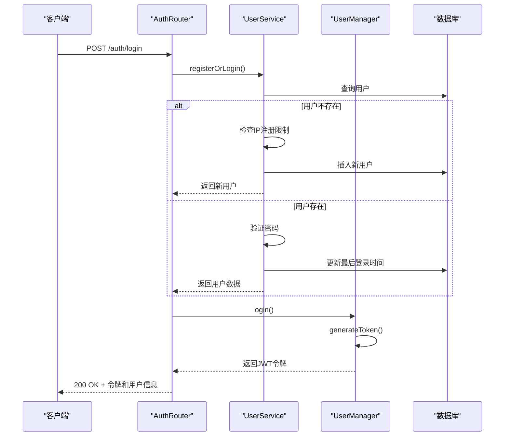

# REST API

<cite>
**本文档中引用的文件**  
- [app.ts](file://server/src/routes/app.ts#L1-L42)
- [admin.ts](file://server/src/routes/admin.ts#L1-L230)
- [auth.ts](file://server/src/routes/auth.ts#L1-L60)
- [UserManager.ts](file://server/src/UserManager.ts#L1-L150)
- [UserService.ts](file://server/src/db/services/UserService.ts#L1-L381)
</cite>

## 目录
1. [简介](#简介)
2. [API版本控制与兼容性](#apiversion)
3. [错误处理机制](#error)
4. [速率限制与配额](#rate-limit)
5. [核心API端点](#core-api)
6. [管理接口](#admin-api)
7. [认证与会话管理](#auth-api)
8. [用户状态与房间管理](#user-room)
9. [API调用序列图](#sequence-diagram)
10. [客户端代码示例](#client-example)

## 简介

本API文档详细描述了resgsv1服务端的RESTful接口设计，涵盖用户认证、头像管理、权限控制、封禁操作及广播功能。API基于Express框架构建，采用JWT进行身份验证，并通过MongoDB持久化用户数据。系统通过UserManager类统一管理在线用户状态和会话，确保数据一致性。

**Section sources**
- [app.ts](file://server/src/routes/app.ts#L1-L42)
- [admin.ts](file://server/src/routes/admin.ts#L1-L230)
- [auth.ts](file://server/src/routes/auth.ts#L1-L60)

## API版本控制与兼容性

当前API未显式包含版本号在URL路径中，但通过客户端版本校验机制实现兼容性控制。在`/auth/login`端点中，服务端会验证请求体中的`client_version`字段，仅接受版本为`1.0.92`的客户端连接。此设计确保了客户端与服务端的协议一致性，防止因版本不匹配导致的功能异常。

未来可扩展为在URL路径中加入版本标识（如`/v1/auth/login`），以支持多版本并行和渐进式升级。

**Section sources**
- [auth.ts](file://server/src/routes/auth.ts#L1-L60)

## 错误处理机制

所有API端点遵循统一的错误响应格式，确保客户端能够一致地处理异常情况。当请求出现错误时，服务端返回相应的HTTP状态码和JSON格式的错误信息。

### 统一错误响应格式
```json
{
  "error": "错误描述信息"
}
```

### 常见HTTP状态码
- **204 No Content**: 操作成功执行，无返回内容
- **400 Bad Request**: 请求参数无效或操作失败
- **401 Unauthorized**: 认证失败，用户名或密码错误
- **500 Internal Server Error**: 服务器内部错误

所有错误均由`try-catch`块捕获，错误消息通过`error.message`提取并返回，确保敏感信息不会泄露。

**Section sources**
- [app.ts](file://server/src/routes/app.ts#L1-L42)
- [admin.ts](file://server/src/routes/admin.ts#L1-L230)
- [auth.ts](file://server/src/routes/auth.ts#L1-L60)

## 速率限制与配额

系统通过IP注册限制和封禁机制实现基础的速率控制。在用户注册时，系统会检查同一IP地址的注册数量，当前限制为每个IP最多注册1个账号。

```typescript
private async checkIpRegistrationLimit(ip: string) {
    const limit = 1;
    const count = await this.collection.countDocuments({
        'registration.ip': ip,
    });
    return count < limit;
}
```

此外，管理员可通过API对滥用行为的IP或用户进行封禁，支持设置封禁时长。这些机制共同防止了暴力注册和滥用行为。

**Section sources**
- [UserService.ts](file://server/src/db/services/UserService.ts#L1-L381)

## 核心API端点

### 修改头像
更新用户的头像URL。

**HTTP方法**: `POST`  
**URL路径**: `/app/update-avatar`  
**请求头**:  
- `x-user-name`: 用户名（URL编码）

**请求体 (JSON)**
```json
{
  "avatar": "头像URL"
}
```

**JSON Schema**
```json
{
  "type": "object",
  "properties": {
    "avatar": {
      "type": "string",
      "format": "uri"
    }
  },
  "required": ["avatar"]
}
```

**响应格式**: 无内容 (204)  
**可能的HTTP状态码**: 204, 400

**curl示例**
```bash
curl -X POST https://api.resgsv1.com/app/update-avatar \
  -H "x-user-name: player1" \
  -H "Content-Type: application/json" \
  -d '{"avatar": "https://example.com/avatar.png"}'
```

**Section sources**
- [app.ts](file://server/src/routes/app.ts#L1-L42)
- [UserService.ts](file://server/src/db/services/UserService.ts#L1-L381)

## 管理接口

### 封禁IP
将指定IP地址加入黑名单。

**HTTP方法**: `POST`  
**URL路径**: `/admin/ban-ip`  
**请求体 (JSON)**
```json
{
  "ip": "192.168.1.1",
  "reason": "封禁原因",
  "times": 86400000
}
```

**JSON Schema**
```json
{
  "type": "object",
  "properties": {
    "ip": { "type": "string" },
    "reason": { "type": "string" },
    "times": { "type": "number" }
  },
  "required": ["ip"]
}
```

### 解封IP
从黑名单中移除指定IP。

**HTTP方法**: `DELETE`  
**URL路径**: `/admin/unban-ip/:ip`

### 封禁用户
封禁指定用户账号。

**HTTP方法**: `POST`  
**URL路径**: `/admin/ban-user`  
**请求体 (JSON)**
```json
{
  "username": "用户名",
  "reason": "封禁原因",
  "times": 86400000,
  "banIp": true
}
```

### 禁止用户游戏
禁止用户参与游戏。

**HTTP方法**: `POST`  
**URL路径**: `/admin/ban-game`  
**请求体 (JSON)**
```json
{
  "username": "用户名",
  "reason": "封禁原因",
  "times": 86400000
}
```

### 禁止用户发言
禁止用户发言（禁言）。

**HTTP方法**: `POST`  
**URL路径**: `/admin/ban-muted`  
**请求体 (JSON)**
```json
{
  "username": "用户名",
  "reason": "封禁原因",
  "times": 86400000
}
```

### 公告广播
向所有在线用户发送广播消息。

**HTTP方法**: `POST`  
**URL路径**: `/admin/broadcast`  
**请求体 (JSON)**
```json
{
  "message": "广播内容"
}
```

**权限要求**: 请求必须通过管理员身份验证中间件`authenticateAdmin`。

**Section sources**
- [admin.ts](file://server/src/routes/admin.ts#L1-L230)
- [UserService.ts](file://server/src/db/services/UserService.ts#L1-L381)

## 认证与会话管理

### 登录或注册
处理用户登录或注册请求。

**HTTP方法**: `POST`  
**URL路径**: `/auth/login`  
**请求体 (JSON)**
```json
{
  "username": "player1",
  "password": "securePassword123",
  "client_version": "1.0.92"
}
```

**JSON Schema**
```json
{
  "type": "object",
  "properties": {
    "username": { "type": "string" },
    "password": { "type": "string" },
    "client_version": { "type": "string" }
  },
  "required": ["username", "password", "client_version"]
}
```

**响应格式 (JSON)**
```json
{
  "token": "JWT令牌",
  "user": {
    "username": "用户名",
    "profile": {
      "avatar": "头像URL",
      "title": "头衔"
    },
    "privileges": {
      "admin": false,
      "tester": true
    }
  }
}
```

**可能的HTTP状态码**: 200, 401

**curl示例**
```bash
curl -X POST https://api.resgsv1.com/auth/login \
  -H "Content-Type: application/json" \
  -d '{
    "username": "player1",
    "password": "securePassword123",
    "client_version": "1.0.92"
  }'
```

**Section sources**
- [auth.ts](file://server/src/routes/auth.ts#L1-L60)
- [UserService.ts](file://server/src/db/services/UserService.ts#L1-L381)

## 用户状态与房间管理

### UserManager设计
`UserManager`类是系统的核心组件，负责管理所有在线用户的状态。它维护一个全局单例的`onlinePlayers`对象，存储用户的实时信息。

**核心数据结构**
```typescript
onlinePlayers: {
  [username: string]: {
    userdata: DbUser;
    token: string;
    lastActive: Date;
    lobbyClient: Client | null;
    rooms: {
      [roomId: string]: {
        room: GameRoom;
        client: Client;
        reconnectToken?: string;
      };
    };
  };
}
```

该设计支持：
- 多端登录覆盖
- 大厅和游戏房间的客户端管理
- 断线重连令牌生成
- 全局广播功能

**Section sources**
- [UserManager.ts](file://server/src/UserManager.ts#L1-L150)

## API调用序列图



**Diagram sources**
- [auth.ts](file://server/src/routes/auth.ts#L1-L60)
- [UserService.ts](file://server/src/db/services/UserService.ts#L1-L381)
- [UserManager.ts](file://server/src/UserManager.ts#L1-L150)

## 客户端代码示例

### JavaScript客户端示例
```javascript
// 登录函数
async function login(username, password) {
    try {
        const response = await fetch('/auth/login', {
            method: 'POST',
            headers: {
                'Content-Type': 'application/json',
            },
            body: JSON.stringify({
                username,
                password,
                client_version: '1.0.92'
            })
        });

        if (!response.ok) {
            const error = await response.json();
            throw new Error(error.error);
        }

        const data = await response.json();
        localStorage.setItem('authToken', data.token);
        return data.user;
    } catch (error) {
        console.error('登录失败:', error.message);
        throw error;
    }
}

// 修改头像函数
async function updateAvatar(avatarUrl, username) {
    try {
        const response = await fetch('/app/update-avatar', {
            method: 'POST',
            headers: {
                'Content-Type': 'application/json',
                'x-user-name': encodeURIComponent(username)
            },
            body: JSON.stringify({ avatar: avatarUrl })
        });

        if (!response.ok) {
            const error = await response.json();
            throw new Error(error.error);
        }
        console.log('头像更新成功');
    } catch (error) {
        console.error('头像更新失败:', error.message);
        throw error;
    }
}

// 管理员广播函数
async function broadcastMessage(message, authToken) {
    try {
        const response = await fetch('/admin/broadcast', {
            method: 'POST',
            headers: {
                'Content-Type': 'application/json',
                'Authorization': `Bearer ${authToken}`
            },
            body: JSON.stringify({ message })
        });

        if (!response.ok) {
            const error = await response.json();
            throw new Error(error.error);
        }
        console.log('广播发送成功');
    } catch (error) {
        console.error('广播发送失败:', error.message);
        throw error;
    }
}
```

**Section sources**
- [auth.ts](file://server/src/routes/auth.ts#L1-L60)
- [app.ts](file://server/src/routes/app.ts#L1-L42)
- [admin.ts](file://server/src/routes/admin.ts#L1-L230)