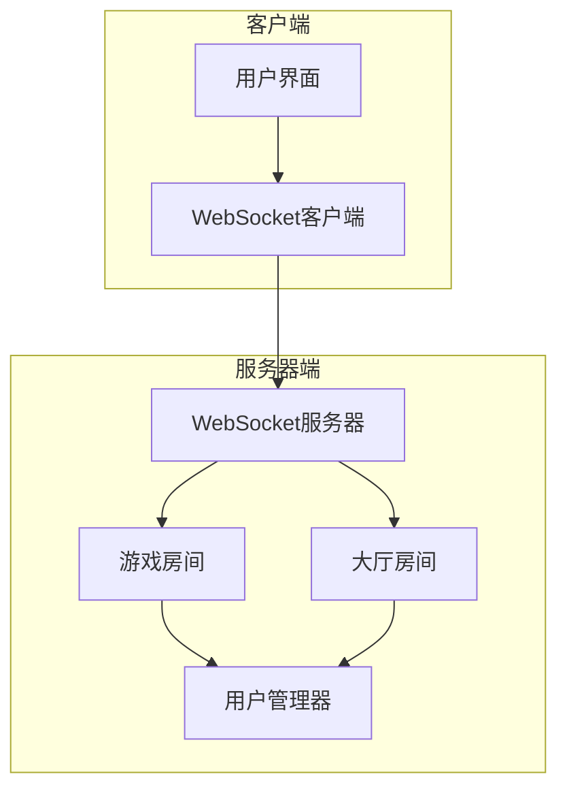
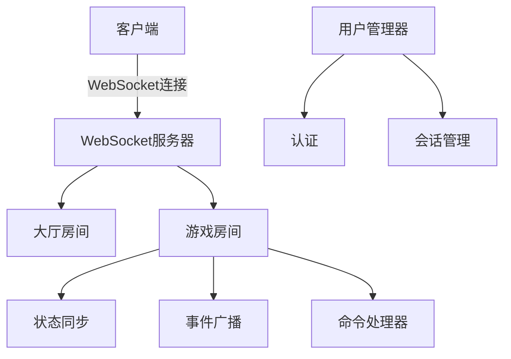
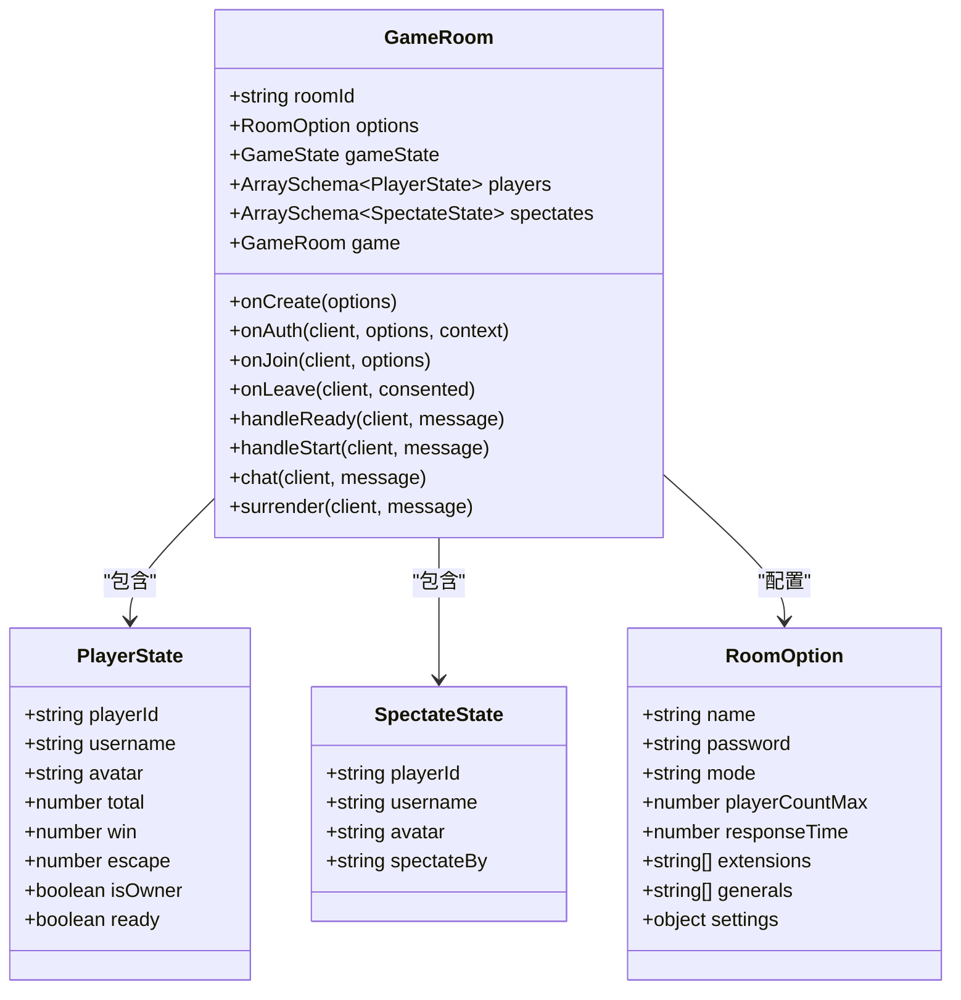
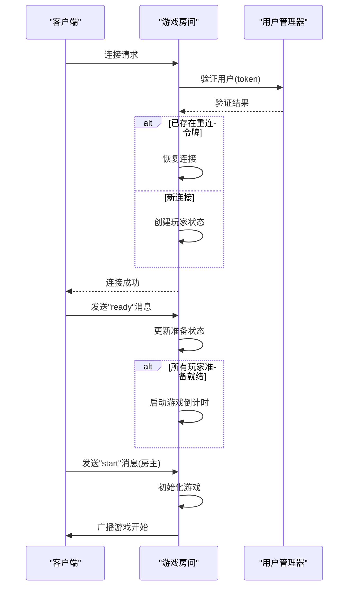
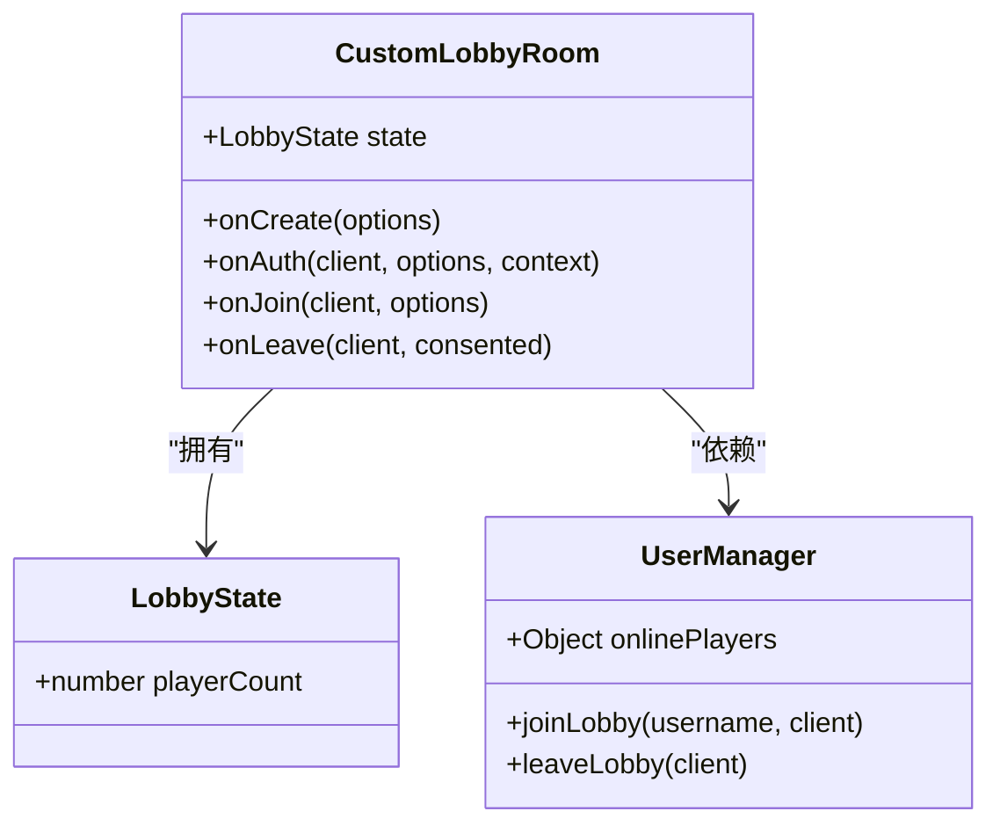
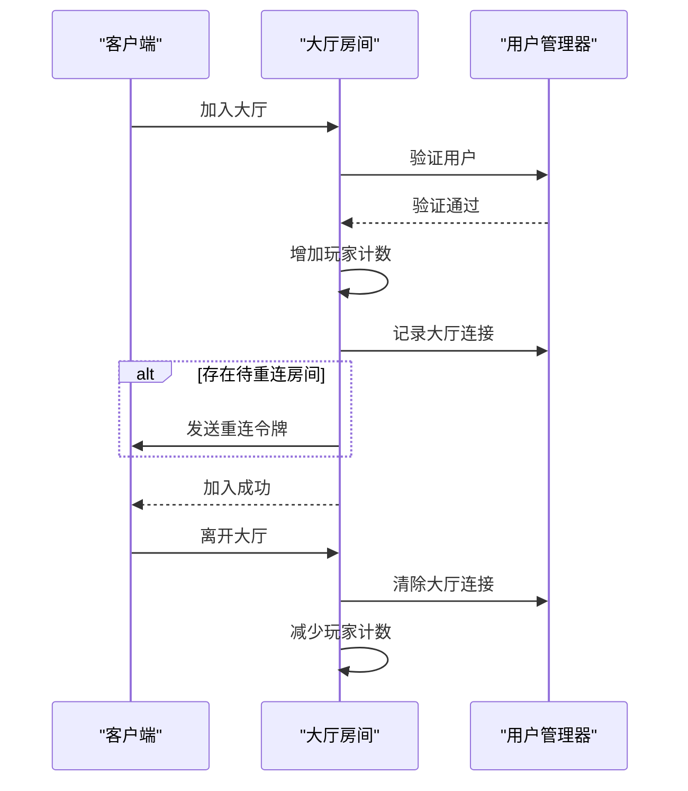
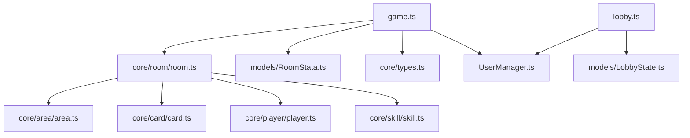

# WebSocket API

<cite>
**本文档中引用的文件**   
- [game.ts](file://server/src/rooms/game.ts)
- [lobby.ts](file://server/src/rooms/lobby.ts)
- [room.ts](file://server/src/core/room/room.ts)
- [room.types.ts](file://server/src/core/room/room.types.ts)
- [RoomStata.ts](file://server/src/models/RoomStata.ts)
- [types.ts](file://server/src/core/types.ts)
- [enums.ts](file://server/src/core/enums.ts)
</cite>

## 目录
1. [引言](#引言)
2. [项目结构](#项目结构)
3. [核心组件](#核心组件)
4. [架构概述](#架构概述)
5. [详细组件分析](#详细组件分析)
6. [依赖分析](#依赖分析)
7. [性能考虑](#性能考虑)
8. [故障排除指南](#故障排除指南)
9. [结论](#结论)

## 引言
本文档详细描述了基于Colyseus框架的WebSocket实时通信协议。文档涵盖WebSocket连接建立过程、认证集成、游戏房间与大厅的消息格式、状态同步机制、事件广播、命令处理、房间生命周期管理以及性能优化建议。通过本指南，开发者可以全面理解系统的通信机制并进行有效开发。

## 项目结构
项目分为客户端和服务器端两大部分。服务器端使用Node.js和Colyseus框架实现WebSocket通信，包含游戏房间（game.ts）、大厅（lobby.ts）等核心模块。客户端通过WebSocket连接到服务器，接收状态更新并发送操作指令。

**图示来源**
- [game.ts](file://server/src/rooms/game.ts#L1-L861)
- [lobby.ts](file://server/src/rooms/lobby.ts#L1-L59)

**本节来源**
- [game.ts](file://server/src/rooms/game.ts#L1-L861)
- [lobby.ts](file://server/src/rooms/lobby.ts#L1-L59)

## 核心组件
系统的核心组件包括游戏房间（GameRoom）、大厅房间（LobbyRoom）、用户管理器（UserManager）和状态同步机制。这些组件共同协作，实现多玩家实时对战功能。

**本节来源**
- [game.ts](file://server/src/rooms/game.ts#L1-L861)
- [lobby.ts](file://server/src/rooms/lobby.ts#L1-L59)
- [UserManager.ts](file://server/src/UserManager.ts#L1-L100)

## 架构概述
系统采用Colyseus框架构建WebSocket服务器，实现低延迟的实时通信。客户端通过WebSocket连接到服务器，加入大厅或游戏房间。服务器维护房间状态并通过@colyseus/schema进行高效的状态同步。

**图示来源**
- [game.ts](file://server/src/rooms/game.ts#L1-L861)
- [lobby.ts](file://server/src/rooms/lobby.ts#L1-L59)
- [UserManager.ts](file://server/src/UserManager.ts#L1-L50)

## 详细组件分析

### 游戏房间分析
游戏房间（GameRoom）是系统的核心，负责管理游戏状态、处理玩家操作和同步游戏数据。

#### 类图

**图示来源**
- [game.ts](file://server/src/rooms/game.ts#L1-L861)
- [RoomStata.ts](file://server/src/models/RoomStata.ts#L1-L116)
- [types.ts](file://server/src/core/types.ts#L1-L82)

#### 序列图

**图示来源**
- [game.ts](file://server/src/rooms/game.ts#L1-L861)
- [UserManager.ts](file://server/src/UserManager.ts#L1-L50)

**本节来源**
- [game.ts](file://server/src/rooms/game.ts#L1-L861)
- [RoomStata.ts](file://server/src/models/RoomStata.ts#L1-L116)
- [types.ts](file://server/src/core/types.ts#L1-L82)

### 大厅房间分析
大厅房间（LobbyRoom）负责管理在线用户列表和房间发现功能。

#### 类图

**图示来源**
- [lobby.ts](file://server/src/rooms/lobby.ts#L1-L59)
- [UserManager.ts](file://server/src/UserManager.ts#L1-L50)

#### 序列图

**图示来源**
- [lobby.ts](file://server/src/rooms/lobby.ts#L1-L59)
- [UserManager.ts](file://server/src/UserManager.ts#L1-L50)

**本节来源**
- [lobby.ts](file://server/src/rooms/lobby.ts#L1-L59)
- [UserManager.ts](file://server/src/UserManager.ts#L1-L50)

## 依赖分析
系统各组件之间的依赖关系清晰，采用模块化设计，便于维护和扩展。

**图示来源**
- [game.ts](file://server/src/rooms/game.ts#L1-L861)
- [lobby.ts](file://server/src/rooms/lobby.ts#L1-L59)
- [room.ts](file://server/src/core/room/room.ts#L1-L1522)

**本节来源**
- [game.ts](file://server/src/rooms/game.ts#L1-L861)
- [lobby.ts](file://server/src/rooms/lobby.ts#L1-L59)
- [room.ts](file://server/src/core/room/room.ts#L1-L1522)

## 性能考虑
系统通过多种机制优化WebSocket通信性能：

1. **状态分片**：使用@colyseus/schema进行增量状态更新，减少网络传输量
2. **批量更新**：设置patchRate为50ms，批量发送状态更新
3. **选择性广播**：在广播消息时排除已离线玩家
4. **内存优化**：及时清理已结束游戏的房间实例
5. **连接复用**：支持断线重连，避免重复创建房间

**本节来源**
- [game.ts](file://server/src/rooms/game.ts#L1-L861)
- [room.ts](file://server/src/core/room/room.ts#L1-L1522)

## 故障排除指南
常见问题及解决方案：

1. **连接认证失败**
   - 检查用户名和token是否正确
   - 确认用户是否已登录
   - 查看ServerCode.AuthError(503)错误码

2. **无法加入房间**
   - 检查房间密码是否正确
   - 确认房间人数是否已满
   - 查看ServerCode.PlayerCountMax(507)错误码

3. **状态不同步**
   - 检查客户端是否正确处理状态更新
   - 确认网络连接稳定
   - 查看patchRate设置是否合理

4. **游戏启动失败**
   - 确认所有玩家都已准备
   - 检查房主权限
   - 查看ServerCode.RoomIsStarted(505)错误码

**本节来源**
- [game.ts](file://server/src/rooms/game.ts#L1-L861)
- [enums.ts](file://server/src/core/enums.ts#L1-L20)

## 结论
本文档详细描述了基于Colyseus框架的WebSocket API实现。系统通过高效的状态同步机制和清晰的组件划分，实现了稳定的实时多人游戏体验。建议开发者遵循文档中的最佳实践，充分利用框架特性，构建高质量的实时应用。