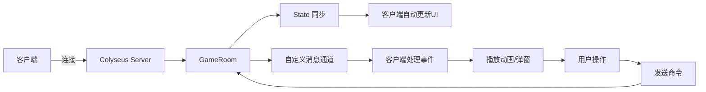
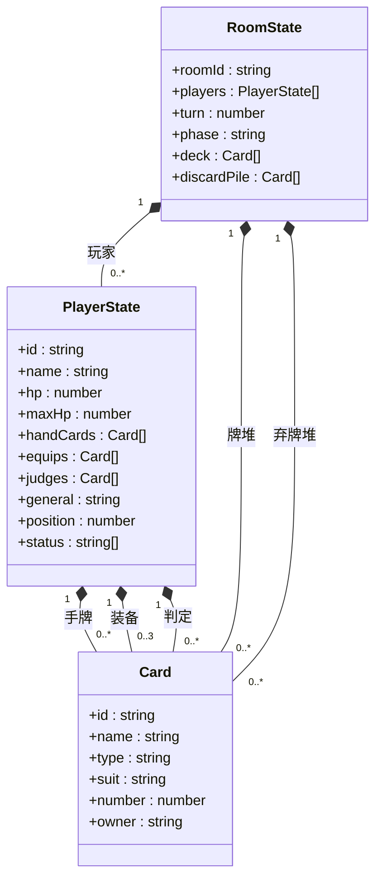
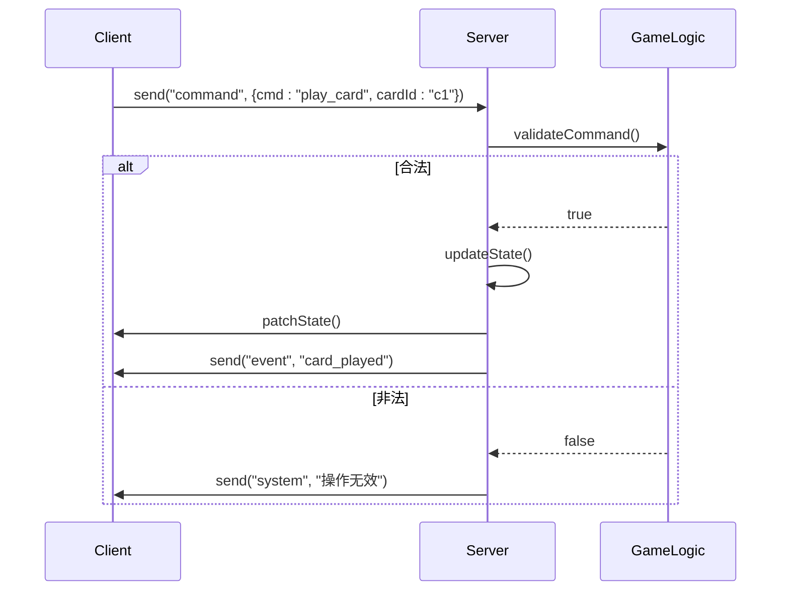
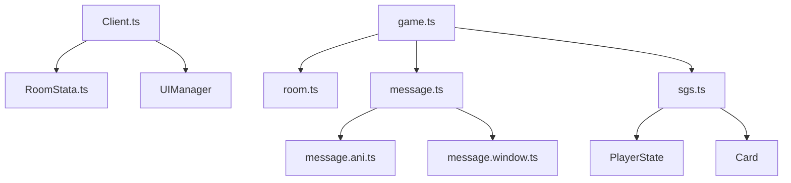

# 消息协议

<cite>
**本文档引用文件**  
- [game.ts](file://server/src/rooms/game.ts)
- [sgs.ts](file://server/src/sgs.ts)
- [message.ts](file://server/src/core/message/message.ts)
- [Client.ts](file://client/src/mgr/Client.ts)
- [RoomStata.ts](file://client/src/models/RoomStata.ts)
- [room.ts](file://server/src/core/room/room.ts)
- [message.window.ts](file://server/src/core/message/message.window.ts)
- [message.ani.ts](file://server/src/core/message/message.ani.ts)
- [message.exter.ts](file://server/src/core/message/message.exter.ts)
</cite>

## 目录
1. [引言](#引言)
2. [项目结构](#项目结构)
3. [核心组件](#核心组件)
4. [架构概览](#架构概览)
5. [详细组件分析](#详细组件分析)
6. [依赖分析](#依赖分析)
7. [性能考虑](#性能考虑)
8. [故障排除指南](#故障排除指南)
9. [结论](#结论)

## 引言

本文档详细描述了基于 Colyseus 的状态同步机制和消息通信协议，重点分析游戏房间（game.ts）中的消息格式设计、sgs.ts 中定义的核心数据模型与序列化格式，以及客户端如何处理消息。文档涵盖消息类型分类、状态同步机制、消息队列处理、冲突解决策略，并提供性能优化建议。

## 项目结构

项目分为客户端（client）和服务端（server）两大部分：

- **客户端**：位于 `client/` 目录，包含游戏界面、动画资源、UI 组件、消息管理器等。
- **服务端**：位于 `server/` 目录，基于 Node.js 和 Colyseus 构建，负责房间管理、状态同步、事件广播和逻辑处理。

关键路径：
- 服务端核心逻辑：`server/src/core/`
- 房间实现：`server/src/rooms/game.ts`
- 消息系统：`server/src/core/message/`
- 客户端通信管理：`client/src/mgr/Client.ts`

```mermaid
graph TB
subgraph "客户端"
UI[用户界面]
Comp[UI组件]
Model[数据模型]
Client[Client.ts]
end
subgraph "服务端"
GameRoom[game.ts]
Message[message.ts]
SGS[sgs.ts]
Room[room.ts]
end
Client < --> |WebSocket| GameRoom
GameRoom --> |状态更新| Message
Message --> |序列化| SGS
GameRoom --> |房间状态| Room
Client --> |订阅状态| Model
```

**图示来源**
- [game.ts](file://server/src/rooms/game.ts#L1-L50)
- [Client.ts](file://client/src/mgr/Client.ts#L1-L30)
- [RoomStata.ts](file://client/src/models/RoomStata.ts#L1-L20)

**本节来源**
- [game.ts](file://server/src/rooms/game.ts#L1-L100)
- [Client.ts](file://client/src/mgr/Client.ts#L1-L50)

## 核心组件

### 消息协议设计原则

消息协议设计遵循以下原则：
- **轻量化**：使用 JSON 格式，字段精简，减少网络开销。
- **可扩展性**：通过 `type` 字段区分不同类型消息，便于新增功能。
- **一致性**：服务端统一生成消息，客户端仅负责展示和响应。
- **安全性**：敏感操作需服务端验证，防止客户端伪造。

### 核心消息类型

根据功能划分，消息类型主要包括：

| 消息类型 | 描述 | 示例 |
|--------|------|------|
| 状态同步 | 同步房间整体状态或玩家状态 | 玩家血量、手牌数、装备区 |
| 事件广播 | 广播游戏内事件（如技能发动、卡牌使用） | “诸葛亮发动【观星】” |
| 命令请求 | 客户端发送操作指令，服务端验证后执行 | 出牌、响应、选择目标 |
| 系统通知 | 系统级消息（如房间创建、玩家加入） | “玩家张三加入房间” |
| 动画指令 | 控制客户端播放特定动画 | 播放【火攻】动画 |
| 窗口控制 | 控制 UI 窗口显示/隐藏 | 显示“选择卡牌”窗口 |

## 架构概览

系统采用 **Colyseus 状态同步 + 自定义消息通道** 的混合架构：



**图示来源**
- [game.ts](file://server/src/rooms/game.ts#L50-L100)
- [Client.ts](file://client/src/mgr/Client.ts#L50-L100)

## 详细组件分析

### 游戏房间状态同步机制（game.ts）

`game.ts` 是游戏房间的核心实现，继承自 `Colyseus.Room`，管理游戏状态和玩家交互。

#### 状态定义

房间状态基于 `RoomState` 类型，包含：
- 玩家列表（players）
- 当前阶段（phase）
- 回合信息（turn）
- 公共区域（如牌堆、弃牌堆）

```typescript
// 简化示例
class RoomState {
  players: PlayerState[];
  turn: number;
  phase: string;
  deckCount: number;
  discardPile: Card[];
}
```

#### 状态同步策略

- **全量更新**：玩家加入时，发送完整房间状态。
- **增量更新**：游戏进行中，仅发送变更字段（Colyseus 自动处理）。
- **优先级控制**：关键状态（如血量变化）立即同步，非关键（如动画）可延迟。

**本节来源**
- [game.ts](file://server/src/rooms/game.ts#L100-L200)
- [RoomStata.ts](file://client/src/models/RoomStata.ts#L10-L50)

### 核心数据模型与序列化（sgs.ts）

`sgs.ts` 定义了游戏的核心数据结构和序列化方法。

#### 主要数据模型



**图示来源**
- [sgs.ts](file://server/src/sgs.ts#L1-L100)
- [PlayerState](file://client/src/models/RoomStata.ts#L5-L30)

#### 序列化格式

使用 `@type` 装饰器优化序列化效率：

```typescript
class PlayerState {
  @type("string") id: string;
  @type("number") hp: number;
  @type([Card]) handCards: Card[]; // 数组类型
}
```

### 消息类型分类与格式

#### 1. 状态同步消息

通过 Colyseus 的 `setState` 和 `patch` 自动处理，无需手动定义格式。

#### 2. 事件广播消息

通过自定义消息通道发送，格式如下：

```json
{
  "type": "event",
  "event": "use_card",
  "data": {
    "playerId": "p1",
    "card": { "id": "c1", "name": "杀" },
    "target": "p2"
  }
}
```

#### 3. 命令请求消息

客户端发送，服务端处理：

```json
{
  "type": "command",
  "cmd": "play_card",
  "payload": {
    "cardId": "c1",
    "targetId": "p2"
  }
}
```

#### 4. 系统通知消息

```json
{
  "type": "system",
  "msg": "玩家张三加入了房间"
}
```

#### 5. 动画与窗口控制消息

- 动画消息（message.ani.ts）：

```json
{
  "type": "ani",
  "ani": "hongsha",
  "from": "p1",
  "to": "p2"
}
```

- 窗口控制消息（message.window.ts）：

```json
{
  "type": "window",
  "action": "show",
  "window": "choose_cards",
  "config": { "min": 1, "max": 2 }
}
```

**本节来源**
- [message.ts](file://server/src/core/message/message.ts#L1-L50)
- [message.ani.ts](file://server/src/core/message/message.ani.ts#L1-L30)
- [message.window.ts](file://server/src/core/message/message.window.ts#L1-L30)

### 客户端消息处理流程（Client.ts）

`Client.ts` 是客户端与服务端通信的桥梁。

#### 订阅状态变化

```typescript
// 连接成功后
this.room.state.players.onAdd = (player, key) => {
  // 添加玩家UI
};

this.room.state.players.onChange = (player, key) => {
  // 更新玩家状态（如血量变化）
};
```

#### 处理自定义消息

```typescript
this.room.onMessage("event", (message) => {
  const { event, data } = message;
  switch (event) {
    case "use_card":
      this.playAnimation("use_card", data);
      break;
    case "trigger_skill":
      this.showPaoPao(data.playerId, data.skillName);
      break;
  }
});

this.room.onMessage("window", (msg) => {
  UIManager.showWindow(msg.window, msg.config);
});
```

#### 发送操作指令

```typescript
sendCommand(cmd: string, payload: any) {
  this.room.send("command", { cmd, payload });
}
```

**本节来源**
- [Client.ts](file://client/src/mgr/Client.ts#L100-L200)
- [UIManager](file://client/src/ui/UIMain.ts#L50-L80)

### 状态同步机制详解

#### 全量更新 vs 增量更新

| 策略 | 触发时机 | 优点 | 缺点 |
|------|----------|------|------|
| 全量更新 | 玩家加入房间 | 数据完整，易于恢复 | 数据量大，延迟高 |
| 增量更新 | 游戏进行中 | 数据量小，实时性好 | 依赖客户端状态一致性 |

#### 冲突解决机制

- **服务端权威**：所有状态变更必须由服务端发起。
- **操作排队**：客户端操作进入队列，服务端按顺序处理。
- **状态校验**：服务端验证操作合法性（如卡牌是否存在）。
- **回滚机制**：非法操作直接忽略，不修改状态。



**图示来源**
- [game.ts](file://server/src/rooms/game.ts#L150-L200)
- [Client.ts](file://client/src/mgr/Client.ts#L120-L150)

## 依赖分析



**图示来源**
- [Client.ts](file://client/src/mgr/Client.ts#L1-L200)
- [game.ts](file://server/src/rooms/game.ts#L1-L200)
- [sgs.ts](file://server/src/sgs.ts#L1-L100)

**本节来源**
- [Client.ts](file://client/src/mgr/Client.ts#L1-L200)
- [game.ts](file://server/src/rooms/game.ts#L1-L200)

## 性能考虑

### 消息优化建议

1. **消息压缩**：对长文本（如聊天）启用 gzip 压缩。
2. **批处理**：将多个小更新合并为一次发送（如连续判定）。
3. **流量控制**：限制高频事件（如动画）的发送频率。
4. **选择性同步**：非关键数据（如装饰性动画）可不通过状态同步。
5. **二进制序列化**：在极端性能要求下，可考虑使用 BSON 或 Protocol Buffers 替代 JSON。

### 状态同步优化

- **减少状态字段**：仅同步必要字段，避免冗余。
- **分层同步**：将状态分为“核心”和“辅助”，核心状态高优先级同步。
- **客户端预测**：对确定性操作（如出牌）进行客户端预测，提升响应速度。

## 故障排除指南

### 常见问题

| 问题 | 可能原因 | 解决方案 |
|------|----------|----------|
| 状态不同步 | 客户端未正确订阅 | 检查 `onAdd`/`onChange` 是否注册 |
| 消息未收到 | 通道名不匹配 | 检查 `onMessage` 的 type 是否一致 |
| 动画不播放 | 资源路径错误 | 检查动画 JSON 文件是否存在 |
| 操作无响应 | 服务端验证失败 | 查看服务端日志，检查命令合法性 |

### 调试方法

1. **开启 Colyseus 调试日志**：在服务端配置中启用 `development` 模式。
2. **客户端日志**：在 `Client.ts` 中添加 `onError` 和 `onLeave` 监听。
3. **网络抓包**：使用浏览器开发者工具查看 WebSocket 消息。

**本节来源**
- [Client.ts](file://client/src/mgr/Client.ts#L50-L100)
- [game.ts](file://server/src/rooms/game.ts#L200-L250)

## 结论

本文档详细阐述了基于 Colyseus 的消息协议设计，包括状态同步机制、消息分类、客户端处理流程和性能优化策略。系统通过“状态同步 + 自定义消息”的混合模式，实现了高效、可靠的游戏通信。建议在实际开发中遵循服务端权威原则，合理使用增量更新，并持续优化消息体积以提升用户体验。