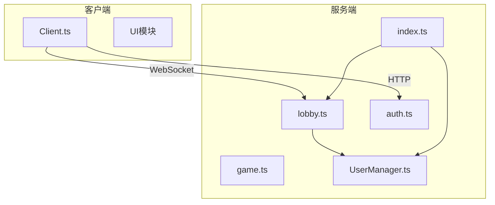
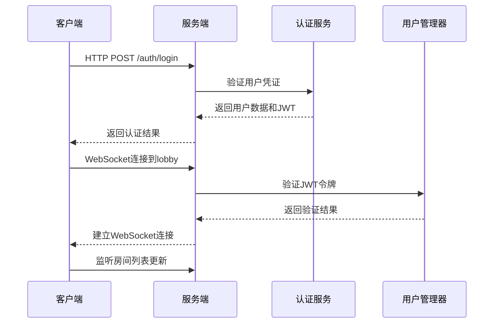
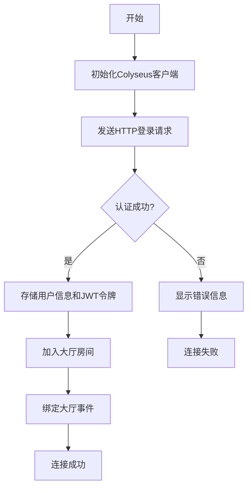
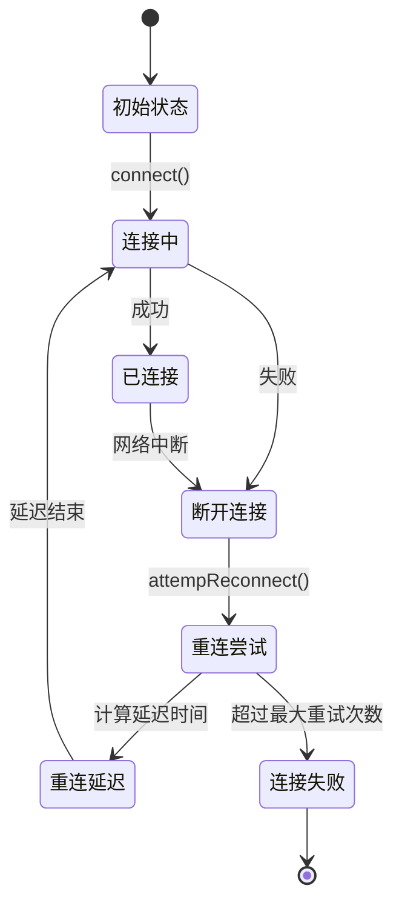
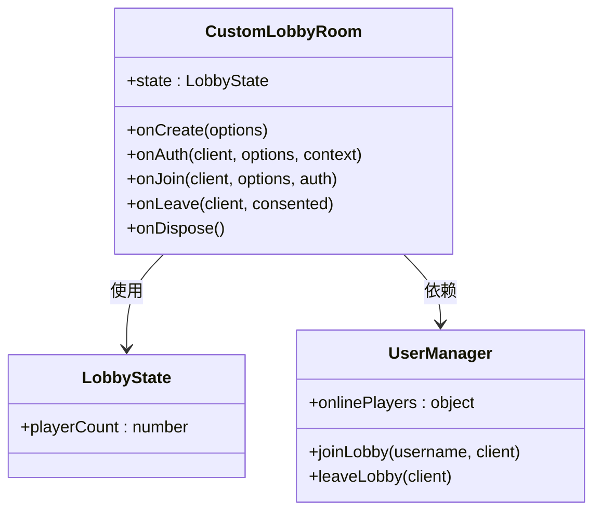
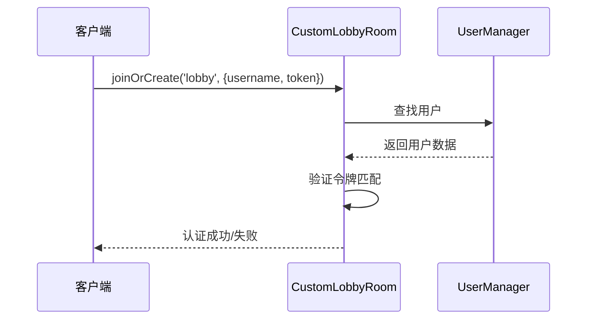
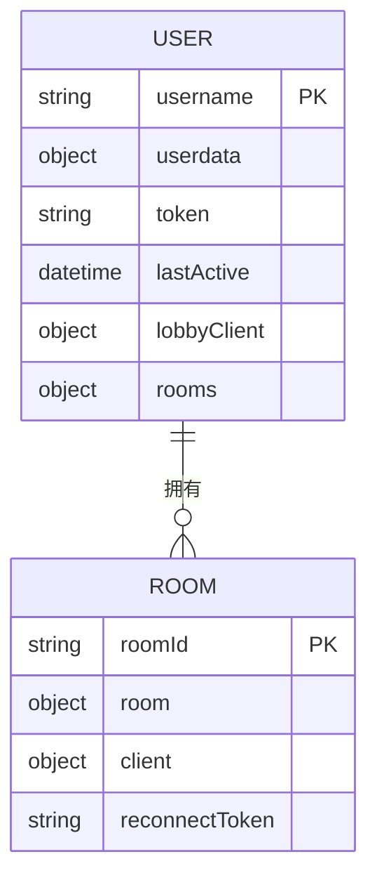
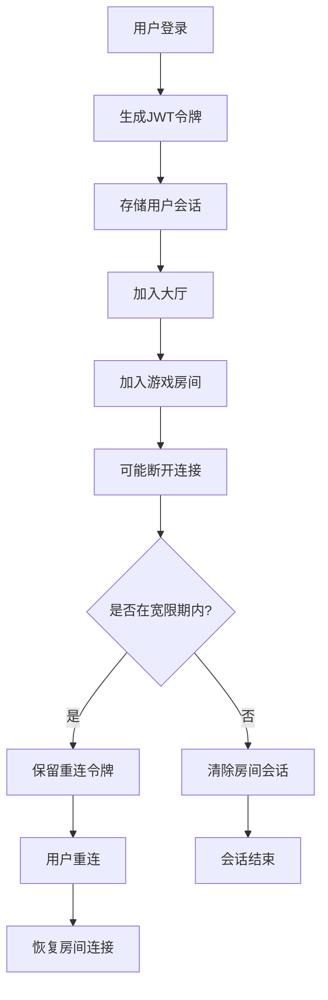
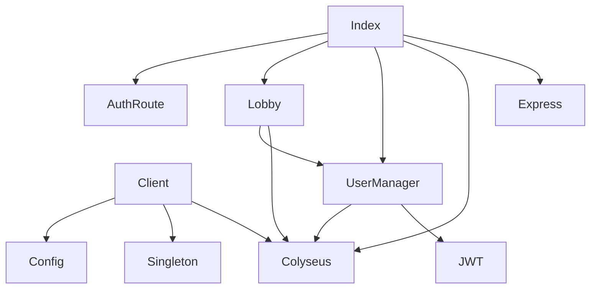

# 连接管理

<cite>
**本文档中引用的文件**  
- [index.ts](file://server/src/index.ts)
- [lobby.ts](file://server/src/rooms/lobby.ts)
- [Client.ts](file://client/src/mgr/Client.ts)
- [UserManager.ts](file://server/src/UserManager.ts)
- [auth.ts](file://server/src/routes/auth.ts)
</cite>

## 目录
1. [引言](#引言)
2. [项目结构](#项目结构)
3. [核心组件](#核心组件)
4. [架构概览](#架构概览)
5. [详细组件分析](#详细组件分析)
6. [依赖分析](#依赖分析)
7. [性能考虑](#性能考虑)
8. [故障排除指南](#故障排除指南)
9. [结论](#结论)

## 引言
本文档详细描述了基于Colyseus框架的WebSocket连接管理机制，涵盖从客户端连接、身份验证、会话管理到重连和心跳检测的完整生命周期。系统采用JWT认证机制确保连接安全，并通过大厅房间（LobbyRoom）实现用户状态同步与房间列表管理。文档还包含连接状态机、性能优化建议和安全防护策略，旨在为开发者提供全面的连接管理参考。

## 项目结构
项目分为客户端（client）和服务端（server）两个主要部分。服务端基于Node.js和Colyseus框架构建，负责WebSocket通信、用户认证和房间管理；客户端使用TypeScript开发，通过colyseus.js库与服务端交互。核心连接逻辑分布在`server/src`和`client/src/mgr`目录下。

**图示来源**
- [index.ts](file://server/src/index.ts#L1-L103)
- [lobby.ts](file://server/src/rooms/lobby.ts#L1-L59)
- [Client.ts](file://client/src/mgr/Client.ts#L1-L368)

## 核心组件
系统连接管理的核心组件包括：
- **Client.ts**：客户端连接管理器，负责建立WebSocket连接、处理认证和重连逻辑
- **lobby.ts**：大厅房间，管理用户在线状态和房间列表同步
- **UserManager.ts**：用户会话管理器，维护用户登录状态和房间连接信息
- **index.ts**：服务端入口，配置Colyseus服务器和路由
- **auth.ts**：认证路由，处理JWT令牌发放

这些组件协同工作，确保用户能够安全、稳定地连接到游戏服务器。

**本节来源**
- [Client.ts](file://client/src/mgr/Client.ts#L1-L368)
- [UserManager.ts](file://server/src/UserManager.ts#L1-L150)

## 架构概览
系统采用Colyseus框架提供的WebSocket服务器架构，通过HTTP升级协议建立持久连接。客户端首先通过HTTP请求进行身份验证获取JWT令牌，然后使用该令牌通过WebSocket连接到大厅房间。用户状态由UserManager集中管理，确保跨房间的一致性。

**图示来源**
- [index.ts](file://server/src/index.ts#L1-L103)
- [auth.ts](file://server/src/routes/auth.ts)
- [lobby.ts](file://server/src/rooms/lobby.ts#L1-L59)

## 详细组件分析

### 客户端连接管理 (Client.ts)

#### 连接建立流程
客户端通过`connect()`方法初始化Colyseus客户端，然后使用`login()`方法进行身份验证和大厅连接。

**图示来源**
- [Client.ts](file://client/src/mgr/Client.ts#L1-L368)

#### 重连机制
客户端实现了指数退避重连策略，确保在网络不稳定时能够自动恢复连接。

**图示来源**
- [Client.ts](file://client/src/mgr/Client.ts#L1-L368)

### 服务端连接管理 (lobby.ts)

#### 大厅房间逻辑
`CustomLobbyRoom`继承自Colyseus的`LobbyRoom`，负责管理用户的大厅连接状态。

**图示来源**
- [lobby.ts](file://server/src/rooms/lobby.ts#L1-L59)
- [UserManager.ts](file://server/src/UserManager.ts#L1-L150)

#### 认证流程
服务端在`onAuth`钩子中验证用户的JWT令牌，确保连接的安全性。

**图示来源**
- [lobby.ts](file://server/src/rooms/lobby.ts#L1-L59)
- [UserManager.ts](file://server/src/UserManager.ts#L1-L150)

### 用户会话管理 (UserManager.ts)

#### 用户状态结构
`UserManager`维护一个全局的在线用户字典，存储用户的完整会话信息。

**图示来源**
- [UserManager.ts](file://server/src/UserManager.ts#L1-L150)

#### 会话生命周期
用户从登录到登出的完整会话管理流程。

**图示来源**
- [UserManager.ts](file://server/src/UserManager.ts#L1-L150)

## 依赖分析
系统各组件之间的依赖关系清晰，遵循高内聚低耦合的设计原则。

**图示来源**
- [index.ts](file://server/src/index.ts#L1-L103)
- [UserManager.ts](file://server/src/UserManager.ts#L1-L150)

## 性能考虑
为确保连接管理的高性能，系统采用了以下优化策略：
- **连接池管理**：通过UserManager集中管理用户会话，避免重复创建对象
- **并发连接限制**：Colyseus服务器内置连接限制机制
- **心跳检测**：WebSocket协议自带心跳机制，确保连接活性
- **状态同步优化**：仅在状态变化时广播更新，减少网络流量
- **内存管理**：定期清理过期会话，防止内存泄漏

建议生产环境配置：
- 最大并发连接数：根据服务器内存调整（建议每连接预留50KB内存）
- 心跳间隔：30秒
- 断开宽限期：30秒
- 重连最大尝试次数：5次

## 故障排除指南
### 常见连接问题及解决方案

| 错误代码 | 错误信息 | 可能原因 | 解决方案 |
|---------|--------|--------|--------|
| 4001 | 登录状态失效，请刷新重试 | JWT令牌过期或无效 | 重新登录获取新令牌 |
| 4002 | 您已经在房间中 | 用户尝试重复加入房间 | 先离开当前房间 |
| 4003 | 房间已经开始游戏 | 尝试加入已开始的游戏 | 等待游戏结束或加入其他房间 |
| 4004 | 密码错误 | 房间密码不正确 | 检查密码并重新输入 |
| 4005 | 房间座位已满 | 房间达到最大玩家数 | 等待有玩家离开或加入其他房间 |

### 调试技巧
1. **启用详细日志**：在`index.ts`中添加日志输出
2. **使用Colyseus Monitor**：访问`/rooms`路径查看实时房间状态
3. **检查网络连接**：确保WebSocket端口（12699）未被防火墙阻挡
4. **验证CORS配置**：检查`allowedOrigin`是否包含客户端域名

**本节来源**
- [Client.ts](file://client/src/mgr/Client.ts#L1-L368)
- [UserManager.ts](file://server/src/UserManager.ts#L1-L150)

## 结论
本文档详细分析了基于Colyseus框架的连接管理系统，涵盖了从客户端到服务端的完整连接生命周期。系统通过JWT认证确保安全性，利用UserManager集中管理用户会话，并实现了智能的重连机制。建议在生产环境中根据实际负载调整连接参数，并定期监控连接状态以确保系统稳定性。