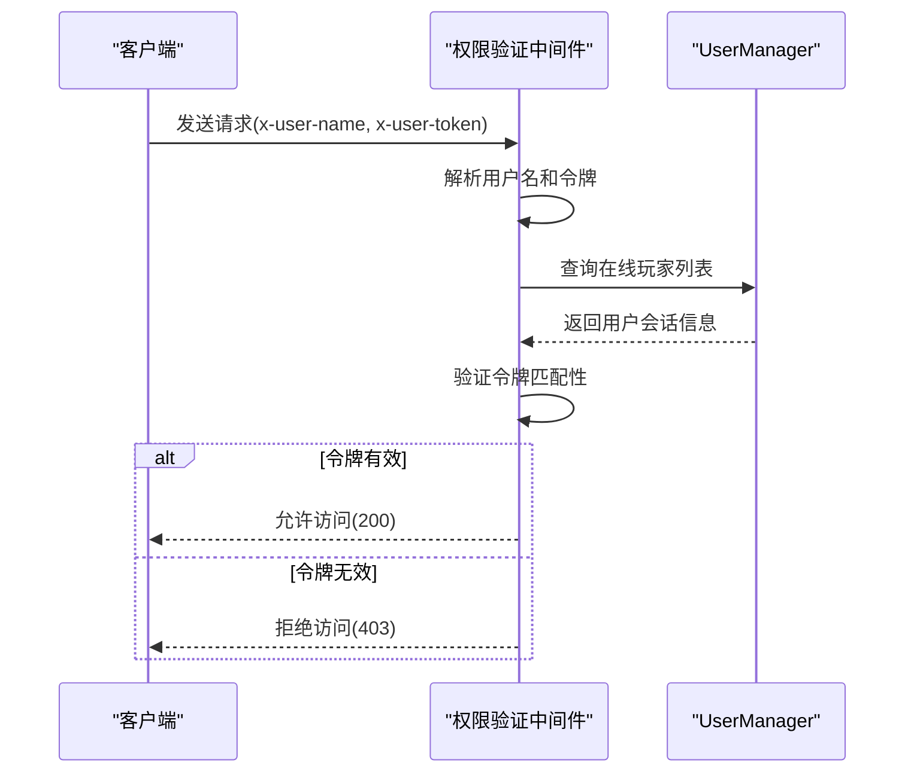
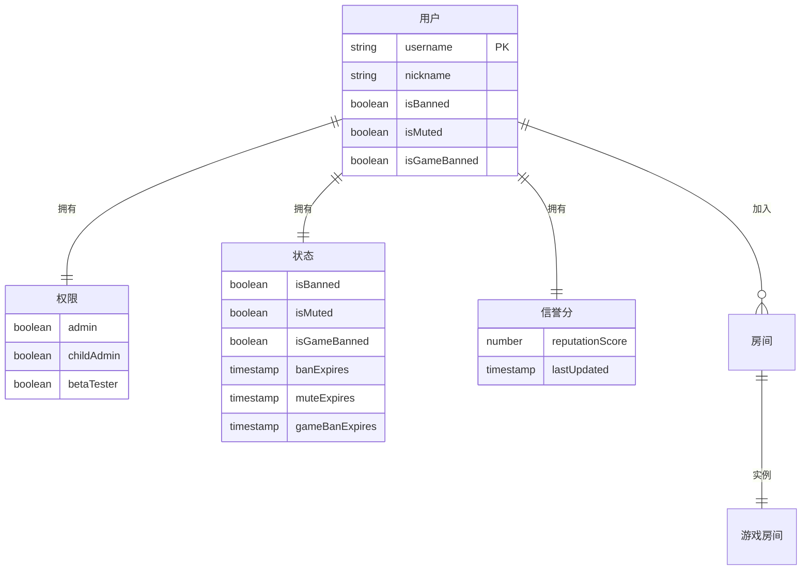
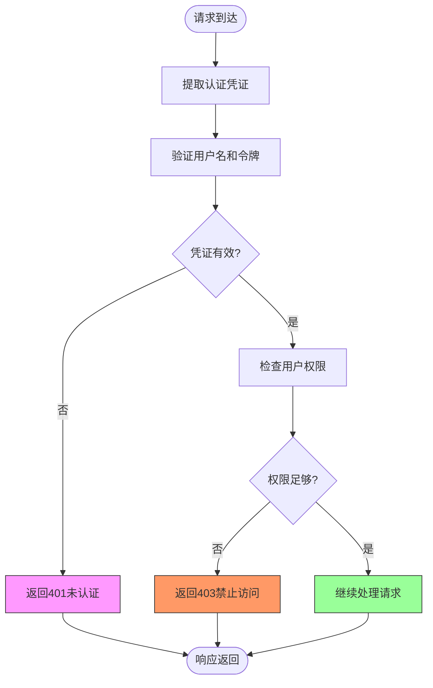
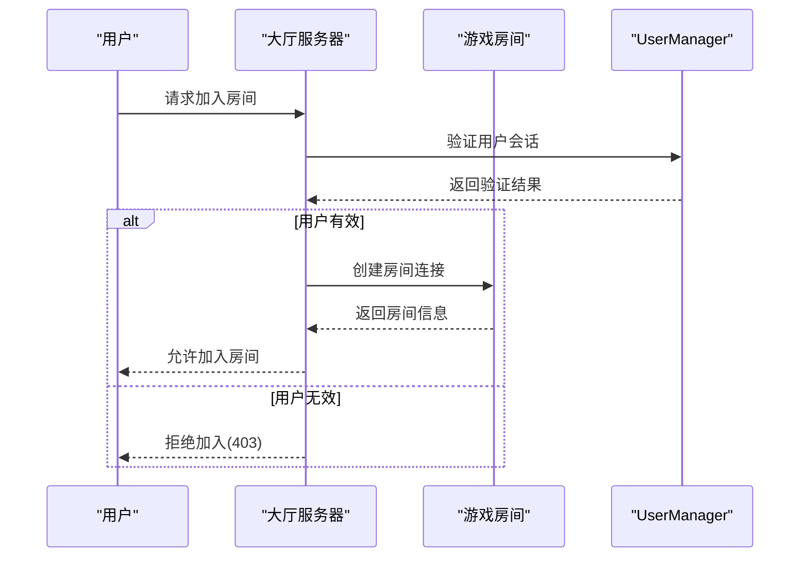
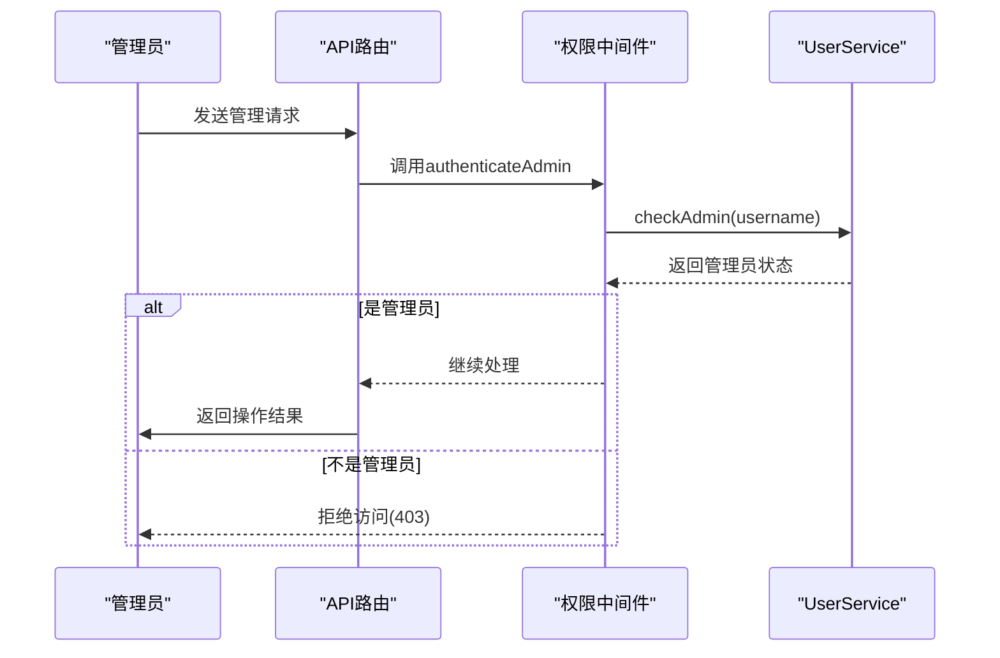
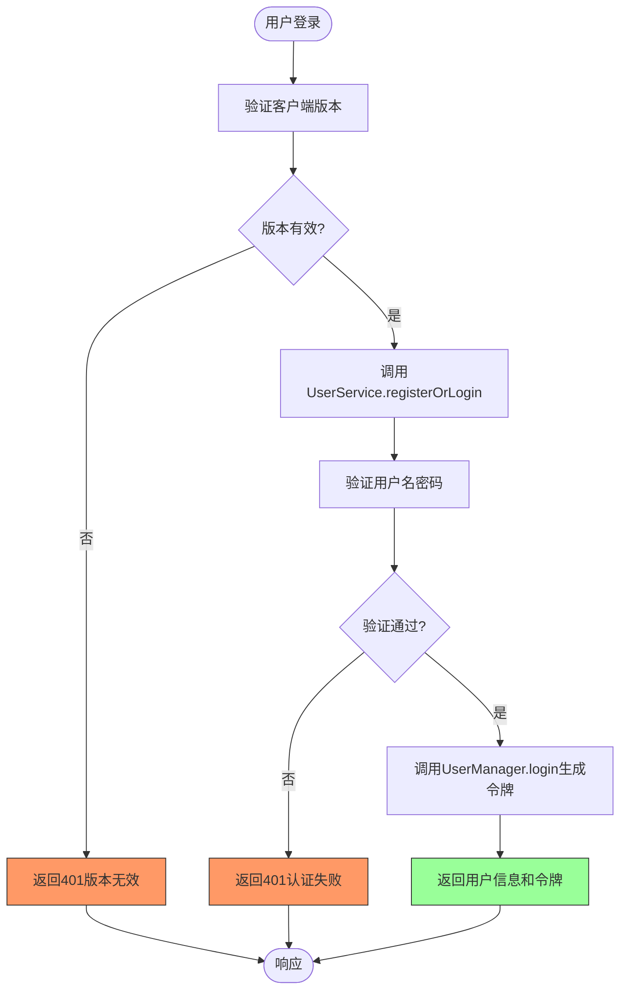

# 权限管理

<cite>
**本文档引用文件**  
- [auth.ts](file://server/src/middleware/auth.ts#L1-L52)
- [UserManager.ts](file://server/src/UserManager.ts#L1-L149)
- [UserService.ts](file://server/src/db/services/UserService.ts#L1-L380)
- [ReputationService.ts](file://server/src/db/services/ReputationService.ts#L1-L107)
- [BanService.ts](file://server/src/db/services/BanService.ts#L1-L95)
- [admin.ts](file://server/src/routes/admin.ts#L1-L49)
- [auth.ts](file://server/src/routes/auth.ts#L1-L58)
</cite>

## 目录
1. [权限管理](#权限管理)
2. [权限验证中间件](#权限验证中间件)
3. [用户权限数据结构](#用户权限数据结构)
4. [权限模型设计](#权限模型设计)
5. [权限验证失败处理](#权限验证失败处理)
6. [实际应用场景](#实际应用场景)

## 权限验证中间件

系统采用基于JWT的权限控制机制，通过中间件实现细粒度的访问控制。核心权限验证逻辑位于`middleware/auth.ts`文件中，包含两个主要的中间件函数：`authenticateAdmin`和`authenticateUser`。

`authenticateAdmin`中间件用于验证管理员权限，它从请求头中提取用户名，并通过`UserService`检查该用户是否具有管理员权限。如果用户不是管理员，则返回403状态码。

`authenticateUser`中间件用于验证普通用户权限，它不仅验证用户名，还需要验证JWT令牌。系统通过`UserManager`中的在线玩家列表来验证用户令牌的有效性。



**图示来源**
- [auth.ts](file://server/src/middleware/auth.ts#L20-L39)
- [UserManager.ts](file://server/src/UserManager.ts#L1-L149)

**本节来源**
- [auth.ts](file://server/src/middleware/auth.ts#L1-L52)

## 用户权限数据结构

`UserManager.ts`文件定义了系统的用户权限数据结构，通过`onlinePlayers`对象管理所有在线用户的会话信息。每个在线用户包含以下关键权限相关数据：

- **userdata**: 用户数据库对象，包含用户基本信息和权限级别
- **token**: JWT令牌，用于身份验证
- **lastActive**: 最后活跃时间，用于会话管理
- **lobbyClient**: 大厅客户端连接
- **rooms**: 用户加入的游戏房间列表

用户权限级别存储在数据库的`DbUser`模型中，具体包括：
- **admin**: 管理员权限
- **childAdmin**: 子管理员权限
- **betaTester**: 内测资格

```mermaid
classDiagram
class UserManager {
+onlinePlayers : { [username : string] : PlayerSession }
+login(user : DbUser) : string
+joinLobby(username : string, client : Client) : void
+leaveLobby(client : Client) : void
+joinRoom(username : string, room : GameRoom, client : Client) : void
+leaveRoom(username : string, roomId : string, token? : string) : void
-generateToken(user : DbUser) : string
}
class PlayerSession {
+userdata : DbUser
+token : string
+lastActive : Date
+lobbyClient : Client | null
+rooms : { [roomId : string] : RoomSession }
}
class RoomSession {
+room : GameRoom
+client : Client
+reconnectToken? : string
}
class DbUser {
+username : string
+privileges : Privileges
+status : Status
+profile : Profile
}
class Privileges {
+admin : boolean
+childAdmin : boolean
+betaTester : boolean
}
class Status {
+isBanned : boolean
+isMuted : boolean
+isGameBanned : boolean
}
UserManager --> PlayerSession : "管理"
PlayerSession --> DbUser : "包含"
PlayerSession --> RoomSession : "包含多个"
DbUser --> Privileges : "包含"
DbUser --> Status : "包含"
```

**图示来源**
- [UserManager.ts](file://server/src/UserManager.ts#L1-L149)
- [UserService.ts](file://server/src/db/services/UserService.ts#L1-L380)

**本节来源**
- [UserManager.ts](file://server/src/UserManager.ts#L1-L149)

## 权限模型设计

系统采用多层次的权限模型，结合角色、权限级别和访问控制列表（ACL）来实现全面的权限管理。权限模型的核心组件包括用户、角色、权限和状态。



权限模型通过以下机制实现：
1. **角色检查**: 通过`UserService.checkAdmin()`方法验证用户角色
2. **权限级别验证**: 检查用户特权字段（admin、childAdmin等）
3. **访问控制列表**: 基于用户状态（封禁、禁言等）限制访问
4. **信誉分系统**: 根据用户行为动态调整权限

**图示来源**
- [UserService.ts](file://server/src/db/services/UserService.ts#L1-L380)
- [ReputationService.ts](file://server/src/db/services/ReputationService.ts#L1-L107)

**本节来源**
- [UserService.ts](file://server/src/db/services/UserService.ts#L1-L380)
- [ReputationService.ts](file://server/src/db/services/ReputationService.ts#L1-L107)

## 权限验证失败处理

当权限验证失败时，系统采用标准化的错误处理机制，确保安全性和用户体验的平衡。根据不同的验证场景，系统返回相应的HTTP状态码和错误信息。



具体的错误处理流程：
1. **认证失败**（401）：当请求缺少用户名或令牌时触发
2. **权限不足**（403）：当用户存在但权限不足时触发
3. **服务器错误**（500）：当验证过程中发生异常时触发

系统还实现了基于信誉分的自动处罚机制。当用户信誉分低于特定阈值时，系统会自动施加相应的处罚：
- 信誉分 < 80：禁止游戏20分钟
- 信誉分 < 70：禁止游戏12小时
- 信誉分 < 60：禁止游戏24小时
- 信誉分 < 40：封禁账号24小时

**图示来源**
- [auth.ts](file://server/src/middleware/auth.ts#L1-L52)
- [ReputationService.ts](file://server/src/db/services/ReputationService.ts#L69-L107)

**本节来源**
- [auth.ts](file://server/src/middleware/auth.ts#L1-L52)
- [ReputationService.ts](file://server/src/db/services/ReputationService.ts#L1-L107)

## 实际应用场景

### 游戏房间加入权限控制

当用户尝试加入游戏房间时，系统通过`UserManager.joinRoom()`方法验证用户权限。只有通过身份验证且未被禁止游戏的用户才能加入房间。



**图示来源**
- [UserManager.ts](file://server/src/UserManager.ts#L1-L149)
- [auth.ts](file://server/src/middleware/auth.ts#L1-L52)

### 管理员操作权限控制

管理员权限通过`admin.ts`路由文件中的`authenticateAdmin`中间件实现。所有管理员API端点都必须通过此中间件验证。



**图示来源**
- [admin.ts](file://server/src/routes/admin.ts#L1-L49)
- [UserService.ts](file://server/src/db/services/UserService.ts#L1-L380)

### 敏感数据访问控制

敏感数据访问通过多层次验证确保安全。以用户登录为例，系统在`auth.ts`路由中实现了完整的验证流程：



**图示来源**
- [auth.ts](file://server/src/routes/auth.ts#L1-L58)
- [UserService.ts](file://server/src/db/services/UserService.ts#L1-L380)

**本节来源**
- [auth.ts](file://server/src/routes/auth.ts#L1-L58)
- [admin.ts](file://server/src/routes/admin.ts#L1-L49)
- [UserManager.ts](file://server/src/UserManager.ts#L1-L149)