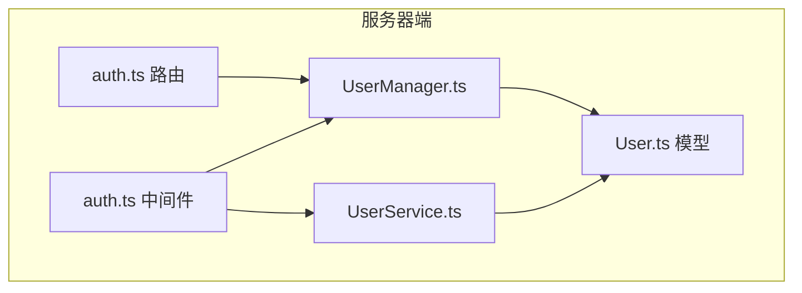
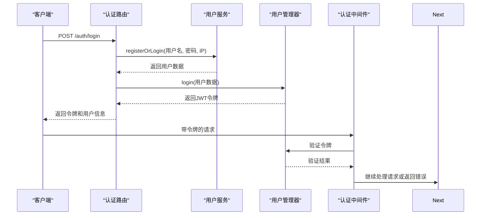
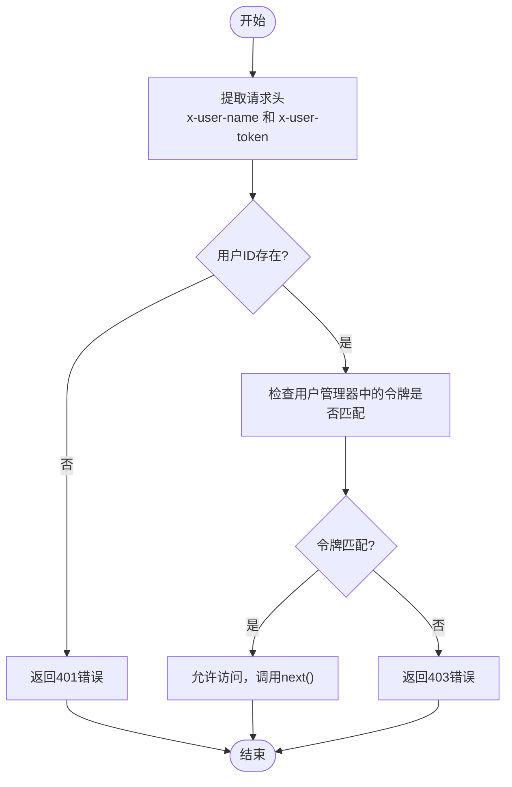
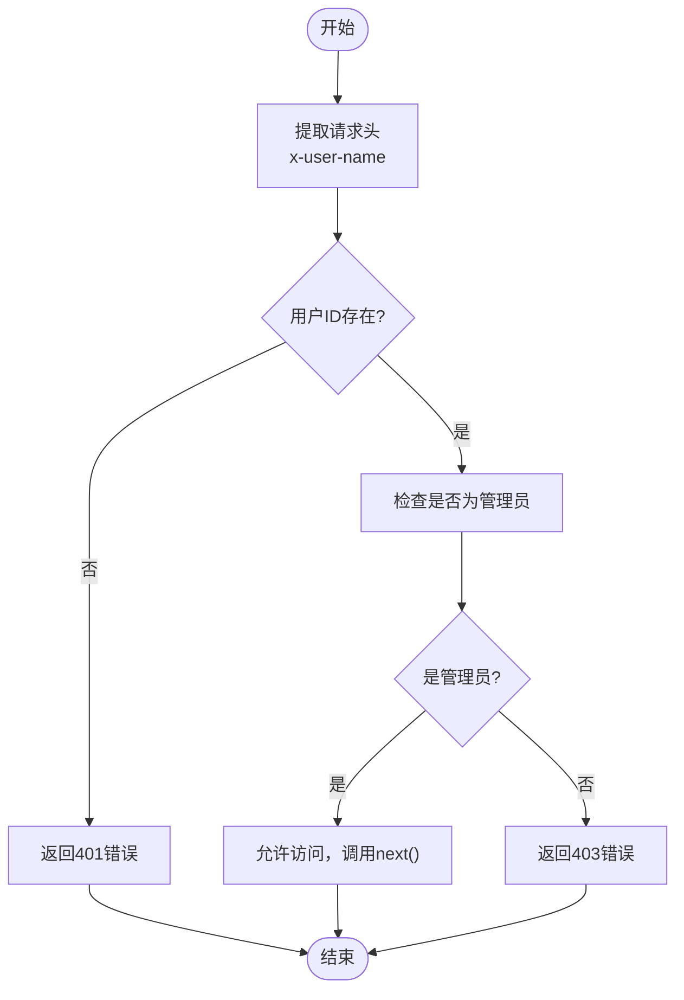
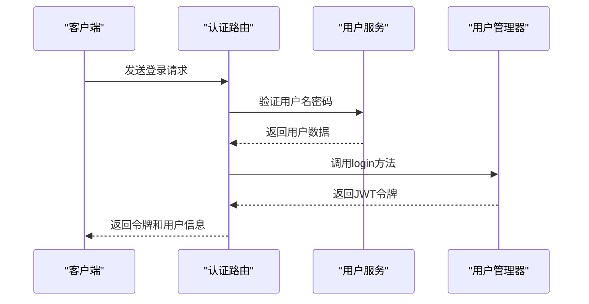
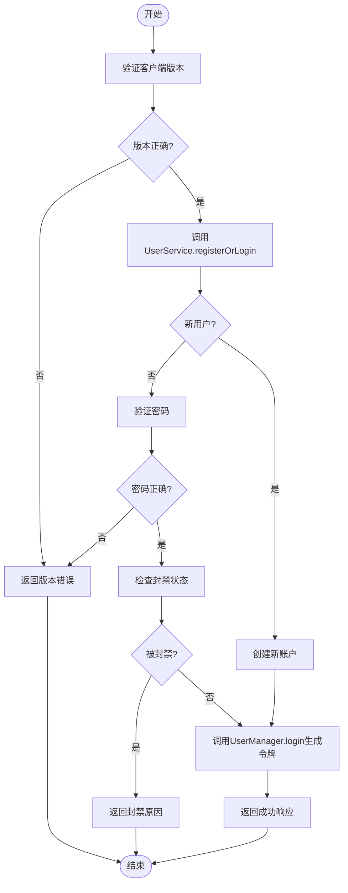
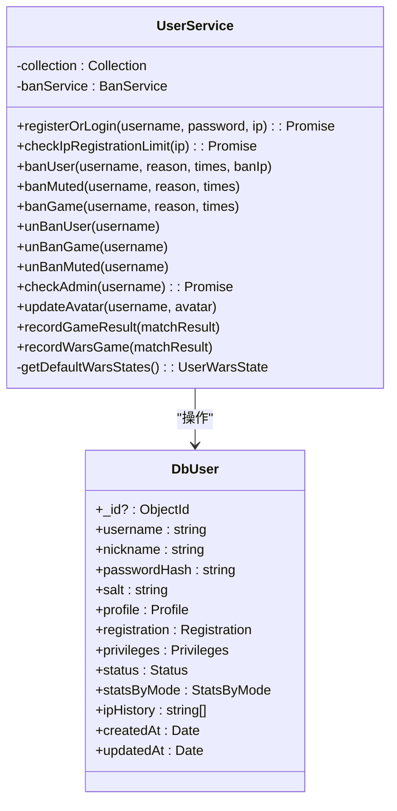
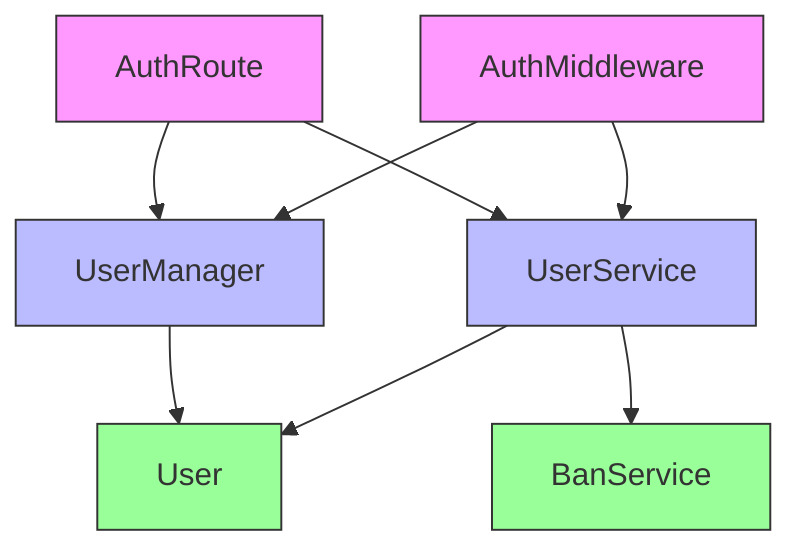

# JWT认证流程

<cite>
**本文档引用的文件**  
- [auth.ts](file://server/src/middleware/auth.ts#L1-L52)
- [UserManager.ts](file://server/src/UserManager.ts#L1-L149)
- [UserService.ts](file://server/src/db/services/UserService.ts#L1-L380)
- [User.ts](file://server/src/db/models/User.ts#L1-L102)
- [routes/auth.ts](file://server/src/routes/auth.ts#L1-L58)
</cite>

## 目录
1. [简介](#简介)
2. [项目结构](#项目结构)
3. [核心组件](#核心组件)
4. [架构概览](#架构概览)
5. [详细组件分析](#详细组件分析)
6. [依赖分析](#依赖分析)
7. [性能考虑](#性能考虑)
8. [故障排除指南](#故障排除指南)
9. [结论](#结论)

## 简介
本文档深入解析基于JWT的认证流程实现，重点介绍`middleware/auth.ts`中的JWT处理机制。文档详细说明了JWT令牌的生成、解析和验证过程，包括密钥管理、签名算法和令牌有效期控制。同时，解释了认证中间件如何从HTTP请求头中提取JWT令牌，并进行解码和验证。文档还涵盖了令牌载荷中包含的用户信息（如用户ID、角色、权限级别）及其在系统中的使用方式，并提供代码示例展示JWT令牌的创建和验证逻辑，包括错误处理和异常情况（如令牌过期、签名无效）。此外，说明了系统如何实现令牌刷新机制和安全存储策略，以及如何防止常见的JWT安全漏洞。

## 项目结构
本项目采用分层架构设计，主要分为客户端（client）和服务器端（server）两大部分。服务器端实现了基于Express框架的RESTful API服务，其中认证相关功能集中在`server/src`目录下。关键的认证组件包括：
- `middleware/auth.ts`：包含用户和管理员认证中间件
- `routes/auth.ts`：处理登录/注册请求的路由
- `UserManager.ts`：用户状态管理和JWT令牌生成
- `db/services/UserService.ts`：用户数据服务和权限检查
- `db/models/User.ts`：用户数据模型定义



**图示来源**
- [auth.ts](file://server/src/middleware/auth.ts#L1-L52)
- [UserManager.ts](file://server/src/UserManager.ts#L1-L149)
- [UserService.ts](file://server/src/db/services/UserService.ts#L1-L380)

**本节来源**
- [server/src/middleware/auth.ts](file://server/src/middleware/auth.ts#L1-L52)
- [server/src/UserManager.ts](file://server/src/UserManager.ts#L1-L149)

## 核心组件
系统的核心认证组件包括认证中间件、用户管理器、用户服务和用户数据模型。这些组件协同工作，实现了完整的JWT认证流程。

**本节来源**
- [auth.ts](file://server/src/middleware/auth.ts#L1-L52)
- [UserManager.ts](file://server/src/UserManager.ts#L1-L149)

## 架构概览
系统的认证架构基于JWT（JSON Web Token）标准，采用无状态认证机制。当用户登录时，服务器验证凭据并生成JWT令牌返回给客户端。后续请求中，客户端在请求头中携带该令牌，服务器通过中间件验证令牌的有效性。



**图示来源**
- [routes/auth.ts](file://server/src/routes/auth.ts#L1-L58)
- [UserManager.ts](file://server/src/UserManager.ts#L1-L149)
- [middleware/auth.ts](file://server/src/middleware/auth.ts#L1-L52)

## 详细组件分析

### 认证中间件分析
认证中间件负责验证每个请求的身份认证信息。系统提供了两种认证方式：普通用户认证和管理员认证。

#### 用户认证中间件


**图示来源**
- [auth.ts](file://server/src/middleware/auth.ts#L20-L39)

#### 管理员认证中间件


**图示来源**
- [auth.ts](file://server/src/middleware/auth.ts#L1-L19)

**本节来源**
- [middleware/auth.ts](file://server/src/middleware/auth.ts#L1-L52)

### 用户管理器分析
用户管理器（UserManager）是认证系统的核心组件，负责用户会话管理和JWT令牌生成。

#### JWT令牌生成机制
```mermaid
classDiagram
class UserManager {
+static inst : UserManager
+onlinePlayers : { [username] : PlayerSession }
-generateToken(user : DbUser) : string
+login(user : DbUser) : string
+joinLobby(username, client)
+leaveLobby(client)
+joinRoom(username, room, client)
+leaveRoom(username, roomId, reconnectToken)
+getPlayerRooms(username) : RoomInfo[]
+findPlayerByClinet(sessionId) : PlayerSession
+broadcast(message : string)
}
class PlayerSession {
+userdata : DbUser
+token : string
+lastActive : Date
+lobbyClient : Client
+rooms : { [roomId] : RoomConnection }
}
class RoomConnection {
+room : GameRoom
+client : Client
+reconnectToken? : string
}
UserManager --> PlayerSession : "管理"
PlayerSession --> RoomConnection : "包含"
```

**图示来源**
- [UserManager.ts](file://server/src/UserManager.ts#L1-L149)

#### JWT令牌生成逻辑
用户管理器中的`generateToken`方法使用`jsonwebtoken`库生成JWT令牌：

```typescript
private generateToken(user: DbUser): string {
    return jwt.sign(
        { userId: user._id, username: user.username },
        'resgs.PrivateKey',
        { expiresIn: '7d' }
    );
}
```

该方法的关键特性包括：
- **载荷内容**：包含用户ID和用户名
- **密钥**：使用硬编码的私钥`resgs.PrivateKey`
- **有效期**：设置为7天（`expiresIn: '7d'`）

**本节来源**
- [UserManager.ts](file://server/src/UserManager.ts#L32-L38)

### 认证路由分析
认证路由处理用户的登录/注册请求，是认证流程的入口点。



**图示来源**
- [routes/auth.ts](file://server/src/routes/auth.ts#L1-L58)

#### 登录流程详细分析


**图示来源**
- [routes/auth.ts](file://server/src/routes/auth.ts#L1-L58)
- [UserService.ts](file://server/src/db/services/UserService.ts#L1-L380)

**本节来源**
- [routes/auth.ts](file://server/src/routes/auth.ts#L1-L58)

### 用户服务分析
用户服务（UserService）负责用户数据的持久化操作和权限检查。



**图示来源**
- [UserService.ts](file://server/src/db/services/UserService.ts#L1-L380)
- [User.ts](file://server/src/db/models/User.ts#L1-L102)

#### 管理员权限检查
```typescript
async checkAdmin(username: string) {
    return await this.collection.findOne({
        username,
        'privileges.admin': true,
    });
}
```

该方法通过查询数据库中具有管理员权限的用户来验证管理员身份。

**本节来源**
- [UserService.ts](file://server/src/db/services/UserService.ts#L330-L335)

## 依赖分析
系统各组件之间的依赖关系清晰，遵循了良好的分层架构原则。



**图示来源**
- [auth.ts](file://server/src/middleware/auth.ts#L1-L52)
- [UserManager.ts](file://server/src/UserManager.ts#L1-L149)
- [UserService.ts](file://server/src/db/services/UserService.ts#L1-L380)

**本节来源**
- [middleware/auth.ts](file://server/src/middleware/auth.ts#L1-L52)
- [UserManager.ts](file://server/src/UserManager.ts#L1-L149)

## 性能考虑
系统的认证机制在性能方面有以下特点：

1. **内存存储**：用户会话信息存储在内存中（`UserManager.onlinePlayers`），读取速度快，但重启后会丢失。
2. **数据库查询**：管理员权限检查需要查询数据库，可能成为性能瓶颈。
3. **JWT验证**：基于内存的令牌验证（比较字符串）非常快速。
4. **密码哈希**：使用bcrypt进行密码哈希，虽然安全但计算成本较高。

## 故障排除指南
### 常见问题及解决方案

**401错误（未授权）**
- **可能原因**：缺少`x-user-name`请求头
- **解决方案**：确保请求中包含正确的用户名头信息

**403错误（禁止访问）**
- **可能原因**：令牌不匹配或用户不是管理员
- **解决方案**：重新登录获取新令牌，或检查用户权限

**令牌过期问题**
- **现象**：用户需要频繁重新登录
- **解决方案**：当前系统令牌有效期为7天，可通过修改`generateToken`方法中的`expiresIn`参数调整

**客户端版本错误**
- **现象**：登录时返回"Client Version Invalid"错误
- **解决方案**：确保客户端版本号与服务器期望的版本（1.0.92）一致

**本节来源**
- [middleware/auth.ts](file://server/src/middleware/auth.ts#L1-L52)
- [routes/auth.ts](file://server/src/routes/auth.ts#L1-L58)

## 结论
本系统实现了一个基于JWT的认证流程，具有以下特点：

1. **安全性**：使用JWT标准进行令牌管理，密码使用bcrypt哈希存储。
2. **可扩展性**：采用中间件模式，易于添加新的认证策略。
3. **性能**：大部分验证操作在内存中完成，响应速度快。
4. **功能完整**：支持普通用户和管理员两种认证级别。

建议的改进方向：
1. 将JWT密钥从硬编码改为环境变量配置
2. 实现令牌刷新机制以提高用户体验
3. 添加更详细的日志记录用于安全审计
4. 考虑使用Redis等持久化存储来管理用户会话，支持服务器重启