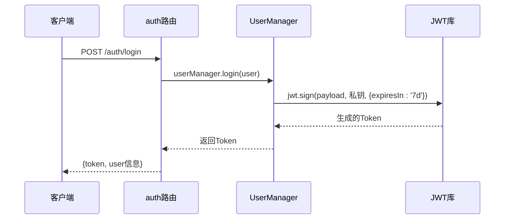
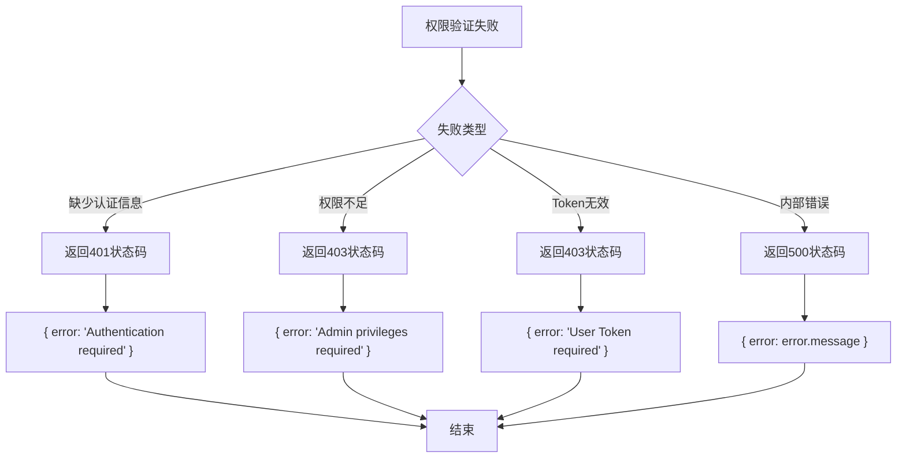

# 权限验证机制

<cite>
**本文档引用的文件**  
- [auth.ts](file://server/src/middleware/auth.ts#L1-L53)
- [UserManager.ts](file://server/src/UserManager.ts#L1-L150)
- [lobby.ts](file://server/src/rooms/lobby.ts#L1-L59)
- [auth.ts](file://server/src/routes/auth.ts#L1-L58)
</cite>

## 目录
1. [权限验证机制概述](#权限验证机制概述)
2. [JWT认证流程与Token生成](#jwt认证流程与token生成)
3. [权限验证中间件实现](#权限验证中间件实现)
4. [房间加入权限控制](#房间加入权限控制)
5. [访问控制列表（ACL）与权限检查](#访问控制列表acl-与权限检查)
6. [权限验证失败处理与安全响应](#权限验证失败处理与安全响应)
7. [实际代码示例与使用方法](#实际代码示例与使用方法)
8. [安全漏洞防护机制](#安全漏洞防护机制)

## 权限验证机制概述

本系统采用基于JWT（JSON Web Token）的认证机制，结合自定义中间件和用户管理服务，实现多层级的权限控制。系统通过`x-user-name`和`x-user-token`请求头传递用户身份信息，并在关键路由和游戏房间中进行权限验证。核心组件包括`authenticateUser`和`authenticateAdmin`中间件、`UserManager`用户管理类以及`CustomLobbyRoom`房间类。

**Section sources**
- [auth.ts](file://server/src/middleware/auth.ts#L1-L53)
- [UserManager.ts](file://server/src/UserManager.ts#L1-L150)

## JWT认证流程与Token生成

系统使用`jsonwebtoken`库生成和验证JWT令牌。当用户成功登录或注册时，系统调用`UserManager`的`login`方法生成Token。Token包含用户ID和用户名，并使用私钥`resgs.PrivateKey`签名，有效期为7天。



**Diagram sources**
- [UserManager.ts](file://server/src/UserManager.ts#L43-L50)
- [auth.ts](file://server/src/routes/auth.ts#L20-L40)

## 权限验证中间件实现

系统在`middleware/auth.ts`中定义了两个核心权限验证中间件：`authenticateUser`和`authenticateAdmin`。

### 用户权限验证中间件

`authenticateUser`中间件验证普通用户的Token有效性。它从请求头中提取`x-user-name`和`x-user-token`，检查该用户是否在线且Token匹配。

```mermaid
flowchart TD
A[开始] --> B[获取x-user-name和x-user-token]
B --> C{用户名存在?}
C --> |否| D[返回401: 认证必需]
C --> |是| E[检查用户是否在线]
E --> F{在线且Token匹配?}
F --> |是| G[调用next()继续处理]
F --> |否| H[返回403: 用户Token必需]
G --> I[结束]
H --> I
D --> I
```

**Diagram sources**
- [auth.ts](file://server/src/middleware/auth.ts#L20-L39)

### 管理员权限验证中间件

`authenticateAdmin`中间件用于验证管理员权限。它检查用户是否具有管理员特权，通过`UserService`的`checkAdmin`方法进行验证。

```mermaid
flowchart TD
A[开始] --> B[获取x-user-name]
B --> C{用户名存在?}
C --> |否| D[返回401: 认证必需]
C --> |是| E[调用userService.checkAdmin]
E --> F{是管理员?}
F --> |是| G[调用next()继续处理]
F --> |否| H[返回403: 需要管理员权限]
G --> I[结束]
H --> I
D --> I
```

**Diagram sources**
- [auth.ts](file://server/src/middleware/auth.ts#L1-L19)

## 房间加入权限控制

在`rooms/lobby.ts`中，`CustomLobbyRoom`类通过`onAuth`方法实现了房间加入的权限控制。该方法在客户端尝试加入房间时被调用，验证用户的用户名和Token。

```typescript
onAuth(client: Client<any, any>, options: any, context: AuthContext) {
    const { username, token } = options;
    const user = UserManager.inst.onlinePlayers[username];
    if (!user) {
        throw new ServerError(ServerCode.AuthError);
    }
    if (user.token !== token) {
        throw new ServerError(ServerCode.AuthError);
    }
    return true;
}
```

该机制确保只有已登录且Token有效的用户才能加入游戏大厅。系统通过`UserManager.inst.onlinePlayers`对象维护在线用户会话，实现会话状态管理。

**Section sources**
- [lobby.ts](file://server/src/rooms/lobby.ts#L10-L20)

## 访问控制列表（ACL）与权限检查

系统实现了基于角色的访问控制（RBAC）机制。用户权限存储在`DbUser`对象的`privileges`字段中，包括`admin`和`betaTester`等角色。

### 权限检查逻辑

权限检查主要通过以下方式实现：
1. **管理员权限检查**：通过`UserService.checkAdmin(userId)`方法
2. **用户会话验证**：通过比较`UserManager`中存储的Token与请求中的Token
3. **特殊权限验证**：如测试员权限通过`user.privileges.tester`检查

系统在用户登录时返回权限信息，前端可根据这些信息控制UI显示：

```json
{
  "privileges": {
    "admin": true,
    "tester": false
  }
}
```

**Section sources**
- [UserManager.ts](file://server/src/UserManager.ts#L100-L120)
- [auth.ts](file://server/src/routes/auth.ts#L40-L50)

## 权限验证失败处理与安全响应

系统对权限验证失败的情况提供了明确的错误处理机制，返回适当的HTTP状态码和错误信息。

### 错误处理流程



### 安全响应机制

系统在捕获异常时，会返回500内部服务器错误，并包含错误消息。这种设计既提供了调试信息，又避免了暴露过多系统细节。

**Section sources**
- [auth.ts](file://server/src/middleware/auth.ts#L15-L18)
- [auth.ts](file://server/src/middleware/auth.ts#L35-L38)

## 实际代码示例与使用方法

### 中间件使用示例

```typescript
// 在路由中使用权限验证中间件
router.get('/admin', authenticateAdmin(userService), (req, res) => {
    res.json({ message: 'Admin dashboard' });
});

router.get('/profile', authenticateUser(userManager), (req, res) => {
    res.json({ message: 'User profile' });
});
```

### 配置选项

权限验证中间件接受服务实例作为参数，实现依赖注入：

```typescript
// 创建认证路由时传入服务实例
const authRouter = createAuthRouter(userService, userManager);
```

这种设计使得中间件具有良好的可测试性和可配置性。

**Section sources**
- [auth.ts](file://server/src/middleware/auth.ts#L1-L53)
- [auth.ts](file://server/src/routes/auth.ts#L1-L58)

## 安全漏洞防护机制

系统通过多种机制防止常见的安全漏洞：

### 防止令牌篡改

使用JWT的签名机制防止令牌篡改。任何对令牌内容的修改都会导致签名验证失败。

### 防止重放攻击

系统通过以下方式降低重放攻击风险：
1. **Token绑定会话**：Token与用户会话关联，注销后立即失效
2. **定期刷新Token**：用户重新登录时生成新Token
3. **HTTPS传输**：确保Token在传输过程中的安全性

### 其他安全措施

1. **输入验证**：对客户端版本号进行验证，防止不兼容客户端访问
2. **IP黑名单**：通过`SystemConfig`管理IP黑名单
3. **会话清理**：定期清理过期的用户会话

```typescript
// 客户端版本验证
if (client_version !== '1.0.92') {
    throw new Error('Client Version Invalid');
}
```

这些安全措施共同构成了系统的纵深防御体系。

**Section sources**
- [auth.ts](file://server/src/routes/auth.ts#L25-L27)
- [SystemConfig.ts](file://server/src/db/models/SystemConfig.ts#L1-L13)