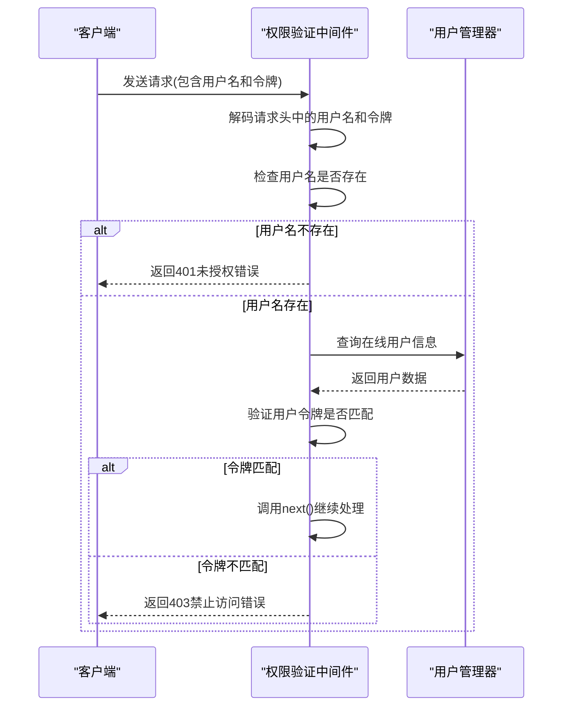
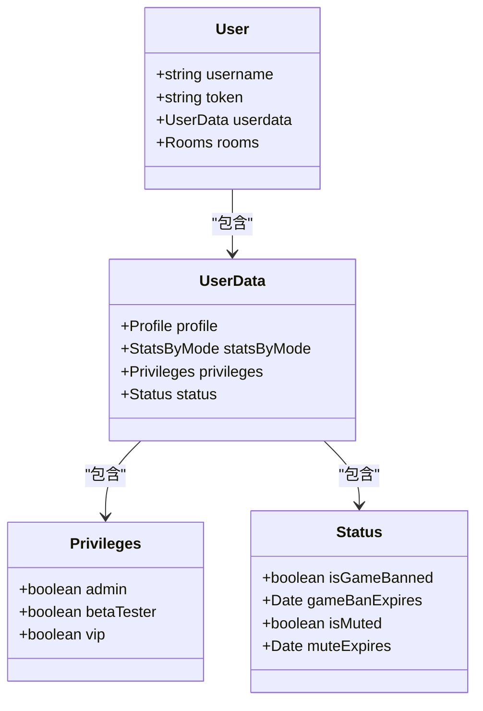
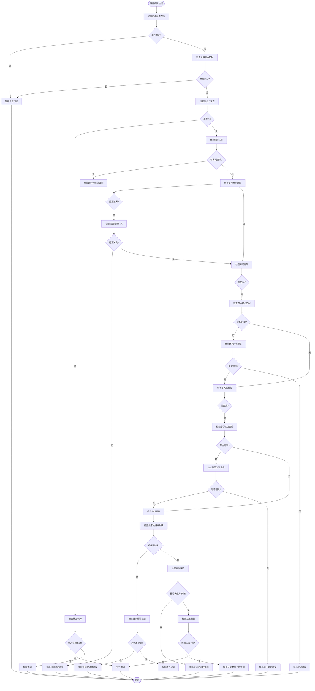
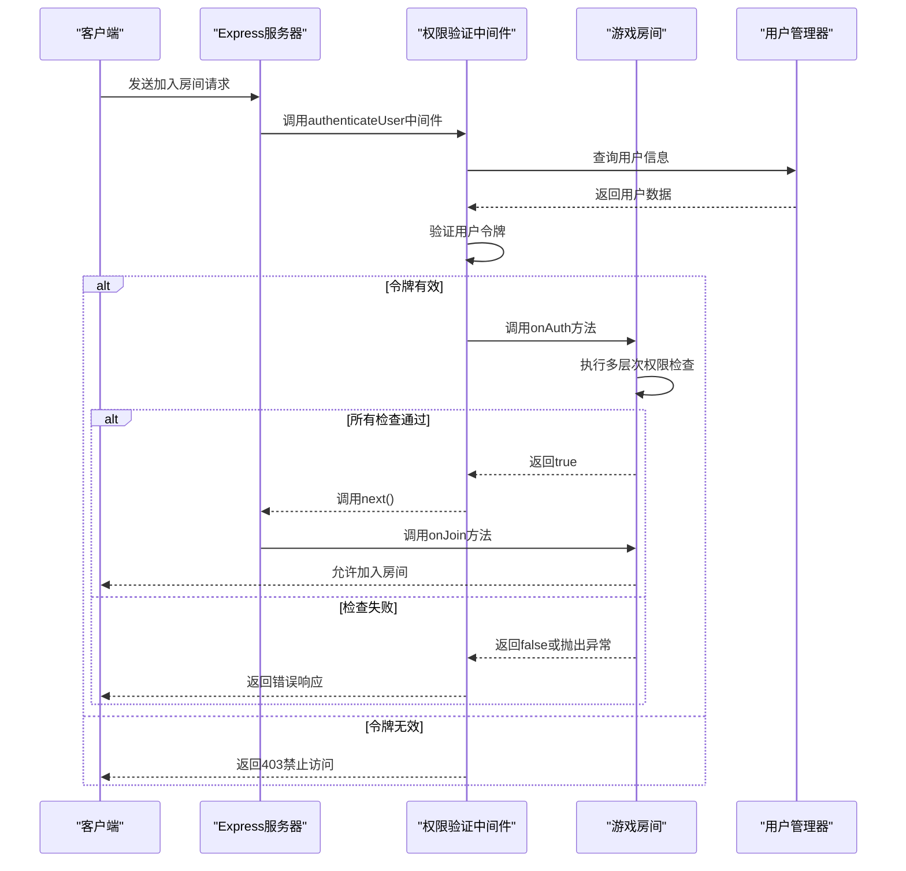

# 访问控制策略

<cite>
**本文档引用的文件**  
- [auth.ts](file://server/src/middleware/auth.ts)
- [lobby.ts](file://server/src/rooms/lobby.ts)
- [game.ts](file://server/src/rooms/game.ts)
</cite>

## 目录
1. [引言](#引言)
2. [核心权限验证机制](#核心权限验证机制)
3. [基于角色的访问控制实现](#基于角色的访问控制实现)
4. [游戏房间权限验证流程](#游戏房间权限验证流程)
5. [权限验证失败处理机制](#权限验证失败处理机制)
6. [权限检查执行流程分析](#权限检查执行流程分析)
7. [实际应用示例](#实际应用示例)
8. [总结](#总结)

## 引言
本系统实现了一套完整的访问控制策略，通过中间件和房间逻辑层的权限验证机制，确保只有经过身份验证和授权的用户才能访问特定资源。系统基于用户角色和权限级别实施细粒度的访问控制，涵盖了普通用户、管理员和特殊角色（如测试员）的权限差异。本文档将详细分析系统的访问控制实现，重点阐述权限验证的逻辑流程和具体实现方式。

## 核心权限验证机制

系统的核心权限验证机制主要由 `middleware/auth.ts` 文件中的两个中间件函数实现：`authenticateAdmin` 和 `authenticateUser`。这两个函数作为 Express.js 的中间件，负责拦截请求并进行身份验证和权限检查。



**图示来源**
- [auth.ts](file://server/src/middleware/auth.ts#L1-L53)

**本节来源**
- [auth.ts](file://server/src/middleware/auth.ts#L1-L53)

## 基于角色的访问控制实现

系统实现了基于角色的访问控制（RBAC），通过用户对象中的 `privileges` 属性来区分不同角色的权限。权限检查主要在游戏房间的 `onAuth` 方法中进行，针对不同的业务场景应用不同的权限规则。



**图示来源**
- [game.ts](file://server/src/rooms/game.ts#L89-L127)
- [lobby.ts](file://server/src/rooms/lobby.ts#L15-L25)

**本节来源**
- [game.ts](file://server/src/rooms/game.ts#L89-L127)
- [lobby.ts](file://server/src/rooms/lobby.ts#L15-L25)

### 管理员权限验证
管理员权限验证通过 `authenticateAdmin` 函数实现，该函数检查用户是否具有管理员权限：

```typescript
export function authenticateAdmin(userService: UserService) {
    return async (req: Request, res: Response, next: NextFunction) => {
        const userId = decodeURIComponent(
            req.headers['x-user-name'].toString()
        );
        if (!userId) {
            return res.status(401).json({ error: 'Authentication required' });
        }

        try {
            if (!userService.checkAdmin(userId)) {
                return res
                    .status(403)
                    .json({ error: 'Admin privileges required' });
            }
            next();
        } catch (error: any) {
            res.status(500).json({ error: error.message });
        }
    };
}
```

该函数首先从请求头中获取用户名，然后调用 `userService.checkAdmin` 方法检查用户是否为管理员。如果用户不是管理员，则返回 HTTP 403 状态码，表示禁止访问。

### 普通用户权限验证
普通用户权限验证通过 `authenticateUser` 函数实现，该函数验证用户的身份令牌：

```typescript
export function authenticateUser(userManager: UserManager) {
    return async (req: Request, res: Response, next: NextFunction) => {
        const userId = decodeURIComponent(
            req.headers['x-user-name'].toString()
        );
        const token = decodeURIComponent(
            req.headers['x-user-token'].toString()
        );
        if (!userId) {
            return res.status(401).json({ error: 'Authentication required' });
        }

        try {
            if (
                userManager.onlinePlayers[userId] &&
                userManager.onlinePlayers[userId].token === token
            ) {
                next();
            } else {
                return res.status(403).json({ error: 'User Token required' });
            }
        } catch (error: any) {
            res.status(500).json({ error: error.message });
        }
    };
}
```

该函数同时验证用户名和令牌，确保用户身份的真实性和有效性。只有当用户在线且提供的令牌与系统记录的令牌匹配时，才允许继续处理请求。

## 游戏房间权限验证流程

游戏房间的权限验证流程在 `onAuth` 方法中实现，该方法在用户尝试加入房间时被调用。流程包括多个层次的权限检查，确保只有符合条件的用户才能加入特定房间。



**图示来源**
- [game.ts](file://server/src/rooms/game.ts#L89-L127)

**本节来源**
- [game.ts](file://server/src/rooms/game.ts#L89-L127)

### 详细权限检查逻辑
游戏房间的 `onAuth` 方法实现了多层次的权限检查逻辑：

1. **基本身份验证**：检查用户是否存在且令牌是否匹配
2. **重连验证**：检查用户是否正在进行重连操作，如果是则验证重连令牌
3. **测试房访问控制**：对于测试房，只有具有 `betaTester` 权限的用户才能加入
4. **密码保护**：对于有密码的房间，需要验证密码，但管理员可以绕过密码验证
5. **旁观限制**：对于禁止旁观的房间，只有管理员可以作为旁观者加入
6. **游戏封禁检查**：检查用户是否被禁止玩游戏
7. **房间状态检查**：确保房间处于等待状态，未开始游戏
8. **玩家数量限制**：确保房间未达到最大玩家数量

这些检查按顺序执行，任何一项检查失败都会导致用户无法加入房间，并返回相应的错误代码。

## 权限验证失败处理机制

系统对权限验证失败的情况进行了详细的处理，返回适当的 HTTP 状态码和错误信息，同时确保安全响应机制的有效性。

### 错误代码定义
系统使用 `ServerCode` 枚举定义了各种权限相关的错误代码：

- `AuthError` (503): 认证错误，用户不存在或令牌不匹配
- `NotTester` (509): 非测试员，无法加入测试房
- `PasswordError` (506): 密码错误，无法加入有密码的房间
- `ProhibitStand` (507): 禁止旁观，无法以旁观者身份加入
- `AlreadyJoined` (508): 已经加入房间，无法重复加入
- `AccountIsBanGame` (510): 账号被禁止玩游戏
- `RoomIsStarted` (511): 房间已开始，无法加入
- `PlayerCountMax` (512): 玩家数量达到上限

### 错误处理流程
当权限验证失败时，系统会抛出 `ServerError` 异常，包含相应的错误代码：

```typescript
if (roomoptions.settings.test && !user.userdata.privileges.betaTester) {
    throw new ServerError(ServerCode.NotTester);
}
```

这种异常处理机制确保了错误信息的一致性和可预测性，便于客户端进行错误处理和用户提示。

## 权限检查执行流程分析

系统的权限检查执行流程从请求拦截开始，经过多层验证，最终决定是否允许访问。整个流程可以分为以下几个阶段：



**图示来源**
- [auth.ts](file://server/src/middleware/auth.ts#L1-L53)
- [game.ts](file://server/src/rooms/game.ts#L89-L127)

**本节来源**
- [auth.ts](file://server/src/middleware/auth.ts#L1-L53)
- [game.ts](file://server/src/rooms/game.ts#L89-L127)

### 请求拦截阶段
在请求到达具体业务逻辑之前，权限验证中间件会首先拦截请求，进行基本的身份验证。这一阶段主要验证用户的基本身份信息，确保请求来自一个已知且有效的用户。

### 权限验证阶段
通过基本身份验证后，请求会到达具体的业务逻辑层（如游戏房间），在这里进行更详细的权限检查。这一阶段会根据具体的业务场景应用不同的权限规则。

### 响应处理阶段
根据权限验证的结果，系统会返回相应的响应：
- 验证通过：调用 `next()` 继续处理请求，允许用户加入房间
- 验证失败：返回适当的 HTTP 状态码和错误信息，阻止用户访问

## 实际应用示例

以下是权限验证机制在不同场景中的实际应用示例：

### 普通用户加入普通房间
```typescript
// 普通用户尝试加入普通房间
const options = {
    username: "user123",
    token: "valid_token_123",
    spectate: false
};

// 权限验证流程：
// 1. authenticateUser中间件验证用户名和令牌
// 2. onAuth方法检查：
//    - 用户存在且令牌匹配 ✓
//    - 不是测试房 ✓
//    - 房间无密码或密码正确 ✓
//    - 不是旁观者 ✓
//    - 未被游戏封禁 ✓
//    - 房间处于等待状态 ✓
//    - 未达到玩家上限 ✓
// 3. 允许加入房间
```

### 管理员加入测试房
```typescript
// 管理员尝试加入测试房
const options = {
    username: "admin123",
    token: "admin_token_123",
    spectate: false
};

// 权限验证流程：
// 1. authenticateUser中间件验证用户名和令牌
// 2. onAuth方法检查：
//    - 用户存在且令牌匹配 ✓
//    - 是测试房，但用户是管理员，可绕过测试员检查 ✓
//    - 其他检查均通过 ✓
// 3. 允许加入房间
```

### 非测试员尝试加入测试房
```typescript
// 非测试员尝试加入测试房
const options = {
    username: "user123",
    token: "valid_token_123",
    spectate: false
};

// 权限验证流程：
// 1. authenticateUser中间件验证用户名和令牌 ✓
// 2. onAuth方法检查：
//    - 用户存在且令牌匹配 ✓
//    - 是测试房，且用户不是测试员 ✗
// 3. 抛出NotTester错误，拒绝加入
```

## 总结
本系统的访问控制策略实现了基于角色的细粒度权限管理，通过中间件和业务逻辑层的协同工作，确保了系统的安全性和可靠性。权限验证机制涵盖了从基本身份验证到复杂业务规则的多层次检查，能够有效防止未授权访问。系统对权限验证失败的情况进行了妥善处理，返回清晰的错误信息，便于客户端进行相应的用户提示。整体设计遵循了安全最佳实践，为不同角色的用户提供了适当的访问权限，同时保持了系统的灵活性和可扩展性。