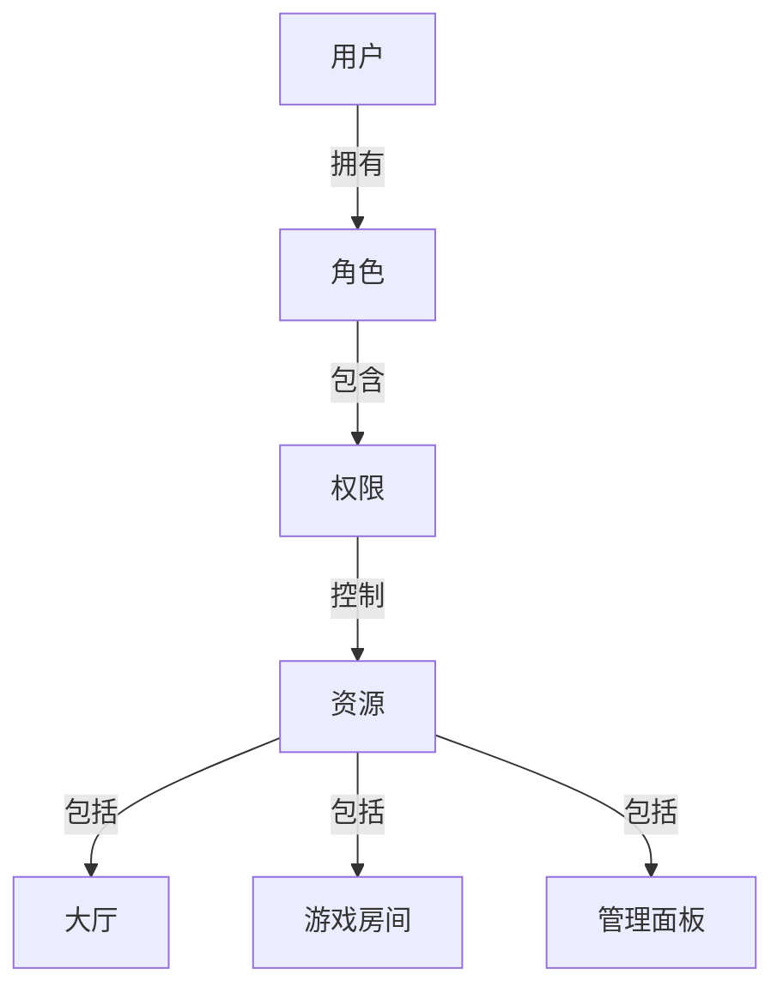
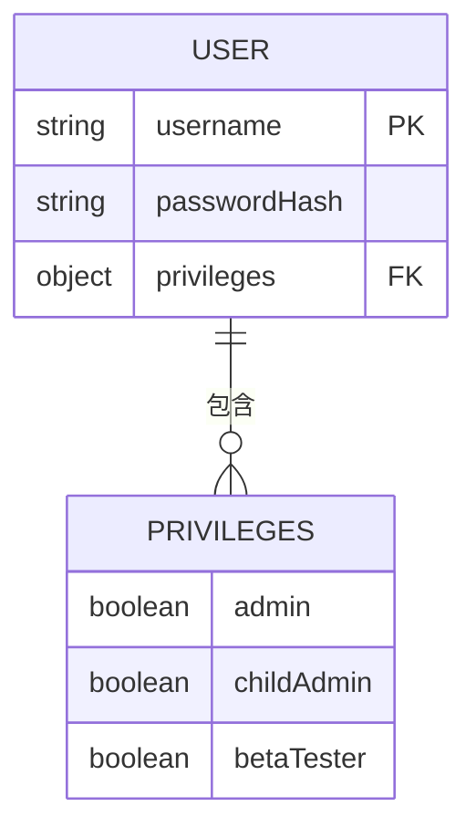
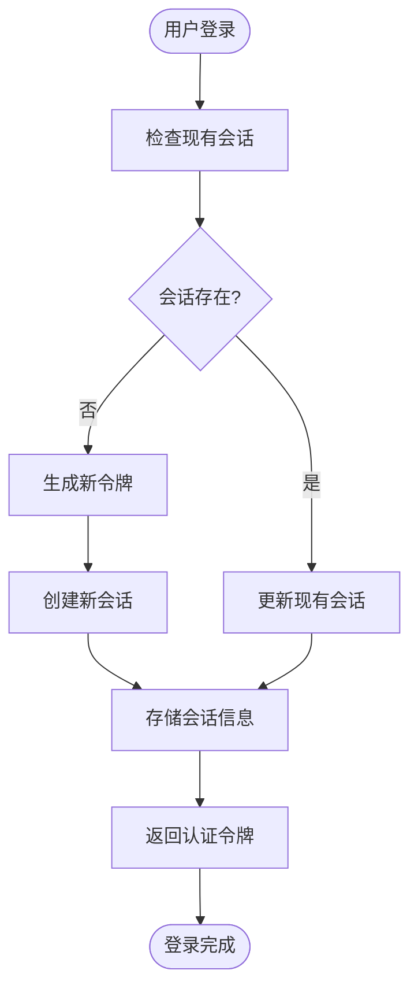
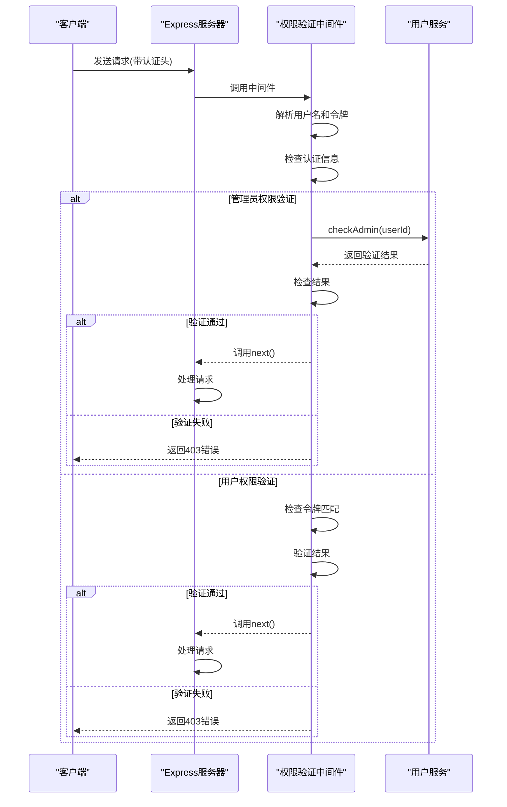
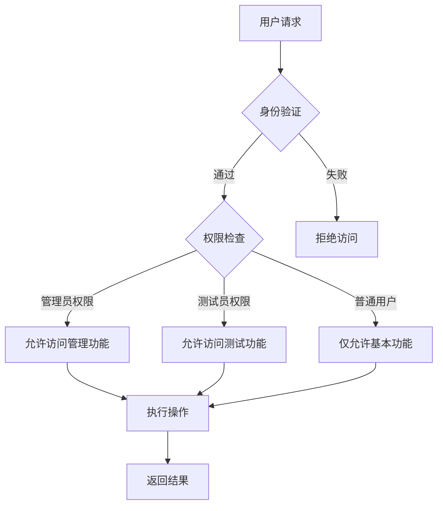
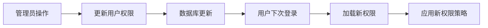
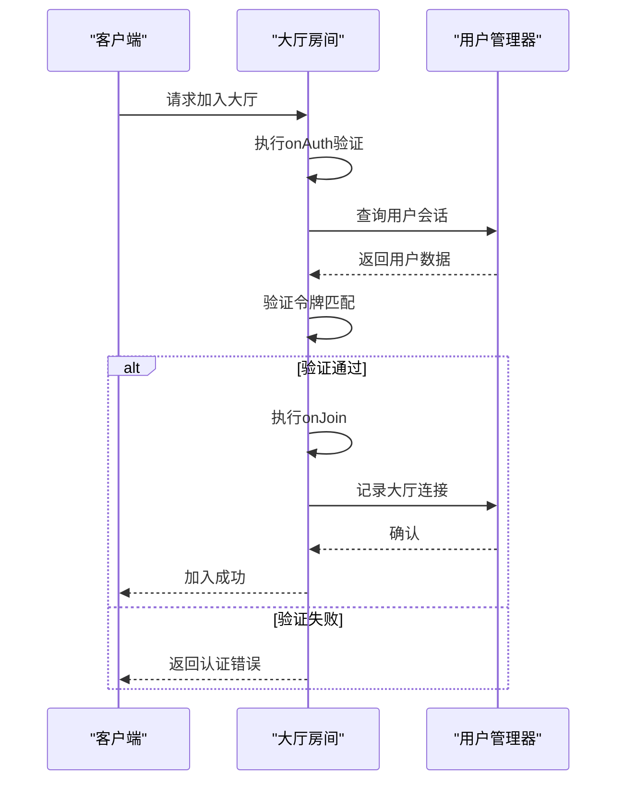
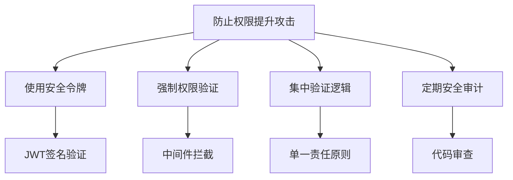

# 权限分配策略

<cite>
**本文档引用的文件**   
- [UserManager.ts](file://server/src/UserManager.ts)
- [lobby.ts](file://server/src/rooms/lobby.ts)
- [User.ts](file://server/src/db/models/User.ts)
- [auth.ts](file://server/src/routes/auth.ts)
- [auth.ts](file://server/src/middleware/auth.ts)
- [UserService.ts](file://server/src/db/services/UserService.ts)
</cite>

## 目录
1. [引言](#引言)
2. [权限模型概述](#权限模型概述)
3. [核心权限管理组件](#核心权限管理组件)
4. [权限定义与数据结构](#权限定义与数据结构)
5. [权限分配与验证机制](#权限分配与验证机制)
6. [基于角色的访问控制实现](#基于角色的访问控制实现)
7. [权限继承与特殊权限处理](#权限继承与特殊权限处理)
8. [业务流程中的权限控制](#业务流程中的权限控制)
9. [安全考虑与最佳实践](#安全考虑与最佳实践)
10. [结论](#结论)

## 引言
本文档深入解析系统中的权限分配策略，重点阐述基于角色的访问控制（RBAC）模型在代码中的具体实现。通过分析UserManager.ts和lobby.ts等核心文件，详细说明权限的定义、分配、验证机制以及在实际业务场景中的应用。文档旨在为开发者和系统管理员提供全面的权限管理指南，确保系统的安全性和可维护性。

## 权限模型概述
系统采用基于角色的访问控制（RBAC）模型来管理用户权限。该模型通过将权限分配给角色，再将角色分配给用户的方式，实现了灵活且可扩展的权限管理体系。系统中的权限主要分为管理员权限、测试员权限等不同类型，每种权限对应不同的系统访问级别和操作能力。



**图示来源**
- [UserManager.ts](file://server/src/UserManager.ts#L1-L150)
- [User.ts](file://server/src/db/models/User.ts#L1-L103)

## 核心权限管理组件

### UserManager组件分析
UserManager是系统中负责用户状态和权限管理的核心单例类。它维护了所有在线玩家的状态信息，包括用户数据、认证令牌、最后活跃时间以及当前连接的大厅和游戏房间等。

```mermaid
classDiagram
class UserManager {
+static inst : UserManager
+onlinePlayers : { [username : string] : PlayerSession }
-DISCONNECT_GRACE_PERIOD : number
-generateToken(user : DbUser) : string
+login(user : DbUser) : string
+joinLobby(username : string, client : Client) : void
+leaveLobby(client : Client) : void
+joinRoom(username : string, room : GameRoom, client : Client) : void
+leaveRoom(username : string, roomId : string, reconnectToken? : string) : void
+getPlayerRooms(username : string) : Array<{ roomId : string; room : GameRoom; client : Client }>
+findPlayerByClinet(sessionId : string) : PlayerSession | null
+broadcast(message : string) : void
}
class PlayerSession {
+userdata : DbUser
+token : string
+lastActive : Date
+lobbyClient : Client | null
+rooms : { [roomId : string] : RoomConnection }
}
class RoomConnection {
+room : GameRoom
+client : Client
+reconnectToken? : string
}
class DbUser {
+username : string
+privileges : Privileges
+status : Status
}
class Privileges {
+admin : boolean
+childAdmin : boolean
+betaTester : boolean
}
UserManager "1" --> "0..*" PlayerSession : 管理
PlayerSession --> DbUser : 包含
PlayerSession --> "0..*" RoomConnection : 连接
```

**图示来源**
- [UserManager.ts](file://server/src/UserManager.ts#L1-L150)

**本节来源**
- [UserManager.ts](file://server/src/UserManager.ts#L1-L150)

## 权限定义与数据结构

### 用户权限数据结构
系统中的用户权限信息存储在DbUser接口的privileges字段中，该字段包含多个布尔类型的权限标志，用于标识用户的不同权限级别。

```typescript
// 权限相关
privileges: {
    admin: boolean; // 是否管理员
    childAdmin: boolean; // 是否子管理员
    betaTester: boolean; // 是否测试白名单
};
```

这些权限在用户注册时被初始化，默认情况下所有权限均为false，确保遵循最小权限原则。



**图示来源**
- [User.ts](file://server/src/db/models/User.ts#L1-L103)

**本节来源**
- [User.ts](file://server/src/db/models/User.ts#L1-L103)

## 权限分配与验证机制

### 权限分配流程
当用户成功登录或注册时，系统会调用UserManager的login方法进行权限分配。该方法首先检查用户是否已存在在线会话，如果不存在则创建新的会话并生成认证令牌。



**图示来源**
- [UserManager.ts](file://server/src/UserManager.ts#L45-L75)
- [auth.ts](file://server/src/routes/auth.ts#L15-L58)

### 权限验证中间件
系统实现了两个主要的权限验证中间件：authenticateAdmin和authenticateUser，用于在HTTP请求处理过程中验证用户权限。



**图示来源**
- [auth.ts](file://server/src/middleware/auth.ts#L1-L39)

**本节来源**
- [auth.ts](file://server/src/middleware/auth.ts#L1-L39)
- [UserManager.ts](file://server/src/UserManager.ts#L45-L75)

## 基于角色的访问控制实现

### RBAC模型的具体应用
系统中的RBAC模型通过将权限与角色关联，实现了灵活的访问控制。不同的角色被赋予不同的权限组合，用户通过被分配角色来获得相应的系统访问权限。

```typescript
// 管理员角色：拥有admin权限
// 测试员角色：拥有betaTester权限
// 普通用户角色：无特殊权限
```

当用户尝试访问受保护的资源时，系统会检查用户是否具有相应的权限。例如，在创建认证路由时，系统会根据用户的权限级别决定是否允许其执行特定操作。



**图示来源**
- [auth.ts](file://server/src/middleware/auth.ts#L1-L39)
- [UserService.ts](file://server/src/db/services/UserService.ts#L34-L74)

**本节来源**
- [auth.ts](file://server/src/middleware/auth.ts#L1-L39)
- [UserService.ts](file://server/src/db/services/UserService.ts#L34-L74)

## 权限继承与特殊权限处理

### 权限继承机制
系统中的权限继承主要体现在管理权限的层级结构上。虽然当前代码中只定义了admin和childAdmin两种管理权限，但这种设计为未来的权限层级扩展提供了基础。

```typescript
// 权限继承示例
// admin权限自动包含childAdmin权限的所有能力
// childAdmin权限可能有特定的限制
```

### 特殊权限的授予与回收
特殊权限（如测试员权限）的授予和回收通常由管理员通过后台管理系统完成。当用户的权限状态发生变化时，系统会更新数据库中的用户记录，并在用户下次登录时同步新的权限信息。



**本节来源**
- [UserService.ts](file://server/src/db/services/UserService.ts#L34-L74)
- [User.ts](file://server/src/db/models/User.ts#L1-L103)

## 业务流程中的权限控制

### 大厅权限控制场景
在lobby.ts文件中，系统实现了大厅房间的权限控制逻辑。当用户尝试加入大厅时，系统会验证其认证信息的有效性。



**图示来源**
- [lobby.ts](file://server/src/rooms/lobby.ts#L1-L59)

**本节来源**
- [lobby.ts](file://server/src/rooms/lobby.ts#L1-L59)
- [UserManager.ts](file://server/src/UserManager.ts#L77-L92)

## 安全考虑与最佳实践

### 最小权限原则实施
系统严格遵循最小权限原则，在用户注册时默认不授予任何特殊权限。只有经过管理员明确授权的用户才能获得额外的权限。

```typescript
// 用户注册时的权限初始化
privileges: {
    admin: false,
    childAdmin: false,
    betaTester: false,
}
```

### 权限提升攻击防范
为了防止权限提升攻击，系统采取了多项安全措施：
1. 使用JWT令牌进行会话管理，确保令牌的安全性
2. 在每次敏感操作前都进行权限验证
3. 将权限验证逻辑集中在中间件中，减少代码重复和漏洞风险



**本节来源**
- [auth.ts](file://server/src/middleware/auth.ts#L1-L39)
- [UserManager.ts](file://server/src/UserManager.ts#L45-L75)
- [UserService.ts](file://server/src/db/services/UserService.ts#L34-L74)

## 结论
本文档详细解析了系统中的权限分配策略，涵盖了从权限模型设计到具体实现的各个方面。通过基于角色的访问控制模型，系统实现了灵活、安全的权限管理体系。核心的UserManager组件负责维护用户会话和权限状态，而各种中间件和业务逻辑组件则共同协作，确保权限控制的有效执行。未来可以考虑进一步完善权限层级结构，增加更细粒度的权限控制，以满足更复杂的业务需求。