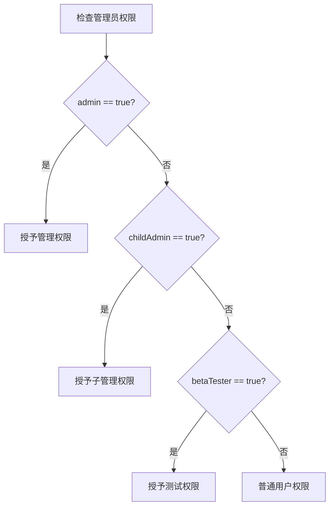
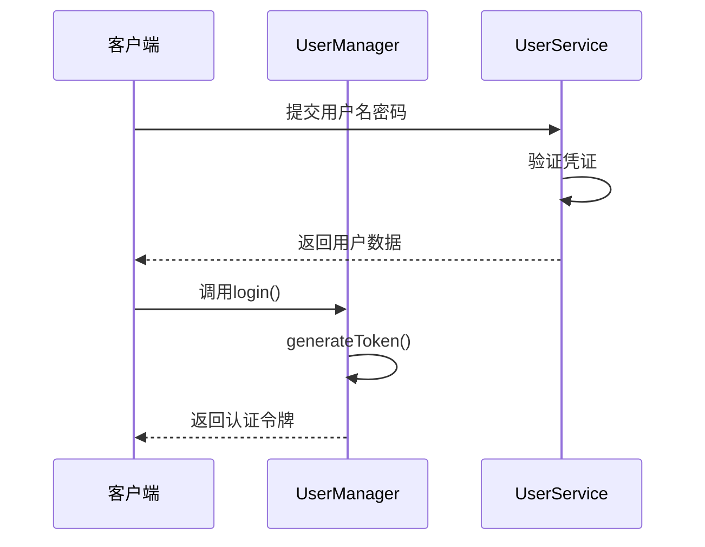
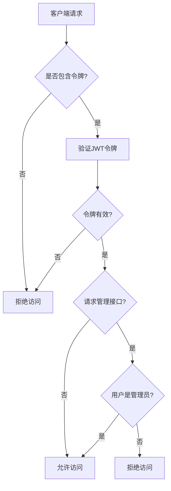
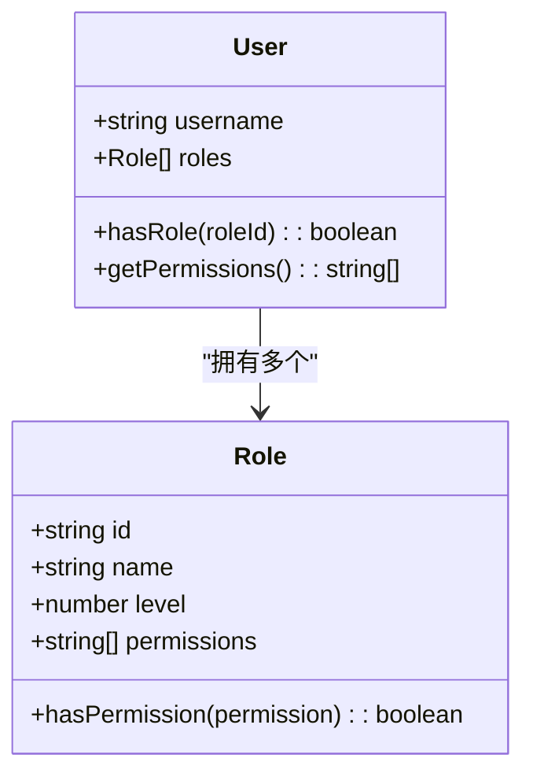

# 角色定义机制

<cite>
**本文档引用文件**  
- [UserManager.ts](file://server/src/UserManager.ts#L1-L150)
- [User.ts](file://server/src/db/models/User.ts#L1-L103)
- [lobby.ts](file://server/src/rooms/lobby.ts#L1-L59)
- [auth.ts](file://server/src/middleware/auth.ts#L1-L39)
- [UserService.ts](file://server/src/db/services/UserService.ts#L1-L244)
</cite>

## 目录
1. [角色定义机制概述](#角色定义机制概述)
2. [角色类型的数据结构设计](#角色类型的数据结构设计)
3. [角色枚举的实现方式](#角色枚举的实现方式)
4. [角色属性的设计](#角色属性的设计)
5. [角色状态的管理方式](#角色状态的管理方式)
6. [在房间管理中的实际应用](#在房间管理中的实际应用)
7. [代码示例与类型安全实现](#代码示例与类型安全实现)
8. [扩展性设计分析](#扩展性设计分析)

## 角色定义机制概述

本系统通过 `DbUser` 接口和 `UserManager` 类共同实现角色的定义与管理。角色信息存储于数据库用户模型中，通过权限字段进行区分，并在运行时由用户管理器维护在线状态。系统支持普通用户、测试用户和管理员等多种角色类型，通过布尔型权限标志进行控制。

**Section sources**
- [User.ts](file://server/src/db/models/User.ts#L1-L103)
- [UserManager.ts](file://server/src/UserManager.ts#L1-L150)

## 角色类型的数据结构设计

系统采用接口（Interface）方式定义用户数据结构，其中角色相关属性集中于 `privileges` 字段。

```typescript
interface DbUser {
    // ... 其他字段
    privileges: {
        admin: boolean;        // 是否管理员
        childAdmin: boolean;   // 是否子管理员
        betaTester: boolean;   // 是否测试白名单用户
    };
}
```

该设计采用扁平化的布尔标志位来表示不同角色类型，具有以下特点：
- **类型安全**：通过 TypeScript 接口确保字段类型一致性
- **可读性强**：字段命名直观明确
- **易于扩展**：可直接添加新的权限标志
- **存储高效**：使用布尔值最小化存储空间

**Section sources**
- [User.ts](file://server/src/db/models/User.ts#L30-L35)

## 角色枚举的实现方式

系统未使用传统枚举类型定义角色，而是采用基于布尔字段的权限模型。这种设计模式提供了更大的灵活性和组合能力。

### 角色类型映射

| 角色类型 | 对应字段 | 说明 |
|---------|--------|------|
| 管理员 | `admin` | 拥有最高权限 |
| 子管理员 | `childAdmin` | 拥有部分管理权限 |
| 测试用户 | `betaTester` | 白名单测试资格 |
| 普通用户 | 所有字段为 false | 基础访问权限 |

### 权限检查实现



**Diagram sources**
- [UserService.ts](file://server/src/db/services/UserService.ts#L194-L244)
- [auth.ts](file://server/src/middleware/auth.ts#L1-L39)

**Section sources**
- [UserService.ts](file://server/src/db/services/UserService.ts#L194-L244)

## 角色属性的设计

角色属性分为核心属性和扩展属性两大类，分别存储在不同的对象层级中。

### 核心属性

```json
{
  "privileges": {
    "admin": true,
    "childAdmin": false,
    "betaTester": true
  }
}
```

- **角色名称**：通过字段名隐式定义
- **权限级别**：通过字段层级体现（admin > childAdmin）
- **特殊标识**：betaTester 作为特殊访问权限标识

### 扩展属性

系统还通过其他字段间接影响角色行为：

```json
{
  "status": {
    "isBanned": false,
    "isMuted": false,
    "isGameBanned": false
  },
  "profile": {
    "reputationScore": 100,
    "titles": ["新手上路", "活跃玩家"]
  }
}
```

这些属性与角色权限协同工作，形成完整的用户权限体系。

**Section sources**
- [User.ts](file://server/src/db/models/User.ts#L30-L45)

## 角色状态的管理方式

角色状态管理由 `UserManager` 类负责，采用单例模式确保全局状态一致性。

### 创建流程

当用户登录时，系统执行以下步骤：
1. 调用 `login()` 方法
2. 检查是否已有会话
3. 生成 JWT 令牌
4. 更新或创建在线玩家记录



**Diagram sources**
- [UserManager.ts](file://server/src/UserManager.ts#L30-L50)
- [UserService.ts](file://server/src/db/services/UserService.ts#L1-L37)

### 更新流程

角色状态更新主要通过以下途径：
- **权限变更**：修改数据库中的 `privileges` 字段
- **在线状态**：通过 `lastActive` 时间戳跟踪
- **令牌刷新**：每次登录重新生成 JWT 令牌

### 删除流程

用户离线时，系统不会立即删除其记录，而是：
- 清除 `lobbyClient` 引用
- 保留 `reconnectToken` 支持重连
- 超时后自动清理（30秒无活动）

```typescript
private readonly DISCONNECT_GRACE_PERIOD = 30000; // 30秒
```

**Section sources**
- [UserManager.ts](file://server/src/UserManager.ts#L30-L150)

## 在房间管理中的实际应用

`lobby.ts` 文件展示了角色在房间管理系统中的具体应用。

### 认证流程

```typescript
onAuth(client: Client, options: any) {
    const { username, token } = options;
    const user = UserManager.inst.onlinePlayers[username];
    if (!user) {
        throw new ServerError(ServerCode.AuthError);
    }
    if (user.token !== token) {
        throw new ServerError(ServerCode.AuthError);
    }
    return true;
}
```

该流程验证用户身份，确保只有通过认证的用户才能加入房间。

### 管理员权限应用

虽然当前代码未直接检查角色类型，但结合 `auth.ts` 中的中间件，形成了完整的权限控制链：



**Diagram sources**
- [lobby.ts](file://server/src/rooms/lobby.ts#L1-L59)
- [auth.ts](file://server/src/middleware/auth.ts#L1-L39)

**Section sources**
- [lobby.ts](file://server/src/rooms/lobby.ts#L1-L59)

## 代码示例与类型安全实现

### 类型安全的角色检查

```typescript
// 管理员认证中间件
export function authenticateAdmin(userService: UserService) {
    return async (req: Request, res: Response, next: NextFunction) => {
        const userId = decodeURIComponent(req.headers['x-user-name'].toString());
        if (!userId) {
            return res.status(401).json({ error: 'Authentication required' });
        }

        try {
            if (!userService.checkAdmin(userId)) {
                return res.status(403).json({ error: 'Admin privileges required' });
            }
            next();
        } catch (error: any) {
            res.status(500).json({ error: error.message });
        }
    };
}
```

### 完整的用户数据结构示例

```typescript
const exampleUser: DbUser = {
    username: "admin_user",
    nickname: "超级管理员",
    passwordHash: "hashed_password",
    salt: "random_salt",
    profile: {
        reputationScore: 100,
        doudizhuScore: 3000,
        avatar: "/avatars/admin.png",
        title: "系统管理员",
        titles: ["系统管理员", "创始成员"],
        lastLogin: new Date()
    },
    registration: {
        ip: "192.168.1.1",
        date: new Date()
    },
    privileges: {
        admin: true,
        childAdmin: false,
        betaTester: true
    },
    status: {
        isBanned: false,
        isMuted: false,
        isGameBanned: false
    },
    statsByMode: {
        doudizhu: {
            matches: 100,
            wins: 65,
            escapes: 2
        }
    },
    ipHistory: ["192.168.1.1"],
    createdAt: new Date(),
    updatedAt: new Date()
};
```

**Section sources**
- [User.ts](file://server/src/db/models/User.ts#L1-L103)
- [auth.ts](file://server/src/middleware/auth.ts#L1-L39)

## 扩展性设计分析

系统的角色定义机制具有良好的扩展性，主要体现在以下几个方面：

### 水平扩展能力

通过增加新的布尔字段即可添加角色类型：

```typescript
privileges: {
    admin: boolean;
    childAdmin: boolean;
    betaTester: boolean;
    vipUser: boolean;      // 新增VIP用户
    moderator: boolean;    // 新增版主
}
```

### 垂直扩展能力

可将扁平结构升级为分级权限系统：

```typescript
interface Role {
    id: string;
    name: string;
    level: number;
    permissions: string[];
}

interface DbUser {
    roles: Role[];
    // 或者
    roleId: string;
}
```

### 当前设计优势

1. **简单高效**：布尔标志位查询性能优异
2. **类型安全**：TypeScript 编译时检查
3. **易于理解**：直观的字段命名
4. **兼容性好**：与现有认证系统无缝集成

### 潜在改进方向

1. **引入角色枚举**：定义明确的角色常量
2. **权限分离**：将权限与角色解耦
3. **动态配置**：通过配置文件定义角色
4. **继承机制**：支持角色继承关系



**Diagram sources**
- [User.ts](file://server/src/db/models/User.ts#L1-L103)

**Section sources**
- [User.ts](file://server/src/db/models/User.ts#L1-L103)
- [UserManager.ts](file://server/src/UserManager.ts#L1-L150)