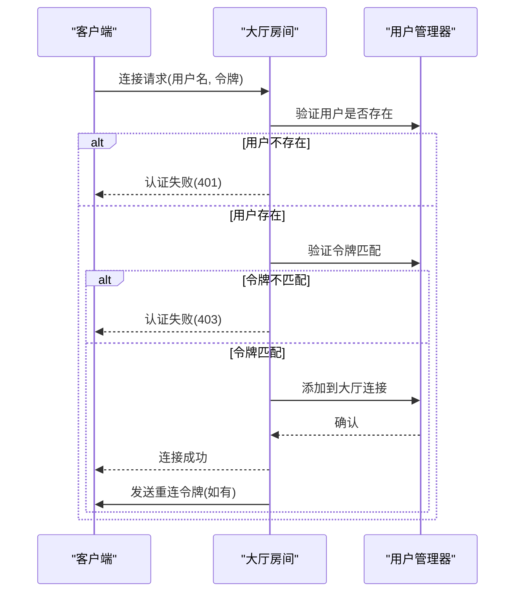
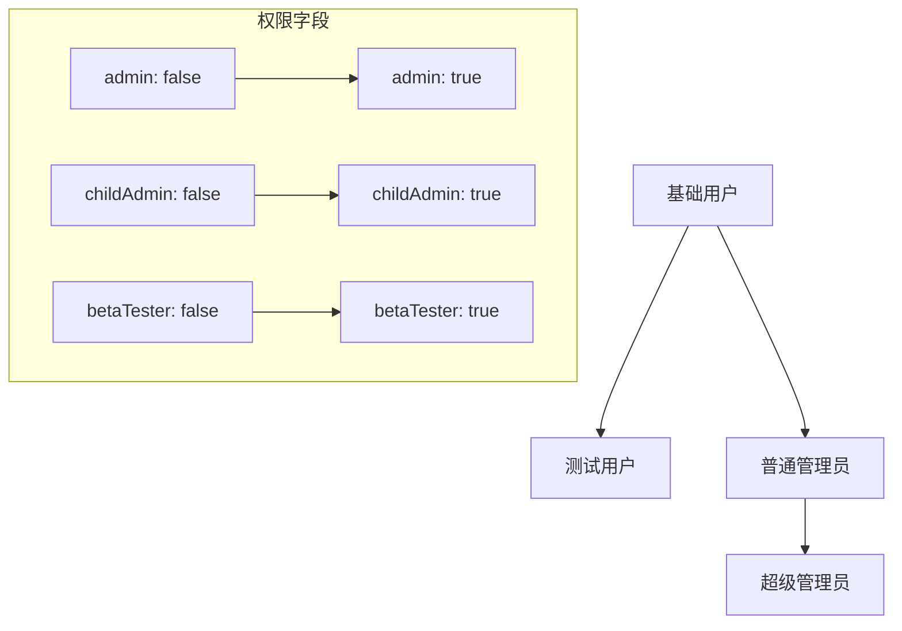
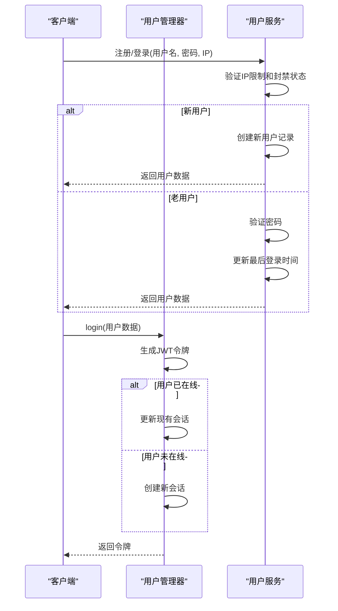
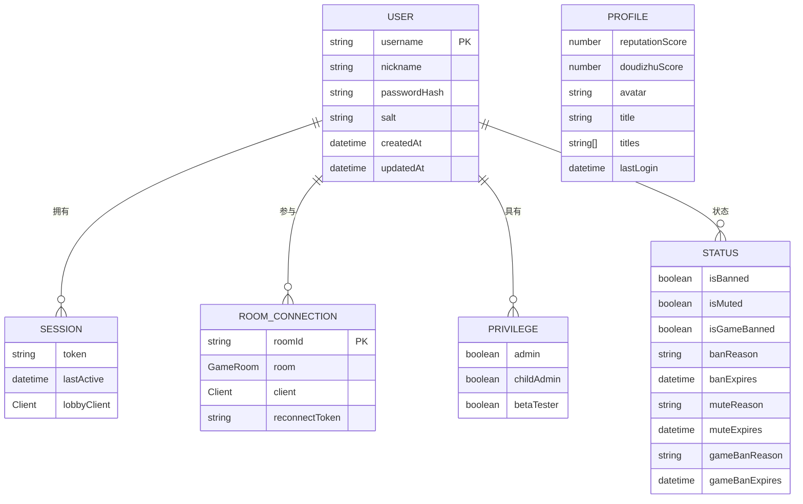

# 角色管理体系

<cite>
**本文档引用文件**  
- [UserManager.ts](file://server/src/UserManager.ts)
- [User.ts](file://server/src/db/models/User.ts)
- [lobby.ts](file://server/src/rooms/lobby.ts)
- [UserService.ts](file://server/src/db/services/UserService.ts)
- [auth.ts](file://server/src/middleware/auth.ts)
</cite>

## 目录
1. [引言](#引言)
2. [用户角色数据结构设计](#用户角色数据结构设计)
3. [角色管理机制实现](#角色管理机制实现)
4. [权限控制应用场景](#权限控制应用场景)
5. [角色继承与权限分配逻辑](#角色继承与权限分配逻辑)
6. [角色变更处理流程](#角色变更处理流程)
7. [角色模型关系图](#角色模型关系图)
8. [实际应用场景示例](#实际应用场景示例)
9. [安全考虑](#安全考虑)

## 引言

本系统采用基于用户属性的细粒度角色管理体系，通过`DbUser`接口定义用户角色和权限。该体系支持管理员、测试用户等多种角色类型，并结合信誉分机制实现动态权限控制。核心管理逻辑由`UserManager`类实现，负责用户会话、令牌管理和在线状态跟踪。

**Section sources**
- [UserManager.ts](file://server/src/UserManager.ts#L1-L150)
- [User.ts](file://server/src/db/models/User.ts#L2-L65)

## 用户角色数据结构设计

### 角色类型与权限级别

用户角色信息存储在`DbUser`接口中，主要包含以下结构：

```typescript
interface DbUser {
  // 基础信息
  profile: {
    reputationScore: number;     // 信誉分
    doudizhuScore: number;       // 豆豆分
    avatar: string;              // 头像URL
    title?: string;              // 显示称号
    titles: string[];            // 拥有称号列表
  };
  
  // 权限相关
  privileges: {
    admin: boolean;              // 是否为管理员
    childAdmin: boolean;         // 是否为子管理员
    betaTester: boolean;         // 是否为测试用户
  };
  
  // 状态控制
  status: {
    isBanned: boolean;           // 是否被封禁
    isMuted: boolean;            // 是否被禁言
    isGameBanned: boolean;       // 是否禁止游戏
  };
}
```

#### 权限级别说明

| 权限级别 | 对应字段 | 说明 |
|---------|--------|------|
| 管理员 | `privileges.admin` | 拥有最高权限，可执行系统管理操作 |
| 子管理员 | `privileges.childAdmin` | 拥有部分管理权限 |
| 测试用户 | `privileges.betaTester` | 可访问测试功能 |

#### 特殊权限存储方式

特殊权限通过组合多个字段实现：
- **禁言状态**：`status.isMuted` + `status.muteReason` + `status.muteExpires`
- **游戏限制**：`status.isGameBanned` + `status.gameBanReason` + `status.gameBanExpires`
- **信誉分惩罚**：根据`profile.reputationScore`值自动触发相应限制

**Section sources**
- [User.ts](file://server/src/db/models/User.ts#L2-L65)
- [UserService.ts](file://server/src/db/services/UserService.ts#L31-L61)

## 角色管理机制实现

### UserManager核心功能

`UserManager`类采用单例模式实现，负责管理所有在线用户的状态：

```mermaid
classDiagram
class UserManager {
+static inst : UserManager
+onlinePlayers : { [username : string] : PlayerSession }
-DISCONNECT_GRACE_PERIOD : number
-generateToken(user : DbUser) : string
+login(user : DbUser) : string
+joinLobby(username : string, client : Client) : void
+leaveLobby(client : Client) : void
+joinRoom(username : string, room : GameRoom, client : Client) : void
+leaveRoom(username : string, roomId : string, reconnectToken? : string) : void
+getPlayerRooms(username : string) : Array<{ roomId : string; room : GameRoom; client : Client }>
+findPlayerByClinet(sessionId : string) : PlayerSession | null
+broadcast(message : string) : void
}
class PlayerSession {
+userdata : DbUser
+token : string
+lastActive : Date
+lobbyClient : Client | null
+rooms : { [roomId : string] : RoomConnection }
}
class RoomConnection {
+room : GameRoom
+client : Client
+reconnectToken? : string
}
UserManager --> PlayerSession : "包含"
PlayerSession --> RoomConnection : "包含多个"
```

**Diagram sources**
- [UserManager.ts](file://server/src/UserManager.ts#L5-L149)

### 在线用户会话结构

`onlinePlayers`对象存储了所有在线用户的信息，其结构设计如下：

```json
{
  "用户名": {
    "userdata": DbUser对象,
    "token": "JWT令牌",
    "lastActive": "最后活跃时间",
    "lobbyClient": "大厅客户端连接",
    "rooms": {
      "房间ID": {
        "room": "游戏房间实例",
        "client": "房间内客户端连接",
        "reconnectToken": "重连令牌"
      }
    }
  }
}
```

### 令牌生成机制

系统使用JWT（JSON Web Token）进行身份验证：

```typescript
private generateToken(user: DbUser): string {
    return jwt.sign(
        { userId: user._id, username: user.username },
        'resgs.PrivateKey',
        { expiresIn: '7d' }
    );
}
```

令牌包含用户ID和用户名，有效期为7天，使用私钥签名确保安全性。

**Section sources**
- [UserManager.ts](file://server/src/UserManager.ts#L15-L30)

## 权限控制应用场景

### 大厅房间权限控制

在`CustomLobbyRoom`中实现了基于令牌的身份验证机制：



**Diagram sources**
- [lobby.ts](file://server/src/rooms/lobby.ts#L1-L58)

### 认证中间件实现

系统提供了两个认证中间件函数：

```typescript
// 普通用户认证
export function authenticateUser(userManager: UserManager) {
    return async (req: Request, res: Response, next: NextFunction) => {
        const userId = decodeURIComponent(req.headers['x-user-name'].toString());
        const token = decodeURIComponent(req.headers['x-user-token'].toString());
        
        if (!userId) {
            return res.status(401).json({ error: 'Authentication required' });
        }

        try {
            if (
                userManager.onlinePlayers[userId] &&
                userManager.onlinePlayers[userId].token === token
            ) {
                next();
            } else {
                return res.status(403).json({ error: 'User Token required' });
            }
        } catch (error: any) {
            res.status(500).json({ error: error.message });
        }
    };
}

// 管理员认证
export function authenticateAdmin(userService: UserService) {
    return async (req: Request, res: Response, next: NextFunction) => {
        const userId = decodeURIComponent(req.headers['x-user-name'].toString());
        if (!userId) {
            return res.status(401).json({ error: 'Authentication required' });
        }

        try {
            if (!userService.checkAdmin(userId)) {
                return res.status(403).json({ error: 'Admin privileges required' });
            }
            next();
        } catch (error: any) {
            res.status(500).json({ error: error.message });
        }
    };
}
```

**Section sources**
- [auth.ts](file://server/src/middleware/auth.ts#L1-L52)

## 角色继承与权限分配逻辑

### 角色继承机制

系统通过`privileges`字段实现角色继承：



### 权限分配逻辑

权限分配通过`UserService`类实现：

```typescript
async checkAdmin(username: string) {
    return await this.collection.findOne({
        username,
        'privileges.admin': true,
    });
}
```

管理员权限直接存储在数据库中，通过MongoDB的嵌套字段查询实现高效验证。

### 动态权限调整

系统通过信誉分机制实现动态权限调整：

```typescript
private async applyPenaltiesIfNeeded(username: string, newScore: number) {
    let penaltiesApplied = false;
    if (newScore < 40) {
        await this.userService.banUser(username, '信誉分低于40', 24 * 60 * 60 * 1000);
    }
    else if (newScore < 60) {
        await this.userService.banGame(username, '信誉分低于60', 24 * 60 * 60 * 1000);
    }
    else if (newScore < 70) {
        await this.userService.banGame(username, '信誉分低于70', 12 * 60 * 60 * 1000);
    }
    else if (newScore < 80) {
        await this.userService.banGame(username, '信誉分低于70', 20 * 60 * 1000);
    }
    return true;
}
```

**Section sources**
- [UserService.ts](file://server/src/db/services/UserService.ts#L300-L380)
- [ReputationService.ts](file://server/src/db/services/ReputationService.ts#L34-L74)

## 角色变更处理流程

### 用户登录流程



### 角色变更处理

当用户权限发生变化时，系统处理流程如下：

1. 数据库更新：通过`UserService`修改`privileges`字段
2. 会话同步：下次用户操作时从数据库重新加载用户数据
3. 权限验证：中间件实时检查最新权限状态

```typescript
login(user: DbUser) {
    const existingSession = this.onlinePlayers[user.username];
    if (!existingSession) {
        const token = this.generateToken(user);
        this.onlinePlayers[user.username] = {
            userdata: user,
            lastActive: new Date(),
            token,
            lobbyClient: null,
            rooms: {},
        };
        return token;
    }

    const newToken = this.generateToken(user);
    existingSession.token = newToken;
    existingSession.userdata = user; // 更新用户数据，包括权限信息
    return newToken;
}
```

**Section sources**
- [UserManager.ts](file://server/src/UserManager.ts#L32-L50)
- [UserService.ts](file://server/src/db/services/UserService.ts#L1-L380)

## 角色模型关系图



**Diagram sources**
- [User.ts](file://server/src/db/models/User.ts#L2-L65)
- [UserManager.ts](file://server/src/UserManager.ts#L5-L149)

## 实际应用场景示例

### 普通用户

- **权限特征**：
  - `privileges.admin = false`
  - `privileges.childAdmin = false`
  - `privileges.betaTester = false`
- **行为限制**：
  - 可以进入大厅和游戏房间
  - 信誉分低于80时可能被限制游戏
  - 被禁言时无法发送聊天消息

### VIP用户（测试用户）

- **权限特征**：
  - `privileges.betaTester = true`
- **特殊权限**：
  - 可以访问测试版本功能
  - 可能享有更高的信誉分起始值
  - 在某些活动中获得特殊称号

### 管理员

- **权限特征**：
  - `privileges.admin = true`
- **管理能力**：
  - 可以封禁用户账号
  - 可以禁言用户
  - 可以查看系统日志
  - 执行全局广播

```typescript
// 管理员操作示例
async banUser(username: string, reason: string, times?: number, banIp: boolean = true) {
    // 封禁用户账号
}

async banMuted(username: string, reason: string, times?: number) {
    // 禁言用户
}

async banGame(username: string, reason: string, times?: number) {
    // 禁止用户参与游戏
}
```

**Section sources**
- [UserService.ts](file://server/src/db/services/UserService.ts#L100-L200)

## 安全考虑

### 防止权限提升攻击

系统采取了多项措施防止权限提升攻击：

1. **服务端验证**：所有权限检查都在服务端进行，不依赖客户端数据
2. **JWT签名**：使用私钥签名令牌，防止篡改
3. **定期刷新**：登录时更新令牌，确保权限变更及时生效
4. **最小权限原则**：默认创建用户时所有特权字段均为`false`

### 防止角色混淆

为防止角色混淆，系统设计了清晰的权限边界：

```typescript
// 权限检查分离
function authenticateUser(userManager: UserManager) {
    // 只验证基本身份
}

function authenticateAdmin(userService: UserService) {
    // 额外验证管理员权限
}
```

### 会话安全管理

- **令牌存储**：JWT令牌存储在内存中，与用户会话绑定
- **会话清理**：用户离开大厅或房间时及时清理连接引用
- **重连机制**：提供有限时间的重连令牌，避免会话劫持

### 信誉分保护机制

通过`ReputationService`实现信誉分相关的安全保护：

```typescript
// 信誉分扣除时自动应用相应惩罚
private async applyPenaltiesIfNeeded(username: string, newScore: number) {
    if (newScore < 40) {
        await this.userService.banUser(username, '信誉分低于40', 24小时);
    }
    else if (newScore < 60) {
        await this.userService.banGame(username, '信誉分低于60', 24小时);
    }
    // ...其他阈值处理
}
```

**Section sources**
- [auth.ts](file://server/src/middleware/auth.ts#L1-L52)
- [ReputationService.ts](file://server/src/db/services/ReputationService.ts#L1-L74)