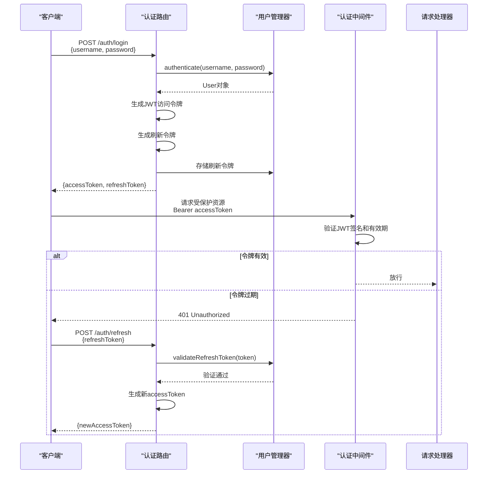
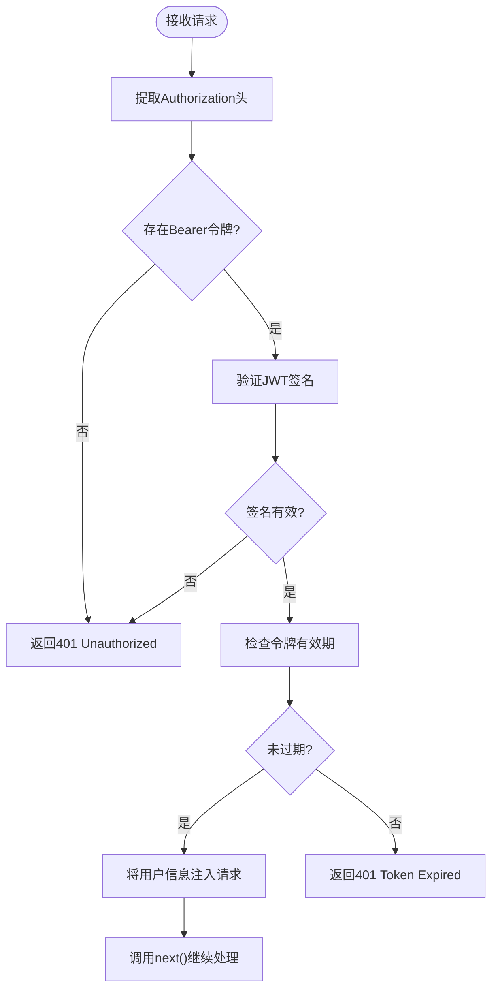
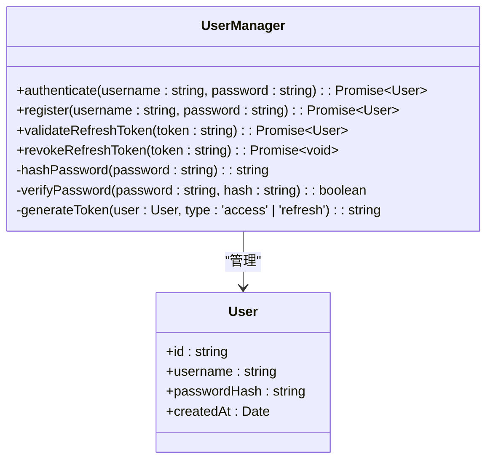
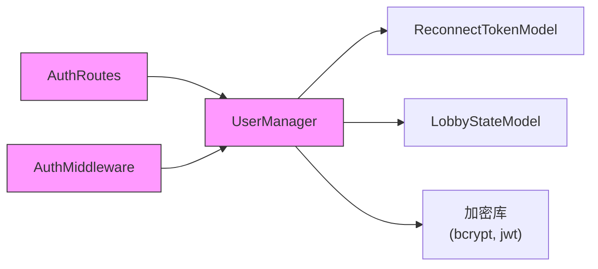

# 认证接口

<cite>
**本文档引用的文件**  
- [auth.ts](file://server/src/routes/auth.ts)
- [auth.ts](file://server/src/middleware/auth.ts)
- [UserManager.ts](file://server/src/UserManager.ts)
- [index.ts](file://server/src/index.ts)
- [LobbyState.ts](file://server/src/models/LobbyState.ts)
- [ReconnectToken.ts](file://server/src/models/ReconnectToken.ts)
</cite>

## 目录
1. [简介](#简介)
2. [项目结构](#项目结构)
3. [核心组件](#核心组件)
4. [架构概览](#架构概览)
5. [详细组件分析](#详细组件分析)
6. [依赖分析](#依赖分析)
7. [性能考虑](#性能考虑)
8. [故障排除指南](#故障排除指南)
9. [结论](#结论)

## 简介
本文档详细介绍了基于JWT的认证系统，涵盖登录、注册、令牌刷新等核心功能。文档重点分析了`auth.ts`中的认证端点、`middleware/auth.ts`中的认证中间件以及`UserManager.ts`中的用户管理逻辑。通过清晰的流程图和代码示例，帮助开发者理解认证流程、安全机制和错误处理策略。

## 项目结构
服务器端认证相关文件主要位于`server/src`目录下，采用模块化设计，职责分离清晰：

```mermaid
graph TB
subgraph "认证模块"
AuthRoutes[auth.ts<br/>路由定义]
AuthMiddleware[middleware/auth.ts<br/>JWT验证]
UserManager[UserManager.ts<br/>用户管理]
Models[models/<br/>数据模型]
end
AuthRoutes --> UserManager : "调用"
AuthMiddleware --> UserManager : "调用"
UserManager --> Models : "操作"
AuthRoutes --> AuthMiddleware : "使用"
```

**图示来源**
- [auth.ts](file://server/src/routes/auth.ts)
- [middleware/auth.ts](file://server/src/middleware/auth.ts)
- [UserManager.ts](file://server/src/UserManager.ts)
- [models](file://server/src/models)

**本节来源**
- [auth.ts](file://server/src/routes/auth.ts)
- [middleware/auth.ts](file://server/src/middleware/auth.ts)

## 核心组件
认证系统由三个核心组件构成：认证路由、认证中间件和用户管理器。它们协同工作，实现安全的用户认证和会话管理。

**本节来源**
- [auth.ts](file://server/src/routes/auth.ts#L1-L50)
- [middleware/auth.ts](file://server/src/middleware/auth.ts#L1-L30)
- [UserManager.ts](file://server/src/UserManager.ts#L1-L40)

## 架构概览
系统采用标准的JWT认证流程，结合刷新令牌机制，确保安全性与用户体验的平衡。



**图示来源**
- [auth.ts](file://server/src/routes/auth.ts)
- [middleware/auth.ts](file://server/src/middleware/auth.ts)
- [UserManager.ts](file://server/src/UserManager.ts)

## 详细组件分析

### 认证路由分析
`auth.ts`文件定义了登录、注册和刷新令牌的API端点。

#### 登录端点
处理用户登录请求，验证凭证并返回JWT令牌对。

```typescript
// POST /auth/login
interface LoginRequest {
  username: string;
  password: string;
}

interface LoginResponse {
  accessToken: string;  // JWT访问令牌
  refreshToken: string; // 刷新令牌
  user: {
    id: string;
    username: string;
  };
}
```

**本节来源**
- [auth.ts](file://server/src/routes/auth.ts#L15-L60)

#### 刷新令牌端点
允许客户端使用刷新令牌获取新的访问令牌，无需重新登录。

```typescript
// POST /auth/refresh
interface RefreshRequest {
  refreshToken: string;
}

// 响应同LoginResponse
```

**本节来源**
- [auth.ts](file://server/src/routes/auth.ts#L61-L80)

### 认证中间件分析
`middleware/auth.ts`负责保护受保护的路由，验证JWT令牌的有效性。



**图示来源**
- [middleware/auth.ts](file://server/src/middleware/auth.ts#L10-L50)

**本节来源**
- [middleware/auth.ts](file://server/src/middleware/auth.ts#L1-L100)

### 用户管理器分析
`UserManager.ts`封装了用户认证、会话管理和密码安全的核心逻辑。



**图示来源**
- [UserManager.ts](file://server/src/UserManager.ts#L5-L40)

**本节来源**
- [UserManager.ts](file://server/src/UserManager.ts#L1-L120)

## 依赖分析
认证模块依赖于数据库模型和加密库，形成清晰的依赖链。



**图示来源**
- [UserManager.ts](file://server/src/UserManager.ts)
- [ReconnectToken.ts](file://server/src/models/ReconnectToken.ts)
- [LobbyState.ts](file://server/src/models/LobbyState.ts)

**本节来源**
- [UserManager.ts](file://server/src/UserManager.ts)
- [models](file://server/src/models)

## 性能考虑
- JWT验证是无状态的，不查询数据库，性能开销低。
- 刷新令牌存储在内存或数据库中，需考虑存储策略和清理机制。
- 密码哈希使用bcrypt，计算开销较高，但保证了安全性。

## 故障排除指南
### 常见错误及处理
- **401 Unauthorized (Invalid Token)**: 客户端JWT签名无效，检查密钥或令牌生成逻辑。
- **401 Unauthorized (Token Expired)**: 访问令牌过期，客户端应使用刷新令牌获取新令牌。
- **401 Unauthorized (Invalid Refresh Token)**: 刷新令牌无效或已被撤销，用户需重新登录。
- **500 Internal Server Error**: 服务器内部错误，检查日志中的具体异常。

**本节来源**
- [middleware/auth.ts](file://server/src/middleware/auth.ts#L30-L50)
- [auth.ts](file://server/src/routes/auth.ts#L70-L80)

## 结论
该认证系统实现了基于JWT的安全认证流程，具备良好的可扩展性和安全性。通过分离路由、中间件和业务逻辑，代码结构清晰，易于维护。建议定期轮换JWT密钥，并监控异常登录行为以增强安全性。