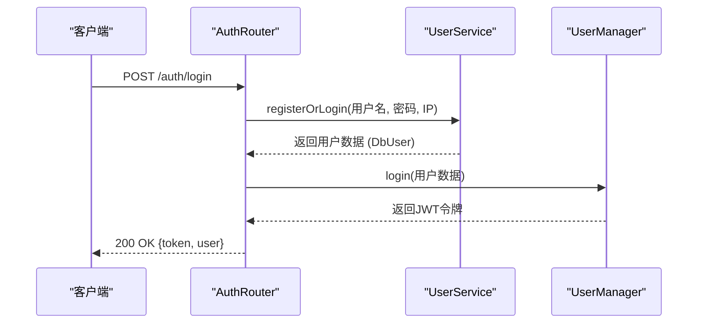

# 令牌刷新

<cite>
**本文档中引用的文件**   
- [auth.ts](file://server/src/routes/auth.ts)
- [auth.ts](file://server/src/middleware/auth.ts)
- [UserManager.ts](file://server/src/UserManager.ts)
</cite>

## 目录
1. [引言](#引言)
2. [核心组件分析](#核心组件分析)
3. [令牌刷新机制详解](#令牌刷新机制详解)
4. [安全特性与状态管理](#安全特性与状态管理)
5. [错误处理与响应格式](#错误处理与响应格式)

## 引言
本文件详细阐述了系统中的JWT令牌刷新机制，涵盖从客户端发起令牌刷新请求到服务器端验证并签发新访问令牌的完整流程。通过对`auth.ts`中认证路由、`middleware/auth.ts`中的身份验证中间件以及`UserManager.ts`中用户状态和令牌管理逻辑的深入分析，全面揭示了系统的身份认证架构与实现细节。尽管当前代码中未直接实现传统的“刷新令牌（refresh token）”机制，但通过`UserManager`类对在线用户会话令牌的动态更新与维护，实现了类似的功能逻辑。

**Section sources**
- [auth.ts](file://server/src/routes/auth.ts#L1-L58)
- [middleware/auth.ts](file://server/src/middleware/auth.ts#L1-L52)
- [UserManager.ts](file://server/src/UserManager.ts#L1-L149)

## 核心组件分析

### 认证路由 (auth.ts)
`auth.ts` 文件定义了系统的认证入口点，通过 `createAuthRouter` 函数创建了一个 Express 路由器，用于处理用户的登录或注册请求。



该模块的核心功能是接收客户端的用户名、密码和客户端版本号，验证版本号后调用 `UserService` 进行用户注册或登录，并最终通过 `UserManager` 生成一个JWT访问令牌返回给客户端。

**Diagram sources**
- [auth.ts](file://server/src/routes/auth.ts#L1-L58)

**Section sources**
- [auth.ts](file://server/src/routes/auth.ts#L1-L58)

### 身份验证中间件 (middleware/auth.ts)
`middleware/auth.ts` 文件提供了两个用于保护API路由的中间件函数：`authenticateAdmin` 和 `authenticateUser`。

```mermaid
flowchart TD
A["请求到达"] --> B{检查 x-user-name 头}
B --> |不存在| C[返回 401 未授权]
B --> |存在| D{检查 x-user-token 头}
D --> |不存在| C
D --> |存在| E[解码用户名和令牌]
E --> F{在线玩家列表中存在该用户?}
F --> |否| G[返回 403 禁止访问]
F --> |是| H{令牌匹配?}
H --> |否| G
H --> |是| I[调用 next() 继续处理]
```

`authenticateUser` 中间件通过检查请求头中的 `x-user-name` 和 `x-user-token`，并与 `UserManager` 中维护的在线玩家会话进行比对，来验证用户的身份。这种方式将令牌的有效性检查与用户的在线状态绑定在一起。

**Diagram sources**
- [middleware/auth.ts](file://server/src/middleware/auth.ts#L35-L51)

**Section sources**
- [middleware/auth.ts](file://server/src/middleware/auth.ts#L1-L52)

### 用户会话管理 (UserManager.ts)
`UserManager.ts` 是整个认证系统的核心，它是一个单例类，负责管理所有在线用户的会话状态。

```mermaid
classDiagram
class UserManager {
+static inst : UserManager
+onlinePlayers : { [username] : PlayerSession }
-generateToken(user : DbUser) : string
+login(user : DbUser) : string
+joinLobby(username, client)
+leaveLobby(client)
+joinRoom(username, room, client)
+leaveRoom(username, roomId, reconnectToken)
+findPlayerByClinet(sessionId) : PlayerSession
}
class PlayerSession {
+userdata : DbUser
+token : string
+lastActive : Date
+lobbyClient : Client
+rooms : { [roomId] : RoomConnection }
}
class RoomConnection {
+room : GameRoom
+client : Client
+reconnectToken? : string
}
UserManager "1" o-- "0..*" PlayerSession
PlayerSession "1" o-- "0..*" RoomConnection
```

`UserManager` 使用一个名为 `onlinePlayers` 的对象来存储所有已登录用户的信息，每个用户条目都包含其用户数据、当前有效的JWT令牌、最后活跃时间以及与游戏大厅和房间的连接信息。

**Diagram sources**
- [UserManager.ts](file://server/src/UserManager.ts#L1-L149)

**Section sources**
- [UserManager.ts](file://server/src/UserManager.ts#L1-L149)

## 令牌刷新机制详解
虽然系统中没有独立的 `/refresh` 端点或传统的刷新令牌，但其令牌的“刷新”逻辑内嵌在用户的登录流程中，实现了动态令牌更新。

### 令牌生成
令牌的生成由 `UserManager` 类的 `generateToken` 私有方法完成。该方法使用 `jsonwebtoken` 库，根据用户的 `_id` 和 `username` 生成一个签名的JWT令牌。

```typescript
private generateToken(user: DbUser): string {
    return jwt.sign(
        { userId: user._id, username: user.username },
        'resgs.PrivateKey',
        { expiresIn: '7d' }
    );
}
```
此令牌的有效期为7天，使用硬编码的密钥 `'resgs.PrivateKey'` 进行签名。

### 登录与令牌签发
当用户成功通过 `UserService` 的验证后，`auth.ts` 路由会调用 `UserManager.login(user)` 方法。

```typescript
login(user: DbUser) {
    const existingSession = this.onlinePlayers[user.username];
    if (!existingSession) {
        // 新用户登录
        const token = this.generateToken(user);
        this.onlinePlayers[user.username] = {
            userdata: user,
            lastActive: new Date(),
            token,
            lobbyClient: null,
            rooms: {},
        };
        return token;
    }

    // 已登录用户重新登录，刷新令牌
    const newToken = this.generateToken(user);
    existingSession.token = newToken;
    existingSession.userdata = user;
    return newToken;
}
```
`login` 方法是实现“刷新”逻辑的关键：
1.  **新登录**：如果用户不在 `onlinePlayers` 列表中，则为其创建一个新会话，并生成一个新令牌。
2.  **重新登录/刷新**：如果用户已在列表中（例如，客户端重启或长时间未操作后重新连接），系统会为该用户生成一个**全新的令牌**，并用它覆盖旧的令牌。旧的令牌随即失效。

### 客户端请求流程
客户端的流程如下：
1.  用户发起 `/auth/login` 请求。
2.  服务器验证凭据。
3.  服务器调用 `UserManager.login()`，无论用户是首次登录还是重新连接，都会返回一个最新的、有效的JWT令牌。
4.  客户端使用此新令牌进行后续的API调用，并在请求头中设置 `x-user-name` 和 `x-user-token`。

这种方式虽然没有使用独立的刷新令牌，但通过在每次成功登录时强制更新访问令牌，达到了类似的效果。

**Section sources**
- [UserManager.ts](file://server/src/UserManager.ts#L45-L75)
- [auth.ts](file://server/src/routes/auth.ts#L25-L45)

## 安全特性与状态管理
系统的安全模型紧密依赖于 `UserManager` 对用户状态的集中管理。

### 令牌验证
令牌的验证并非通过解密JWT本身来完成，而是通过与 `UserManager` 内存中的状态进行比对。`authenticateUser` 中间件检查：
1.  请求头中的 `x-user-name` 是否存在。
2.  该用户名是否存在于 `onlinePlayers` 列表中。
3.  请求头中的 `x-user-token` 是否与 `onlinePlayers` 中存储的该用户的 `token` 值完全匹配。

只要这三个条件都满足，请求就被认为是有效的。这意味着，一旦 `UserManager` 更新了用户的令牌（例如，通过重新登录），所有持有旧令牌的请求都将因令牌不匹配而被拒绝（返回403）。

### 会话状态管理
`UserManager` 不仅管理令牌，还管理用户的完整会话状态，包括：
-   **在线状态**：通过 `onlinePlayers` 对象的存在来体现。
-   **最后活跃时间**：`lastActive` 字段可用于实现超时断开逻辑。
-   **连接信息**：`lobbyClient` 和 `rooms` 字段跟踪用户在游戏大厅和各个游戏房间中的连接。

这种集中式的管理方式使得系统可以精确地控制用户的访问权限，并在用户断开连接时进行清理。

**Section sources**
- [middleware/auth.ts](file://server/src/middleware/auth.ts#L35-L51)
- [UserManager.ts](file://server/src/UserManager.ts#L1-L149)

## 错误处理与响应格式
系统对认证过程中的各种错误情况都有明确的处理。

### 错误响应
-   **401 Unauthorized (未授权)**：当 `client_version` 不匹配、用户名为空或用户凭据无效时返回。响应体为 `{ error: "错误信息" }`。
-   **403 Forbidden (禁止访问)**：当 `authenticateUser` 中间件检测到用户名或令牌不匹配时返回。响应体为 `{ error: "User Token required" }`。
-   **500 Internal Server Error (内部服务器错误)**：当中间件内部发生未预期的异常时返回。响应体为 `{ error: "错误信息" }`。

### 成功响应
登录成功时，服务器返回200状态码和一个包含新令牌及用户信息的JSON对象：
```json
{
  "token": "eyJhbGciOiJIUzI1NiIsInR5cCI6IkpXVCJ9...",
  "user": {
    "username": "player1",
    "profile": {
      "avatar": "default",
      "title": "新手"
    },
    "privileges": {
      "admin": false,
      "tester": true
    }
  }
}
```
客户端应使用此新令牌进行后续的所有认证请求。

**Section sources**
- [auth.ts](file://server/src/routes/auth.ts#L50-L57)
- [middleware/auth.ts](file://server/src/middleware/auth.ts#L20-L30)