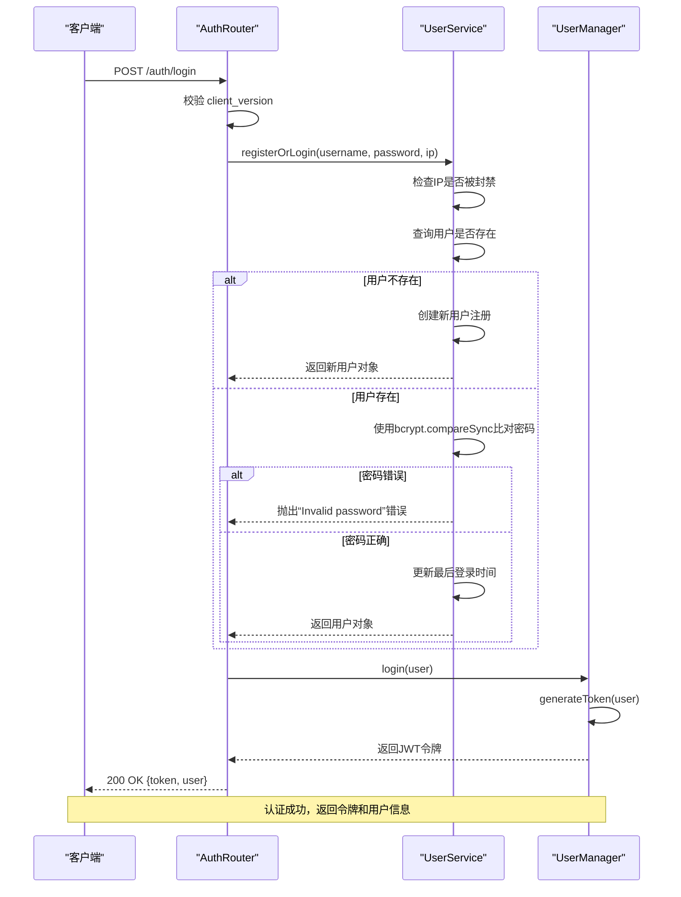

# 登录认证

<cite>
**本文档引用的文件**  
- [auth.ts](file://server/src/routes/auth.ts)
- [UserManager.ts](file://server/src/UserManager.ts)
- [UserService.ts](file://server/src/db/services/UserService.ts)
</cite>

## 目录
1. [登录认证流程概述](#登录认证流程概述)  
2. [客户端请求分析](#客户端请求分析)  
3. [服务器端认证逻辑](#服务器端认证逻辑)  
4. [用户身份验证实现](#用户身份验证实现)  
5. [JWT令牌生成与结构](#jwt令牌生成与结构)  
6. [请求与响应示例](#请求与响应示例)  
7. [安全机制与防护措施](#安全机制与防护措施)

## 登录认证流程概述

本系统采用基于JWT（JSON Web Token）的无状态认证机制，用户通过客户端发起 `/auth/login` 请求，服务器验证凭证后返回包含用户信息和令牌的响应。整个流程包括客户端请求、服务端验证、用户状态检查、密码比对、令牌签发等环节。

该认证机制结合了 bcrypt 密码哈希算法与 JWT 令牌技术，确保用户凭证的安全性，并通过 IP 封禁、注册限制等策略增强系统安全性。

**Section sources**  
- [auth.ts](file://server/src/routes/auth.ts#L1-L58)

## 客户端请求分析

客户端在登录时需向 `/auth/login` 端点发送 POST 请求，请求体包含用户名、密码及客户端版本号。服务器通过 `req.body` 解析这些参数。

### 请求参数说明
- **username**: 用户名，用于唯一标识用户账户
- **password**: 明文密码，将在服务端进行哈希比对
- **client_version**: 客户端版本号，用于版本控制与兼容性校验

```json
{
  "username": "player1",
  "password": "securePassword123",
  "client_version": "1.0.92"
}
```

服务器首先校验 `client_version` 是否为允许的版本（当前为 `1.0.92`），若不匹配则直接拒绝请求，防止旧版或非官方客户端接入。

**Section sources**  
- [auth.ts](file://server/src/routes/auth.ts#L15-L20)

## 服务器端认证逻辑

认证流程由 `auth.ts` 中的 `/login` 路由处理，其核心逻辑如下：

1. 提取请求参数并校验客户端版本
2. 调用 `UserService.registerOrLogin()` 方法进行用户登录或注册
3. 若用户存在且密码正确，调用 `UserManager.login()` 生成令牌
4. 返回包含 JWT 令牌和用户基本信息的 JSON 响应

### 认证流程序列图



**Diagram sources**  
- [auth.ts](file://server/src/routes/auth.ts#L15-L58)
- [UserService.ts](file://server/src/db/services/UserService.ts#L15-L100)
- [UserManager.ts](file://server/src/UserManager.ts#L40-L60)

## 用户身份验证实现

用户身份验证的核心实现在 `UserService.ts` 的 `registerOrLogin` 方法中，涉及密码哈希处理、用户状态检查和注册限制。

### 密码哈希处理（bcrypt）

系统使用 `bcryptjs` 库对用户密码进行单向哈希存储，确保即使数据库泄露也无法直接获取明文密码。

- **注册时**：生成 salt（盐值），使用 `bcrypt.hashSync(password, salt)` 生成哈希值
- **登录时**：使用 `bcrypt.compareSync(password, user.passwordHash)` 比对输入密码与存储哈希

```typescript
const salt = bcrypt.genSaltSync(10);
const passwordHash = bcrypt.hashSync(password, salt);
```

### 用户状态检查

在密码验证通过后，系统会检查用户的封禁状态：

- 若 `status.isBanned` 为 `true` 且封禁未过期，则拒绝登录
- 若封禁已过期，则自动解封并允许登录

此外，系统还会记录用户的登录IP，并更新 `lastLogin` 时间戳。

### IP 封禁与注册限制

- **IP 封禁检查**：调用 `banService.isIpBanned(ip)` 判断当前IP是否被全局封禁
- **注册限制**：同一IP最多只能注册1个账号（通过 `checkIpRegistrationLimit(ip)` 实现）

```typescript
if (ipCheck.isBanned) {
    throw new Error(`IP地址已被封禁：${ipCheck.reason}`);
}
```

**Section sources**  
- [UserService.ts](file://server/src/db/services/UserService.ts#L15-L100)

## JWT令牌生成与结构

令牌由 `UserManager.ts` 中的 `generateToken` 方法生成，使用对称密钥签名，有效期为7天。

### 令牌生成逻辑

```typescript
private generateToken(user: DbUser): string {
    return jwt.sign(
        { userId: user._id, username: user.username },
        'resgs.PrivateKey',
        { expiresIn: '7d' }
    );
}
```

### JWT 令牌声明（Claims）

| 声明 | 类型 | 描述 |
|------|------|------|
| `userId` | string | 用户数据库ID（_id） |
| `username` | string | 用户名 |
| `exp` | number | 过期时间戳（UTC秒） |
| `iat` | number | 签发时间戳 |

### 令牌管理机制

`UserManager` 维护一个 `onlinePlayers` 对象，记录所有在线用户的状态：

```typescript
public onlinePlayers: {
    [username: string]: {
        userdata: DbUser;
        token: string;
        lastActive: Date;
        lobbyClient: Client | null;
        rooms: { [roomId: string]: { room: GameRoom; client: Client } };
    };
};
```

当用户登录时：
- 若为首次登录，生成新令牌并加入在线列表
- 若已在线，则更新令牌和用户数据

**Section sources**  
- [UserManager.ts](file://server/src/UserManager.ts#L40-L60)

## 请求与响应示例

### 成功认证（200 OK）

**请求**
```http
POST /auth/login
Content-Type: application/json

{
  "username": "player1",
  "password": "securePassword123",
  "client_version": "1.0.92"
}
```

**响应**
```json
HTTP/1.1 200 OK
Content-Type: application/json

{
  "token": "eyJhbGciOiJIUzI1NiIsInR5cCI6IkpXVCJ9.xxxxx",
  "user": {
    "username": "player1",
    "profile": {
      "avatar": "http://res.resgs.com/generals/shibingn/image.png",
      "title": null
    },
    "privileges": {
      "admin": false,
      "tester": false
    }
  }
}
```

### 认证失败（401 Unauthorized）

**密码错误响应**
```json
HTTP/1.1 401 Unauthorized
Content-Type: application/json

{
  "error": "Invalid password"
}
```

**客户端版本错误响应**
```json
HTTP/1.1 401 Unauthorized
Content-Type: application/json

{
  "error": "Client Version Invalid"
}
```

**IP被封禁响应**
```json
HTTP/1.1 401 Unauthorized
Content-Type: application/json

{
  "error": "IP address is banned:滥用行为"
}
```

**Section sources**  
- [auth.ts](file://server/src/routes/auth.ts#L30-L50)
- [UserService.ts](file://server/src/db/services/UserService.ts#L30-L50)

## 安全机制与防护措施

系统实现了多层次的安全防护机制，保障用户账户与系统稳定。

### 防暴力破解措施

- **IP级封禁**：通过 `BanService` 对频繁尝试的IP进行封禁
- **注册限制**：单个IP最多注册1个账号，防止批量注册
- **密码哈希**：使用 bcrypt（salt rounds=10）确保密码不可逆

### 敏感信息保护

- **密码不存储明文**：仅存储 bcrypt 哈希值
- **令牌有效期控制**：JWT 设置7天过期，降低泄露风险
- **请求头认证**：后续请求使用 `x-user-name` 和 `x-user-token` 进行身份验证，避免重复传输密码

### 安全建议

1. **密钥管理**：当前JWT密钥为硬编码字符串 `'resgs.PrivateKey'`，建议改为环境变量配置
2. **HTTPS强制**：生产环境应强制使用HTTPS防止中间人攻击
3. **日志审计**：记录登录失败日志以便分析异常行为
4. **多因素认证**：可扩展支持邮箱/手机验证码二次验证

**Section sources**  
- [auth.ts](file://server/src/routes/auth.ts#L15-L20)
- [UserService.ts](file://server/src/db/services/UserService.ts#L10-L25)
- [UserManager.ts](file://server/src/UserManager.ts#L40-L50)