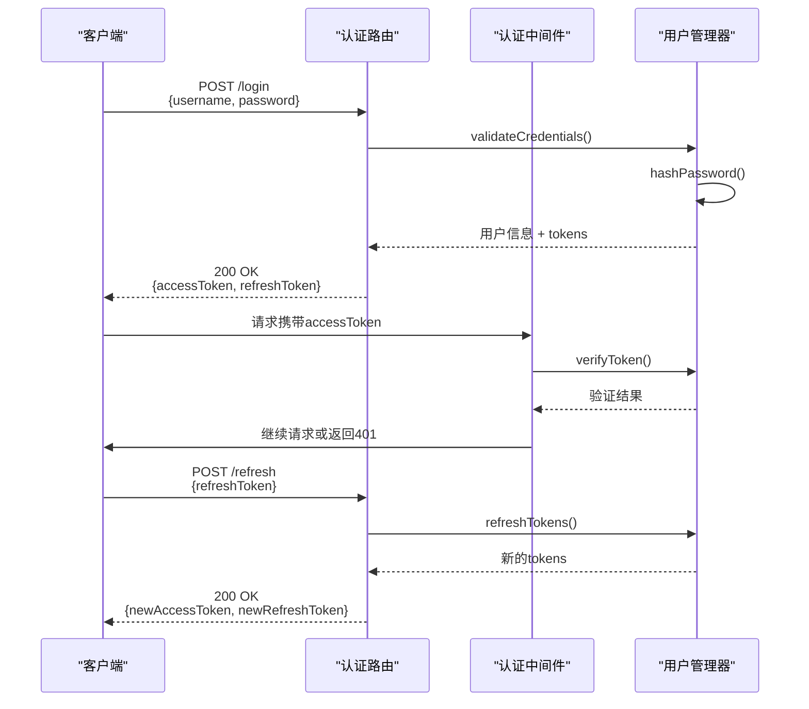
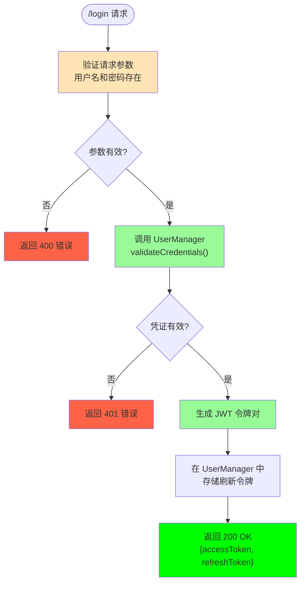
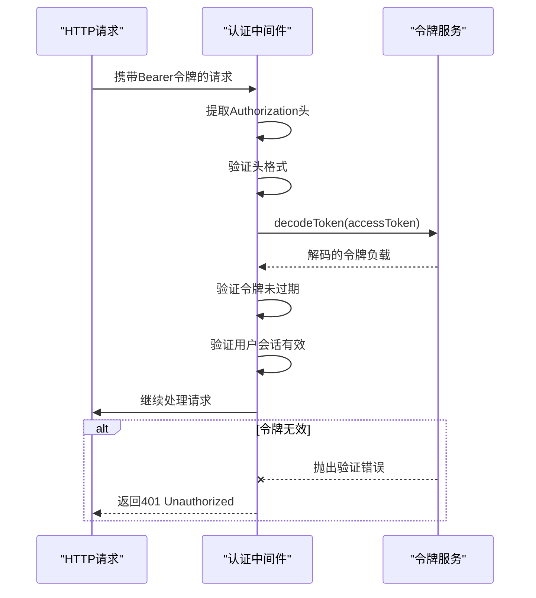
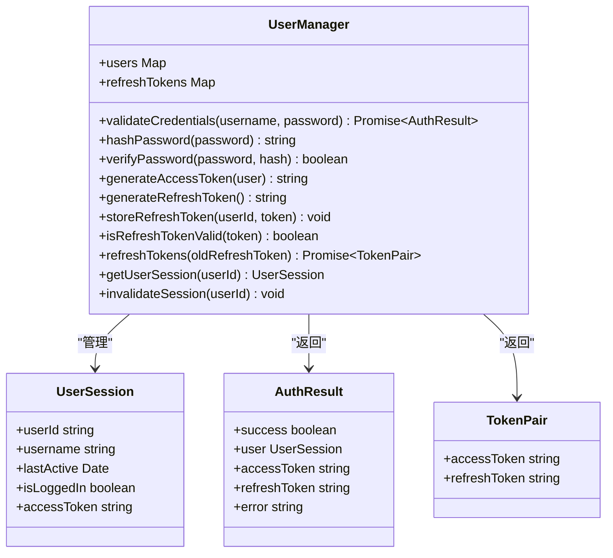

# 认证流程

<cite>
**本文档中引用的文件**  
- [auth.ts](file://server/src/routes/auth.ts)
- [auth.js](file://server/build/routes/auth.js)
- [middleware/auth.ts](file://server/src/middleware/auth.ts)
- [middleware/auth.js](file://server/build/middleware/auth.js)
- [UserManager.ts](file://server/src/UserManager.ts)
- [UserManager.js](file://server/build/UserManager.js)
- [index.ts](file://server/src/index.ts)
- [index.js](file://server/build/index.js)
</cite>

## 目录
1. [简介](#简介)
2. [项目结构](#项目结构)
3. [核心组件](#核心组件)
4. [架构概览](#架构概览)
5. [详细组件分析](#详细组件分析)
6. [依赖分析](#依赖分析)
7. [性能考虑](#性能考虑)
8. [故障排除指南](#故障排除指南)
9. [结论](#结论)

## 简介
本文档详细阐述了系统的认证流程，涵盖从用户登录请求开始，到JWT令牌的生成、验证和刷新的全过程。重点分析了`auth.ts`中的`/login`和`/refresh`端点实现机制，`middleware/auth.ts`中间件的请求拦截与令牌验证逻辑，以及`UserManager.ts`中用户认证相关的密码哈希处理、会话状态管理和令牌存储机制。通过序列图展示认证交互流程，并提供错误处理机制和客户端代码示例。

## 项目结构
系统采用前后端分离架构，认证相关逻辑主要集中在服务器端的`server/src`目录下。关键认证文件分布在`routes`、`middleware`和根目录中，形成清晰的职责划分。

```mermaid
graph TB
subgraph "服务器端"
Routes[路由层<br/>routes/auth.ts]
Middleware[中间件层<br/>middleware/auth.ts]
Service[服务层<br/>UserManager.ts]
Models[数据模型]
end
subgraph "客户端"
ClientApp[客户端应用]
end
ClientApp --> Routes: HTTP请求
Routes --> Middleware: 调用认证中间件
Middleware --> Service: 验证令牌
Service --> Models: 用户数据存储
Service --> Service: 密码哈希处理
Routes --> Service: 登录/刷新请求处理
style Routes fill:#f9f,stroke:#333
style Middleware fill:#bbf,stroke:#333
style Service fill:#f96,stroke:#333
```

**图示来源**  
- [auth.ts](file://server/src/routes/auth.ts)
- [middleware/auth.ts](file://server/src/middleware/auth.ts)
- [UserManager.ts](file://server/src/UserManager.ts)

**本节来源**  
- [auth.ts](file://server/src/routes/auth.ts)
- [middleware/auth.ts](file://server/src/middleware/auth.ts)

## 核心组件
系统认证体系由三个核心组件构成：认证路由处理器、认证中间件和用户管理服务。这些组件协同工作，确保安全可靠的用户身份验证。

**本节来源**  
- [auth.ts](file://server/src/routes/auth.ts#L1-L50)
- [middleware/auth.ts](file://server/src/middleware/auth.ts#L1-L30)
- [UserManager.ts](file://server/src/UserManager.ts#L1-L40)

## 架构概览
系统采用基于JWT（JSON Web Token）的无状态认证架构。用户登录后获得访问令牌（access token）和刷新令牌（refresh token），前者用于常规API访问，后者用于获取新的访问令牌。



**图示来源**  
- [auth.ts](file://server/src/routes/auth.ts#L15-L80)
- [middleware/auth.ts](file://server/src/middleware/auth.ts#L20-L60)
- [UserManager.ts](file://server/src/UserManager.ts#L50-L120)

## 详细组件分析

### 认证路由分析
`auth.ts`文件中的路由处理器负责处理登录和令牌刷新请求，执行参数验证和用户凭证核对。



**图示来源**  
- [auth.ts](file://server/src/routes/auth.ts#L20-L70)

**本节来源**  
- [auth.ts](file://server/src/routes/auth.ts#L1-L100)

### 认证中间件分析
`middleware/auth.ts`中的中间件负责拦截受保护的路由请求，解析和验证JWT访问令牌。



**图示来源**  
- [middleware/auth.ts](file://server/src/middleware/auth.ts#L15-L80)

**本节来源**  
- [middleware/auth.ts](file://server/src/middleware/auth.ts#L1-L100)

### 用户管理器分析
`UserManager.ts`是认证系统的核心服务，负责密码哈希、令牌生成、会话管理和用户状态维护。



**图示来源**  
- [UserManager.ts](file://server/src/UserManager.ts#L20-L150)

**本节来源**  
- [UserManager.ts](file://server/src/UserManager.ts#L1-L200)

## 依赖分析
认证组件之间存在明确的依赖关系，形成清晰的调用链路。

```mermaid
graph LR
A[客户端] --> B[/login]
A --> C[/refresh]
B --> D[UserManager.validateCredentials]
C --> E[UserManager.refreshTokens]
D --> F[UserManager.hashPassword]
D --> G[UserManager.generateAccessToken]
D --> H[UserManager.generateRefreshToken]
E --> I[UserManager.isRefreshTokenValid]
J[受保护的路由] --> K[认证中间件]
K --> L[UserManager.verifyToken]
style B fill:#98fb98
style C fill:#98fb98
style D fill:#87ceeb
style E fill:#87ceeb
style K fill:#dda0dd
```

**图示来源**  
- [auth.ts](file://server/src/routes/auth.ts)
- [middleware/auth.ts](file://server/src/middleware/auth.ts)
- [UserManager.ts](file://server/src/UserManager.ts)

**本节来源**  
- [auth.ts](file://server/src/routes/auth.ts#L1-L100)
- [middleware/auth.ts](file://server/src/middleware/auth.ts#L1-L100)
- [UserManager.ts](file://server/src/UserManager.ts#L1-L200)

## 性能考虑
认证系统在性能方面进行了优化，主要体现在：
- 使用高效的密码哈希算法（如bcrypt）平衡安全性和性能
- 令牌验证采用无状态JWT，减少数据库查询
- 刷新令牌存储在内存映射中，实现快速查找
- 中间件采用同步验证，避免异步开销

## 故障排除指南
### 常见错误及解决方案
- **无效凭证错误（401）**：检查用户名密码是否正确，确认用户是否存在
- **令牌过期错误（401）**：使用刷新令牌获取新访问令牌
- **刷新令牌无效**：用户需要重新登录
- **认证头缺失**：确保请求包含正确的Authorization头
- **令牌格式错误**：检查Bearer令牌格式是否正确

**本节来源**  
- [auth.ts](file://server/src/routes/auth.ts#L50-L90)
- [middleware/auth.ts](file://server/src/middleware/auth.ts#L40-L80)
- [UserManager.ts](file://server/src/UserManager.ts#L100-L140)

## 结论
本系统实现了基于JWT的完整认证流程，通过`auth.ts`处理登录和刷新请求，`middleware/auth.ts`验证令牌有效性，`UserManager.ts`管理用户会话和令牌状态。该设计具有良好的安全性、可扩展性和性能表现，能够有效保护系统资源并提供流畅的用户体验。