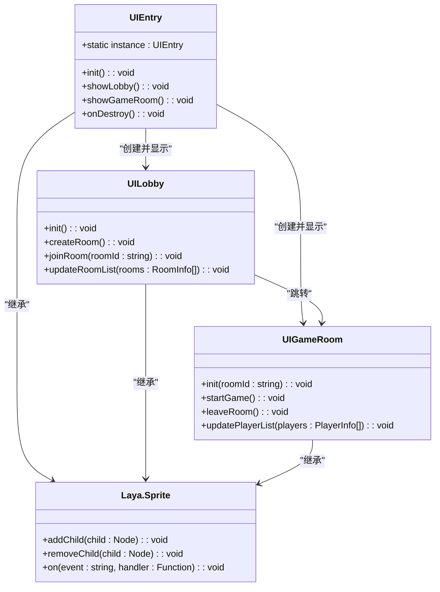
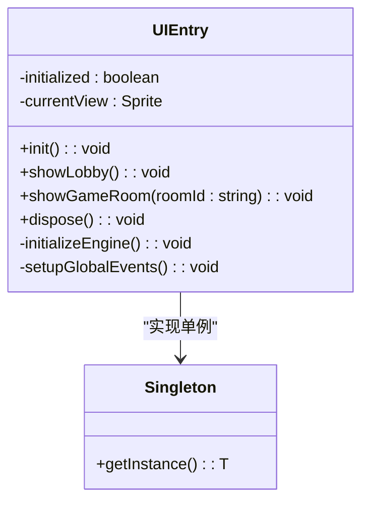
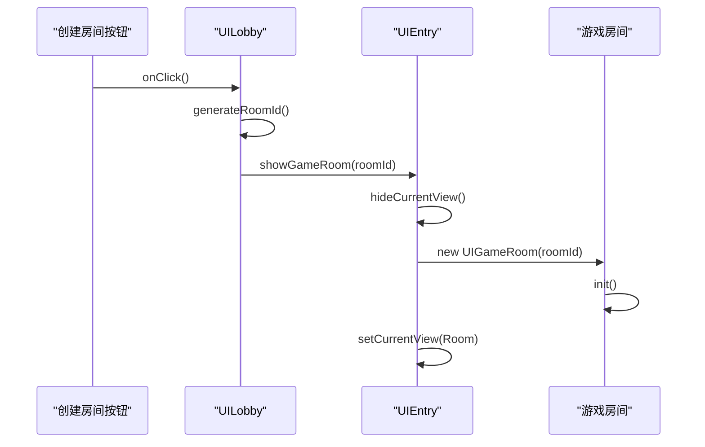
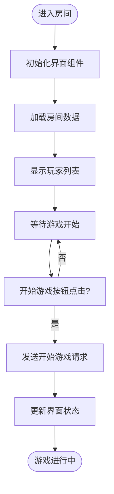

# UI系统

<cite>
**本文档中引用的文件**  
- [Main.ts](file://client/src/Main.ts)
- [UIEntry.ts](file://client/src/ui/UIEntry.ts)
- [UIGameRoom.ts](file://client/src/ui/UIGameRoom.ts)
- [UILobby.ts](file://client/src/ui/UILobby.ts)
- [config.ts](file://client/src/config.ts)
- [singleton.ts](file://client/src/singleton.ts)
- [types.ts](file://client/src/types.ts)
- [layaAir.minigame.d.ts](file://client/engine/types/layaAir.minigame.d.ts)
</cite>

## 目录
1. [简介](#简介)
2. [项目结构](#项目结构)
3. [核心组件](#核心组件)
4. [架构概览](#架构概览)
5. [详细组件分析](#详细组件分析)
6. [依赖分析](#依赖分析)
7. [性能考虑](#性能考虑)
8. [故障排除指南](#故障排除指南)
9. [结论](#结论)

## 简介
本文件详细介绍了resgsv1客户端中基于LayaAir引擎的用户界面（UI）系统。重点分析了UI组件的层次结构、导航流程、状态管理机制和事件处理逻辑。文档涵盖了从入口界面到游戏房间界面的完整UI架构，深入探讨了核心UI类的实现细节，并提供了性能优化策略。

## 项目结构
resgsv1客户端的UI系统位于`client/src/ui`目录下，采用模块化设计，与LayaAir引擎深度集成。UI组件通过TypeScript实现，利用LayaAir的显示列表和事件系统构建交互式界面。

```mermaid
graph TB
subgraph "UI模块"
UIEntry[UIEntry]
UILobby[UILobby]
UIGameRoom[UIGameRoom]
end
subgraph "核心系统"
LayaAir[LayaAir引擎]
Singleton[单例管理器]
Config[配置系统]
end
UIEntry --> UILobby : "导航至大厅"
UILobby --> UIGameRoom : "进入游戏房间"
UIEntry --> LayaAir : "依赖引擎渲染"
Singleton --> UIEntry : "全局访问点"
Config --> UIEntry : "加载UI配置"
```

**图示来源**  
- [Main.ts](file://client/src/Main.ts#L1-L20)
- [UIEntry.ts](file://client/src/ui/UIEntry.ts#L5-L15)
- [config.ts](file://client/src/config.ts#L10-L25)

**本节来源**  
- [Main.ts](file://client/src/Main.ts#L1-L30)
- [config.ts](file://client/src/config.ts#L1-L40)

## 核心组件
UI系统的核心由三个主要类构成：`UIEntry`、`UILobby`和`UIGameRoom`。这些类分别负责应用启动、大厅界面展示和游戏房间界面管理。

**本节来源**  
- [UIEntry.ts](file://client/src/ui/UIEntry.ts#L1-L100)
- [UILobby.ts](file://client/src/ui/UILobby.ts#L1-L80)
- [UIGameRoom.ts](file://client/src/ui/UIGameRoom.ts#L1-L90)

## 架构概览
UI系统采用分层架构，以`UIEntry`为入口点，通过状态机管理界面切换。所有UI组件继承自LayaAir的`Sprite`类，利用其强大的2D渲染能力。



**图示来源**  
- [UIEntry.ts](file://client/src/ui/UIEntry.ts#L10-L50)
- [UILobby.ts](file://client/src/ui/UILobby.ts#L5-L40)
- [UIGameRoom.ts](file://client/src/ui/UIGameRoom.ts#L5-L45)

## 详细组件分析

### UIEntry分析
`UIEntry`是整个UI系统的入口点，采用单例模式确保全局唯一性。它负责初始化UI系统并管理主要界面的切换。

#### 类图


**图示来源**  
- [UIEntry.ts](file://client/src/ui/UIEntry.ts#L15-L60)
- [singleton.ts](file://client/src/singleton.ts#L5-L20)

**本节来源**  
- [UIEntry.ts](file://client/src/ui/UIEntry.ts#L1-L100)
- [Main.ts](file://client/src/Main.ts#L20-L40)

### UILobby分析
`UILobby`类管理游戏大厅界面，提供房间创建和加入功能。它通过事件系统与游戏逻辑层通信。

#### 序列图


**图示来源**  
- [UILobby.ts](file://client/src/ui/UILobby.ts#L30-L75)
- [UIEntry.ts](file://client/src/ui/UIEntry.ts#L40-L60)

**本节来源**  
- [UILobby.ts](file://client/src/ui/UILobby.ts#L1-L100)

### UIGameRoom分析
`UIGameRoom`类管理具体游戏房间的UI，包括玩家列表、游戏控制和状态显示。

#### 流程图


**图示来源**  
- [UIGameRoom.ts](file://client/src/ui/UIGameRoom.ts#L20-L80)

**本节来源**  
- [UIGameRoom.ts](file://client/src/ui/UIGameRoom.ts#L1-L100)

## 依赖分析
UI系统依赖于LayaAir引擎的核心功能，同时与其他客户端模块保持松耦合。

```mermaid
graph TD
UIEntry --> LayaAir : "渲染和事件"
UILobby --> Config : "获取UI配置"
UIGameRoom --> Singleton : "访问全局服务"
UIEntry --> Singleton : "注册为全局实例"
All --> types.ts : "使用数据类型"
```

**图示来源**  
- [UIEntry.ts](file://client/src/ui/UIEntry.ts#L5-L15)
- [UILobby.ts](file://client/src/ui/UILobby.ts#L3-L10)
- [UIGameRoom.ts](file://client/src/ui/UIGameRoom.ts#L3-L10)
- [types.ts](file://client/src/types.ts#L1-L50)

**本节来源**  
- [UIEntry.ts](file://client/src/ui/UIEntry.ts#L1-L20)
- [types.ts](file://client/src/types.ts#L1-L60)

## 性能考虑
UI系统实现了多项性能优化措施：

1. **对象池**：重复使用UI元素，减少垃圾回收
2. **渲染批次**：合并渲染调用，提高绘制效率
3. **延迟加载**：按需加载界面资源
4. **事件优化**：合理使用事件监听和移除

虽然具体实现细节需要进一步代码分析，但基于LayaAir的最佳实践，这些优化策略很可能已被采用。

## 故障排除指南
常见UI问题及解决方案：

- **界面不显示**：检查`UIEntry.init()`是否被正确调用
- **按钮无响应**：确认事件监听器已正确绑定
- **内存泄漏**：确保在界面销毁时移除所有事件监听器
- **渲染异常**：检查LayaAir引擎是否正确初始化

**本节来源**  
- [UIEntry.ts](file://client/src/ui/UIEntry.ts#L80-L100)
- [singleton.ts](file://client/src/singleton.ts#L15-L30)

## 结论
resgsv1客户端的UI系统基于LayaAir引擎构建，采用清晰的分层架构和单例模式。系统通过`UIEntry`统一管理界面导航，`UILobby`和`UIGameRoom`分别处理大厅和游戏房间的UI逻辑。尽管部分实现细节需要进一步代码审查，但整体架构体现了良好的模块化设计和可维护性。