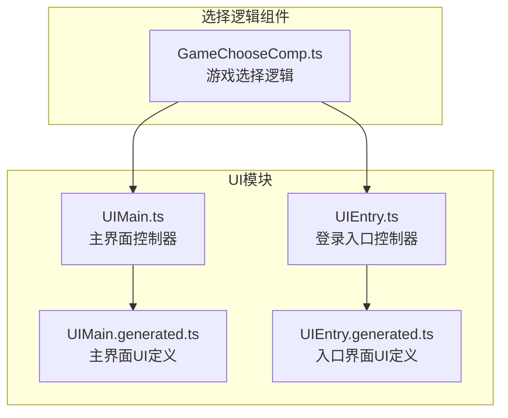
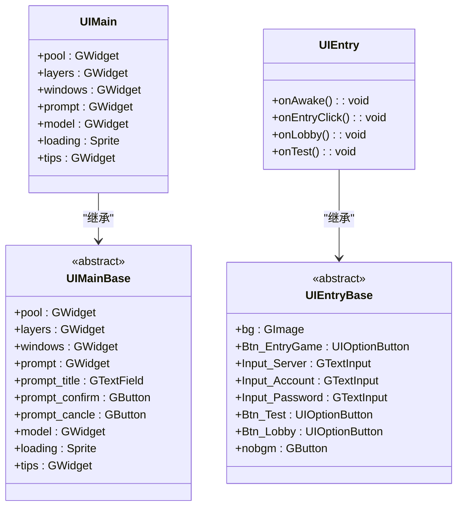
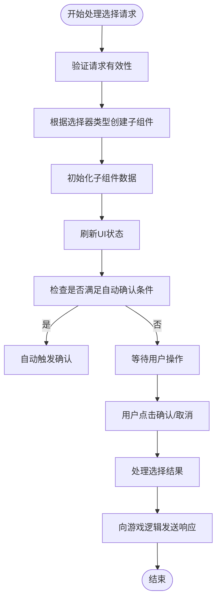
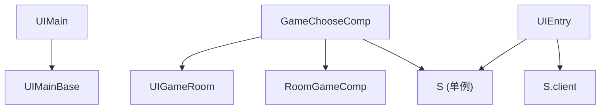

# 主界面

<cite>
**本文档引用文件**  
- [UIMain.ts](file://client/src/ui/UIMain.ts)
- [UIMain.generated.ts](file://client/src/ui/UIMain.generated.ts)
- [UIEntry.ts](file://client/src/ui/UIEntry.ts)
- [UIEntry.generated.ts](file://client/src/ui/UIEntry.generated.ts)
- [GameChooseComp.ts](file://client/src/comps/choose/GameChooseComp.ts)
</cite>

## 目录
1. [简介](#简介)
2. [项目结构](#项目结构)
3. [核心组件](#核心组件)
4. [架构概览](#架构概览)
5. [详细组件分析](#详细组件分析)
6. [依赖关系分析](#依赖关系分析)
7. [性能考虑](#性能考虑)
8. [故障排除指南](#故障排除指南)
9. [结论](#结论)

## 简介
本文档深入分析resgsv1客户端中主界面的实现，重点介绍`UIMain`组件的布局结构、视觉设计、交互逻辑以及与`UIEntry`和`GameChooseComp`的协作机制。文档涵盖主界面的初始化流程、事件绑定、资源加载策略、响应式设计和性能优化建议，旨在为开发者提供全面的技术参考。

## 项目结构
主界面相关代码位于`client/src/ui/`目录下，主要由`UIMain.ts`和`UIEntry.ts`构成。`UIMain`作为主场景入口，负责整体界面的组织与管理；`UIEntry`则为登录与测试入口界面，提供账号登录和快速测试功能。此外，`GameChooseComp`作为游戏选择逻辑的核心组件，处理玩家在游戏过程中的各类选择操作。



**图示来源**
- [UIMain.ts](file://client/src/ui/UIMain.ts)
- [UIEntry.ts](file://client/src/ui/UIEntry.ts)
- [GameChooseComp.ts](file://client/src/comps/choose/GameChooseComp.ts)

**本节来源**
- [UIMain.ts](file://client/src/ui/UIMain.ts)
- [UIEntry.ts](file://client/src/ui/UIEntry.ts)

## 核心组件
主界面的核心组件包括`UIMain`、`UIEntry`和`GameChooseComp`。`UIMain`继承自`UIMainBase`，后者由LayaAirIDE自动生成，定义了主界面的UI元素结构。`UIEntry`负责处理用户登录和进入游戏的逻辑，而`GameChooseComp`则封装了游戏中玩家选择的复杂逻辑，如选择卡牌、武将、目标等。

**本节来源**
- [UIMain.ts](file://client/src/ui/UIMain.ts#L1-L6)
- [UIMain.generated.ts](file://client/src/ui/UIMain.generated.ts#L1-L20)
- [UIEntry.ts](file://client/src/ui/UIEntry.ts#L1-L271)

## 架构概览
主界面采用基于LayaAir引擎的组件化架构，通过`@regClass()`装饰器注册为可被引擎识别的UI类。`UIMain`作为主场景，通过`layers`、`windows`、`prompt`等子组件管理不同层级的UI元素。`UIEntry`作为独立的UI组件，通过事件绑定响应用户操作，并调用客户端API进行登录和场景切换。



**图示来源**
- [UIMain.ts](file://client/src/ui/UIMain.ts#L1-L6)
- [UIMain.generated.ts](file://client/src/ui/UIMain.generated.ts#L1-L20)
- [UIEntry.ts](file://client/src/ui/UIEntry.ts#L1-L271)
- [UIEntry.generated.ts](file://client/src/ui/UIEntry.generated.ts#L1-L21)

## 详细组件分析

### UIMain 组件分析
`UIMain`是游戏主界面的控制器，负责管理主场景的UI元素和生命周期。它通过继承`UIMainBase`获得由LayaAirIDE生成的UI结构，包括`pool`（对象池）、`layers`（层级管理）、`windows`（窗口管理）、`prompt`（提示框）等。

```typescript
const { regClass } = Laya;
import { UIMainBase } from "./UIMain.generated";

@regClass()
export class UIMain extends UIMainBase {
}
```

该组件本身逻辑简单，主要作为UI结构的容器，具体的业务逻辑由其他组件（如`GameChooseComp`）注入或通过事件系统进行交互。

**本节来源**
- [UIMain.ts](file://client/src/ui/UIMain.ts#L1-L6)
- [UIMain.generated.ts](file://client/src/ui/UIMain.generated.ts#L1-L20)

### UIEntry 组件分析
`UIEntry`是游戏的入口界面，提供账号登录和快速测试功能。其核心方法包括：

- `onAwake()`: 初始化界面，绑定按钮点击事件。
- `onEntryClick()`: 处理登录按钮点击，验证输入并调用客户端登录API。
- `onLobby()`: 进入大厅场景，播放背景音乐。
- `onTest()`: 快速创建一个本地测试房间，用于开发调试。

```typescript
protected async onEntryClick() {
    const username = this.Input_Account.text;
    const password = this.Input_Password.text;
    if (username === '') return S.ui.toast('请输入账号');
    if (password === '') return S.ui.toast('请输入密码');
    S.client.connect();
    if (await S.client.login({ username, password, ... })) {
        this.onLobby();
    }
}
```

`onTest()`方法中预设了一个包含大量武将的国战测试房间配置，方便开发者快速进入游戏进行测试。

**本节来源**
- [UIEntry.ts](file://client/src/ui/UIEntry.ts#L1-L271)

### GameChooseComp 组件分析
`GameChooseComp`是游戏中处理玩家选择的核心组件，挂载在`UIGameRoom`上，负责管理所有与“选择”相关的UI交互。

#### 初始化与事件绑定
组件在`onAwake()`中获取所属的`UIGameRoom`和`RoomGameComp`，并为确认、取消、重铸、结束等按钮绑定点击事件。

```typescript
onAwake(): void {
    this.game = this.owner.getComponent(RoomGameComp);
    this.owner.selfseat.confirm.on(Laya.Event.CLICK, this, this.onConfirmClick);
    this.owner.selfseat.cancle.on(Laya.Event.CLICK, this, this.onCancleClick);
    // ... 其他事件绑定
}
```

#### 选择请求处理
`start(request: GameRequest)`方法是组件的核心入口，接收来自游戏逻辑的`GameRequest`，解析其中的选择器（selectors），并动态创建相应的子组件（如`ChooseCardComp`、`ChooseGeneralComp`等）来呈现选择界面。



**图示来源**
- [GameChooseComp.ts](file://client/src/comps/choose/GameChooseComp.ts#L1-L657)

#### 技能按钮交互
组件通过`onSkillButtonClick()`方法处理技能按钮的点击。当玩家点击一个技能时，组件会高亮该按钮，并根据技能效果动态生成选项按钮（如“发动哪个效果”），待用户选择后，构造新的`GameRequest`并重新启动选择流程。

#### 状态管理与优化
组件通过`next()`方法统一管理所有子组件的状态，按`step`顺序依次刷新，并计算确认、取消、重铸等按钮的可见性和可点击状态，减少不必要的DOM操作，提升性能。

**本节来源**
- [GameChooseComp.ts](file://client/src/comps/choose/GameChooseComp.ts#L1-L657)

## 依赖关系分析
主界面组件之间存在明确的依赖关系。`UIMain`作为根场景，依赖`UIMainBase`提供的UI结构。`GameChooseComp`依赖`UIGameRoom`和`RoomGameComp`来获取游戏状态，并通过`S`单例访问全局服务。`UIEntry`则依赖客户端网络模块`S.client`进行登录操作。



**图示来源**
- [UIMain.ts](file://client/src/ui/UIMain.ts)
- [GameChooseComp.ts](file://client/src/comps/choose/GameChooseComp.ts)
- [UIEntry.ts](file://client/src/ui/UIEntry.ts)

**本节来源**
- [UIMain.ts](file://client/src/ui/UIMain.ts)
- [GameChooseComp.ts](file://client/src/comps/choose/GameChooseComp.ts)
- [UIEntry.ts](file://client/src/ui/UIEntry.ts)

## 性能考虑
- **资源预加载**：主界面的UI资源（如图片、动画）应在进入场景前预加载，避免卡顿。
- **延迟渲染**：对于非立即显示的UI元素（如弹窗、提示），可采用延迟初始化或对象池技术。
- **内存释放**：在`onDestroy()`中及时解绑事件监听器，防止内存泄漏，如`GameChooseComp`中对按钮事件的解绑。
- **批量更新**：在`next()`方法中，组件将UI状态的更新（如按钮可见性、可点击性）进行批量处理，减少重绘次数。

## 故障排除指南
- **界面元素不显示**：检查`UIMain.generated.ts`中的UI元素是否在LayaAirIDE中正确命名，确保与代码引用一致。
- **按钮点击无反应**：确认`onAwake()`中事件绑定是否成功，检查`owner`组件是否已正确挂载。
- **选择逻辑异常**：调试`GameChooseComp`的`start()`和`next()`方法，检查`request`对象和`selectors`的状态是否符合预期。
- **内存泄漏**：确保在`onDestroy()`中清理所有事件监听器和定时器。

**本节来源**
- [UIMain.ts](file://client/src/ui/UIMain.ts)
- [GameChooseComp.ts](file://client/src/comps/choose/GameChooseComp.ts#L50-L60)
- [UIEntry.ts](file://client/src/ui/UIEntry.ts)

## 结论
resgsv1客户端的主界面采用清晰的组件化设计，`UIMain`、`UIEntry`和`GameChooseComp`各司其职，共同构建了稳定、可扩展的UI系统。通过深入理解这些组件的实现细节和交互逻辑，开发者可以更高效地进行功能开发和问题排查。未来可进一步优化资源加载策略和UI渲染性能，提升用户体验。