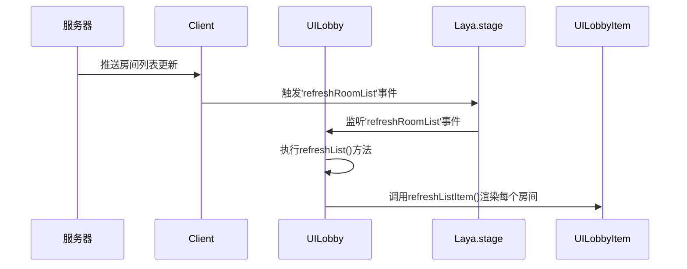
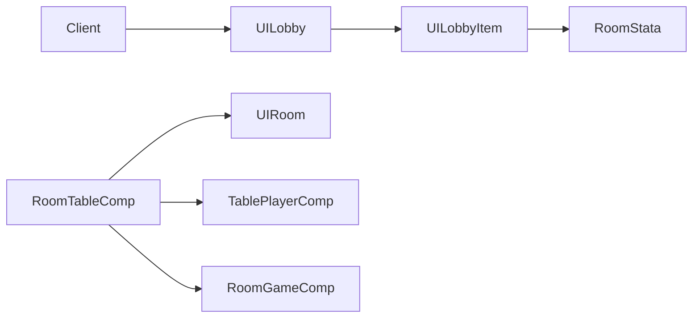

# 大厅界面

<cite>
**本文档中引用的文件**  
- [UILobby.ts](file://client/src/ui/UILobby.ts)
- [UILobbyItem.ts](file://client/src/ui/UILobbyItem.ts)
- [RoomTableComp.ts](file://client/src/comps/room/RoomTableComp.ts)
- [LobbyState.ts](file://client/src/models/LobbyState.ts)
- [RoomStata.ts](file://client/src/models/RoomStata.ts)
- [Client.ts](file://client/src/mgr/Client.ts)
- [game.ts](file://server/src/rooms/game.ts)
- [lobby.ts](file://server/src/rooms/lobby.ts)
</cite>

## 目录
1. [简介](#简介)
2. [项目结构](#项目结构)
3. [核心组件](#核心组件)
4. [架构概览](#架构概览)
5. [详细组件分析](#详细组件分析)
6. [依赖分析](#依赖分析)
7. [性能考虑](#性能考虑)
8. [故障排除指南](#故障排除指南)
9. [结论](#结论)

## 简介
本文档详细介绍了resgsv1客户端中大厅界面的实现机制，重点围绕`UILobby`组件展开。文档深入解析了房间列表的展示逻辑、房间状态的实时更新机制以及用户交互功能的实现方式。同时，阐述了`UILobby`与`UILobbyItem`之间的组件关系，以及如何通过`RoomTableComp`实现房间信息的动态渲染。此外，还讨论了大厅界面的实时数据同步机制，并提供了用户体验优化建议。

## 项目结构
大厅界面相关的代码主要位于客户端的`client/src`目录下，其结构清晰，按功能模块划分。

```mermaid
graph TD
subgraph "UI 组件"
UILobby[UILobby.ts]
UILobbyItem[UILobbyItem.ts]
UIRoom[UIRoom.ts]
end
subgraph "数据模型"
LobbyState[LobbyState.ts]
RoomStata[RoomStata.ts]
end
subgraph "管理器"
Client[Client.ts]
end
subgraph "游戏房间逻辑"
RoomTableComp[RoomTableComp.ts]
end
UILobby --> Client : "获取房间列表"
UILobby --> LobbyState : "依赖状态"
UILobbyItem --> RoomStata : "显示房间元数据"
RoomTableComp --> UIRoom : "控制房间UI"
Client --> UILobby : "触发刷新事件"
```

**图示来源**
- [UILobby.ts](file://client/src/ui/UILobby.ts)
- [UILobbyItem.ts](file://client/src/ui/UILobbyItem.ts)
- [RoomTableComp.ts](file://client/src/comps/room/RoomTableComp.ts)
- [Client.ts](file://client/src/mgr/Client.ts)

**本节来源**
- [UILobby.ts](file://client/src/ui/UILobby.ts)
- [UILobbyItem.ts](file://client/src/ui/UILobbyItem.ts)

## 核心组件
大厅界面的核心由`UILobby`、`UILobbyItem`和`RoomTableComp`三个组件构成。`UILobby`负责整体界面的布局和用户交互，`UILobbyItem`用于渲染单个房间的详细信息，而`RoomTableComp`则处理进入房间后的游戏逻辑和状态管理。

**本节来源**
- [UILobby.ts](file://client/src/ui/UILobby.ts)
- [UILobbyItem.ts](file://client/src/ui/UILobbyItem.ts)
- [RoomTableComp.ts](file://client/src/comps/room/RoomTableComp.ts)

## 架构概览
整个大厅界面的架构遵循了典型的MVC（Model-View-Controller）模式。`LobbyState`和`RoomStata`作为数据模型，存储了大厅和房间的实时状态。`UILobby`和`UILobbyItem`作为视图层，负责将数据模型中的信息渲染到屏幕上。`Client`类作为控制器，负责与服务器通信，接收数据更新，并通过事件系统通知视图层进行刷新。



**图示来源**
- [UILobby.ts](file://client/src/ui/UILobby.ts)
- [Client.ts](file://client/src/mgr/Client.ts)

## 详细组件分析

### UILobby 组件分析
`UILobby`是大厅界面的主控组件，继承自`UILobbyBase`，后者由LayaAirIDE自动生成。该组件负责初始化UI元素、绑定事件监听器以及管理房间列表的刷新逻辑。

#### 初始化与事件绑定
在`onAwake`生命周期方法中，`UILobby`完成了关键的初始化工作：
1.  **设置列表渲染器**：`this.list.itemRenderer = this.refreshListItem.bind(this);` 将`refreshListItem`方法绑定为列表项的渲染函数。
2.  **监听刷新事件**：`Laya.stage.on('refreshRoomList', this, this.refreshList);` 监听全局的`refreshRoomList`事件，当收到该事件时，会调用`refreshList`方法更新列表。
3.  **绑定按钮事件**：为创建房间、进入武将/卡牌介绍、退出等按钮绑定点击事件。

```typescript
onAwake(): void {
    this.list.itemRenderer = this.refreshListItem.bind(this);
    Laya.stage.on('refreshRoomList', this, this.refreshList);
    // ... 其他事件绑定
}
```

**图示来源**
- [UILobby.ts](file://client/src/ui/UILobby.ts#L15-L34)

#### 房间列表刷新逻辑
`refreshList`方法是房间列表更新的核心。它根据用户的筛选条件（如只显示等待中的房间或搜索特定房间ID）从`S.client.allRooms`中过滤出符合条件的房间，并更新列表的显示数量。

```typescript
protected refreshList() {
    // 查看只等待
    if (this.onlywait.selected) {
        this.rooms = S.client.allRooms.filter(
            (v) => v.metadata.state === 'wait' && !v.metadata.options.settings.xl_test
        );
        this.list.numItems = this.rooms.length;
        return;
    }
    // 搜索房间
    if (this.input_serch.text) {
        this.rooms = S.client.allRooms.filter(
            (v) => v.roomId === this.input_serch.text
        );
        this.list.numItems = this.rooms.length;
        return;
    }
    this.rooms = S.client.allRooms.filter(
        (v) => !v.metadata.options.settings.xl_test
    );
    this.list.numItems = this.rooms.length;
}
```
此方法通过改变`this.list.numItems`的值来触发LayaAir的虚拟列表机制，从而高效地渲染大量房间。

**本节来源**
- [UILobby.ts](file://client/src/ui/UILobby.ts#L68-L88)

### UILobbyItem 组件分析
`UILobbyItem`组件负责渲染单个房间的详细信息，如房间ID、名称、状态、玩家数量等。

#### 房间信息渲染
`set`方法接收一个`RoomAvailable`对象作为参数，并将其数据填充到UI元素中。它会根据房间是否有密码、是否禁言等设置，动态地在房间名称后添加相应的图标。

```typescript
public set(room: RoomAvailable<RoomMetedata>) {
    this.room = room;
    const metedata = room.metadata;
    this.roomname.text = `[${room.roomId}]${metedata.options.name}`;
    if (metedata.options.password) {
        this.roomname.text += '[img]resources/lobby/texture/hall_room_yaoshi.png[/img]';
        this.hasPassWord = true;
    }
    if (metedata.options.settings?.prohibitChat) {
        this.roomname.text += '[img]resources/lobby/texture/hall_room_jinyan_mark.png[/img] ';
    }
    this.playercount.text = `${metedata.playerCount}/${metedata.options.playerCountMax}(${metedata.spectaterCount})`;
    this.roomstate.text = state[metedata.state]; // 映射状态码到中文
}
```

**本节来源**
- [UILobbyItem.ts](file://client/src/ui/UILobbyItem.ts#L25-L50)

#### 用户交互功能
`UILobbyItem`提供了加入房间、旁观房间和查看房间信息的交互功能。当用户点击“加入”或“旁观”按钮时，如果房间有密码，则会弹出密码输入框；否则，直接调用`S.client.joinRoom`方法请求加入。

```typescript
onJoinClick() {
    if (this.hasPassWord) {
        this.showType = 1;
        this.inputpassword.visible = true;
    } else {
        S.client.joinRoom(this.room.roomId, { /* 加入参数 */ });
    }
}
```

**本节来源**
- [UILobbyItem.ts](file://client/src/ui/UILobbyItem.ts#L52-L65)

### RoomTableComp 组件分析
`RoomTableComp`是进入房间后加载的游戏房间主控组件，它负责管理游戏状态、玩家信息和游戏逻辑。

#### 房间状态绑定
`bindRoom`方法是`RoomTableComp`的核心，它通过`colyseus.js`的监听机制，将UI与服务器的实时状态同步。例如，当有新玩家加入时，`players.onAdd`监听器会被触发，从而在UI上创建或更新对应的玩家座位。

```typescript
bindRoom() {
    this.listens.push(
        this.$(this.state).players.onAdd((item, index) => {
            const ui = this.players.find((v) => v.state?.playerId === item.playerId);
            if (ui) {
                ui.bindState(item, this);
            }
        })
    );
    // ... 监听其他状态变化
}
```

**本节来源**
- [RoomTableComp.ts](file://client/src/comps/room/RoomTableComp.ts#L100-L120)

#### 实时数据同步机制
大厅界面的实时数据同步依赖于WebSocket和`colyseus.js`库。服务器端的`GameRoom`和`CustomLobbyRoom`会通过`updateLobby`函数向所有连接的客户端广播房间列表的变更。

```mermaid
flowchart TD
A[服务器] --> |创建/更新房间| B[调用updateLobby()]
B --> C[向LobbyRoom广播'rooms'消息]
C --> D[Client.ts接收消息]
D --> E[触发'refreshRoomList'事件]
E --> F[UILobby.ts监听事件]
F --> G[执行refreshList()刷新UI]
```

在客户端，`Client`类负责监听来自服务器的`+`（新增房间）、`-`（移除房间）和`rooms`（全量更新）消息，并相应地更新`allRooms`数组，最后通过`Laya.stage.event`触发全局事件，通知`UILobby`进行刷新。

```typescript
private bindLobby() {
    this.lobbyRoom.onMessage('rooms', (rooms) => {
        this.allRooms = rooms;
        Laya.stage.event('refreshRoomList'); // 触发刷新
    });
    this.lobbyRoom.onMessage('+', ([roomId, room]) => {
        // 更新单个房间
        Laya.stage.event('refreshRoomList');
    });
}
```

**本节来源**
- [Client.ts](file://client/src/mgr/Client.ts#L113-L135)
- [game.ts](file://server/src/rooms/game.ts#L859)
- [lobby.ts](file://server/src/rooms/lobby.ts)

## 依赖分析
大厅界面的组件之间存在明确的依赖关系。`UILobby`依赖于`Client`来获取数据，`UILobbyItem`依赖于`RoomStata`来解析房间元数据。`RoomTableComp`则依赖于`UIRoom`和`TablePlayerComp`等UI组件来构建游戏界面。



**图示来源**
- [UILobby.ts](file://client/src/ui/UILobby.ts)
- [UILobbyItem.ts](file://client/src/ui/UILobbyItem.ts)
- [RoomTableComp.ts](file://client/src/comps/room/RoomTableComp.ts)

## 性能考虑
当前的实现利用了LayaAir的`GList`组件，该组件支持虚拟滚动，能够有效处理大量房间的渲染，避免了性能瓶颈。然而，`refreshList`方法在每次刷新时都会对`allRooms`数组进行多次`filter`操作，如果房间数量极大，可能会产生性能开销。建议在`Client`层对房间列表进行预处理和索引，以提高查询效率。

## 故障排除指南
*   **问题：房间列表无法刷新**
    *   检查`Client`是否成功连接到`LobbyRoom`。
    *   确认服务器端的`updateLobby`函数是否被正确调用。
    *   检查`Laya.stage`上的`refreshRoomList`事件监听器是否正常工作。

*   **问题：无法加入有密码的房间**
    *   确保`UILobbyItem`中的`onConfirmClick`方法正确地将密码作为参数传递给`joinRoom`。

*   **问题：断线重连失败**
    *   检查服务器端的`reconnectToken`是否有效且未过期。
    *   确认客户端在离开房间时正确地保存了`reconnectToken`。

**本节来源**
- [UILobby.ts](file://client/src/ui/UILobby.ts)
- [UILobbyItem.ts](file://client/src/ui/UILobbyItem.ts)
- [Client.ts](file://client/src/mgr/Client.ts)

## 结论
resgsv1客户端的大厅界面实现了一个功能完整、响应迅速的房间管理系统。通过`UILobby`和`UILobbyItem`的组件化设计，实现了房间列表的高效渲染和用户交互。基于`colyseus.js`的实时通信机制确保了数据的同步性。未来可进一步优化搜索和过滤功能，并引入更复杂的房间筛选器来提升用户体验。