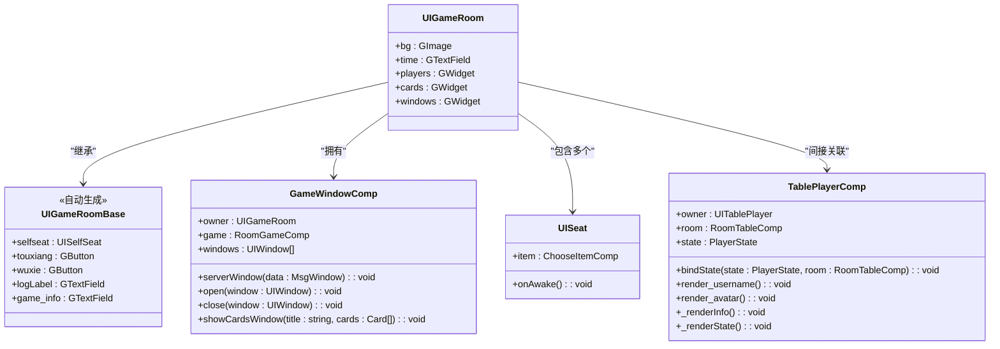
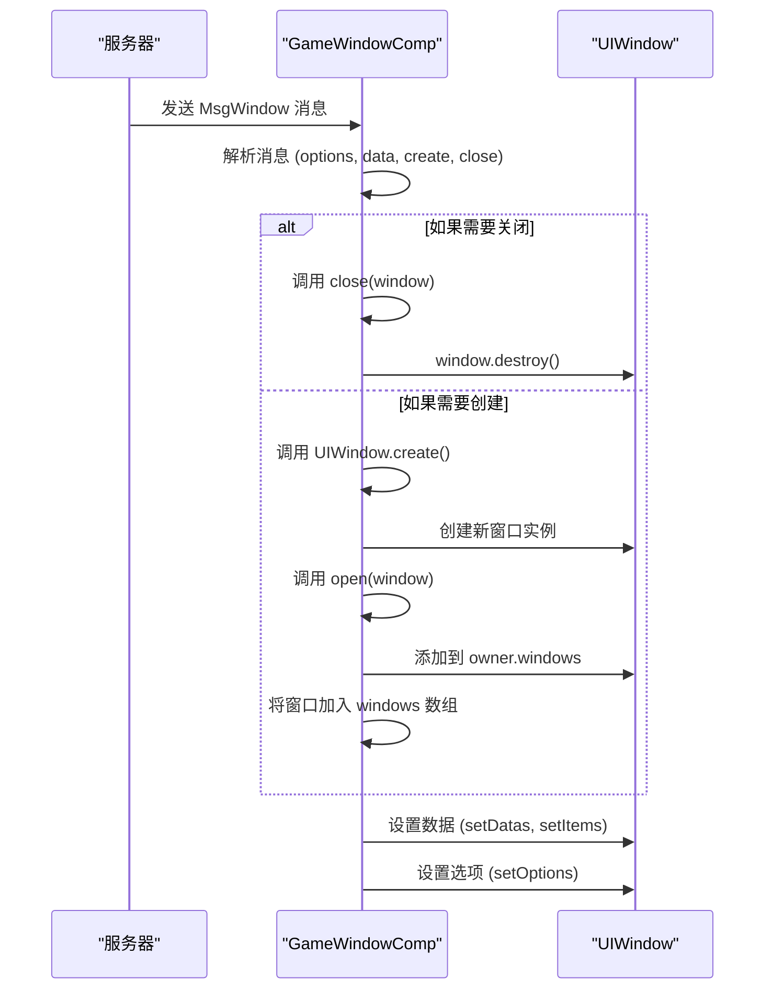
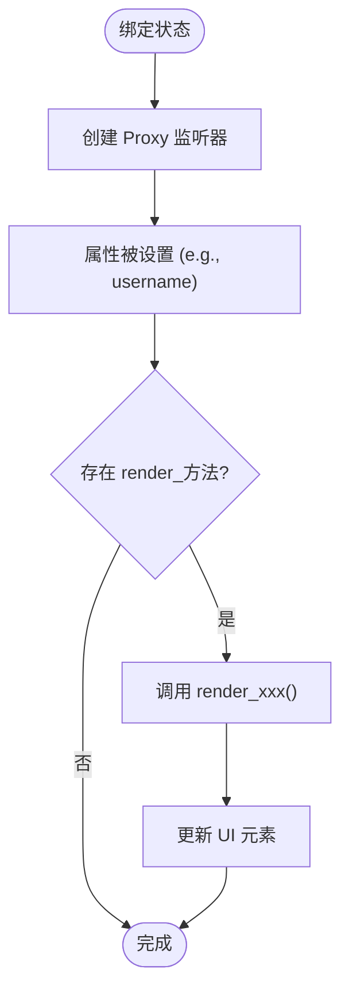
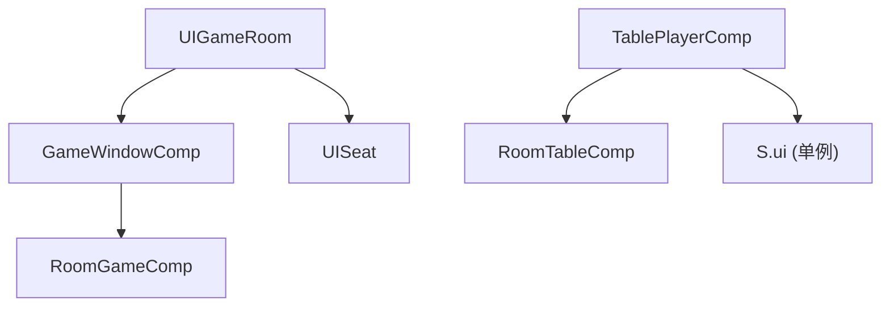

# 游戏房间界面

<cite>
**本文档引用的文件**  
- [UIGameRoom.ts](file://client/src/ui/UIGameRoom.ts)
- [UIGameRoom.generated.ts](file://client/src/ui/UIGameRoom.generated.ts)
- [GameWindowComp.ts](file://client/src/comps/room/GameWindowComp.ts)
- [TablePlayerComp.ts](file://client/src/comps/player/TablePlayerComp.ts)
- [UISeat.ts](file://client/src/ui/UISeat.ts)
- [UISeat.generated.ts](file://client/src/ui/UISeat.generated.ts)
</cite>

## 目录
1. [简介](#简介)
2. [项目结构](#项目结构)
3. [核心组件](#核心组件)
4. [架构概览](#架构概览)
5. [详细组件分析](#详细组件分析)
6. [依赖关系分析](#依赖关系分析)
7. [性能考虑](#性能考虑)
8. [故障排除指南](#故障排除指南)
9. [结论](#结论)

## 简介
本文档深入分析了 `resgsv1` 客户端中 `UIGameRoom` 组件的实现，重点介绍游戏房间界面的布局结构、玩家座位管理、卡牌显示区域和操作按钮布局。文档详细阐述了 `UIGameRoom` 与 `GameWindowComp`、`TablePlayerComp` 和 `UISeat` 等组件的协作关系，以及如何实现玩家信息的动态更新。通过实际代码示例，展示了游戏状态显示、回合指示器更新和技能按钮交互的实现细节，并讨论了界面的复杂状态管理和性能优化策略。

## 项目结构
游戏房间界面的实现主要分布在 `client/src/ui` 和 `client/src/comps` 目录下。`UIGameRoom` 是游戏房间的主界面组件，继承自由 LayaAir IDE 自动生成的 `UIGameRoomBase`。相关的业务逻辑由 `GameWindowComp` 和 `TablePlayerComp` 等组件处理，而玩家座位的 UI 则由 `UISeat` 组件管理。

```mermaid
graph TB
subgraph "UI Components"
UIGameRoom["UIGameRoom (主游戏房间)"]
UISeat["UISeat (玩家座位)"]
end
subgraph "Logic Components"
GameWindowComp["GameWindowComp (窗口管理)"]
TablePlayerComp["TablePlayerComp (玩家状态管理)"]
end
UIGameRoom --> GameWindowComp : "包含"
UIGameRoom --> TablePlayerComp : "间接关联"
UIGameRoom --> UISeat : "包含多个"
```

**图示来源**
- [UIGameRoom.ts](file://client/src/ui/UIGameRoom.ts)
- [GameWindowComp.ts](file://client/src/comps/room/GameWindowComp.ts)
- [TablePlayerComp.ts](file://client/src/comps/player/TablePlayerComp.ts)
- [UISeat.ts](file://client/src/ui/UISeat.ts)

**本节来源**
- [UIGameRoom.ts](file://client/src/ui/UIGameRoom.ts)
- [GameWindowComp.ts](file://client/src/comps/room/GameWindowComp.ts)

## 核心组件
`UIGameRoom` 组件是游戏房间的根 UI 组件，它通过继承 `UIGameRoomBase` 获得了由 LayaAir IDE 定义的所有 UI 元素。其主要职责是作为其他逻辑组件的容器和协调者。

```typescript
const { regClass } = Laya;
import { UIGameRoomBase } from "./UIGameRoom.generated";

@regClass()
export class UIGameRoom extends UIGameRoomBase {
}
```

该组件本身代码简洁，主要通过 `GameWindowComp` 等附加组件来实现复杂的业务逻辑。

**本节来源**
- [UIGameRoom.ts](file://client/src/ui/UIGameRoom.ts#L1-L5)

## 架构概览
整个游戏房间界面采用组件化架构，`UIGameRoom` 作为顶层容器，负责整合各个功能模块。`GameWindowComp` 负责管理游戏中的弹出窗口，`TablePlayerComp` 负责处理玩家状态的绑定和 UI 更新，`UISeat` 则负责处理座位相关的交互。



**图示来源**
- [UIGameRoom.generated.ts](file://client/src/ui/UIGameRoom.generated.ts)
- [GameWindowComp.ts](file://client/src/comps/room/GameWindowComp.ts)
- [TablePlayerComp.ts](file://client/src/comps/player/TablePlayerComp.ts)
- [UISeat.ts](file://client/src/ui/UISeat.ts)

## 详细组件分析

### GameWindowComp 分析
`GameWindowComp` 是 `UIGameRoom` 的一个关键逻辑组件，负责管理游戏中的所有弹出窗口。

#### 窗口管理逻辑
该组件维护一个 `windows` 数组来跟踪所有打开的窗口。它提供了 `open` 和 `close` 方法来管理窗口的生命周期，并通过 `serverWindow` 方法响应服务器发送的窗口创建和关闭指令。

```typescript
public serverWindow(_data: MsgWindow) {
    const { options, data, create, close } = _data;
    if (!options?.id) return;
    let window = this.getWindow(options.id);
    if (close) {
        this.close(window);
        return;
    }
    if (create && !window) {
        window = UIWindow.create(this.game, options);
        window.isActiveClinet = false;
        this.open(window);
    }
    if (window) {
        if (data) {
            if (data.type === 'datas') {
                window.setDatas(data.cards);
            }
            if (data.type === 'rows') {
                window.setDatas(data.datas);
            }
            if (data.type === 'items') {
                window.setItems(data.datas);
            }
        }
        window.setOptions(options);
    }
}
```

#### 窗口创建流程


**图示来源**
- [GameWindowComp.ts](file://client/src/comps/room/GameWindowComp.ts#L15-L90)

**本节来源**
- [GameWindowComp.ts](file://client/src/comps/room/GameWindowComp.ts)

### TablePlayerComp 分析
`TablePlayerComp` 组件负责处理玩家信息的动态更新和 UI 渲染。

#### 状态绑定机制
该组件使用 JavaScript Proxy 来监听 `PlayerState` 的变化。当状态的任何属性（如 `username`、`avatar`）发生变化时，会自动触发对应的 `render_` 方法来更新 UI。

```typescript
bindState(state: PlayerState, room: RoomTableComp) {
    // ... 初始化代码
    const proxy = new Proxy(state, {
        set: (target, p, newValue, receiver) => {
            const ret = Reflect.set(target, p, newValue, receiver);
            if (Reflect.has(this, `render_${p.toString()}`)) {
                (this as any)[`render_${p.toString()}`]();
            }
            return ret;
        },
    });
    room.$(state).bindTo(proxy);
    this.state = proxy;
}
```

#### UI 渲染方法
- `render_username()`: 更新玩家名称，并根据是否为当前玩家设置红色字体。
- `render_avatar()`: 加载并显示玩家头像。
- `_renderInfo()`: 计算并显示玩家的胜率等统计信息。
- `_renderState()`: 根据玩家状态（房主、准备、未准备）显示不同的状态图标。



**图示来源**
- [TablePlayerComp.ts](file://client/src/comps/player/TablePlayerComp.ts#L25-L140)

**本节来源**
- [TablePlayerComp.ts](file://client/src/comps/player/TablePlayerComp.ts)

### UISeat 分析
`UISeat` 组件处理玩家座位的交互，特别是国战模式下的势力选择。

#### 交互逻辑
组件为每个势力按钮（魏、蜀、吴、群、晋、野）绑定了点击事件。点击按钮会切换其灰化状态，并隐藏大标记。

```typescript
onAwake(): void {
    this.guozhan_mark_small.on(Laya.Event.CLICK, this, () => {
        this.guozhan_mark_big.visible = true;
    });

    this.b_wei.on(Laya.Event.CLICK, this, () => {
        this.b_wei.grayed = this.s_wei.grayed = !this.b_wei.grayed;
        this.guozhan_mark_big.visible = false;
    });

    // 其他势力按钮的逻辑类似...
}
```

此设计允许玩家通过点击小标记来查看大标记，并通过点击势力按钮来选择或取消选择该势力。

**本节来源**
- [UISeat.ts](file://client/src/ui/UISeat.ts)

## 依赖关系分析
`UIGameRoom` 与各个组件之间形成了清晰的依赖关系。`UIGameRoom` 依赖于 `GameWindowComp` 来管理窗口，依赖于 `UISeat` 来显示座位。`TablePlayerComp` 则依赖于 `RoomTableComp` 来获取房间信息。



**图示来源**
- [UIGameRoom.ts](file://client/src/ui/UIGameRoom.ts)
- [GameWindowComp.ts](file://client/src/comps/room/GameWindowComp.ts)
- [TablePlayerComp.ts](file://client/src/comps/player/TablePlayerComp.ts)

**本节来源**
- [GameWindowComp.ts](file://client/src/comps/room/GameWindowComp.ts)
- [TablePlayerComp.ts](file://client/src/comps/player/TablePlayerComp.ts)

## 性能考虑
虽然当前代码没有显式的性能优化，但可以提出以下建议：
1. **批量更新**: 当多个玩家状态同时更新时，应避免频繁触发 UI 重绘，可以使用防抖或节流技术。
2. **内存泄漏预防**: 在 `TablePlayerComp` 的 `unBindState` 方法中，应确保移除所有事件监听器。
3. **动画帧率控制**: 对于 `aozhan_ani` 等动画，应确保其帧率适中，避免影响整体性能。

## 故障排除指南
- **问题**: 玩家信息未更新。
  - **检查**: 确认 `TablePlayerComp` 的 `bindState` 方法是否被正确调用。
  - **检查**: 确认 `PlayerState` 的属性变化是否通过 Proxy 正确触发了 `render_` 方法。
- **问题**: 弹出窗口无法显示。
  - **检查**: 确认 `GameWindowComp` 的 `serverWindow` 方法是否收到了正确的 `MsgWindow` 消息。
  - **检查**: 确认 `options.id` 是否有效。

**本节来源**
- [TablePlayerComp.ts](file://client/src/comps/player/TablePlayerComp.ts#L25-L140)
- [GameWindowComp.ts](file://client/src/comps/room/GameWindowComp.ts#L15-L90)

## 结论
`UIGameRoom` 组件通过清晰的组件化设计，有效地管理了复杂的游戏房间界面。`GameWindowComp` 和 `TablePlayerComp` 等组件的分离使得代码职责明确，易于维护。通过使用 Proxy 进行状态监听，实现了高效的 UI 动态更新。未来可以进一步优化性能，特别是在处理大量玩家和频繁状态更新的场景下。