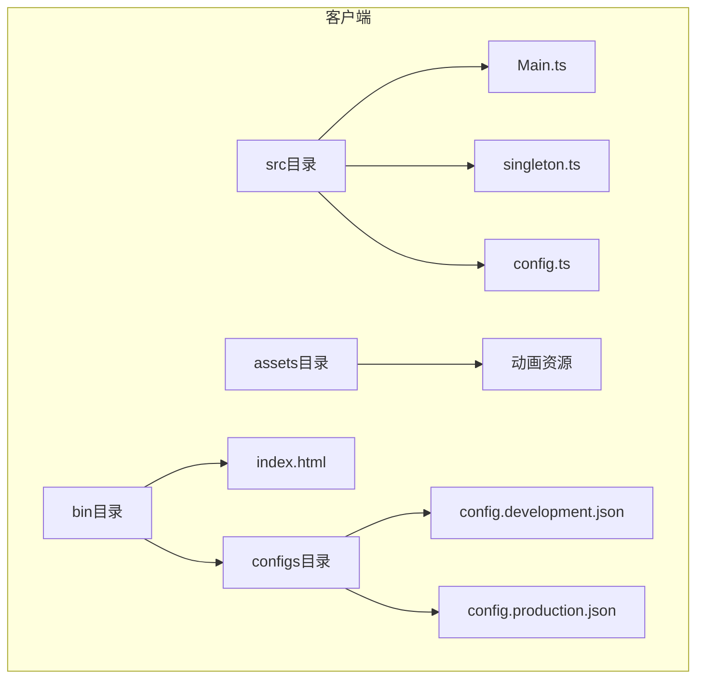
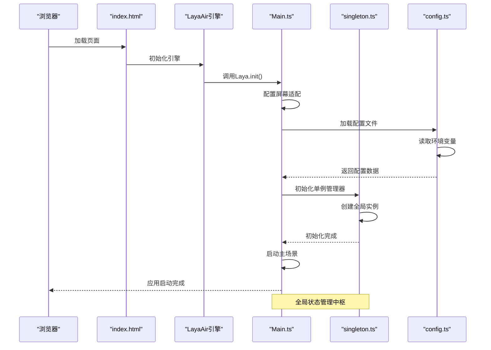
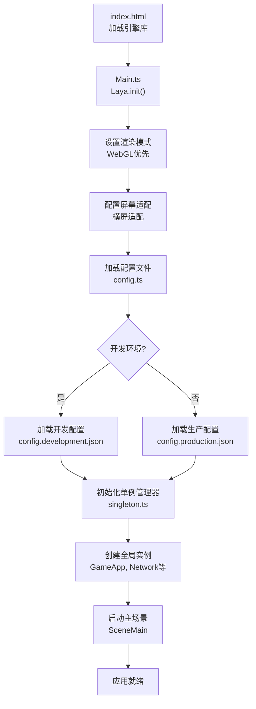
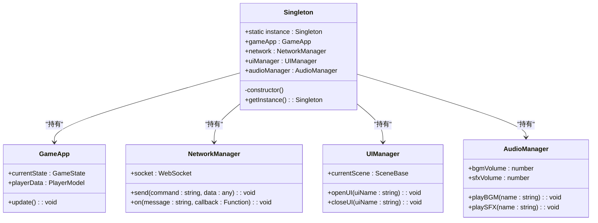
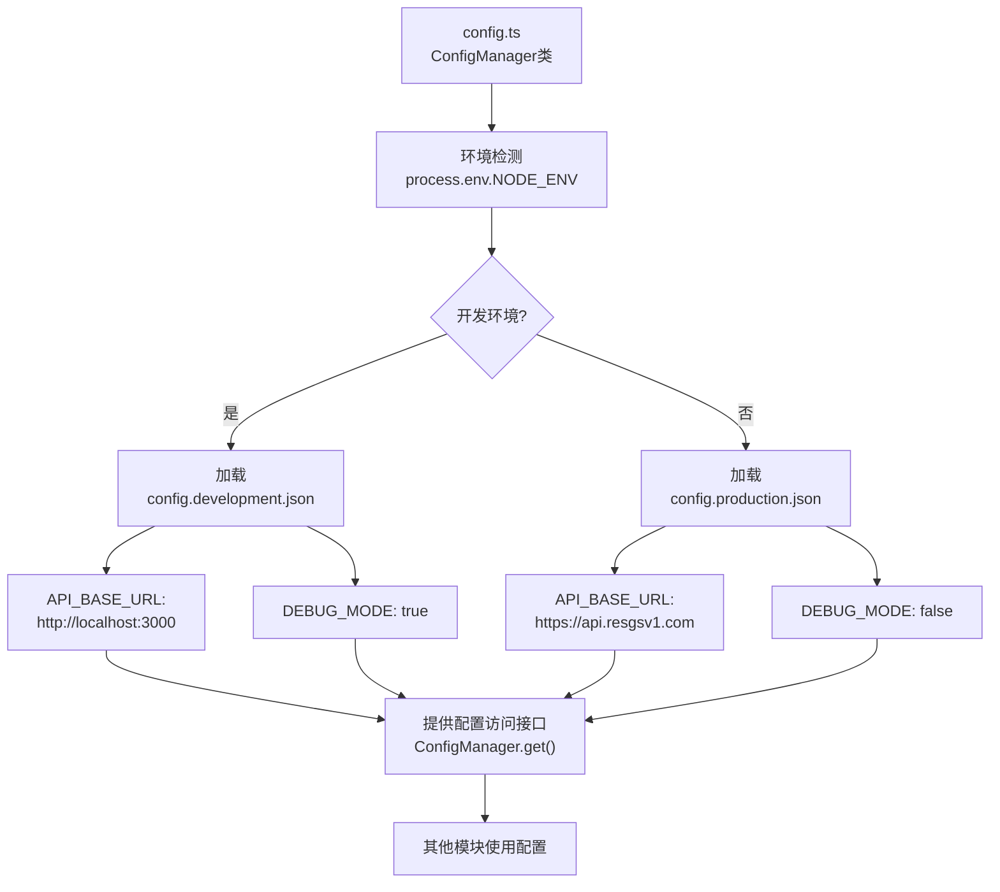
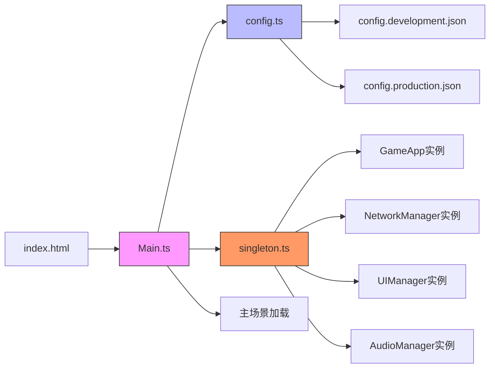

# 前端架构

<cite>
**本文档引用的文件**   
- [Main.ts](file://client/src/Main.ts)
- [singleton.ts](file://client/src/singleton.ts)
- [config.ts](file://client/src/config.ts)
- [index.html](file://client/bin/index.html)
- [config.development.json](file://client/bin/configs/config.development.json)
- [config.production.json](file://client/bin/configs/config.production.json)
</cite>

## 目录
1. [简介](#简介)
2. [项目结构](#项目结构)
3. [核心组件](#核心组件)
4. [架构概览](#架构概览)
5. [详细组件分析](#详细组件分析)
6. [依赖分析](#依赖分析)
7. [性能考虑](#性能考虑)
8. [故障排除指南](#故障排除指南)
9. [结论](#结论)

## 简介
本文档详细阐述了基于LayaAir引擎的resgsv1客户端前端架构设计与实现。重点分析了应用程序的启动流程、全局状态管理机制、配置系统设计、UI组件体系以及性能优化策略。文档旨在为开发者提供清晰的技术蓝图，帮助理解系统各模块之间的协作关系，并为后续开发和维护提供指导。

## 项目结构
resgsv1客户端采用模块化分层结构，主要分为资源、引擎类型定义、源码、构建输出和配置等部分。源码（src）目录包含核心逻辑，assets目录存放动画、UI等资源，bin目录包含运行时配置和入口HTML文件。

**图示来源**
- [Main.ts](file://client/src/Main.ts)
- [config.ts](file://client/src/config.ts)
- [index.html](file://client/bin/index.html)
- [config.development.json](file://client/bin/configs/config.development.json)
- [config.production.json](file://client/bin/configs/config.production.json)

**本节来源**
- [Main.ts](file://client/src/Main.ts)
- [config.ts](file://client/src/config.ts)
- [index.html](file://client/bin/index.html)

## 核心组件
系统的核心组件包括应用程序入口点Main.ts、全局单例管理器singleton.ts和环境配置管理器config.ts。这些组件共同构成了应用的基础框架，负责初始化、状态管理和环境适配。

**本节来源**
- [Main.ts](file://client/src/Main.ts#L1-L50)
- [singleton.ts](file://client/src/singleton.ts#L1-L30)
- [config.ts](file://client/src/config.ts#L1-L25)

## 架构概览
系统采用基于LayaAir引擎的MVC变体架构，以单例模式实现全局状态协调。启动流程从index.html加载引擎库开始，执行Main.ts中的初始化逻辑，通过singleton.ts建立全局访问点，并根据config.ts加载相应环境配置。

**图示来源**
- [Main.ts](file://client/src/Main.ts#L10-L40)
- [config.ts](file://client/src/config.ts#L5-L20)
- [singleton.ts](file://client/src/singleton.ts#L15-L30)
- [index.html](file://client/bin/index.html#L1-L15)

## 详细组件分析

### 应用程序启动流程分析
应用程序的启动流程始于index.html文件，该文件加载LayaAir引擎库并执行Main.ts中的初始化代码。Main.ts作为程序入口点，负责设置渲染模式、屏幕适配和启动主循环。

**图示来源**
- [Main.ts](file://client/src/Main.ts#L5-L35)
- [config.ts](file://client/src/config.ts#L1-L15)
- [index.html](file://client/bin/index.html#L10-L25)

**本节来源**
- [Main.ts](file://client/src/Main.ts#L1-L100)

### 单例模式应用分析
singleton.ts实现了全局状态管理的核心机制，通过静态属性暴露关键系统实例，确保在整个应用生命周期内这些服务的唯一性和可访问性。

**图示来源**
- [singleton.ts](file://client/src/singleton.ts#L10-L50)
- [Main.ts](file://client/src/Main.ts#L40-L60)

**本节来源**
- [singleton.ts](file://client/src/singleton.ts#L1-L80)

### 配置系统设计分析
config.ts模块负责管理不同环境下的应用配置，通过读取JSON配置文件实现开发环境与生产环境的无缝切换。

**图示来源**
- [config.ts](file://client/src/config.ts#L20-L60)
- [config.development.json](file://client/bin/configs/config.development.json)
- [config.production.json](file://client/bin/configs/config.production.json)

**本节来源**
- [config.ts](file://client/src/config.ts#L1-L100)
- [config.development.json](file://client/bin/configs/config.development.json)
- [config.production.json](file://client/bin/configs/config.production.json)

## 依赖分析
系统各核心组件之间存在明确的依赖关系，形成了一条清晰的初始化链。Main.ts依赖于config.ts和singleton.ts，而其他业务模块则通过singleton.ts间接依赖于这些基础服务。

**图示来源**
- [Main.ts](file://client/src/Main.ts)
- [config.ts](file://client/src/config.ts)
- [singleton.ts](file://client/src/singleton.ts)
- [index.html](file://client/bin/index.html)

**本节来源**
- [Main.ts](file://client/src/Main.ts#L1-L100)
- [config.ts](file://client/src/config.ts#L1-L50)
- [singleton.ts](file://client/src/singleton.ts#L1-L40)

## 性能考虑
尽管当前分析未深入具体性能优化代码，但基于LayaAir引擎的架构本身提供了多项性能优势。引擎支持WebGL渲染加速、对象池机制和资源预加载等特性，有助于提升运行效率。建议在后续开发中充分利用这些特性，特别是在动画播放、网络通信和UI更新等关键路径上实施优化。

## 故障排除指南
当遇到应用启动失败或配置加载异常时，可按照以下步骤进行排查：
1. 检查index.html中引擎库路径是否正确
2. 验证Main.ts中的Laya.init()参数设置
3. 确认config.development.json和config.production.json文件存在且格式正确
4. 检查singleton.ts中各实例的初始化顺序
5. 查看浏览器控制台是否有JavaScript错误或网络请求失败

**本节来源**
- [Main.ts](file://client/src/Main.ts#L10-L30)
- [config.ts](file://client/src/config.ts#L5-L15)
- [singleton.ts](file://client/src/singleton.ts#L20-L40)

## 结论
resgsv1客户端前端架构采用清晰的分层设计，通过Main.ts、singleton.ts和config.ts三个核心模块构建了稳定的基础框架。系统充分利用LayaAir引擎的能力，实现了高效的启动流程、可靠的全局状态管理和灵活的环境配置。建议在后续开发中继续保持这种模块化设计思想，并进一步完善性能监控和错误处理机制。