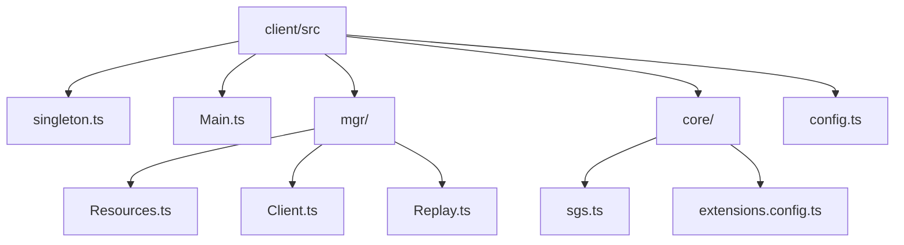
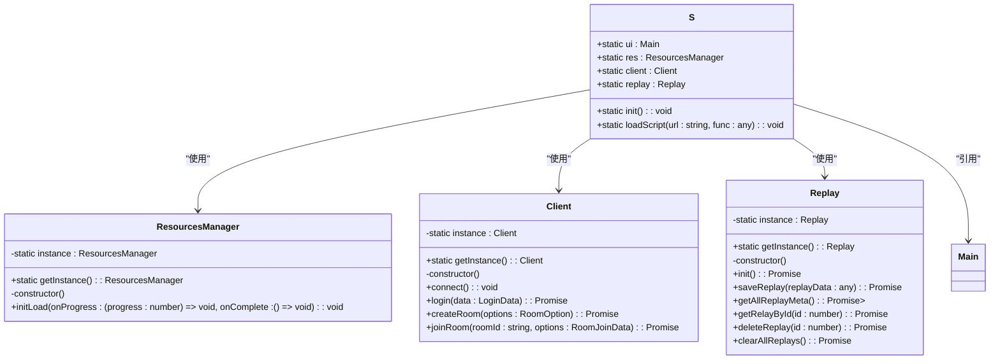
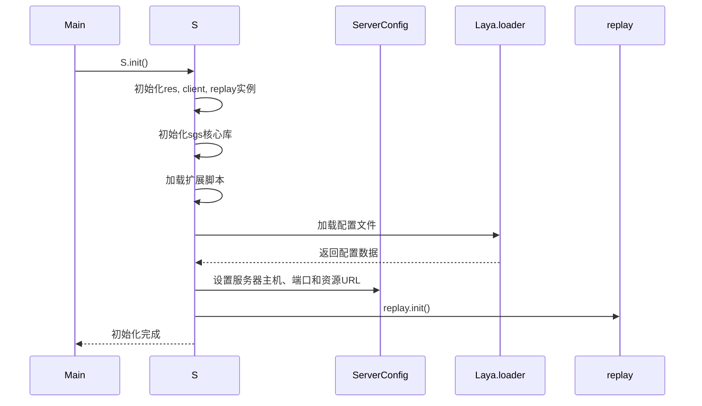
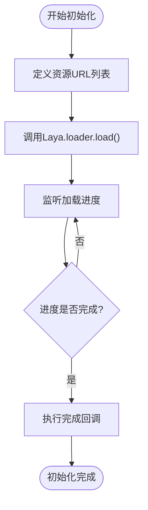
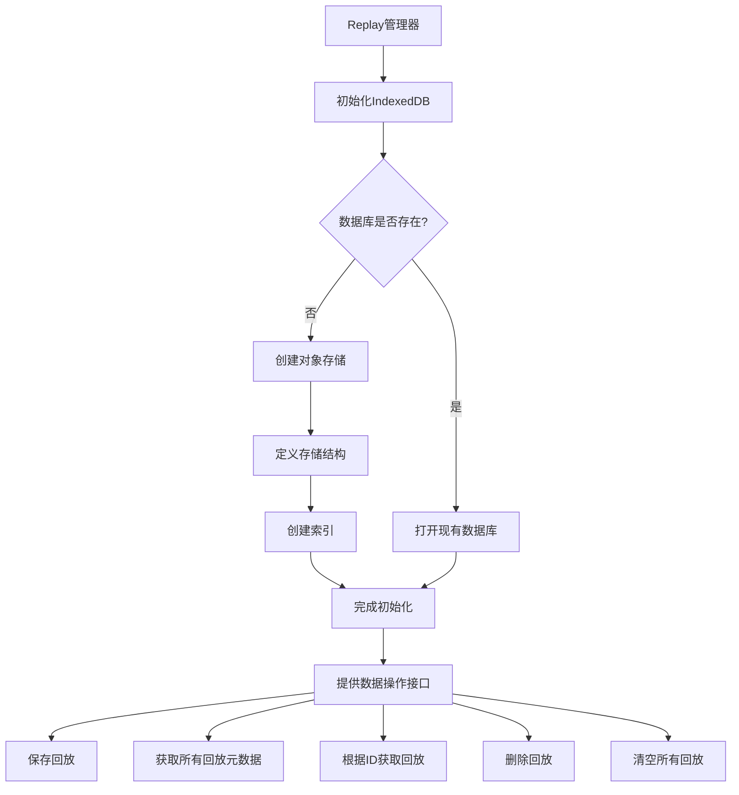
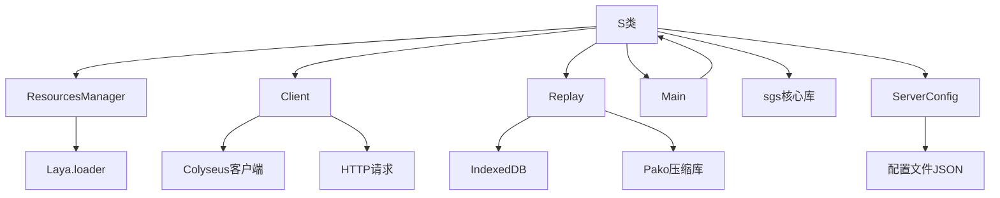

# 全局状态管理

<cite>
**本文档中引用的文件**   
- [singleton.ts](file://client/src/singleton.ts)
- [Main.ts](file://client/src/Main.ts)
- [Resources.ts](file://client/src/mgr/Resources.ts)
- [Client.ts](file://client/src/mgr/Client.ts)
- [Replay.ts](file://client/src/mgr/Replay.ts)
- [config.ts](file://client/src/config.ts)
- [sgs.ts](file://client/src/core/sgs.ts)
- [extensions.config.ts](file://client/src/core/extensions.config.ts)
</cite>

## 目录
1. [项目结构](#项目结构)
2. [核心组件](#核心组件)
3. [单例模式架构](#单例模式架构)
4. [详细组件分析](#详细组件分析)
5. [依赖关系分析](#依赖关系分析)
6. [性能与内存管理](#性能与内存管理)
7. [全局状态访问与修改](#全局状态访问与修改)
8. [优势与潜在风险](#优势与潜在风险)
9. [结论](#结论)

## 项目结构

项目采用分层架构设计，前端代码位于`client/src`目录下，主要包含核心逻辑、管理器、UI组件和工具类。全局状态管理通过`singleton.ts`文件实现，作为整个前端应用的中心枢纽。



**图示来源**
- [singleton.ts](file://client/src/singleton.ts)
- [Main.ts](file://client/src/Main.ts)
- [Resources.ts](file://client/src/mgr/Resources.ts)
- [Client.ts](file://client/src/mgr/Client.ts)
- [Replay.ts](file://client/src/mgr/Replay.ts)
- [config.ts](file://client/src/config.ts)
- [sgs.ts](file://client/src/core/sgs.ts)
- [extensions.config.ts](file://client/src/core/extensions.config.ts)

## 核心组件

全局状态管理的核心是`S`抽象类，它通过静态属性暴露多个单例实例，为整个应用提供统一的访问入口。这些单例实例包括资源管理器、客户端连接、回放管理器和UI主控制器等。

**组件来源**
- [singleton.ts](file://client/src/singleton.ts#L1-L57)
- [Main.ts](file://client/src/Main.ts#L1-L161)

## 单例模式架构

### 设计原理

单例模式确保一个类只有一个实例，并提供一个全局访问点。在`singleton.ts`中，`S`类作为静态容器，通过静态方法`init()`初始化各个管理器实例。



**图示来源**
- [singleton.ts](file://client/src/singleton.ts#L1-L57)
- [Resources.ts](file://client/src/mgr/Resources.ts#L1-L30)
- [Client.ts](file://client/src/mgr/Client.ts#L1-L367)
- [Replay.ts](file://client/src/mgr/Replay.ts#L1-L187)
- [Main.ts](file://client/src/Main.ts#L1-L161)

### 初始化流程

`S`类的初始化过程涉及多个异步操作，包括脚本加载、配置读取和系统初始化。



**图示来源**
- [singleton.ts](file://client/src/singleton.ts#L7-L57)
- [config.ts](file://client/src/config.ts#L1-L799)
- [Replay.ts](file://client/src/mgr/Replay.ts#L1-L187)

## 详细组件分析

### 资源管理器 (ResourcesManager)

资源管理器负责游戏资源的预加载，采用单例模式确保资源只加载一次。



**组件来源**
- [Resources.ts](file://client/src/mgr/Resources.ts#L1-L30)

### 客户端管理器 (Client)

客户端管理器封装了与服务器的通信逻辑，包括连接、登录、房间创建和加入等功能。

```mermaid
classDiagram
class Client {
-static instance : Client
+static getInstance() : Client
-constructor()
+url : string
+client : Colyseus.Client
+username : string
+avatar : string
+token : string
+reconnectToken : string
+lobbyRoom : Colyseus.Room<LobbyState>
+gameRooms : { [key : string] : Colyseus.Room[] }
+allRooms : Colyseus.RoomAvailable<RoomMetedata>[]
+reconnectAttempts : number
+maxReconnectAttempts : number
+reconnectDelay : number
+isAdmin : boolean
+isSuperAdmin : boolean
+connect() : void
+login(data : LoginData) : Promise<any>
+createRoom(options : RoomOption) : Promise<any>
+joinRoom(roomId : string, options : RoomJoinData) : Promise<any>
+attempReconnect() : void
+toastEroor(e : { code : ServerCode }) : void
+broadcast(message : string) : Promise<void>
+updateAvatar(avatar : string) : Promise<void>
+ban(username : string, data : { type : 'ban' | 'muted' | 'game', reason : string, times : number }) : Promise<void>
+unban(username : string, type : 'ban' | 'muted' | 'game') : Promise<void>
}
```

**图示来源**
- [Client.ts](file://client/src/mgr/Client.ts#L1-L367)

### 回放管理器 (Replay)

回放管理器使用IndexedDB本地存储游戏回放数据，实现了数据的压缩存储和检索。



**图示来源**
- [Replay.ts](file://client/src/mgr/Replay.ts#L1-L187)

## 依赖关系分析

全局状态管理系统的依赖关系清晰，各组件之间通过单例模式进行通信，避免了复杂的依赖注入。



**图示来源**
- [singleton.ts](file://client/src/singleton.ts)
- [Resources.ts](file://client/src/mgr/Resources.ts)
- [Client.ts](file://client/src/mgr/Client.ts)
- [Replay.ts](file://client/src/mgr/Replay.ts)
- [Main.ts](file://client/src/Main.ts)
- [config.ts](file://client/src/config.ts)
- [sgs.ts](file://client/src/core/sgs.ts)

## 性能与内存管理

### 内存泄漏防范

单例模式的实现中采用了私有构造函数和静态实例的方式，确保不会创建多个实例。同时，通过`getInstance()`方法提供全局访问点，避免了全局变量的滥用。

```typescript
private static instance: ResourcesManager;

public static getInstance() {
    if (!this.instance) {
        this.instance = new ResourcesManager();
    }
    return this.instance;
}

private constructor() {}
```

这种实现方式确保了类的单一实例，防止了内存泄漏。

### 性能优化策略

1. **资源预加载**：在应用启动时预加载必要资源，减少运行时加载延迟
2. **数据压缩**：使用Pako库对回放数据进行GZIP压缩，减少存储空间
3. **异步操作**：所有I/O操作均采用异步方式，避免阻塞主线程
4. **事件驱动**：采用事件机制进行组件间通信，降低耦合度

**组件来源**
- [Resources.ts](file://client/src/mgr/Resources.ts#L1-L30)
- [Replay.ts](file://client/src/mgr/Replay.ts#L1-L187)

## 全局状态访问与修改

### 配置信息管理

通过`ServerConfig`对象管理服务器配置信息，包括主机地址、端口和资源URL。

```typescript
export const ServerConfig = {
    host: '47.93.84.143',
    port: 12699,
    res_url: 'http://res.resgs.com',
};
```

### 用户偏好设置

用户偏好设置存储在本地LocalStorage中，包括音效音量、背景音乐音量等。

```typescript
public settings = {
    bgmVolume: 1,
    audioVolume: 1,
    eggaudio: true,
};
```

### 应用级状态管理

应用级状态通过单例对象进行管理，各组件可以通过`S`类静态属性访问。

```typescript
// 访问UI主控制器
S.ui.toast("提示信息");

// 访问资源管理器
S.res.initLoad(progress => {}, () => {});

// 访问客户端管理器
S.client.login(loginData);

// 访问回放管理器
S.replay.saveReplay(replayData);
```

**组件来源**
- [config.ts](file://client/src/config.ts#L1-L799)
- [Main.ts](file://client/src/Main.ts#L1-L161)
- [singleton.ts](file://client/src/singleton.ts#L1-L57)

## 优势与潜在风险

### 优势

1. **全局访问**：提供统一的全局访问点，简化组件间通信
2. **资源节约**：确保关键服务只实例化一次，节约内存资源
3. **状态一致性**：保证全局状态的一致性，避免状态冲突
4. **初始化集中**：将系统初始化逻辑集中管理，提高代码可维护性

### 潜在风险

1. **测试困难**：单例模式难以进行单元测试，因为其状态在测试间共享
2. **过度耦合**：可能导致组件对全局状态的过度依赖，增加耦合度
3. **并发问题**：在多线程环境下可能存在线程安全问题（尽管JavaScript是单线程）
4. **生命周期管理**：需要谨慎管理单例的生命周期，避免内存泄漏

### 解决方案

1. **依赖注入**：在可能的情况下使用依赖注入替代全局访问
2. **模块化设计**：将全局状态分解为更小的、职责单一的模块
3. **事件总线**：使用事件总线模式替代直接的状态访问
4. **测试隔离**：在测试中重置单例状态，确保测试独立性

**组件来源**
- [singleton.ts](file://client/src/singleton.ts)
- [Main.ts](file://client/src/Main.ts)
- [Resources.ts](file://client/src/mgr/Resources.ts)
- [Client.ts](file://client/src/mgr/Client.ts)
- [Replay.ts](file://client/src/mgr/Replay.ts)

## 结论

单例模式在本项目中作为全局状态容器发挥了重要作用，有效地协调了不同UI组件和业务模块之间的数据共享。通过`S`类的静态属性，系统提供了对资源管理器、客户端连接、回放管理和UI控制器的统一访问。尽管单例模式存在测试困难和过度耦合等潜在风险，但通过合理的架构设计和编码规范，这些风险得到了有效控制。建议在未来开发中考虑引入更现代化的状态管理方案，如Redux或MobX，以进一步提高代码的可测试性和可维护性。