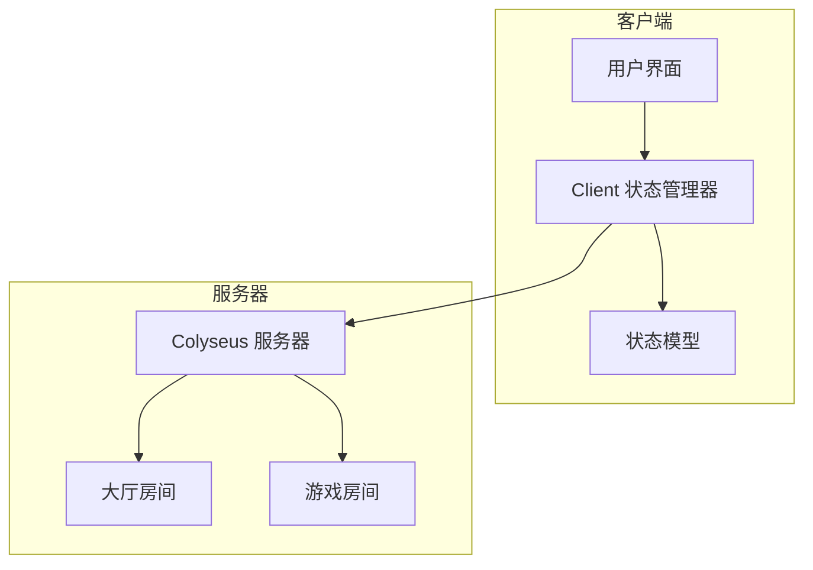
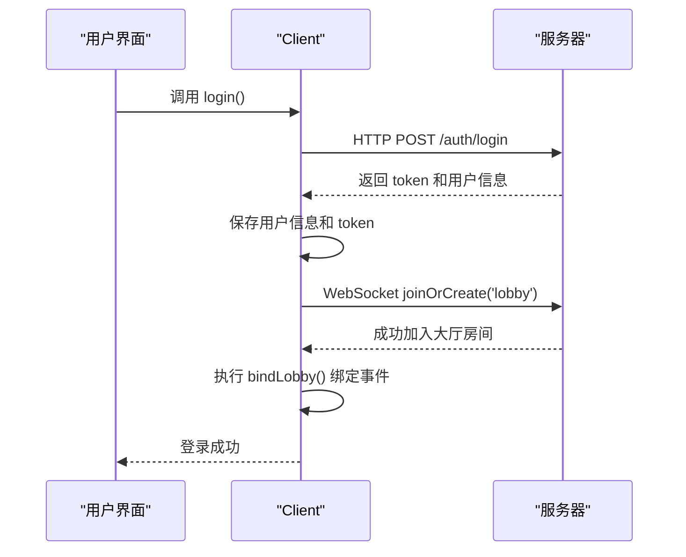
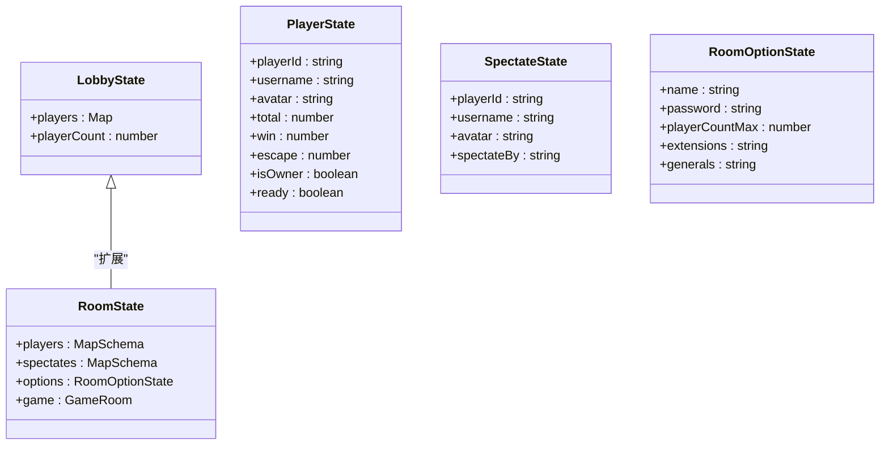

# 客户端状态管理

<cite>
**本文档引用的文件**
- [Client.ts](file://client/src/mgr/Client.ts#L1-L367)
- [LobbyState.ts](file://client/src/models/LobbyState.ts#L1-L9)
- [RoomStata.ts](file://client/src/models/RoomStata.ts#L1-L110)
- [enums.ts](file://client/src/enums.ts#L1-L232)
- [types.ts](file://client/src/core/types.ts)
</cite>

## 目录
1. [简介](#简介)
2. [项目结构](#项目结构)
3. [核心组件](#核心组件)
4. [架构概览](#架构概览)
5. [详细组件分析](#详细组件分析)
6. [依赖分析](#依赖分析)
7. [性能考虑](#性能考虑)
8. [故障排除指南](#故障排除指南)
9. [结论](#结论)

## 简介
本文档深入分析了基于 `Colyseus` 框架的客户端状态管理系统，重点研究 `Client.ts` 文件中实现的客户端状态管理器。该系统负责管理连接状态、认证状态和游戏状态，通过 WebSocket 与服务器保持实时通信，并具备完善的重连机制和错误处理流程。文档将详细解释状态机设计、状态转换逻辑、状态持久化策略以及多状态并发处理的最佳实践。

## 项目结构
客户端项目采用分层架构，主要目录包括：
- **assets**: 存放游戏资源，如动画、图片、字体等。
- **bin**: 编译后的配置文件和 HTML 入口。
- **engine/types**: 引擎类型定义文件。
- **library**: 资源库文件。
- **src**: 源代码目录，核心逻辑所在。
  - **comps**: UI 组件。
  - **effects**: 特效逻辑。
  - **mgr**: 管理器类，`Client.ts` 位于此目录。
  - **models**: 数据模型，定义了 `LobbyState` 和 `RoomState`。
  - **ui**: 用户界面逻辑。
  - **core**: 核心逻辑，如枚举、类型定义。
- **settings**: 项目配置。

**Section sources**
- [Client.ts](file://client/src/mgr/Client.ts#L1-L367)

## 核心组件
`Client` 类是整个客户端状态管理的核心单例，负责：
- 建立和维护与服务器的 WebSocket 连接。
- 处理用户登录和身份认证。
- 管理大厅和游戏房间的加入、创建和状态同步。
- 实现自动重连机制以应对网络中断。
- 提供对服务器的 HTTP API 调用接口。

**Section sources**
- [Client.ts](file://client/src/mgr/Client.ts#L1-L367)

## 架构概览
系统采用客户端-服务器（C/S）架构，客户端通过 `Colyseus.js` 库与基于 Node.js 的服务器进行通信。状态管理主要依赖于 `Colyseus.Room` 对象，该对象封装了 WebSocket 连接，并提供了状态同步、消息广播和事件监听等高级功能。



**Diagram sources**
- [Client.ts](file://client/src/mgr/Client.ts#L1-L367)

## 详细组件分析

### 客户端状态管理器 (Client.ts) 分析

#### 状态管理机制
`Client` 类通过管理多个 `Colyseus.Room` 实例来跟踪不同的状态：
- **连接状态**: 通过 `client` 属性（`Colyseus.Client` 实例）的存在与否来判断。
- **认证状态**: 通过 `username`, `token` 等属性存储用户登录信息。
- **游戏状态**: 通过 `lobbyRoom` 和 `gameRooms` 属性管理用户所在的大厅和游戏房间。

```mermaid
classDiagram
class Client {
+url : string
+client : Colyseus.Client
+username : string
+token : string
+lobbyRoom : Colyseus.Room<LobbyState>
+gameRooms : { [key : string] : Colyseus.Room[] }
+reconnectAttempts : number
+isAdmin : boolean
connect() : void
login(data : LoginData) : Promise<void>
createRoom(options : RoomOption) : Promise<Colyseus.Room>
joinRoom(roomId : string, options : RoomJoinData) : Promise<Colyseus.Room>
attempReconnect() : void
}
class Colyseus.Client {
+joinOrCreate(roomName : string, options : any) : Promise<Colyseus.Room>
+joinById(roomId : string, options : any, stateClass : any) : Promise<Colyseus.Room>
}
class Colyseus.Room {
+onMessage(event : string, callback : Function) : void
+onLeave(callback : Function) : void
+state : Schema
}
Client --> Colyseus.Client : "使用"
Client --> Colyseus.Room : "管理"
```

**Diagram sources**
- [Client.ts](file://client/src/mgr/Client.ts#L1-L367)

#### 连接与认证流程
1.  **连接**: 调用 `connect()` 方法初始化 `Colyseus.Client` 实例。
2.  **登录**: 调用 `login()` 方法，首先通过 HTTP POST 请求 `/auth/login` 进行身份验证，获取 `token`。
3.  **加入大厅**: 认证成功后，使用 `client.joinOrCreate('lobby', { username, token })` 加入大厅房间。
4.  **绑定事件**: 成功加入大厅后，调用 `bindLobby()` 方法绑定各种事件监听器。



**Diagram sources**
- [Client.ts](file://client/src/mgr/Client.ts#L1-L367)

#### 状态同步与事件监听
`Client` 类通过监听 `Colyseus.Room` 的事件来实现状态同步：
- **`onMessage('rooms')`**: 接收服务器推送的房间列表更新。
- **`onMessage('+')`**: 监听新房间创建或现有房间信息更新。
- **`onMessage('-')`**: 监听房间被销毁。
- **`onLeave()`**: 监听与房间的连接断开，触发重连逻辑。
- **`getStateCallbacks().listen()`**: 监听房间内特定状态字段的变化（如玩家数量）。

**Section sources**
- [Client.ts](file://client/src/mgr/Client.ts#L1-L367)

#### 错误处理与重连机制
系统实现了健壮的错误处理和重连策略：
- **错误处理**: `toastEroor()` 方法将服务器返回的错误码（`ServerCode`）映射为用户友好的提示信息。
- **重连机制**: `attempReconnect()` 方法实现了指数退避重连算法。当与大厅的连接断开时，会尝试最多 5 次重连，每次重连间隔时间翻倍（1s, 2s, 4s...），以避免对服务器造成过大压力。

```mermaid
flowchart TD
A[连接断开] --> B{重连次数 < 最大次数?}
B --> |是| C[计算延迟时间<br/>delay = 初始延迟 * 2^(次数-1)]
C --> D[显示重连提示]
D --> E[等待延迟时间]
E --> F[尝试重连]
F --> G{重连成功?}
G --> |是| H[重置重连次数<br/>绑定事件]
G --> |否| I[重连次数+1]
I --> B
B --> |否| J[提示用户刷新]
```

**Diagram sources**
- [Client.ts](file://client/src/mgr/Client.ts#L1-L367)

#### 状态模型 (State Models)
状态模型定义了客户端与服务器同步的数据结构，使用 `@colyseus/schema` 库进行序列化和反序列化。
- **LobbyState**: 大厅状态，包含玩家列表和玩家总数。
- **RoomState**: 游戏房间状态，包含玩家列表、旁观者列表、房间选项和游戏实例。



**Diagram sources**
- [LobbyState.ts](file://client/src/models/LobbyState.ts#L1-L9)
- [RoomStata.ts](file://client/src/models/RoomStata.ts#L1-L110)

## 依赖分析
`Client` 类依赖于多个外部模块和内部组件：
- **外部依赖**: `colyseus.js` (核心通信库), `@colyseus/schema` (状态同步)。
- **内部依赖**: `singleton.ts` (S.ui 用于 UI 交互), `config.ts` (服务器地址配置), `enums.ts` (错误码定义), `types.ts` (数据类型定义), `LobbyState.ts` 和 `RoomStata.ts` (状态模型)。

```mermaid
graph TD
Client[Client.ts] --> Colyseus[colyseus.js]
Client --> Schema[@colyseus/schema]
Client --> Singleton[singleton.ts]
Client --> Config[config.ts]
Client --> Enums[enums.ts]
Client --> Types[types.ts]
Client --> LobbyState[LobbyState.ts]
Client --> RoomState[RoomStata.ts]
```

**Diagram sources**
- [Client.ts](file://client/src/mgr/Client.ts#L1-L367)

## 性能考虑
- **状态同步**: `@colyseus/schema` 库采用高效的二进制协议（msgpack）进行数据传输，减少了网络带宽消耗。
- **内存管理**: 使用 `MapSchema` 和 `ArraySchema` 可以精确地监听状态变化，避免了不必要的全量数据更新和 UI 重绘。
- **重连策略**: 指数退避算法有效防止了在网络不稳定时对服务器的“雪崩”式请求。

## 故障排除指南
- **无法连接服务器**: 检查 `ServerConfig.host` 和 `port` 是否正确，确认服务器是否正常运行。
- **登录失败**: 检查用户名和密码是否正确，确认服务器 `/auth/login` 接口是否可用。
- **频繁断线重连**: 检查网络连接稳定性，确认服务器 WebSocket 服务是否正常。
- **状态不同步**: 检查 `@type` 装饰器是否正确应用，确认客户端和服务器的 `@colyseus/schema` 版本是否一致。

**Section sources**
- [Client.ts](file://client/src/mgr/Client.ts#L1-L367)

## 结论
`Client.ts` 实现了一个功能完整、健壮的客户端状态管理器。它通过 `Colyseus` 框架有效地管理了连接、认证和游戏状态，利用状态模型实现了高效的数据同步，并通过完善的重连和错误处理机制保证了用户体验。该设计模式清晰，易于维护和扩展，是构建实时多人在线游戏客户端的优秀实践范例。