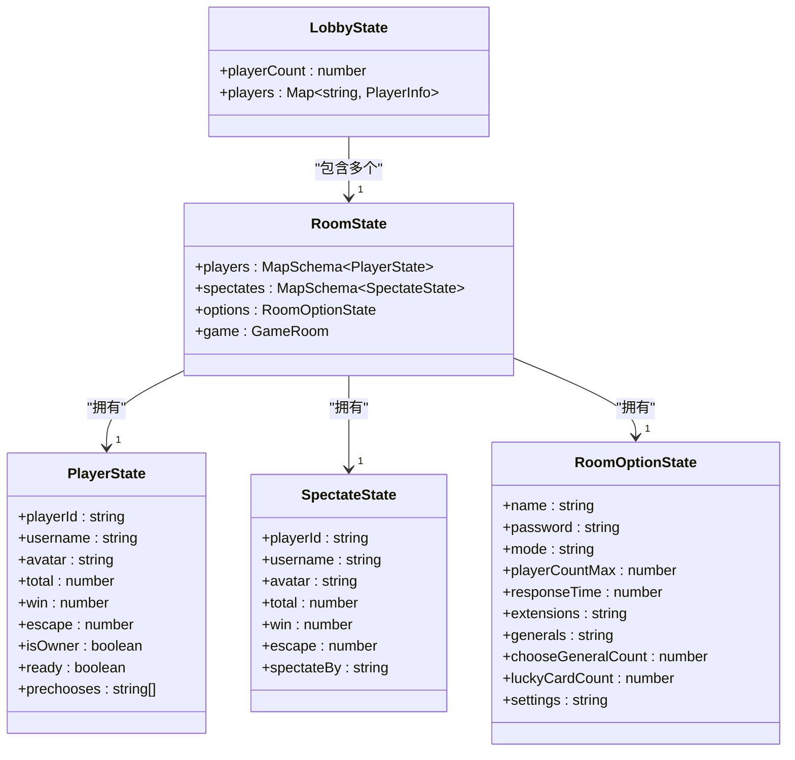
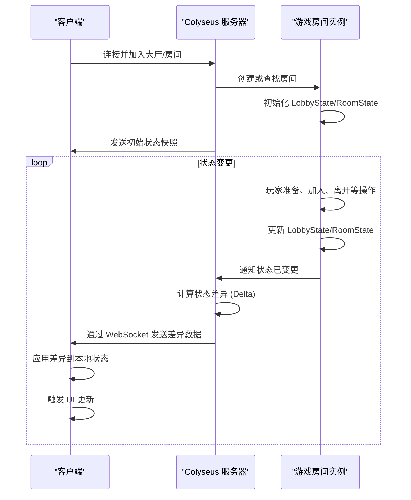

# 游戏状态同步

<cite>
**本文档引用文件**  
- [LobbyState.ts](file://server/src/models/LobbyState.ts)
- [RoomStata.ts](file://server/src/models/RoomStata.ts)
- [LobbyState.ts](file://client/src/models/LobbyState.ts)
- [RoomStata.ts](file://client/src/models/RoomStata.ts)
</cite>

## 目录
1. [引言](#引言)
2. [核心状态模型](#核心状态模型)
3. [LobbyState 模型详解](#lobbystate-模型详解)
4. [RoomStata 模型详解](#roomstata-模型详解)
5. [状态同步机制](#状态同步机制)
6. [状态更新与监听](#状态更新与监听)
7. [性能优化策略](#性能优化策略)
8. [状态一致性与异常恢复](#状态一致性与异常恢复)

## 引言

本技术文档详细阐述了游戏服务器中 **LobbyState** 和 **RoomStata** 两个核心状态模型的设计与实现。这两个模型是基于 **Colyseus** 框架的 `@colyseus/schema` 构建的，用于在服务器端精确反映游戏大厅和游戏房间的实时状态，并通过 WebSocket 协议与客户端进行高效、实时的双向同步。文档将深入分析其数据结构、字段含义、状态转换规则、同步机制及性能优化策略。

## 核心状态模型

游戏状态同步的核心在于服务器端维护的两个 Schema 模型：`LobbyState` 和 `RoomState`（在代码中为 `RoomStata`）。它们分别代表了游戏大厅和游戏房间的全局状态。



**图示来源**
- [LobbyState.ts](file://server/src/models/LobbyState.ts)
- [RoomStata.ts](file://server/src/models/RoomStata.ts)

**本节来源**
- [LobbyState.ts](file://server/src/models/LobbyState.ts)
- [RoomStata.ts](file://server/src/models/RoomStata.ts)

## LobbyState 模型详解

`LobbyState` 模型用于表示游戏大厅的全局状态，是所有玩家进入游戏前的集合点。

### 数据结构与字段

该模型定义在 `server/src/models/LobbyState.ts` 中，其结构如下：

```typescript
export class LobbyState extends Schema {
    @type('number')
    playerCount: number = 0;
}
```

- **playerCount**: 类型为 `number`，使用 `@type('number')` 进行装饰。该字段记录了当前在线的玩家总数。服务器会实时更新此数值，客户端通过监听其变化来更新大厅界面的在线人数显示。

在客户端模型 `client/src/models/LobbyState.ts` 中，为了提供更丰富的信息，还额外定义了一个 `players` 字段：
```typescript
players: Map<string, { username: string; status: string }>;
```
此字段是一个映射，键为玩家的唯一ID，值为包含用户名和当前状态（如“在线”、“游戏中”）的对象。这使得客户端可以展示一个更详细的大厅玩家列表。

### 状态同步机制

`LobbyState` 的同步是通过 Colyseus 的自动状态同步功能实现的。当服务器端的 `playerCount` 发生变化时（例如有玩家加入或离开），Colyseus 会自动检测到这个变更，并通过 WebSocket 将**差异数据**（delta）发送给所有连接到大厅的客户端。客户端收到更新后，会自动应用这些变更到本地的 `LobbyState` 实例上，从而保证了状态的一致性。

## RoomStata 模型详解

`RoomStata` 模型（即 `RoomState`）是游戏房间的核心状态容器，其结构更为复杂，包含了房间内所有玩家、旁观者、房间设置和游戏实例的完整信息。

### 数据结构与字段

该模型定义在 `server/src/models/RoomStata.ts` 中，其核心是一个 `RoomState` 类，它聚合了多个子状态类。

#### 1. RoomState 主体

```typescript
export class RoomState extends Schema {
    @type({ map: PlayerState })
    public players = new MapSchema<PlayerState>();
    @type({ map: SpectateState })
    public spectates = new MapSchema<SpectateState>();
    @type(RoomOptionState)
    public options: RoomOptionState;
    public game: GameRoom;
}
```

- **players**: 类型为 `MapSchema<PlayerState>`，是一个由 `PlayerState` 对象组成的映射。键为玩家的唯一ID，值为该玩家的详细状态。这是房间内所有参与玩家的核心数据集合。
- **spectates**: 类型为 `MapSchema<SpectateState>`，是一个由 `SpectateState` 对象组成的映射。用于管理所有旁观该房间的玩家。
- **options**: 类型为 `RoomOptionState`，包含了房间的创建配置，如房间名、密码、最大玩家数、游戏模式等。
- **game**: 类型为 `GameRoom`，这是一个对实际游戏逻辑房间实例的引用，包含了游戏进行中的所有动态数据（如卡牌、武将、回合等），但此引用本身不会被序列化同步。

#### 2. PlayerState 玩家状态

`PlayerState` 类定义了每个参与玩家的详细信息：

```typescript
export class PlayerState extends Schema {
    token: string; // 服务器内部使用，不暴露给客户端
    client: Client; // 服务器内部使用，不暴露给客户端
    key: string; // 服务器内部使用，不暴露给客户端
    @type('string') playerId: string;
    @type('string') username: string;
    @type('string') avatar: string;
    @type('number') total: number = 0;
    @type('number') win: number = 0;
    @type('number') escape: number = 0;
    @type('boolean') isOwner: boolean = false;
    @type('boolean') ready: boolean = false;
    prechooses: string[]; // 预选武将列表，类型为字符串数组
}
```

- **playerId, username, avatar**: 基础身份信息。
- **total, win, escape**: 玩家的游戏统计数据。
- **isOwner**: 标识该玩家是否为房主，房主拥有修改房间设置和踢人的权限。
- **ready**: 标识玩家是否已准备就绪，当所有玩家都准备后，房主可以开始游戏。
- **prechooses**: 一个字符串数组，用于存储玩家预选的武将ID。

#### 3. SpectateState 旁观者状态

`SpectateState` 的结构与 `PlayerState` 高度相似，但多了一个 `spectateBy` 字段，用于记录该旁观者正在观看哪位玩家。

#### 4. RoomOptionState 房间选项

此状态类封装了房间的配置参数，允许客户端在创建或加入房间时获取这些信息。

### 状态同步机制

`RoomState` 的同步机制与 `LobbyState` 类似，但数据量更大，结构更复杂。Colyseus 的 `MapSchema` 和 `Schema` 能够高效地处理嵌套对象和集合的变更检测。当房间内任何玩家的状态（如 `ready` 变为 `true`）或房间选项发生变化时，Colyseus 会生成一个精确的差异补丁（patch），并通过 WebSocket 发送给所有房间内的客户端（包括玩家和旁观者）。客户端收到后，会自动将补丁应用到本地的 `RoomState` 上，实现UI的实时更新。

## 状态同步机制

游戏状态的实时同步是通过 **WebSocket** 和 **Colyseus 框架**协同完成的。

### 同步流程



**图示来源**
- [LobbyState.ts](file://server/src/models/LobbyState.ts)
- [RoomStata.ts](file://server/src/models/RoomStata.ts)

**本节来源**
- [LobbyState.ts](file://server/src/models/LobbyState.ts)
- [RoomStata.ts](file://server/src/models/RoomStata.ts)

### 数据序列化与反序列化

Colyseus 使用其 `@colyseus/schema` 库来处理数据的序列化和反序列化。
- **服务器端**: 当状态变更时，`Schema` 对象会被序列化成一种高效的二进制或紧凑的 JSON 格式（具体取决于配置），然后通过 WebSocket 发送。
- **客户端**: 接收到数据后，Colyseus 客户端库会将其反序列化，并自动应用到本地的 `Schema` 实例上。开发者无需手动解析 JSON。

### 状态差异检测算法

Colyseus 的核心优势之一是其高效的**状态差异检测**（Delta Encoding）算法。
- **原理**: 服务器端会维护一个状态的“快照”（snapshot）。当状态发生变更后，框架会将新状态与快照进行比较，只计算出发生变化的部分（即差异）。
- **优势**: 这种方式极大地减少了网络传输的数据量。例如，一个包含100个玩家的房间，如果只有一个玩家的 `ready` 状态从 `false` 变为 `true`，服务器只会发送关于这个玩家 `ready` 字段变更的极小数据包，而不是整个房间的完整状态。

## 状态更新与监听

开发者通过监听状态变更事件来响应游戏逻辑和更新UI。

### 代码示例：客户端状态监听

```typescript
// 假设 client 是已连接的 Colyseus 客户端实例
// 假设 room 是已加入的房间实例

// 监听 LobbyState 的 playerCount 变化
room.state.lobby.listen('playerCount', (newCount, prevCount) => {
    console.log(`在线人数从 ${prevCount} 变为 ${newCount}`);
    // 更新UI上的在线人数显示
    updatePlayerCountUI(newCount);
});

// 监听 RoomState 中 players 集合的变化
room.state.room.players.onAdd = (playerState, playerId) => {
    console.log(`玩家加入: ${playerState.username}`);
    // 在UI上添加一个新玩家座位
    addPlayerSeat(playerId, playerState);
};

room.state.room.players.onRemove = (playerState, playerId) => {
    console.log(`玩家离开: ${playerState.username}`);
    // 从UI上移除该玩家座位
    removePlayerSeat(playerId);
};

// 监听单个玩家状态的 ready 字段变化
room.state.room.players.onAdd = (playerState, playerId) => {
    playerState.listen('ready', (isReady) => {
        console.log(`${playerState.username} 的准备状态变为: ${isReady}`);
        // 更新该玩家座位上的准备指示器
        updatePlayerReadyStatus(playerId, isReady);
    });
};
```

**本节来源**
- [LobbyState.ts](file://client/src/models/LobbyState.ts)
- [RoomStata.ts](file://client/src/models/RoomStata.ts)

## 性能优化策略

为了保证大规模并发下的流畅体验，系统采用了多种性能优化策略。

### 增量更新 (Incremental Updates)

如前所述，Colyseus 的 Delta Encoding 是最核心的优化。它确保了只有变更的数据被传输，显著降低了带宽消耗和客户端的处理负担。

### 状态压缩

Colyseus 内部会对序列化后的数据进行压缩（如使用 `msgpack` 编码），进一步减小数据包体积，提高传输效率。

### 网络延迟处理

- **客户端预测 (Client-Side Prediction)**: 对于玩家自身的操作（如点击“准备”按钮），客户端可以立即更新本地UI，然后向服务器发送请求。如果服务器确认，则状态保持不变；如果服务器拒绝，则回滚UI。这提供了即时的反馈，减少了网络延迟带来的卡顿感。
- **延迟补偿**: 服务器在处理状态变更时，会考虑网络延迟，确保状态变更的顺序性和一致性。

## 状态一致性与异常恢复

保证状态一致性是多人游戏的关键。

### 一致性校验机制

- **服务器权威 (Server Authority)**: 服务器是唯一可信的“真相来源”。所有状态变更必须由服务器验证和执行。客户端只能发送操作请求，不能直接修改全局状态。
- **变更验证**: 服务器在接收到客户端的请求（如“准备”）时，会进行逻辑验证（例如，检查该玩家是否在房间内，游戏是否已经开始等），只有验证通过才会更新 `RoomState`。

### 异常状态恢复

- **断线重连 (Reconnection)**: Colyseus 提供了强大的断线重连机制。当玩家网络中断后，服务器会保留其 `ReconnectToken` 一段时间。玩家重新连接时，可以使用该令牌重新加入房间，并获取自断线以来的所有状态差异，从而无缝恢复到断线前的状态。
- **状态快照**: 服务器会定期或在关键节点保存状态快照。在极端情况下（如服务器崩溃重启），可以从最近的快照恢复游戏状态。