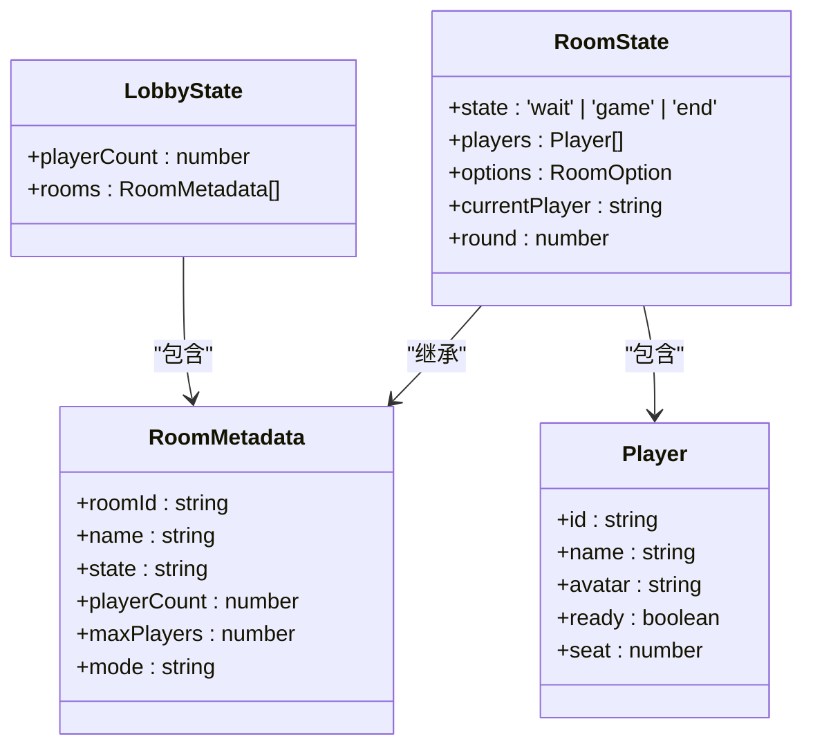
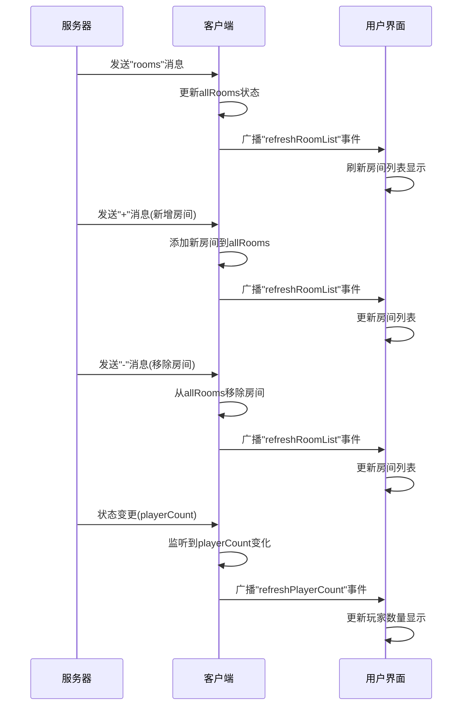

# 状态管理

<cite>
**本文档中引用的文件**   
- [singleton.ts](file://client/src/singleton.ts)
- [Client.ts](file://client/src/mgr/Client.ts)
- [LobbyState.ts](file://client/src/models/LobbyState.ts)
- [RoomStata.ts](file://client/src/models/RoomStata.ts)
- [UILobbyItem.ts](file://client/src/ui/UILobbyItem.ts)
- [UIRoom.ts](file://client/src/ui/UIRoom.ts)
- [RoomTableComp.ts](file://client/src/comps/room/RoomTableComp.ts)
- [types.ts](file://server/src/core/types.ts)
</cite>

## 目录
1. [简介](#简介)
2. [全局状态管理](#全局状态管理)
3. [客户端状态管理器](#客户端状态管理器)
4. [大厅与房间状态模型](#大厅与房间状态模型)
5. [状态同步机制](#状态同步机制)
6. [状态订阅与监听](#状态订阅与监听)
7. [状态管理最佳实践](#状态管理最佳实践)

## 简介
本项目采用基于单例模式和WebSocket通信的前端状态管理架构，通过`singleton.ts`中的全局状态容器协调不同模块间的数据共享，利用`Client.ts`中的客户端状态管理器维护连接、认证和游戏状态。系统通过Colyseus框架实现与服务器的实时通信，确保客户端状态与服务器端游戏状态保持同步。状态管理设计注重性能优化和错误处理，为用户提供流畅的游戏体验。

## 全局状态管理

`singleton.ts`文件实现了单例模式作为全局状态容器，协调不同模块之间的数据共享。该文件通过静态类`S`提供全局访问点，初始化并管理多个核心管理器实例。

```typescript
import { Main } from './Main';
import { ResourcesManager } from './mgr/Resources';
import { sgs } from './core/sgs';
import extensions from './core/extensions.config';
import { Client } from './mgr/Client';
import { ServerConfig } from './config';
import { Replay } from './mgr/Replay';

export abstract class S {
    public static init() {
        this.res = ResourcesManager.getInstance();
        this.client = Client.getInstance();
        this.replay = Replay.getInstance();
        const side: string = 'preview';
        sgs.init(side, (name) => {
            this.loadScript(`./extensions/${name}.js`, () => {
                sgs.extensions.push(name);
            });
        });

        sgs.loadTranslation({
            ['wars.hezong']: '合纵',
        });

        if (side !== 'preview') {
            for (const pkg of extensions) {
                sgs.loadPackage(pkg);
            }
        }

        let config = `./configs/config.${
            Laya.LayaEnv.isPreview ? 'development' : 'production'
        }.json`;

        Laya.loader.load(config, Laya.Loader.JSON).then((res) => {
            const data = res.data;
            ServerConfig.host = data.serverHost;
            ServerConfig.port = data.serverPort;
            ServerConfig.res_url = data.gameAssetsUrl;
        });

        this.replay.init();
    }

    public static loadScript(url: string, func: any) {
        var script = document.createElement('script');
        script.src = url;
        script.onload = func;
        document.body.appendChild(script);
    }

    public static ui: Main;
    public static res: ResourcesManager;
    public static client: Client;
    public static replay: Replay;
}
```

该单例模式通过`init()`方法初始化资源管理器、客户端和回放管理器，并加载服务器配置。静态属性`ui`、`res`、`client`和`replay`提供了对这些核心组件的全局访问，确保整个应用使用同一实例，避免了状态不一致的问题。

**Section sources**
- [singleton.ts](file://client/src/singleton.ts#L1-L58)

## 客户端状态管理器

`Client.ts`文件中的`Client`类作为客户端状态管理器，负责管理连接状态、认证状态和游戏状态。该类采用单例模式，确保全局唯一实例。

```typescript
export class Client {
    private static instance: Client;

    public static getInstance() {
        if (!this.instance) {
            this.instance = new Client();
        }
        return this.instance;
    }

    private constructor() {}

    public url: string;
    public client: Colyseus.Client;
    public username: string;
    public avatar: string = 'general/shibingn/image.png';
    public token: string;
    public reconnectToken: string;

    public lobbyRoom: Colyseus.Room<LobbyState>;
    public gameRooms: { [key: string]: Colyseus.Room[] } = {};
    public allRooms: Colyseus.RoomAvailable<RoomMetedata>[] = [];

    public reconnectAttempts = 0;
    private maxReconnectAttempts = 5;
    private reconnectDelay = 1000;

    public isAdmin: boolean = false;
    public isSuperAdmin: boolean = false;
```

该管理器维护了多个状态属性：
- **连接状态**：通过`client`属性管理WebSocket连接
- **认证状态**：通过`username`、`token`等属性管理用户认证信息
- **游戏状态**：通过`lobbyRoom`和`gameRooms`属性管理大厅和房间状态
- **重连机制**：通过`reconnectAttempts`、`maxReconnectAttempts`等属性管理网络重连逻辑

```mermaid
classDiagram
class Client {
-static instance : Client
+url : string
+client : Colyseus.Client
+username : string
+avatar : string
+token : string
+reconnectToken : string
+lobbyRoom : Colyseus.Room<LobbyState>
+gameRooms : { [key : string] : Colyseus.Room[] }
+allRooms : Colyseus.RoomAvailable<RoomMetedata>[]
+reconnectAttempts : number
+maxReconnectAttempts : number
+reconnectDelay : number
+isAdmin : boolean
+isSuperAdmin : boolean
+getInstance() : Client
+connect() : void
+login(data : LoginData) : Promise<void>
+bindLobby() : void
+attempReconnect() : void
+createRoom(options : RoomOption) : Promise<Room>
+joinRoom(roomId : string, options : RoomJoinData) : Promise<Room>
+toastEroor(e : { code : ServerCode }) : void
+broadcast(message : string) : Promise<void>
+updateAvatar(avatar : string) : Promise<void>
+ban(username : string, data : BanData) : Promise<void>
+unban(username : string, type : BanType) : Promise<void>
}
class LobbyState {
+playerCount : number
+rooms : RoomMetadata[]
}
class RoomState {
+state : 'wait' | 'game' | 'end'
+players : Player[]
+options : RoomOption
}
Client --> LobbyState : "管理"
Client --> RoomState : "管理"
Client --> Colyseus.Client : "使用"
```

**Diagram sources**
- [Client.ts](file://client/src/mgr/Client.ts#L1-L368)

**Section sources**
- [Client.ts](file://client/src/mgr/Client.ts#L1-L368)

## 大厅与房间状态模型

### LobbyState模型
`LobbyState`模型定义了大厅状态的结构，主要包含玩家数量和房间列表信息。该模型用于反映服务器端的大厅状态，为客户端提供实时的大厅数据。

```typescript
// 从UILobbyItem.ts中提取的状态定义
const state = {
    wait: '等待中',
    game: '游戏中',
    end: '结算中',
};
```

### RoomStata模型
`RoomStata`模型定义了房间状态的结构，包括游戏状态、玩家列表和房间选项等。该模型与服务器端的`types.ts`中的定义保持一致。

```typescript
// 从server/src/core/types.ts中提取的状态定义
state: 'wait' | 'game' | 'end';
```



**Diagram sources**
- [LobbyState.ts](file://client/src/models/LobbyState.ts)
- [RoomStata.ts](file://client/src/models/RoomStata.ts)
- [types.ts](file://server/src/core/types.ts#L50-L50)

**Section sources**
- [LobbyState.ts](file://client/src/models/LobbyState.ts)
- [RoomStata.ts](file://client/src/models/RoomStata.ts)
- [types.ts](file://server/src/core/types.ts#L50-L50)

## 状态同步机制

状态同步机制通过WebSocket消息触发状态更新，确保客户端状态与服务器端保持一致。`Client.ts`中的`bindLobby`方法设置了多个消息监听器，处理来自服务器的状态更新。

```typescript
private bindLobby() {
    this.lobbyRoom.onMessage('rooms', (rooms) => {
        this.allRooms = rooms;
        Laya.stage.event('refreshRoomList');
    });
    this.lobbyRoom.onMessage('+', ([roomId, room]) => {
        const index = this.allRooms.findIndex(
            (room) => room.roomId === roomId
        );
        if (index !== -1) {
            this.allRooms[index] = room;
        } else {
            this.allRooms.push(room);
        }
        Laya.stage.event('refreshRoomList');
    });
    this.lobbyRoom.onMessage('-', (roomId) => {
        this.allRooms = this.allRooms.filter(
            (room) => room.roomId !== roomId
        );
        Laya.stage.event('refreshRoomList');
    });
    this.lobbyRoom.onLeave((code: number) => {
        if (code === 3005) {
            return;
        }
        this.lobbyRoom = undefined;
        this.reconnectAttempts = 0;
        this.attempReconnect();
    });

    const $ = getStateCallbacks(this.lobbyRoom);
    $(this.lobbyRoom.state).listen(
        'playerCount',
        (value, previousValue) => {
            Laya.stage.event('refreshPlayerCount');
        }
    );

    this.lobbyRoom.onMessage('reconnectToken', (roomId: string) => {
        this.reconnectToken = roomId;
        Laya.stage.event('onReconnectToken');
    });
}
```

该机制通过以下方式实现状态同步：
1. **全量更新**：`rooms`消息提供完整的房间列表
2. **增量更新**：`+`和`-`消息分别处理房间的添加和移除
3. **状态监听**：使用`getStateCallbacks`监听特定状态字段的变化
4. **事件广播**：通过`Laya.stage.event`广播状态变化事件



**Diagram sources**
- [Client.ts](file://client/src/mgr/Client.ts#L100-L135)

**Section sources**
- [Client.ts](file://client/src/mgr/Client.ts#L100-L135)

## 状态订阅与监听

状态订阅与监听机制允许UI组件和其他模块响应状态变化。通过`getStateCallbacks`函数和事件系统，实现了灵活的状态监听。

```typescript
// 在UI组件中监听状态变化
public get state() {
    return this.room.state;
}

// 在UILobbyItem中使用状态映射
const state = {
    wait: '等待中',
    game: '游戏中',
    end: '结算中',
};
```

实际代码示例展示了如何在不同组件中订阅和使用状态：

```typescript
// RoomTableComp.ts中的状态获取
public get state() {
    return this.owner.state;
}

// UIRoom.ts中的状态获取
public get state() {
    return this.room.state;
}
```

这种设计模式的优势包括：
- **解耦**：UI组件与状态管理器解耦，通过事件通信
- **响应式**：状态变化自动触发UI更新
- **可维护性**：集中管理状态，避免分散的状态更新逻辑
- **性能**：只在状态变化时触发更新，避免不必要的渲染

**Section sources**
- [UILobbyItem.ts](file://client/src/ui/UILobbyItem.ts#L7-L11)
- [UIRoom.ts](file://client/src/ui/UIRoom.ts#L22-L24)
- [RoomTableComp.ts](file://client/src/comps/room/RoomTableComp.ts#L19-L21)

## 状态管理最佳实践

### 状态规范化
项目采用状态规范化设计，将状态分为不同的管理器：
- **全局状态**：通过`S`类提供全局访问
- **连接状态**：由`Client`类管理
- **资源状态**：由`ResourcesManager`管理
- **回放状态**：由`Replay`类管理

### 性能优化
1. **增量更新**：使用`+`和`-`消息减少数据传输量
2. **事件节流**：通过事件系统避免频繁的UI更新
3. **对象池**：利用引擎的对象池机制减少内存分配

### 错误处理策略
1. **网络重连**：实现指数退避重连算法
2. **用户反馈**：通过`S.ui.toast`提供友好的错误提示
3. **状态恢复**：保存`reconnectToken`支持断线重连

```typescript
public attempReconnect() {
    if (this.reconnectAttempts >= this.maxReconnectAttempts) {
        S.ui.toast('网络异常，请刷新重试');
        return;
    }
    this.reconnectAttempts++;
    const delay =
        this.reconnectDelay * Math.pow(2, this.reconnectAttempts - 1);
    S.ui.toast(
        `与服务器断开连接，将在${delay / 1000}秒后尝试重连（${
            this.reconnectAttempts
        }/${this.maxReconnectAttempts}）`
    );
    S.ui.openModelLoad();
    setTimeout(async () => {
        try {
            const lobby = await this.client.joinOrCreate('lobby', {
                username: this.username,
            });
            if (lobby) {
                this.reconnectAttempts = 0;
                this.lobbyRoom = lobby as any;
                this.bindLobby();
                S.ui.closeModelLoad();
            } else {
                this.attempReconnect();
            }
        } catch {}
    }, delay);
}
```

该错误处理策略确保了良好的用户体验，即使在网络不稳定的情况下也能提供清晰的反馈和自动恢复机制。

**Section sources**
- [Client.ts](file://client/src/mgr/Client.ts#L137-L170)