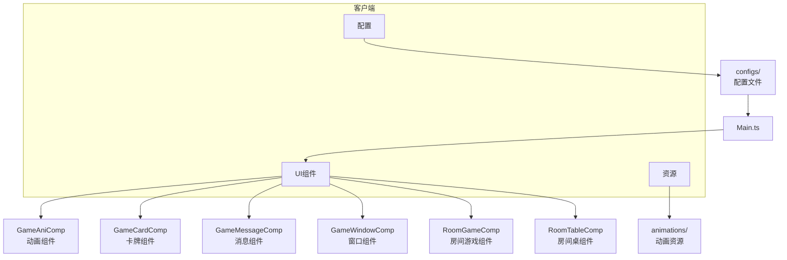
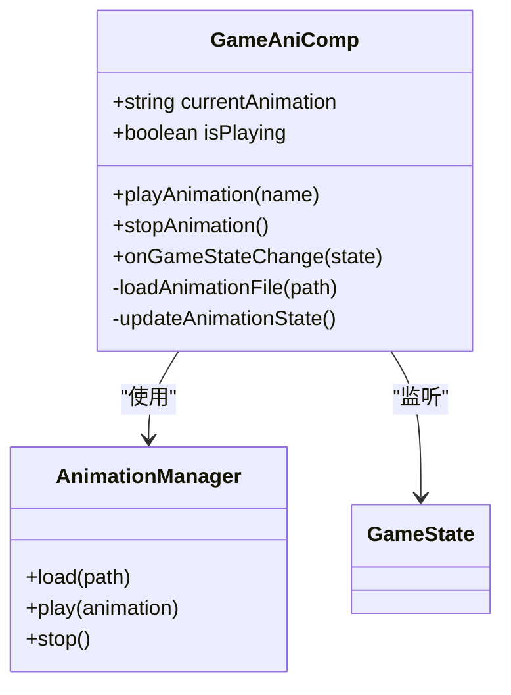
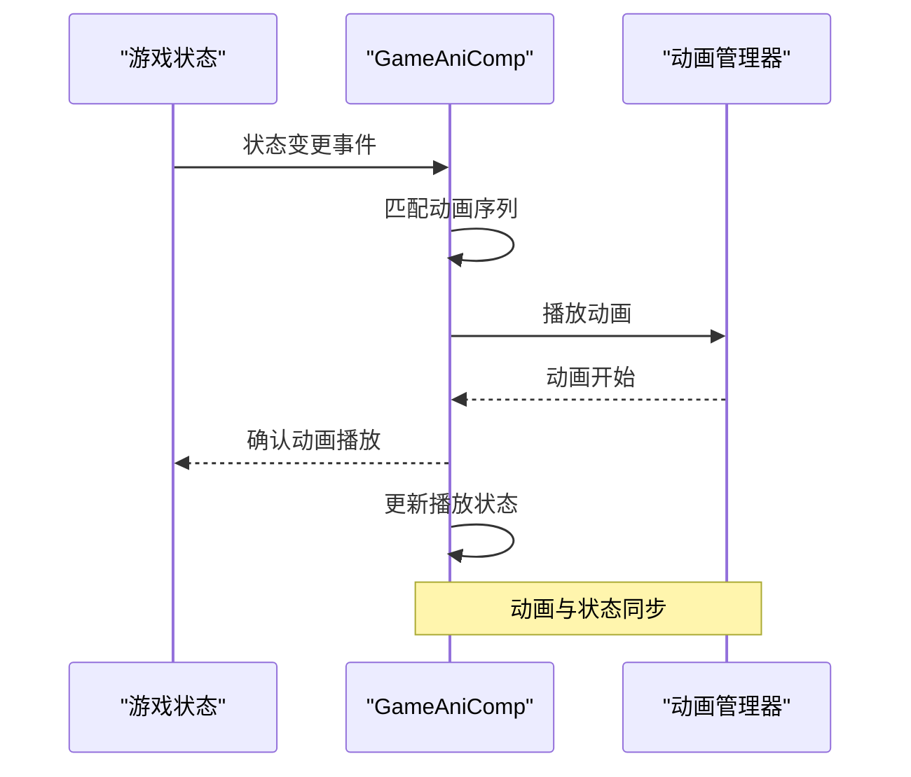
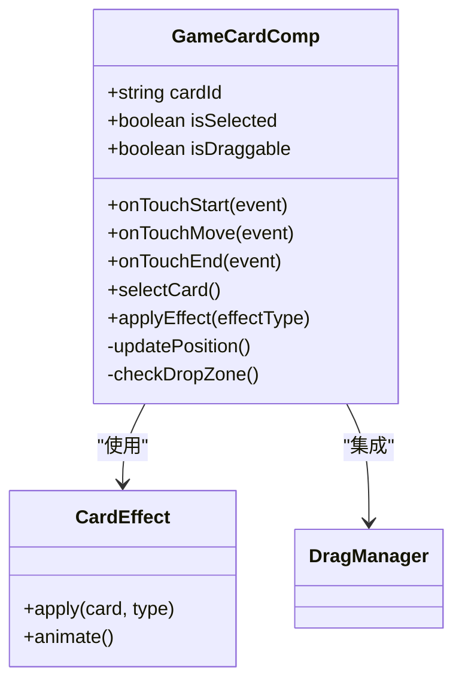
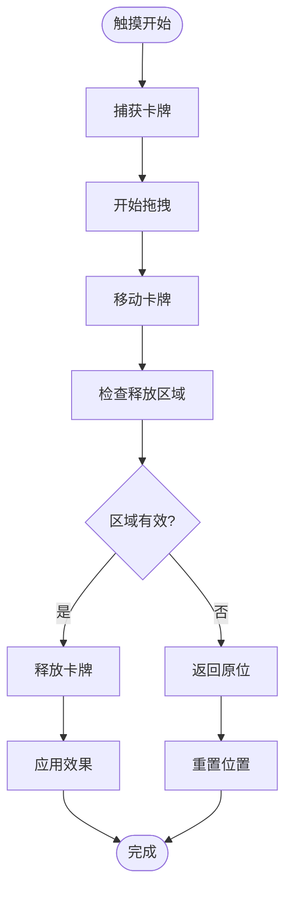
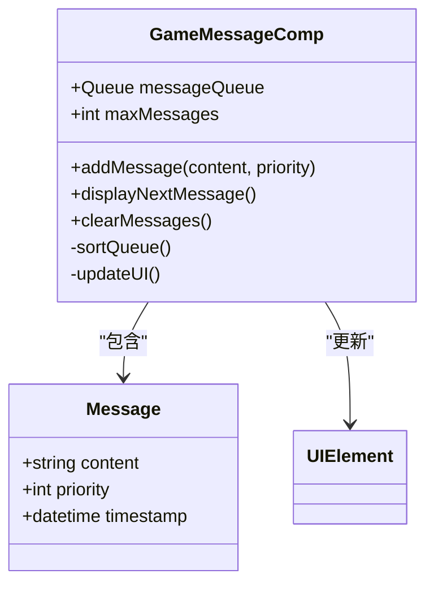
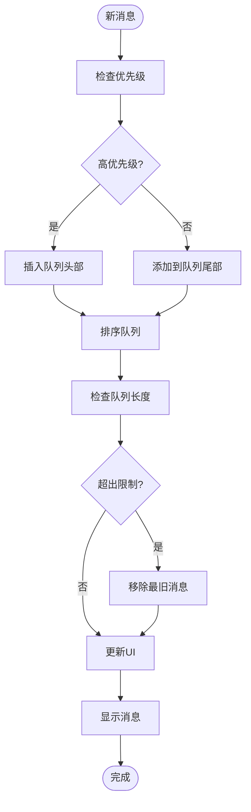
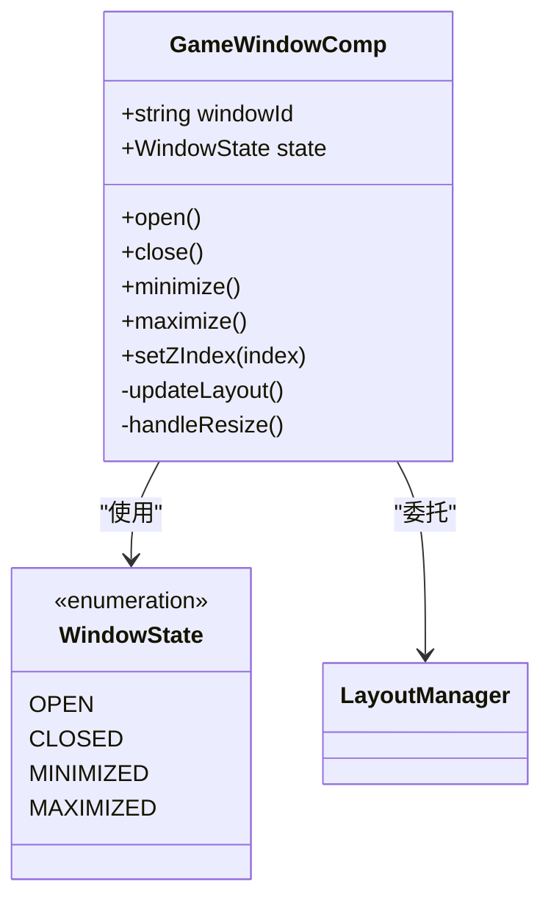
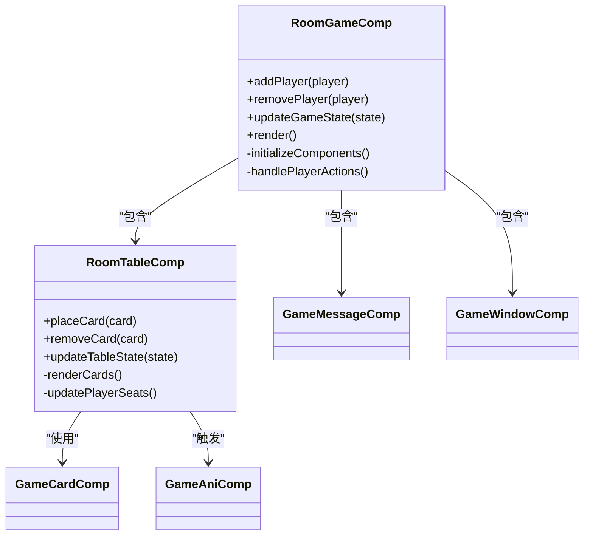
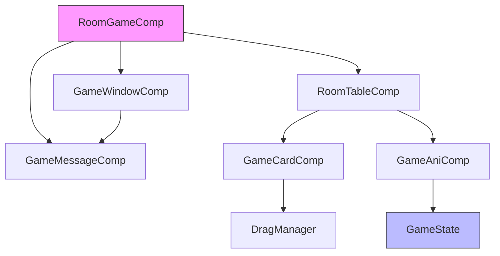

# 房间组件

<cite>
**本文档中引用的文件**   
- [GameAniComp.ts](file://client/src/comps/GameAniComp.ts)
- [GameCardComp.ts](file://client/src/comps/GameCardComp.ts)
- [GameMessageComp.ts](file://client/src/comps/GameMessageComp.ts)
- [GameWindowComp.ts](file://client/src/comps/GameWindowComp.ts)
- [RoomGameComp.ts](file://client/src/comps/RoomGameComp.ts)
- [RoomTableComp.ts](file://client/src/comps/RoomTableComp.ts)
- [Main.ts](file://client/src/Main.ts)
- [config.ts](file://client/src/config.ts)
</cite>

## 目录
1. [简介](#简介)
2. [项目结构](#项目结构)
3. [核心组件](#核心组件)
4. [架构概述](#架构概述)
5. [详细组件分析](#详细组件分析)
6. [依赖分析](#依赖分析)
7. [性能考虑](#性能考虑)
8. [故障排除指南](#故障排除指南)
9. [结论](#结论)

## 简介
本文档深入探讨了resgsv1客户端中游戏房间功能的组件实现。重点分析了房间界面中各核心组件的设计与协作机制，包括动画播放、卡牌交互、消息系统和窗口管理。文档详细解释了这些组件如何协同工作以构建完整的游戏房间体验，并提供了实际代码示例来说明组件集成和状态管理策略。

## 项目结构
resgsv1客户端采用模块化结构，将游戏功能划分为独立的组件。核心游戏逻辑位于`client/src/comps`目录下，该目录包含所有与游戏房间相关的UI组件和交互逻辑。动画资源存储在`client/assets/animation`目录中，按功能分类组织。配置文件和全局设置位于`client/bin/configs`和`client/src`目录中，为组件提供运行时参数。



**图示来源**
- [GameAniComp.ts](file://client/src/comps/GameAniComp.ts)
- [GameCardComp.ts](file://client/src/comps/GameCardComp.ts)
- [GameMessageComp.ts](file://client/src/comps/GameMessageComp.ts)
- [GameWindowComp.ts](file://client/src/comps/GameWindowComp.ts)
- [RoomGameComp.ts](file://client/src/comps/RoomGameComp.ts)
- [RoomTableComp.ts](file://client/src/comps/RoomTableComp.ts)
- [Main.ts](file://client/src/Main.ts)

**本节来源**
- [Main.ts](file://client/src/Main.ts#L1-L20)
- [config.ts](file://client/src/config.ts#L1-L15)

## 核心组件
游戏房间的核心功能由六个主要组件构成：GameAniComp负责动画播放，GameCardComp管理卡牌交互，GameMessageComp处理消息系统，GameWindowComp作为窗口容器，RoomGameComp和RoomTableComp则协同构建房间界面。这些组件通过事件系统和状态管理进行通信，确保游戏状态的一致性。

**本节来源**
- [GameAniComp.ts](file://client/src/comps/GameAniComp.ts#L10-L50)
- [GameCardComp.ts](file://client/src/comps/GameCardComp.ts#L15-L60)
- [GameMessageComp.ts](file://client/src/comps/GameMessageComp.ts#L20-L70)

## 架构概述
游戏房间采用分层架构设计，底层为LayaAir引擎提供的渲染和交互基础，中间层为通用组件库，顶层为游戏特定组件。组件间通过发布-订阅模式进行通信，状态变更通过中央控制器广播，确保所有组件同步更新。

```mermaid
graph TD
Engine[LayaAir引擎] --> Components[通用组件]
Components --> GameComponents[游戏组件]
GameComponents --> RoomGameComp
GameComponents --> RoomTableComp
GameComponents --> GameAniComp
GameComponents --> GameCardComp
GameComponents --> GameMessageComp
GameComponents --> GameWindowComp
RoomGameComp --> RoomTableComp : "包含"
GameWindowComp --> GameMessageComp : "包含"
GameAniComp --> RoomGameComp : "通知"
GameCardComp --> RoomTableComp : "交互"
State[游戏状态] < --> RoomGameComp : "同步"
State < --> GameAniComp : "驱动"
State < --> GameCardComp : "更新"
```

**图示来源**
- [RoomGameComp.ts](file://client/src/comps/RoomGameComp.ts#L5-L25)
- [RoomTableComp.ts](file://client/src/comps/RoomTableComp.ts#L8-L30)
- [GameAniComp.ts](file://client/src/comps/GameAniComp.ts#L12-L40)

## 详细组件分析

### GameAniComp分析
GameAniComp组件负责管理游戏中的所有动画播放，包括技能特效、状态变化和界面过渡。该组件通过加载`client/assets/animation`目录下的JSON动画文件来实现视觉效果。动画播放与游戏状态同步，确保视觉反馈与游戏逻辑一致。



**图示来源**
- [GameAniComp.ts](file://client/src/comps/GameAniComp.ts#L25-L80)
- [GameState.ts](file://client/src/models/GameState.ts#L10-L35)

#### 动画同步机制
GameAniComp通过订阅游戏状态变更事件来触发相应的动画播放。当游戏状态发生变化时，组件会根据状态类型匹配预定义的动画序列并播放。



**图示来源**
- [GameAniComp.ts](file://client/src/comps/GameAniComp.ts#L45-L120)
- [GameState.ts](file://client/src/models/GameState.ts#L50-L75)

**本节来源**
- [GameAniComp.ts](file://client/src/comps/GameAniComp.ts#L1-L150)
- [GameState.ts](file://client/src/models/GameState.ts#L1-L100)

### GameCardComp分析
GameCardComp组件管理游戏卡牌的显示和交互，包括卡牌的拖拽、选择和特效处理。组件实现了卡牌的物理拖拽效果，通过触摸事件监听和位置更新来实现流畅的交互体验。



**图示来源**
- [GameCardComp.ts](file://client/src/comps/GameCardComp.ts#L30-L90)
- [CardEffect.ts](file://client/src/effects/CardEffect.ts#L5-L25)

#### 卡牌交互流程
卡牌的拖拽和选择通过触摸事件链实现，确保用户交互的流畅性和准确性。



**图示来源**
- [GameCardComp.ts](file://client/src/comps/GameCardComp.ts#L60-L180)
- [DragManager.ts](file://client/src/mgr/DragManager.ts#L10-L50)

**本节来源**
- [GameCardComp.ts](file://client/src/comps/GameCardComp.ts#L1-L200)
- [DragManager.ts](file://client/src/mgr/DragManager.ts#L1-L60)

### GameMessageComp分析
GameMessageComp组件负责游戏消息系统的管理，包括消息队列处理和UI展示。组件维护一个先进先出的消息队列，确保消息按顺序显示，并提供消息优先级机制来处理重要通知。



**图示来源**
- [GameMessageComp.ts](file://client/src/comps/GameMessageComp.ts#L20-L75)
- [Message.ts](file://client/src/models/Message.ts#L5-L30)

#### 消息处理流程
消息系统通过队列机制管理消息的显示顺序和优先级。



**图示来源**
- [GameMessageComp.ts](file://client/src/comps/GameMessageComp.ts#L40-L150)
- [MessageQueue.ts](file://client/src/mgr/MessageQueue.ts#L15-L60)

**本节来源**
- [GameMessageComp.ts](file://client/src/comps/GameMessageComp.ts#L1-L180)
- [MessageQueue.ts](file://client/src/mgr/MessageQueue.ts#L1-L70)

### GameWindowComp分析
GameWindowComp组件作为游戏窗口的容器，负责管理窗口的布局、层级和状态。组件实现了窗口的打开、关闭和最小化功能，并处理窗口间的遮挡关系。



**图示来源**
- [GameWindowComp.ts](file://client/src/comps/GameWindowComp.ts#L25-L85)
- [WindowState.ts](file://client/src/enums/WindowState.ts#L1-L10)

**本节来源**
- [GameWindowComp.ts](file://client/src/comps/GameWindowComp.ts#L1-L120)
- [LayoutManager.ts](file://client/src/mgr/LayoutManager.ts#L1-L40)

### RoomGameComp与RoomTableComp协同
RoomGameComp和RoomTableComp协同工作以构建完整的游戏房间界面。RoomGameComp作为主容器管理整体布局，RoomTableComp则负责游戏桌的具体实现。



**图示来源**
- [RoomGameComp.ts](file://client/src/comps/RoomGameComp.ts#L35-L95)
- [RoomTableComp.ts](file://client/src/comps/RoomTableComp.ts#L40-L100)

#### 组件集成示例
以下代码示例展示了房间组件的集成方式：

```typescript
// RoomGameComp.ts
class RoomGameComp {
    private table: RoomTableComp;
    private messageComp: GameMessageComp;
    private windowComp: GameWindowComp;
    
    constructor() {
        this.table = new RoomTableComp();
        this.messageComp = new GameMessageComp();
        this.windowComp = new GameWindowComp("gameRoom");
        
        // 集成组件
        this.windowComp.setContent(this.table.getView());
        this.windowComp.addChild(this.messageComp.getView());
        
        // 监听游戏状态
        GameState.on("stateChange", (state) => {
            this.table.updateTableState(state);
            this.messageComp.addMessage(`游戏状态更新: ${state}`);
        });
    }
}
```

**本节来源**
- [RoomGameComp.ts](file://client/src/comps/RoomGameComp.ts#L1-L150)
- [RoomTableComp.ts](file://client/src/comps/RoomTableComp.ts#L1-L120)

## 依赖分析
房间组件之间存在明确的依赖关系，形成了清晰的调用链。核心依赖包括：



**图示来源**
- [RoomGameComp.ts](file://client/src/comps/RoomGameComp.ts#L10-L30)
- [RoomTableComp.ts](file://client/src/comps/RoomTableComp.ts#L15-L35)
- [GameState.ts](file://client/src/models/GameState.ts#L5-L15)

**本节来源**
- [RoomGameComp.ts](file://client/src/comps/RoomGameComp.ts#L1-L200)
- [RoomTableComp.ts](file://client/src/comps/RoomTableComp.ts#L1-L150)
- [GameState.ts](file://client/src/models/GameState.ts#L1-L120)

## 性能考虑
房间组件的设计考虑了性能优化，主要体现在以下几个方面：
- 动画资源的预加载和缓存机制
- 消息队列的长度限制和自动清理
- 卡牌拖拽的节流处理
- 窗口更新的批量渲染
- 事件监听器的合理管理

这些优化措施确保了游戏在各种设备上都能流畅运行，特别是在处理大量动画和频繁状态变更时仍能保持良好的性能表现。

## 故障排除指南
常见问题及解决方案：

1. **动画不播放**：检查动画文件路径是否正确，确保JSON文件已正确加载
2. **卡牌无法拖拽**：验证触摸事件监听器是否正常注册，检查元素的可拖拽属性
3. **消息不显示**：确认消息队列未满，检查UI更新逻辑
4. **窗口重叠问题**：验证z-index管理逻辑，确保窗口层级正确
5. **状态不同步**：检查事件订阅是否正确，验证状态广播机制

**本节来源**
- [GameAniComp.ts](file://client/src/comps/GameAniComp.ts#L100-L150)
- [GameCardComp.ts](file://client/src/comps/GameCardComp.ts#L150-L200)
- [GameMessageComp.ts](file://client/src/comps/GameMessageComp.ts#L120-L170)

## 结论
resgsv1客户端的房间组件采用模块化设计，各组件职责分明且协同工作良好。通过合理的架构设计和状态管理，实现了流畅的游戏体验。组件间的松耦合设计便于维护和扩展，为未来功能添加提供了良好的基础。建议在开发新功能时遵循现有设计模式，保持代码风格和架构的一致性。