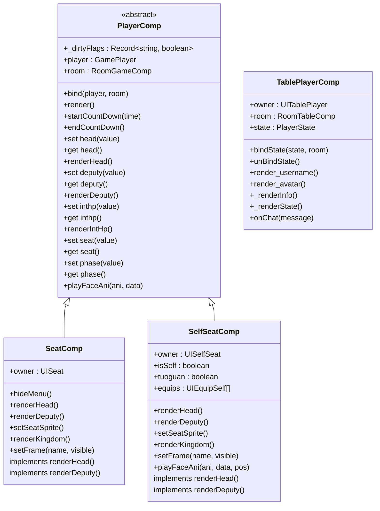
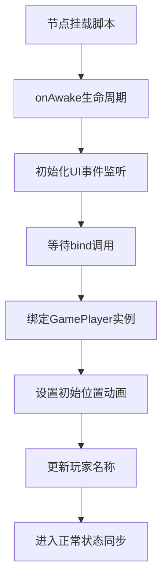

# 玩家组件

<cite>
**本文档引用的文件**  
- [PlayerComp.ts](file://client/src/comps/player/PlayerComp.ts)
- [SeatComp.ts](file://client/src/comps/player/SeatComp.ts)
- [SelfSeatComp.ts](file://client/src/comps/player/SelfSeatComp.ts)
- [TablePlayerComp.ts](file://client/src/comps/player/TablePlayerComp.ts)
</cite>

## 目录
1. [玩家组件概述](#玩家组件概述)  
2. [核心组件分析](#核心组件分析)  
   2.1 [PlayerComp：玩家状态管理核心](#playercomp玩家状态管理核心)  
   2.2 [SeatComp：普通座位组件](#seatcomp普通座位组件)  
   2.3 [SelfSeatComp：特殊座位组件](#selfseatcomp特殊座位组件)  
   2.4 [TablePlayerComp：游戏桌玩家展示](#tableplayercomp游戏桌玩家展示)  
3. [组件关系与架构图](#组件关系与架构图)  
4. [数据绑定与事件处理机制](#数据绑定与事件处理机制)  
5. [初始化流程与代码示例](#初始化流程与代码示例)  
6. [组件复用与扩展策略](#组件复用与扩展策略)

## 玩家组件概述

玩家组件是resgsv1客户端中用于管理游戏界面中玩家信息展示的核心模块。该系统采用组件化设计，通过分层架构实现玩家数据的动态更新、状态同步和UI渲染。组件体系主要由`PlayerComp`作为基类，派生出`SeatComp`（普通座位）、`SelfSeatComp`（自身座位）和`TablePlayerComp`（房间桌位）等具体实现，分别服务于不同场景下的玩家信息展示需求。

这些组件通过与`GamePlayer`模型数据绑定，实现了属性变更的自动响应和UI的脏检查更新机制，确保了高性能的界面渲染。同时，组件间职责清晰，支持多种游戏模式下的灵活配置。

**Section sources**  
- [PlayerComp.ts](file://client/src/comps/player/PlayerComp.ts#L1-L1056)

## 核心组件分析

### PlayerComp：玩家状态管理核心

`PlayerComp`是所有玩家组件的抽象基类，继承自Laya.Script，负责统一管理玩家的通用属性和状态同步逻辑。

#### 属性管理
该组件通过getter/setter模式封装了玩家的多个核心属性，包括：
- **身份与势力**：`role`（身份）、`kingdom`（势力）
- **武将信息**：`_head`（主将）、`_deputy`（副将）、`headOpen`（主将明置）
- **生命值系统**：`inthp`（当前体力）、`maxhp`（体力上限）、`shield`（护盾）
- **游戏状态**：`phase`（阶段）、`inturn`（回合内）、`death`（死亡状态）

所有属性变更均触发脏标记（dirtyFlags），用于后续的增量渲染优化。

#### 状态同步机制
组件通过`_dirtyFlags`对象实现脏检查机制，仅在特定属性变更时才重新渲染对应UI元素。例如：

```typescript
if (this._dirtyFlags.head) {
    this.renderHead();
    this._dirtyFlags.head = false;
}
```

这种设计避免了全量重绘，显著提升了性能。

#### UI更新机制
`render()`方法是UI更新的核心入口，根据脏标记调用相应的`renderXxx()`方法。例如`renderHpmax()`会根据体力上限动态生成血条图标，`renderIntHp()`则根据当前体力值更新血条颜色和显示状态。

此外，组件还实现了倒计时动画、技能特效播放（`playFaceAni`）等交互功能。

**Section sources**  
- [PlayerComp.ts](file://client/src/comps/player/PlayerComp.ts#L1-L1056)

### SeatComp：普通座位组件

`SeatComp`继承自`PlayerComp`，专用于非自身玩家的座位展示，其`owner`类型为`UISeat`。

#### 功能特性
- **菜单交互**：右键长按弹出操作菜单，支持举报、屏蔽、投掷道具等操作
- **信息查看**：点击玩家信息区域可查看详细资料
- **隐私保护**：对未明置的武将牌显示“主将/副将”占位符
- **势力显示**：根据`camp_mode`（阵营模式）切换身份或势力图标

#### 渲染逻辑
```typescript
public renderKingdom(): void {
    if (this.camp_mode === 'kingdom') {
        this.owner.kingdom.loadImage(`resources/room/texture/game/kingdom/${kingdom}.png`);
    } else {
        this.renderHead();
        this.renderDeputy();
    }
}
```

该组件还实现了装备栏更新（`setEquip`/`removeEquip`）和判定区管理（`setDelayedScroll`）等功能。

**Section sources**  
- [SeatComp.ts](file://client/src/comps/player/SeatComp.ts#L1-L173)

### SelfSeatComp：特殊座位组件

`SelfSeatComp`同样继承自`PlayerComp`，但针对玩家自身座位进行了特殊优化，`owner`类型为`UISelfSeat`。

#### 差异化处理
- **视觉样式**：使用独立的资源路径（如`self/${seat}.png`），提供更醒目的视觉反馈
- **装备管理**：维护`equips`数组，便于批量操作
- **技能特效定位**：重写`playFaceAni`方法，支持将特效绑定到主将或副将头像上
- **势力推断**：当势力为"none"时，根据武将势力自动推断显示（如"ye"野心家）

#### 特殊渲染
```typescript
public renderKingdom(): void {
    let kingdom = this.kingdom.includes('ye') ? 'ye' : this.kingdom;
    this.owner.kingdom.loadImage(`resources/room/texture/game/kingdom/${kingdom}.png`);
    // 同时更新主副将名称背景
    this.owner.general_head.namebg.loadImage(`resources/room/texture/game/name/${kingdom}.png`);
}
```

这种设计确保了自身座位的信息完整性和交互便捷性。

**Section sources**  
- [SelfSeatComp.ts](file://client/src/comps/player/SelfSeatComp.ts#L1-L127)

### TablePlayerComp：游戏桌玩家展示

`TablePlayerComp`独立于`PlayerComp`体系，用于房间准备界面的玩家列表展示，`owner`类型为`UITablePlayer`。

#### 数据绑定机制
该组件采用ES6 Proxy实现数据劫持，当`PlayerState`状态变更时自动触发对应`render_xxx`方法：

```typescript
const proxy = new Proxy(state, {
    set: (target, p, newValue, receiver) => {
        const ret = Reflect.set(target, p, newValue, receiver);
        if (Reflect.has(this, `render_${p.toString()}`)) {
            (this as any)[`render_${p.toString()}`]();
        }
        return ret;
    },
});
```

#### 功能实现
- **信息展示**：用户名、头像、胜率统计（`_renderInfo`）
- **状态标识**：房主、准备状态（`_renderState`）
- **踢人功能**：房主可点击按钮踢出其他玩家
- **聊天气泡**：支持接收并显示玩家聊天消息

此组件与游戏进行中的玩家组件分离，体现了关注点分离的设计原则。

**Section sources**  
- [TablePlayerComp.ts](file://client/src/comps/player/TablePlayerComp.ts#L1-L144)

## 组件关系与架构图



**Diagram sources**  
- [PlayerComp.ts](file://client/src/comps/player/PlayerComp.ts#L1-L1056)  
- [SeatComp.ts](file://client/src/comps/player/SeatComp.ts#L1-L173)  
- [SelfSeatComp.ts](file://client/src/comps/player/SelfSeatComp.ts#L1-L127)  
- [TablePlayerComp.ts](file://client/src/comps/player/TablePlayerComp.ts#L1-L144)

## 数据绑定与事件处理机制

玩家组件通过以下机制实现高效的数据同步：

1. **属性劫持**：使用getter/setter拦截属性访问，自动更新脏标记
2. **Proxy代理**：`TablePlayerComp`使用Proxy监听状态变化
3. **事件委托**：UI交互事件（如点击、长按）通过Laya事件系统委托给组件处理
4. **定时器管理**：使用`owner.timer`进行倒计时和动画控制

例如，倒计时功能通过`Laya.Tween`实现平滑动画：

```typescript
protected onCountDown() {
    this._time -= 1;
    Laya.Tween.create(this.owner.timebar)
        .duration(1000)
        .to('value', this._time / this._maxtime);
}
```

**Section sources**  
- [PlayerComp.ts](file://client/src/comps/player/PlayerComp.ts#L1-L1056)  
- [TablePlayerComp.ts](file://client/src/comps/player/TablePlayerComp.ts#L1-L144)

## 初始化流程与代码示例

### 组件初始化流程


### 代码示例：绑定玩家数据
```typescript
// 在RoomGameComp中绑定玩家
const comp = playerNode.getComponent(PlayerComp);
comp.bind(gamePlayer, this);
```

### 代码示例：更新玩家状态
```typescript
// 更新体力值
playerComp.inthp = 3;

// 开始倒计时
playerComp.startCountDown(30, '请出牌');

// 播放技能动画
playerComp.playFaceAni('huihe');
```

**Section sources**  
- [PlayerComp.ts](file://client/src/comps/player/PlayerComp.ts#L1-L1056)  
- [SeatComp.ts](file://client/src/comps/player/SeatComp.ts#L1-L173)

## 组件复用与扩展策略

玩家组件系统通过以下设计实现高度复用和灵活扩展：

1. **继承机制**：`SeatComp`和`SelfSeatComp`继承`PlayerComp`，共享基础功能
2. **抽象方法**：`renderHead()`、`renderDeputy()`等方法由子类实现，支持差异化渲染
3. **接口统一**：所有组件通过`setFrame()`等统一接口控制UI状态
4. **场景分离**：游戏进行中（PlayerComp体系）与房间准备（TablePlayerComp）使用不同组件
5. **配置驱动**：通过`camp_mode`等配置项动态调整显示模式

这种设计使得系统能够轻松支持国战、身份局等多种游戏模式，同时保持代码的可维护性和扩展性。

**Section sources**  
- [PlayerComp.ts](file://client/src/comps/player/PlayerComp.ts#L1-L1056)  
- [SeatComp.ts](file://client/src/comps/player/SeatComp.ts#L1-L173)  
- [SelfSeatComp.ts](file://client/src/comps/player/SelfSeatComp.ts#L1-L127)