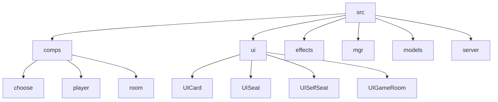
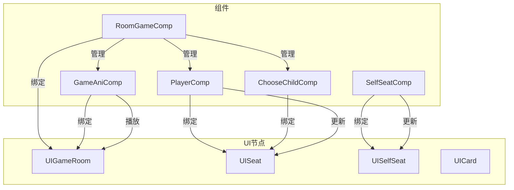
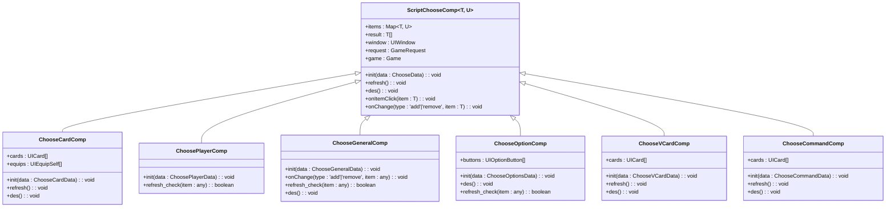
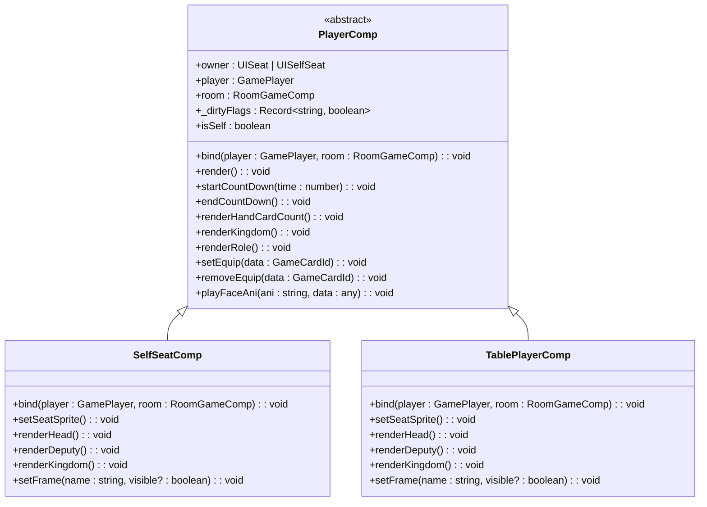
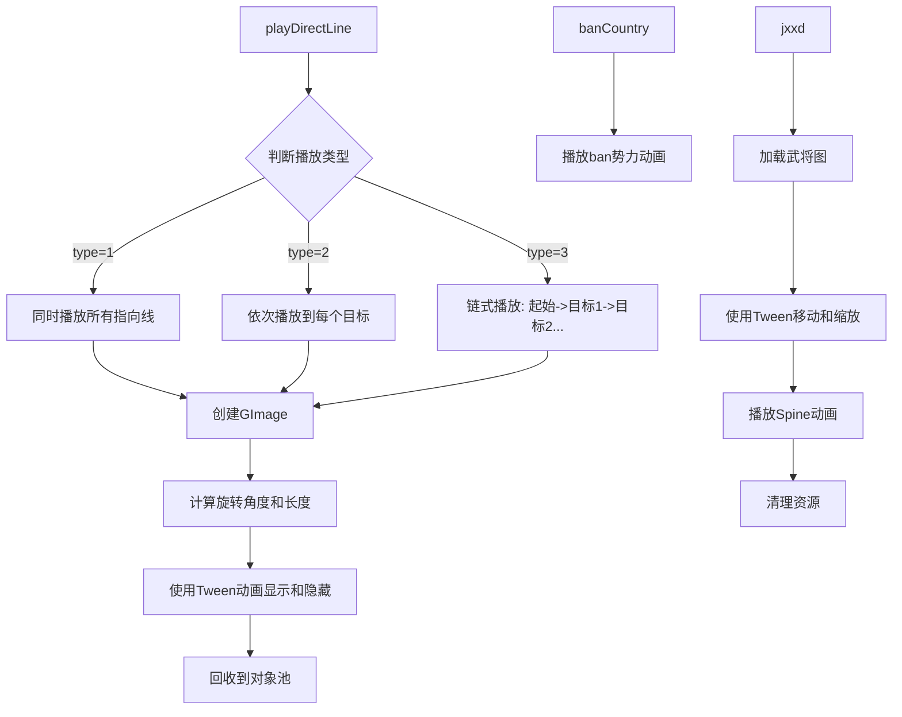
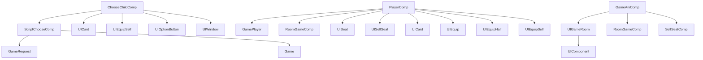

# 组件体系

<cite>
**本文档中引用的文件**  
- [ChooseChildComp.ts](file://client\src\comps\choose\ChooseChildComp.ts)
- [PlayerComp.ts](file://client\src\comps\player\PlayerComp.ts)
- [GameAniComp.ts](file://client\src\comps\room\GameAniComp.ts)
- [ScriptChooseComp.ts](file://client\src\comps\choose\ScriptChooseComp.ts)
- [RoomGameComp.ts](file://client\src\comps\room\RoomGameComp.ts)
- [UIChooseCards.ts](file://client\src\ui\UIChooseCards.ts)
- [UICard.ts](file://client\src\ui\UICard.ts)
- [UISelfSeat.ts](file://client\src\ui\UISelfSeat.ts)
- [UISeat.ts](file://client\src\ui\UISeat.ts)
- [UIGameRoom.ts](file://client\src\ui\UIGameRoom.ts)
</cite>

## 目录
1. [简介](#简介)
2. [项目结构](#项目结构)
3. [核心组件](#核心组件)
4. [架构概览](#架构概览)
5. [详细组件分析](#详细组件分析)
6. [依赖分析](#依赖分析)
7. [性能考量](#性能考量)
8. [故障排除指南](#故障排除指南)
9. [结论](#结论)

## 简介
本文档详细介绍了resgsv1客户端中基于LayaAir引擎的前端组件体系。重点分析了组件的层次结构、继承关系以及从基础UI组件到复合业务组件的构建模式。深入探讨了`ChooseChildComp`、`PlayerComp`和`GameAniComp`等核心组件的实现细节，包括其属性、方法和事件处理机制。同时，阐述了组件间的通信模式、生命周期管理，并通过代码示例展示了组件的注册、实例化和使用方式，旨在为开发者提供一套高效、可维护的组件化开发实践。

## 项目结构
resgsv1客户端项目采用模块化结构，主要分为`assets`、`src`、`bin`等目录。`src`目录是核心源码所在，其结构清晰，按功能划分：
- `comps`: 存放所有可复用的UI组件，如选择组件、玩家组件、房间组件等。
- `ui`: 存放由LayaAir IDE生成的UI界面类，如`UICard`、`UISeat`等。
- `effects`: 存放与动画效果相关的脚本。
- `mgr`: 存放管理器类，如资源管理、客户端连接管理。
- `models`: 存放数据模型。
- `server`: 存放与服务器通信相关的脚本。

这种结构使得代码职责分明，便于维护和扩展。

**图源**
- [project_structure](file://)

## 核心组件
前端组件体系的核心是基于LayaAir的`Laya.Script`构建的。所有组件都继承自`Laya.Script`或其子类，并通过`@regClass()`装饰器注册，使其能在LayaAir的节点系统中被实例化。组件通过`owner`属性绑定到特定的UI节点（如`Laya.Node`或其子类），从而实现对UI元素的控制。

组件体系遵循了清晰的分层设计：
1.  **基础组件层**: 如`PlayerComp`，提供对单个玩家UI元素的封装和控制。
2.  **复合业务组件层**: 如`GameAniComp`，负责协调多个基础组件，实现复杂的业务逻辑和动画效果。
3.  **交互选择组件层**: 如`ChooseChildComp`，专门处理游戏中的选择交互，是组件体系中最复杂的部分。

**组件源**
- [PlayerComp.ts](file://client\src\comps\player\PlayerComp.ts)
- [GameAniComp.ts](file://client\src\comps\room\GameAniComp.ts)
- [ChooseChildComp.ts](file://client\src\comps\choose\ChooseChildComp.ts)

## 架构概览
整个组件体系围绕`RoomGameComp`（房间游戏组件）构建。`RoomGameComp`是游戏主界面的控制器，它负责管理所有玩家的`PlayerComp`、处理游戏动画的`GameAniComp`以及各种选择交互的`ChooseChildComp`。

组件间的通信主要通过两种方式：
1.  **父-子组件通信**: 子组件通过`this.owner`访问其绑定的UI节点，父组件通过`owner.getComponent()`获取子组件实例，从而进行直接调用。
2.  **事件总线**: 使用LayaAir内置的事件系统（`Laya.Event`）进行跨组件通信。例如，当玩家状态改变时，`PlayerComp`会触发事件，其他监听该事件的组件可以做出响应。

**图源**
- [RoomGameComp.ts](file://client\src\comps\room\RoomGameComp.ts)
- [PlayerComp.ts](file://client\src\comps\player\PlayerComp.ts)
- [GameAniComp.ts](file://client\src\comps\room\GameAniComp.ts)

## 详细组件分析

### ChooseChildComp 分析
`ChooseChildComp`是处理游戏中所有选择操作的基类组件。它定义了一套标准的初始化、刷新和销毁流程，并通过泛型支持不同类型的选择（如选择卡牌、选择玩家、选择武将等）。

#### 类图

**图源**
- [ChooseChildComp.ts](file://client\src\comps\choose\ChooseChildComp.ts)

**组件源**
- [ChooseChildComp.ts](file://client\src\comps\choose\ChooseChildComp.ts)
- [UIChooseCards.ts](file://client\src\ui\UIChooseCards.ts)

#### 实现细节
*   **初始化 (`init`)**: 根据传入的`data`（如`ChooseCardData`）配置UI。例如，`ChooseCardComp`会遍历`data.selectable`中的卡牌ID，创建对应的`UICard`实例并添加到`owner.cards`容器中。
*   **事件处理**: 通过`onItemClick`方法处理用户的点击事件，将选中的项加入`result`数组，并触发`onChange`回调。
*   **刷新 (`refresh`)**: 在每次选择后调用，用于更新UI状态，如高亮已选卡牌。
*   **销毁 (`des`)**: 清理创建的临时UI元素（如动态创建的卡牌），并重置状态。

### PlayerComp 分析
`PlayerComp`是玩家UI的控制器，负责渲染和更新玩家的各种状态，如体力、身份、装备等。

#### 类图

**图源**
- [PlayerComp.ts](file://client\src\comps\player\PlayerComp.ts)

**组件源**
- [PlayerComp.ts](file://client\src\comps\player\PlayerComp.ts)
- [UISeat.ts](file://client\src\ui\UISeat.ts)
- [UISelfSeat.ts](file://client\src\ui\UISelfSeat.ts)

#### 实现细节
*   **脏检查机制**: 使用`_dirtyFlags`对象来标记需要更新的属性。`onUpdate`方法会检查这些标记，只重新渲染被标记为脏的部分，提高了性能。
*   **状态渲染**: 提供了`renderHandCardCount`、`renderKingdom`、`renderRole`等方法，将`GamePlayer`模型中的数据同步到UI上。
*   **装备管理**: `setEquip`和`removeEquip`方法用于动态添加和移除装备区的UI元素。
*   **动画播放**: `playFaceAni`方法用于播放各种面部动画（如“回合”、“技能”等），增强游戏表现力。

### GameAniComp 分析
`GameAniComp`是游戏动画的专用组件，负责播放各种视觉效果，如指向线、势力禁用动画、觉醒动画等。

#### 流程图

**图源**
- [GameAniComp.ts](file://client\src\comps\room\GameAniComp.ts)

**组件源**
- [GameAniComp.ts](file://client\src\comps\room\GameAniComp.ts)
- [UIGameRoom.ts](file://client\src\ui\UIGameRoom.ts)

#### 实现细节
*   **指向线动画**: `playDirectLine`方法通过创建`Laya.GImage`并使用`Laya.Tween`实现平滑的指向线动画。它支持三种播放模式，满足不同场景需求。
*   **对象池**: 使用`S.ui.getObjectFromPool`和`S.ui.retObjectFromPool`来管理`GImage`对象，避免频繁创建和销毁，优化性能。
*   **复杂动画**: `jxxd`方法结合了`Laya.Tween`和`Spine2D`动画，实现了武将觉醒/限定技的复杂视觉效果。

## 依赖分析
组件体系的依赖关系清晰，遵循了低耦合、高内聚的原则。

**图源**
- [ChooseChildComp.ts](file://client\src\comps\choose\ChooseChildComp.ts)
- [PlayerComp.ts](file://client\src\comps\player\PlayerComp.ts)
- [GameAniComp.ts](file://client\src\comps\room\GameAniComp.ts)

**组件源**
- [ChooseChildComp.ts](file://client\src\comps\choose\ChooseChildComp.ts)
- [PlayerComp.ts](file://client\src\comps\player\PlayerComp.ts)
- [GameAniComp.ts](file://client\src\comps\room\GameAniComp.ts)

## 性能考量
该组件体系在性能方面做了多项优化：
1.  **脏检查**: `PlayerComp`使用`_dirtyFlags`避免了不必要的UI重绘。
2.  **对象池**: `GameAniComp`在播放指向线时使用对象池，减少了GC压力。
3.  **懒加载**: 动态创建的UI元素（如选择时的卡牌）在不需要时会被销毁，释放内存。
4.  **事件解绑**: 在组件销毁时（`des`方法），会主动解绑事件监听器，防止内存泄漏。

## 故障排除指南
*   **问题**: 选择组件无法正常工作。
  *   **检查**: 确认`ChooseChildComp`的`owner`是否正确绑定到了UI节点，并且传入的`data`数据结构是否符合预期。
*   **问题**: 玩家状态未更新。
  *   **检查**: 确认`PlayerComp`的`_dirtyFlags`是否被正确设置，并且`onUpdate`方法是否被调用。
*   **问题**: 动画无法播放或资源丢失。
  *   **检查**: 确认资源路径是否正确，Spine动画资源是否已正确加载。

**组件源**
- [PlayerComp.ts](file://client\src\comps\player\PlayerComp.ts)
- [GameAniComp.ts](file://client\src\comps\room\GameAniComp.ts)

## 结论
resgsv1客户端的组件体系设计精良，通过继承和组合的方式，构建了一个灵活、可扩展的前端架构。`ChooseChildComp`、`PlayerComp`和`GameAniComp`等核心组件各司其职，共同支撑了游戏的交互和表现。该体系不仅提高了代码的复用性和可维护性，也为实现复杂的游戏逻辑提供了坚实的基础。遵循此文档中的最佳实践，可以有效提升开发效率和产品质量。