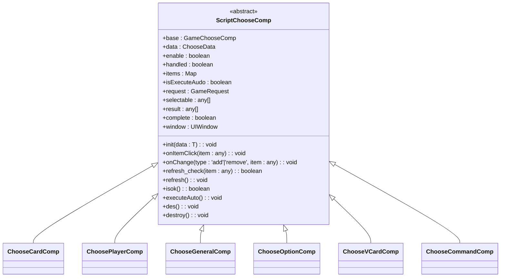
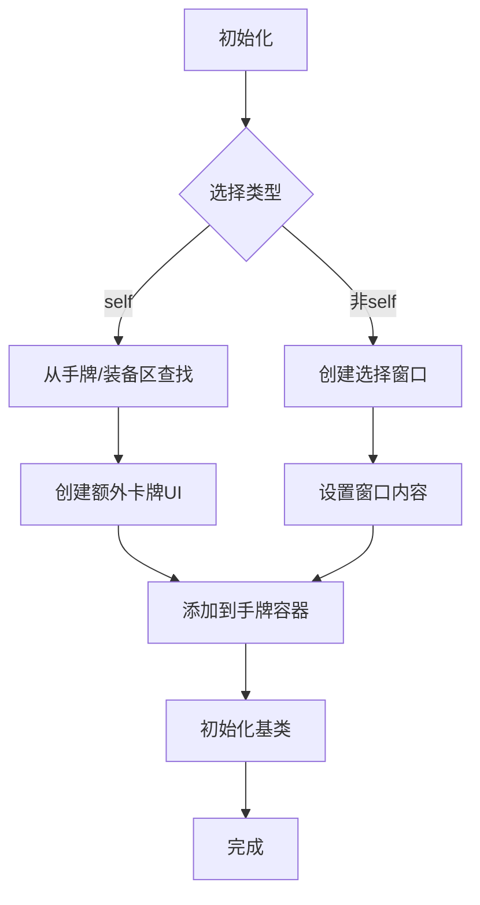
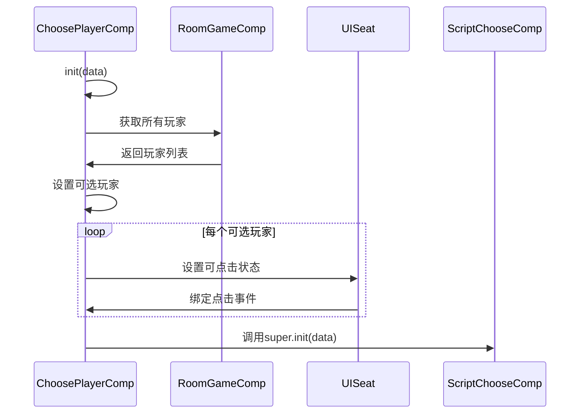
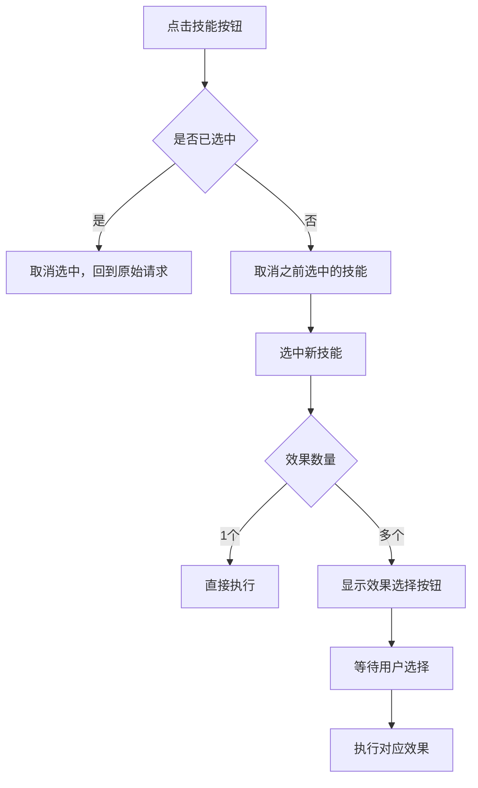

# 选择组件

<cite>
**本文档引用的文件**  
- [ChooseChildComp.ts](file://client/src/comps/choose/ChooseChildComp.ts)
- [ChooseItemComp.ts](file://client/src/comps/ChooseItemComp.ts)
- [GameChooseComp.ts](file://client/src/comps/choose/GameChooseComp.ts)
- [ScriptChooseComp.ts](file://client/src/comps/choose/ScriptChooseComp.ts)
</cite>

## 目录
1. [介绍](#介绍)
2. [核心组件概览](#核心组件概览)
3. [选择项基础组件分析](#选择项基础组件分析)
4. [选择逻辑管理组件分析](#选择逻辑管理组件分析)
5. [具体选择子组件实现](#具体选择子组件实现)
6. [脚本驱动选择组件](#脚本驱动选择组件)
7. [组件交互与状态管理](#组件交互与状态管理)
8. [可扩展性设计](#可扩展性设计)
9. [使用示例与配置方法](#使用示例与配置方法)
10. [总结](#总结)

## 介绍
本文档深入分析resgsv1客户端中选择功能的组件实现。重点介绍`ChooseChildComp`和`ChooseItemComp`的结构设计，解释它们在游戏选择界面中的角色和交互逻辑。详细说明`GameChooseComp`如何管理选择流程，包括状态管理和用户交互处理。阐述`ScriptChooseComp`在脚本驱动选择中的应用，以及如何通过事件机制实现选择结果的传递。提供实际代码示例展示选择组件的配置和使用方法，包括如何自定义选择项和处理选择回调。讨论选择组件的可扩展性设计，以及如何适应不同类型的游戏选择需求。

## 核心组件概览
选择组件系统由多个核心类构成，形成一个完整的层次结构：

- **ChooseItemComp**: 选择项的基础交互组件，负责处理点击、选中状态和可点击性
- **ScriptChooseComp**: 所有选择组件的抽象基类，提供通用的选择逻辑和生命周期管理
- **GameChooseComp**: 选择流程的主控制器，协调多个选择子组件的执行顺序和状态
- **ChooseChildComp**: 包含多种具体选择类型的实现，如卡牌、武将、玩家等选择

这些组件共同构成了一个灵活且可扩展的选择系统，能够满足游戏中各种复杂的选择场景需求。

## 选择项基础组件分析

### ChooseItemComp 结构与功能
`ChooseItemComp`是所有可选择UI元素的基础组件，它封装了选择项的通用交互行为。

```mermaid
classDiagram
class ChooseItemComp {
-_selected : boolean
-_canClick : boolean
+selected : boolean
+canClick : boolean
+clickFunc : Function
+longClickFunc : Function
+setSelected(value : boolean, show : boolean)
+setCanClick(value : boolean)
+onClick(func : Function)
+onLongClick(func : Function)
}
ChooseItemComp : owner : Laya.Sprite
ChooseItemComp : clickNode : Laya.GWidget
ChooseItemComp : selectedImage : Laya.GWidget[]
ChooseItemComp : canClickMask : Laya.GWidget
ChooseItemComp : isButton : boolean
```

**图示来源**  
- [ChooseItemComp.ts](file://client/src/comps/ChooseItemComp.ts#L1-L93)

**中文功能说明**：
- **selected**: 获取或设置选择项的选中状态，通过`setSelected`方法控制视觉反馈
- **canClick**: 获取或设置选择项的可点击状态，通过`setCanClick`方法控制交互能力
- **onClick**: 绑定点击事件处理器，确保在可点击状态下才触发回调
- **onLongClick**: 绑定长按事件处理器，包含500ms的长按检测逻辑
- **setSelected**: 设置选中状态并控制选中图像的显示/隐藏
- **setCanClick**: 设置可点击状态并控制遮罩层的显示/隐藏

该组件通过`clickNode`属性定义响应点击的区域，`selectedImage`数组定义选中时显示的视觉元素，`canClickMask`定义不可点击时的遮罩层。这种设计使得任何UI元素都可以轻松地添加选择功能。

**本节来源**  
- [ChooseItemComp.ts](file://client/src/comps/ChooseItemComp.ts#L1-L93)

## 选择逻辑管理组件分析

### ScriptChooseComp 抽象基类
`ScriptChooseComp`是所有具体选择组件的抽象基类，提供了统一的选择逻辑框架。



**图示来源**  
- [ScriptChooseComp.ts](file://client/src/comps/choose/ScriptChooseComp.ts#L1-L287)

**核心属性说明**：
- **base**: 指向`GameChooseComp`实例，建立与主控制器的连接
- **data**: 当前选择的数据配置，包含可选项、计数限制等信息
- **items**: 映射可选项与其对应UI组件的Map结构
- **result**: 存储当前已选择项的数组
- **enable**: 控制当前选择组件是否激活
- **window**: 关联的选择窗口UI组件

**核心方法说明**：
- **init**: 初始化选择组件，设置数据、绑定事件、创建UI元素
- **onItemClick**: 处理点击事件，实现选中/取消选中的切换逻辑
- **refresh**: 刷新UI状态，根据当前enable状态和选择条件更新可点击性
- **isok**: 判断选择是否满足完成条件（数量要求、自定义验证等）
- **executeAuto**: 执行自动选择逻辑，用于AI或超时自动处理

该抽象类通过泛型参数`T extends ChooseData`和`ItemUI extends { item: ChooseItemComp }`实现了类型安全，确保具体实现类能够正确处理特定类型的选择数据和UI组件。

**本节来源**  
- [ScriptChooseComp.ts](file://client/src/comps/choose/ScriptChooseComp.ts#L1-L287)

## 具体选择子组件实现

### ChooseCardComp 卡牌选择组件
`ChooseCardComp`负责处理卡牌选择逻辑，支持从手牌区、装备区或额外创建的卡牌中进行选择。



**图示来源**  
- [ChooseChildComp.ts](file://client/src/comps/choose/ChooseChildComp.ts#L1-L569)

**主要功能**：
- 支持多种选择来源：手牌区、装备区、场上卡牌或新创建的卡牌
- 特殊处理重铸卡牌，在出牌阶段允许直接点击选择
- 管理额外创建的卡牌UI，确保在组件销毁时正确清理
- 在刷新时正确处理选中状态的显示逻辑

**本节来源**  
- [ChooseChildComp.ts](file://client/src/comps/choose/ChooseChildComp.ts#L1-L569)

### ChoosePlayerComp 玩家选择组件
`ChoosePlayerComp`处理玩家选择逻辑，通常用于技能目标选择。



**图示来源**  
- [ChooseChildComp.ts](file://client/src/comps/choose/ChooseChildComp.ts#L1-L569)

**主要特点**：
- 自动过滤死亡玩家（默认行为）
- 统一管理所有玩家座位的可点击状态
- 继承基类的通用选择逻辑，只需关注初始化过程

**本节来源**  
- [ChooseChildComp.ts](file://client/src/comps/choose/ChooseChildComp.ts#L1-L569)

### ChooseGeneralComp 武将选择组件
`ChooseGeneralComp`处理武将选择逻辑，支持多种选择界面形式。

**主要功能**：
- 支持直接创建武将卡牌UI进行选择
- 支持通过窗口组件进行选择，包括双将选择、单将选择等模式
- 提供`onChange`方法与窗口组件通信，实现选择状态同步
- 在销毁时清理创建的所有武将卡牌UI

**本节来源**  
- [ChooseChildComp.ts](file://client/src/comps/choose/ChooseChildComp.ts#L1-L569)

### ChooseOptionComp 选项选择组件
`ChooseOptionComp`处理文本选项选择，通常用于技能效果选择。

**主要特点**：
- 动态创建选项按钮UI
- 支持翻译选项文本
- 特殊处理以"!"开头的选项（表示不可直接点击）
- 管理取消按钮的显示和事件绑定

**本节来源**  
- [ChooseChildComp.ts](file://client/src/comps/choose/ChooseChildComp.ts#L1-L569)

## 脚本驱动选择组件

### GameChooseComp 主控制器
`GameChooseComp`是选择流程的主控制器，负责协调整个选择过程。

```mermaid
classDiagram
class GameChooseComp {
+game : RoomGameComp
+originalRequest : GameRequest
+request : GameRequest
+childs : { [key : string] : ScriptChooseComp }
+start(request : GameRequest) : void
+end() : void
+next() : void
+addComponent(key : string, data : ChooseData) : ScriptChooseComp
+clearAllChild() : void
+onConfirmClick() : void
+onCancleClick() : void
+onRecastClick() : void
+onEndClick() : void
+onSkillButtonClick(ui : UISkillButton|UIEquipSelf|UICard, handles : string[], reqs : GameRequest[]) : void
}
GameChooseComp : owner : UIGameRoom
GameChooseComp : skill_ui : UISkillButton|UIEquipSelf|UICard
```

**图示来源**  
- [GameChooseComp.ts](file://client/src/comps/choose/GameChooseComp.ts#L1-L656)

**核心功能分析**：

#### 选择流程管理
`GameChooseComp`通过`next()`方法实现选择流程的推进，该方法具有以下特点：

- **排序执行**: 按照`step`属性对选择组件进行排序，确保按正确顺序执行
- **依赖控制**: 后续选择组件的启用状态依赖于前一个组件是否完成
- **状态同步**: 统一计算确认、取消、重铸等按钮的状态，减少UI重绘
- **自动确认**: 当所有选择完成且确认按钮不可见时，自动触发确认逻辑

#### 技能交互处理
`onSkillButtonClick`方法处理技能按钮点击，实现复杂的技能发动逻辑：



**本节来源**  
- [GameChooseComp.ts](file://client/src/comps/choose/GameChooseComp.ts#L1-L656)

## 组件交互与状态管理

### 数据流与事件机制
选择组件系统通过精心设计的数据流和事件机制实现组件间的通信：

- **数据流**: `GameRequest`对象贯穿整个选择过程，包含所有选择数据和结果
- **事件流**: 通过`onChange`回调和`next()`方法实现状态更新的传播
- **状态同步**: 所有UI状态的更新都集中在`next()`方法中批量处理

### 生命周期管理
各组件的生命周期紧密配合：

1. **初始化**: `GameChooseComp.start()` → `addComponent()` → `ScriptChooseComp.init()`
2. **运行时**: `GameChooseComp.next()` → `ScriptChooseComp.refresh()` → 用户交互 → `onItemClick()`
3. **结束**: `onConfirmClick()` → `game.response()` → `GameChooseComp.end()` → `ScriptChooseComp.des()`

这种设计确保了资源的正确分配和释放，避免了内存泄漏。

**本节来源**  
- [GameChooseComp.ts](file://client/src/comps/choose/GameChooseComp.ts#L1-L656)
- [ScriptChooseComp.ts](file://client/src/comps/choose/ScriptChooseComp.ts#L1-L287)

## 可扩展性设计

### 泛型与继承架构
选择组件系统采用泛型和继承的组合设计，提供了良好的可扩展性：

- **泛型参数**: `ScriptChooseComp<T extends ChooseData, ItemUI extends { item: ChooseItemComp }>`允许类型安全的定制
- **抽象基类**: 提供通用逻辑，减少重复代码
- **具体实现**: 通过继承实现特定类型的选择逻辑

### 配置驱动设计
系统采用配置驱动的方式，通过`ChooseData`接口定义选择行为：

```typescript
interface ChooseData {
    type: string;
    selectable: any[];
    count: number | [number, number];
    filter?: (item: any, result: any[]) => boolean;
    canConfirm?: (result: any[]) => boolean;
    auto?: boolean;
    auto_func?: () => void;
    onChange?: (type: string, item: any, result: any[]) => void;
}
```

这种设计使得新的选择类型可以通过配置而非编码实现，大大提高了系统的灵活性。

**本节来源**  
- [ScriptChooseComp.ts](file://client/src/comps/choose/ScriptChooseComp.ts#L1-L287)
- [GameChooseComp.ts](file://client/src/comps/choose/GameChooseComp.ts#L1-L656)

## 使用示例与配置方法

### 基本使用模式
```typescript
// 创建选择请求
const request: GameRequest = {
    id: "choose_card",
    player: currentPlayer,
    room: gameRoom,
    selectors: {
        card: {
            type: "card",
            selectable: handCards,
            count: 1,
            filter: (card, result) => card.canUse(),
            canConfirm: (result) => result.length > 0
        }
    },
    options: {
        prompt: "请选择一张牌",
        isPlayPhase: true,
        canCancle: true
    }
};

// 启动选择流程
gameChooseComp.start(request);
```

### 自定义选择逻辑
```typescript
// 自定义过滤函数
const customFilter = (card, result) => {
    return card.type === CardType.Basic && card.canUse();
};

// 自定义确认条件
const customCanConfirm = (result) => {
    return result.length === 2 && result[0].value + result[1].value >= 10;
};

// 配置选择数据
const chooseData: ChooseCardData = {
    type: "card",
    selectable: cards,
    count: [1, 2],
    filter: customFilter,
    canConfirm: customCanConfirm,
    onChange: (type, item, result) => {
        console.log(`${type}: ${item}, result length: ${result.length}`);
    }
};
```

### 处理选择结果
```typescript
// 在response回调中处理结果
game.response = (request) => {
    if (request.result.cancle) {
        // 处理取消选择
        return;
    }
    
    if (request.result.selected_skill) {
        // 处理技能选择
        executeSkill(request.result.selected_skill);
    }
    
    if (request.result.use_or_play_card) {
        // 处理卡牌使用
        useCard(request.result.use_or_play_card);
    }
    
    // 处理具体选择结果
    const cardResult = request.selectors.card?.result;
    if (cardResult) {
        processSelectedCards(cardResult);
    }
};
```

**本节来源**  
- [GameChooseComp.ts](file://client/src/comps/choose/GameChooseComp.ts#L1-L656)
- [ScriptChooseComp.ts](file://client/src/comps/choose/ScriptChooseComp.ts#L1-L287)

## 总结
resgsv1客户端的选择组件系统是一个设计精良、结构清晰的UI交互框架。通过`ChooseItemComp`、`ScriptChooseComp`、`GameChooseComp`等组件的协同工作，实现了灵活且可扩展的选择功能。

系统的主要优势包括：
- **模块化设计**: 各组件职责分明，易于维护和扩展
- **类型安全**: 通过泛型确保类型正确性
- **配置驱动**: 大部分行为可通过配置而非编码实现
- **性能优化**: 批量更新UI状态，减少重绘
- **完整生命周期**: 确保资源的正确管理

该系统不仅满足了当前游戏的各种选择需求，还为未来的新功能提供了良好的扩展基础。通过理解其设计原理和使用方法，开发者可以高效地实现各种复杂的选择交互场景。