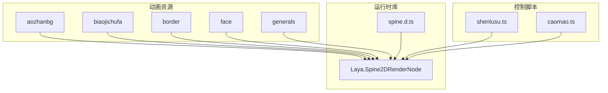
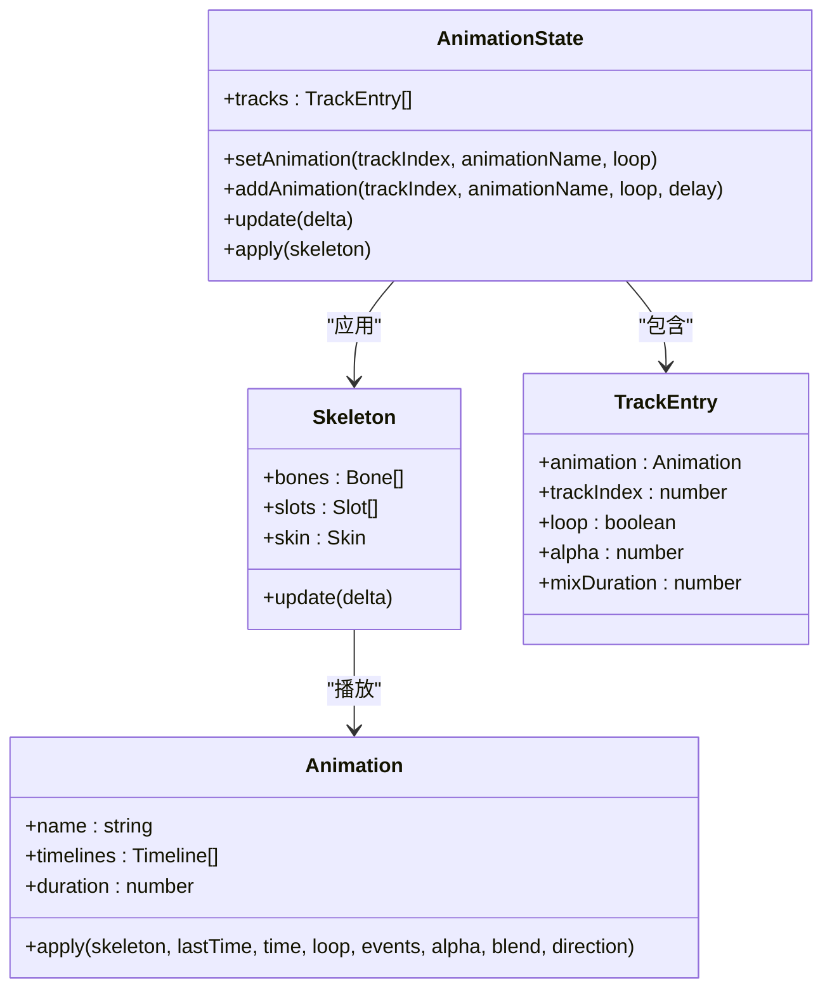
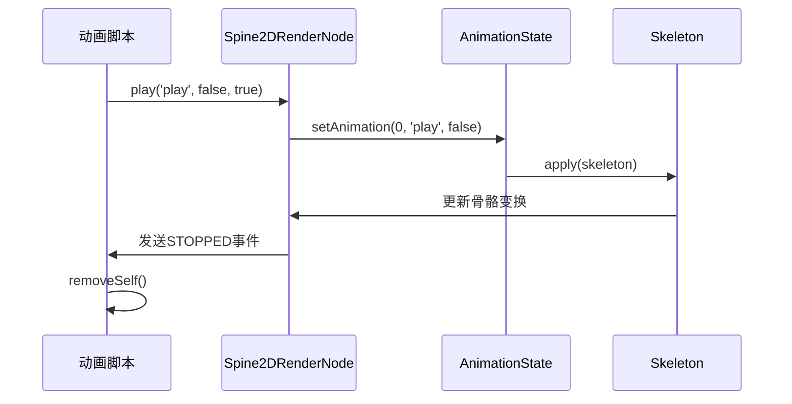
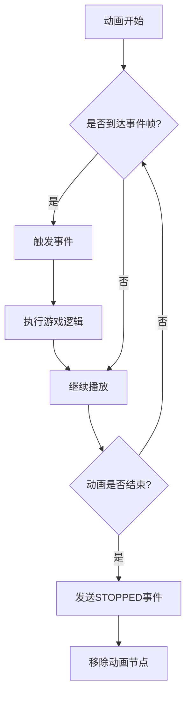
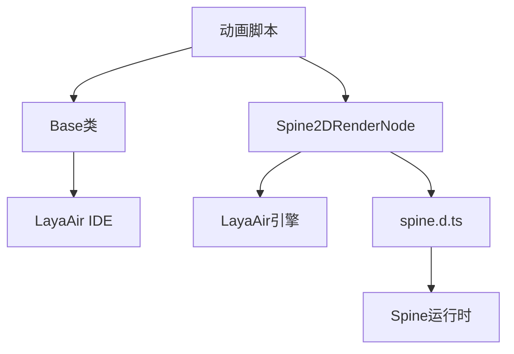

# 动画系统

<cite>
**本文档中引用的文件**   
- [spine.d.ts](file://client/engine/types/spine.d.ts)
- [shenlusu.ts](file://client/src/effects/shenlusu.ts)
- [shenlusu.generated.ts](file://client/src/effects/shenlusu.generated.ts)
- [caomao.ts](file://client/src/effects/caomao.ts)
- [caomao.generated.ts](file://client/src/effects/caomao.generated.ts)
- [aozhan_huo.json](file://client/assets/animation/aozhanbg/aozhan_huo.json)
- [numChange.json](file://client/assets/animation/biaojichufa/numChange.json)
- [qy_tx_jinengfadong.json](file://client/assets/animation/border/qy_tx_jinengfadong.json)
</cite>

## 目录
1. [简介](#简介)
2. [项目结构](#项目结构)
3. [核心组件](#核心组件)
4. [架构概述](#架构概述)
5. [详细组件分析](#详细组件分析)
6. [依赖分析](#依赖分析)
7. [性能考虑](#性能考虑)
8. [故障排除指南](#故障排除指南)
9. [结论](#结论)

## 简介
本文档详细介绍了resgsv1客户端中基于Spine的动画系统。该系统负责管理游戏中的各种动画资源，包括角色技能、界面特效和背景动画等。文档将深入探讨动画资源的组织结构、加载机制、播放控制以及事件处理等关键方面。

## 项目结构
动画系统主要由三部分组成：动画资源文件、Spine运行时库和动画播放控制脚本。动画资源存储在`client/assets/animation`目录下，按功能分类组织。Spine运行时类型定义位于`client/engine/types/spine.d.ts`，提供了完整的类型支持。动画播放逻辑实现在`client/src/effects`目录下的TypeScript文件中。

**图示来源**
- [spine.d.ts](file://client/engine/types/spine.d.ts)
- [shenlusu.ts](file://client/src/effects/shenlusu.ts)
- [caomao.ts](file://client/src/effects/caomao.ts)
- [aozhan_huo.json](file://client/assets/animation/aozhanbg/aozhan_huo.json)

**节来源**
- [spine.d.ts](file://client/engine/types/spine.d.ts)
- [client/assets/animation](file://client/assets/animation)

## 核心组件
动画系统的核心组件包括骨骼（Bone）、插槽（Slot）、皮肤（Skin）和动画序列（Animation）。每个动画资源都是一个JSON格式的文件，包含了完整的骨骼结构、动画数据和纹理信息。`AnimationState`类负责管理动画的播放状态，支持多个动画轨道的混合播放。

**节来源**
- [spine.d.ts](file://client/engine/types/spine.d.ts#L96-L146)
- [spine.d.ts](file://client/engine/types/spine.d.ts#L417-L446)

## 架构概述
动画系统的架构基于Spine 2D骨骼动画框架，采用数据驱动的设计模式。动画资源在编辑器中创建后导出为JSON格式，运行时通过LayaAir引擎的Spine2DRenderNode组件进行渲染。动画控制脚本封装了播放、暂停、循环等基本操作。

**图示来源**
- [spine.d.ts](file://client/engine/types/spine.d.ts#L96-L146)
- [spine.d.ts](file://client/engine/types/spine.d.ts#L417-L446)

## 详细组件分析

### 动画播放控制分析
动画播放控制通过封装Spine2DRenderNode组件实现。每个动画效果都有对应的TypeScript类，继承自自动生成的Base类。播放时调用play方法，指定动画名称、是否循环和是否从头开始。

**图示来源**
- [shenlusu.ts](file://client/src/effects/shenlusu.ts#L1-L12)
- [caomao.ts](file://client/src/effects/caomao.ts#L1-L12)

#### 动画事件处理
动画系统支持在关键帧触发自定义事件。通过EventTimeline可以在动画的特定时间点发送事件，游戏逻辑可以监听这些事件来执行相应的操作，如播放音效、触发技能效果等。

**图示来源**
- [spine.d.ts](file://client/engine/types/spine.d.ts#L563-L602)
- [shenlusu.ts](file://client/src/effects/shenlusu.ts#L6-L8)

**节来源**
- [shenlusu.ts](file://client/src/effects/shenlusu.ts#L1-L12)
- [caomao.ts](file://client/src/effects/caomao.ts#L1-L12)

### JSON动画文件结构
JSON格式的动画文件包含了完整的动画数据，主要由以下部分组成：
- **skeleton**: 骨骼系统的基本信息
- **bones**: 骨骼层级结构
- **slots**: 插槽定义
- **skins**: 皮肤数据
- **animations**: 动画序列集合

以aozhan_huo.json为例，其结构包含火焰特效的骨骼动画数据，通过AttachmentTimeline控制纹理附件的切换。

**节来源**
- [aozhan_huo.json](file://client/assets/animation/aozhanbg/aozhan_huo.json)
- [numChange.json](file://client/assets/animation/biaojichufa/numChange.json)

## 依赖分析
动画系统依赖于LayaAir引擎的Spine2D渲染组件和TypeScript类型定义。各动画效果脚本依赖于自动生成的Base类，确保与LayaAir IDE的同步。

**图示来源**
- [spine.d.ts](file://client/engine/types/spine.d.ts)
- [shenlusu.generated.ts](file://client/src/effects/shenlusu.generated.ts)
- [caomao.generated.ts](file://client/src/effects/caomao.generated.ts)

**节来源**
- [spine.d.ts](file://client/engine/types/spine.d.ts)
- [shenlusu.generated.ts](file://client/src/effects/shenlusu.generated.ts#L1-L9)

## 性能考虑
动画系统在性能方面进行了多项优化：
1. 使用对象池（Pool）管理TrackEntry，减少内存分配
2. 支持动画混合时长配置，实现平滑过渡
3. 提供LOD（细节层次）控制，可根据性能需求调整动画质量
4. 支持动画资源的预加载和按需加载

通过AnimationStateData可以设置不同动画之间的混合时长，避免突兀的动画切换。

## 故障排除指南
常见问题及解决方案：
- **动画不播放**：检查JSON文件路径是否正确，确保资源已正确导入
- **纹理缺失**：确认纹理图集文件存在且路径正确
- **事件未触发**：检查EventTimeline是否正确配置，事件监听器是否注册
- **内存泄漏**：确保动画结束后调用removeSelf()方法清理资源

**节来源**
- [shenlusu.ts](file://client/src/effects/shenlusu.ts#L7-L8)
- [caomao.ts](file://client/src/effects/caomao.ts#L7-L8)

## 结论
resgsv1客户端的动画系统基于Spine框架构建，提供了强大的2D骨骼动画功能。系统设计合理，易于扩展，支持复杂的动画效果和事件交互。通过合理的资源管理和性能优化，能够在各种设备上流畅运行。