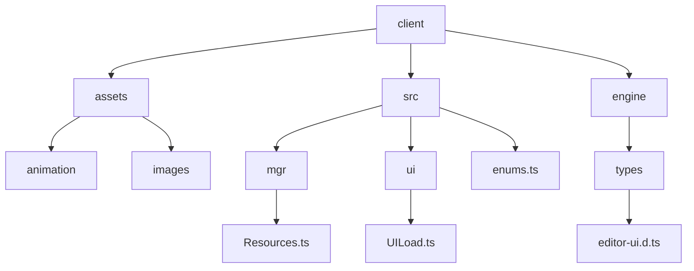
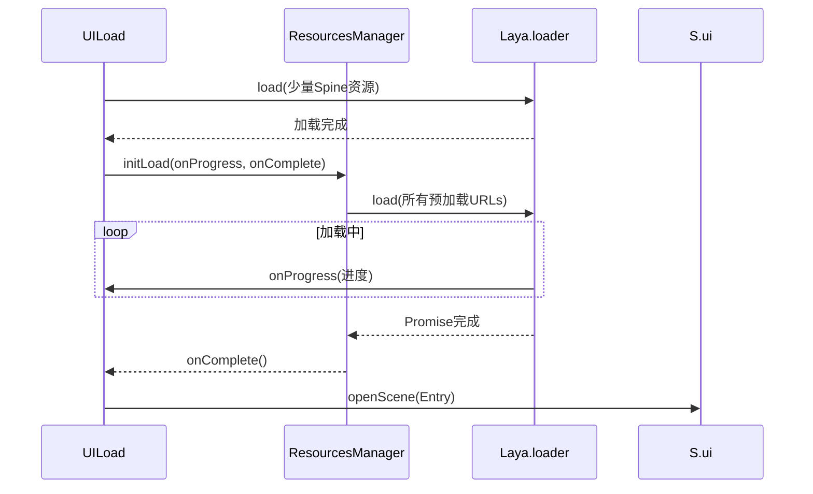
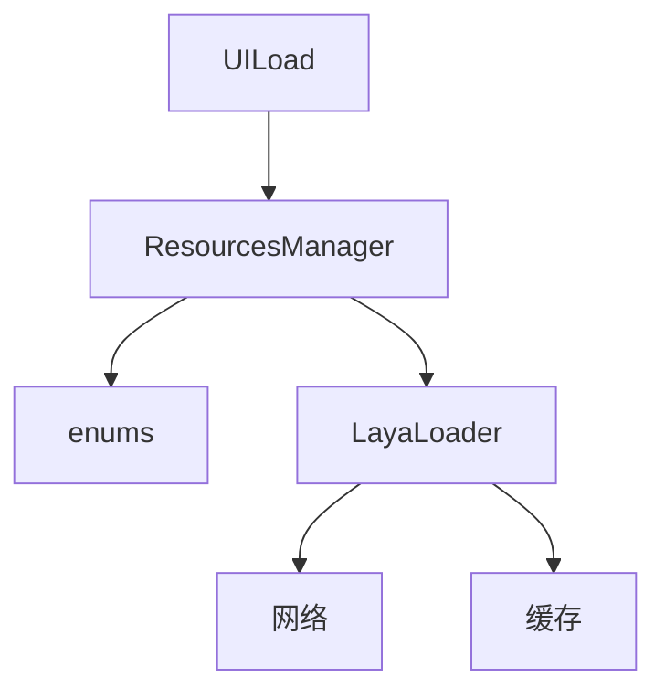

# 资源加载策略

<cite>
**本文档中引用的文件**  
- [Resources.ts](file://client/src/mgr/Resources.ts)
- [enums.ts](file://client/src/enums.ts)
- [UILoad.ts](file://client/src/ui/UILoad.ts)
- [editor-ui.d.ts](file://client/engine/types/editor-ui.d.ts)
</cite>

## 目录
1. [简介](#简介)
2. [项目结构](#项目结构)
3. [核心组件](#核心组件)
4. [架构概述](#架构概述)
5. [详细组件分析](#详细组件分析)
6. [依赖分析](#依赖分析)
7. [性能考虑](#性能考虑)
8. [故障排除指南](#故障排除指南)
9. [结论](#结论)

## 简介
本文档深入分析resgsv1客户端中资源加载机制的实现，重点围绕`ResourcesManager`类展开。文档详细阐述了预加载、按需加载和懒加载三种策略的实现方式与适用场景，解析了资源加载队列管理、并发控制和优先级调度的核心机制。同时，对资源缓存策略、内存管理、引用计数以及完整的加载生命周期进行了全面说明。通过实际代码示例，展示了如何高效地加载JSON、图片、音频等不同类型的资源，并探讨了加载性能优化技巧和错误处理机制。

## 项目结构
项目采用典型的分层结构，前端资源主要存放在`client`目录下。`assets`目录存放动画、图片等原始资源，`src`目录包含核心源代码。`mgr`目录下的`Resources.ts`是资源管理的核心文件，`enums.ts`定义了资源路径的枚举。`ui`目录包含UI相关的脚本，如`UILoad.ts`负责加载界面的逻辑。`engine/types`目录提供了Laya引擎的类型定义，是理解底层加载机制的关键。



**图示来源**
- [Resources.ts](file://client/src/mgr/Resources.ts)
- [UILoad.ts](file://client/src/ui/UILoad.ts)
- [enums.ts](file://client/src/enums.ts)

**章节来源**
- [Resources.ts](file://client/src/mgr/Resources.ts)
- [enums.ts](file://client/src/enums.ts)

## 核心组件
`ResourcesManager`类是整个资源加载系统的核心，它是一个单例模式的管理器，负责协调所有资源的加载、缓存和释放。该类通过`initLoad`方法启动预加载流程，加载`pres`、`prefabs`和`scenes`三类关键资源。`UILoad`类则作为加载界面的控制器，负责调用`ResourcesManager`并更新加载进度。

**章节来源**
- [Resources.ts](file://client/src/mgr/Resources.ts#L1-L29)
- [UILoad.ts](file://client/src/ui/UILoad.ts#L1-L38)

## 架构概述
资源加载系统基于Laya引擎的`ResourceManager`实现，`ResourcesManager`作为上层业务逻辑的封装，简化了资源加载的调用。`UILoad`在游戏启动时首先加载少量Spine动画资源，然后调用`ResourcesManager`的`initLoad`方法，开始批量加载核心资源。加载完成后，自动跳转到主界面。



**图示来源**
- [Resources.ts](file://client/src/mgr/Resources.ts#L15-L29)
- [UILoad.ts](file://client/src/ui/UILoad.ts#L10-L38)
- [editor-ui.d.ts](file://client/engine/types/editor-ui.d.ts#L386-L406)

## 详细组件分析

### ResourcesManager 分析
`ResourcesManager`类实现了单例模式，确保全局只有一个实例。其`initLoad`方法是预加载的入口，它从`enums.ts`中定义的`res`对象聚合了`pres`、`prefabs`和`scenes`三类资源的URL列表，然后通过`Laya.loader.load`方法进行批量加载。

```typescript
// Resources.ts
initLoad(onProgress: (progress: number) => void, onComplete: () => void) {
    const urls = [
        ...res.pres,
        ...res.prefabs,
        ...res.scenes,
    ];
    Laya.loader.load(urls, null, onProgress).then(() => {
        onComplete();
    });
}
```

**图示来源**
- [Resources.ts](file://client/src/mgr/Resources.ts#L15-L29)

### UILoad 分析
`UILoad`类是加载界面的逻辑控制器。在`onAwake`生命周期中，它首先加载两个关键的Spine动画（曹操背景和形象），以确保加载界面的动画效果能立即播放。随后，它调用`S.res.initLoad`（即`ResourcesManager`的实例）开始主资源的加载，并传入`onProgress`和`onComplete`回调函数来更新UI和处理加载完成后的逻辑。

```typescript
// UILoad.ts
onAwake(): void {
    Laya.loader.load([
        'animation/generlas/caomao/state2_beijing/BeiJing.json',
        'animation/generlas/caomao/state2_skin/XingXiang.json',
    ], Laya.Loader.SPINE, () => {
        this.txt.text = '正在加载{text=资源}...{value=0}%';
        S.res.initLoad(
            this.onProgress.bind(this),
            this.onComplete.bind(this)
        );
    });
}
```

**图示来源**
- [UILoad.ts](file://client/src/ui/UILoad.ts#L10-L38)

### 资源类型与加载策略分析
项目中的资源被分类管理，不同的类别适用于不同的加载策略。

```mermaid
classDiagram
class ResourcesManager {
+static getInstance() ResourcesManager
+initLoad(onProgress, onComplete) void
}
class ResourceCategories {
<<enumeration>>
pres
prefabs
scenes
images
spines
sks
animations
fonts
}
class LoadingStrategies {
<<enumeration>>
预加载
按需加载
懒加载
}
ResourcesManager --> ResourceCategories : "加载"
ResourceCategories --> LoadingStrategies : "对应策略"
note right of ResourceCategories
pres : UI基础组件，预加载
prefabs : UI预制件，预加载
scenes : 场景，预加载
images : 图片，按需/懒加载
spines : Spine动画，按需/懒加载
fonts : 字体，预加载
end note
```

**图示来源**
- [enums.ts](file://client/src/enums.ts#L1-L231)
- [Resources.ts](file://client/src/mgr/Resources.ts#L15-L29)

**章节来源**
- [enums.ts](file://client/src/enums.ts#L1-L231)

## 依赖分析
`ResourcesManager`依赖于`enums.ts`中的`res`对象来获取资源路径。`UILoad`依赖于`ResourcesManager`来执行主加载流程。底层的`Laya.loader`（`ResourceManager`的实例）是最终的资源加载器，它负责处理网络请求、文件解析和缓存管理。



**图示来源**
- [Resources.ts](file://client/src/mgr/Resources.ts)
- [UILoad.ts](file://client/src/ui/UILoad.ts)
- [enums.ts](file://client/src/enums.ts)

**章节来源**
- [Resources.ts](file://client/src/mgr/Resources.ts)
- [UILoad.ts](file://client/src/ui/UILoad.ts)

## 性能考虑
当前的加载策略将`pres`、`prefabs`和`scenes`全部在启动时预加载，这可能导致初始加载时间较长。优化建议包括：
1.  **资源分包**：将资源按功能或场景分包，使用`Laya.loader.loadPackage`进行分包加载。
2.  **按需加载**：对于非核心的`images`、`spines`等资源，应在需要时再加载。
3.  **加载进度优化**：`onProgress`回调的精度取决于Laya引擎的内部实现，确保UI更新的平滑性。
4.  **并发控制**：`ResourceManager`的`maxLoader`属性控制了最大并发加载数，避免过多的网络请求。

## 故障排除指南
- **加载卡住**：检查`Laya.loader`的`loadedMap`和`_queue`，确认是否有资源加载失败或队列阻塞。
- **资源未找到**：确保`enums.ts`中的路径与实际文件路径完全一致，注意大小写和扩展名。
- **内存泄漏**：`Resource`类有引用计数（`refCount`），确保不再使用的资源调用`clearRes`或`destroy`来释放。
- **回调不触发**：检查`onProgress`和`onComplete`函数的绑定是否正确，确保`this`上下文无误。

**章节来源**
- [Resources.ts](file://client/src/mgr/Resources.ts#L15-L29)
- [editor-ui.d.ts](file://client/engine/types/editor-ui.d.ts)

## 结论
resgsv1客户端的资源加载系统通过`ResourcesManager`单例进行集中管理，实现了清晰的预加载流程。系统利用Laya引擎强大的`ResourceManager`作为底层支撑，具备了基础的加载、缓存和错误处理能力。通过分析，我们明确了其预加载策略的实现细节，并提出了按需加载和资源分包等性能优化方向。该设计保证了核心资源的可靠加载，为游戏的稳定运行奠定了基础。