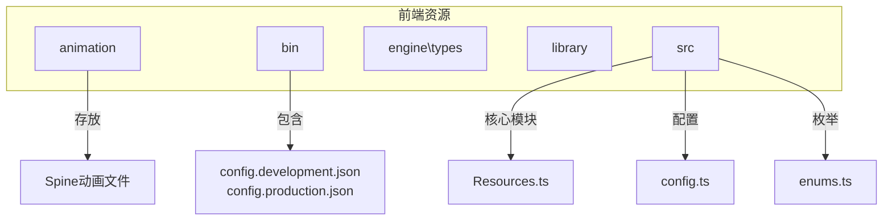
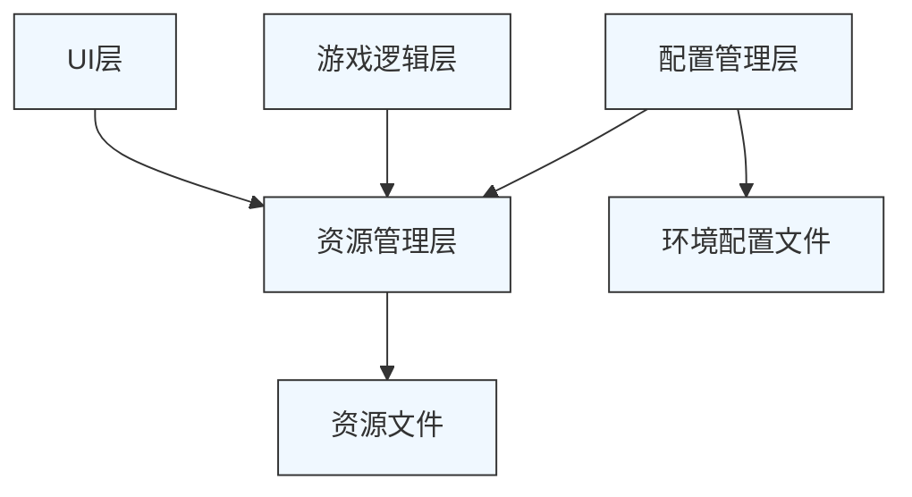
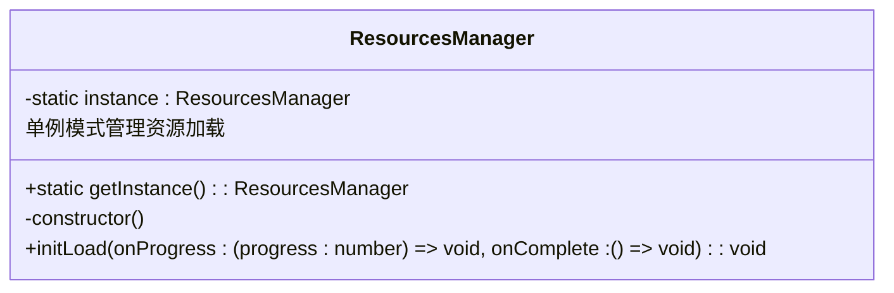
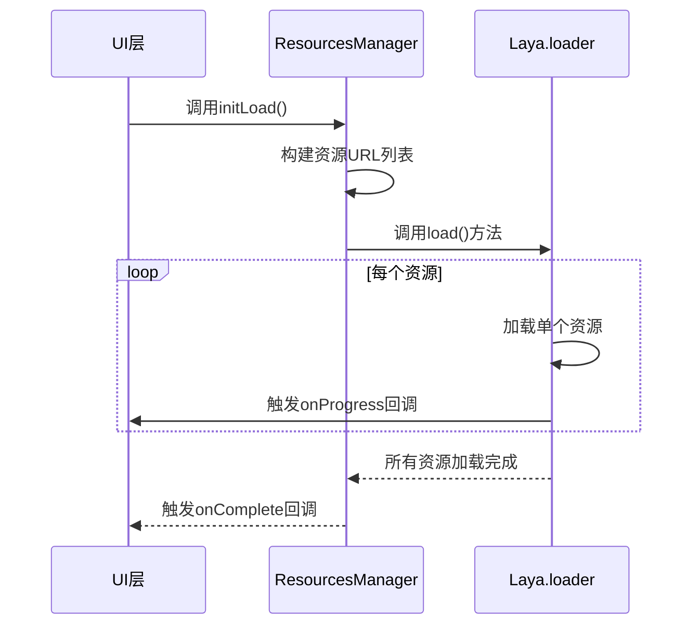
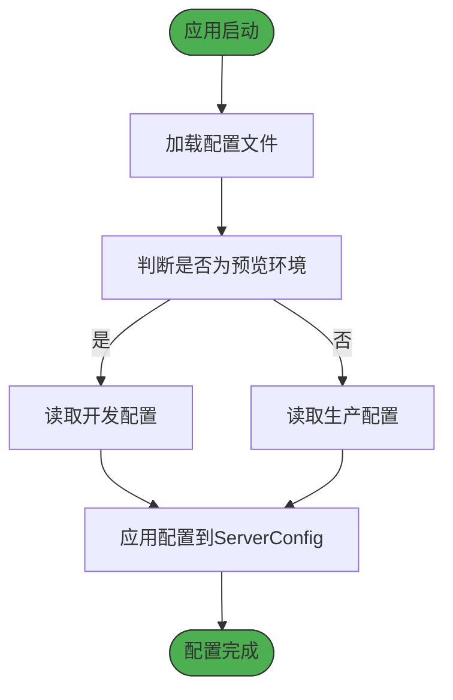
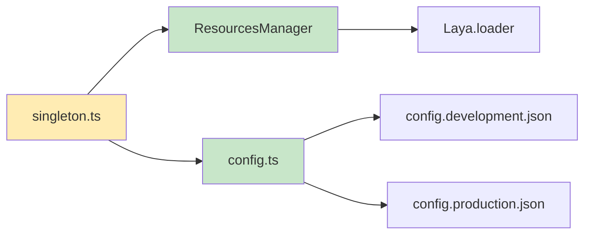

# 资源管理

<cite>
**本文档引用的文件**  
- [Resources.ts](file://client/src/mgr/Resources.ts)
- [config.ts](file://client/src/config.ts)
- [enums.ts](file://client/src/enums.ts)
- [singleton.ts](file://client/src/singleton.ts)
- [config.development.json](file://client/bin/configs/config.development.json)
- [config.production.json](file://client/bin/configs/config.production.json)
</cite>

## 更新摘要
**已做更改**  
- 更新了配置管理分析部分，以反映`singleton.ts`中配置加载逻辑的变更
- 修正了环境配置流程图，准确展示配置加载顺序
- 更新了依赖分析部分，反映新的配置加载依赖关系
- 所有文档内容已根据最新代码状态进行验证和更新

## 目录
1. [简介](#简介)
2. [项目结构](#项目结构)
3. [核心组件](#核心组件)
4. [架构概览](#架构概览)
5. [详细组件分析](#详细组件分析)
6. [依赖分析](#依赖分析)
7. [性能考虑](#性能考虑)
8. [故障排除指南](#故障排除指南)
9. [结论](#结论)

## 简介
本文档详细介绍了resgsv1客户端中游戏资源的加载、缓存和管理机制。重点分析了`Resources.ts`中的资源管理器设计，包括预加载、按需加载和资源释放策略。同时探讨了`config.ts`中资源路径的配置管理，以及开发与生产环境的切换机制。文档还阐述了Spine动画等动画资源的加载流程，资源依赖管理机制，并通过代码示例展示了完整的资源使用流程。最后讨论了内存优化、加载进度显示和错误恢复等最佳实践。

## 项目结构
项目采用分层结构组织前端资源，主要分为动画、配置、引擎类型定义、资源库、源码等目录。`client/assets/animation`目录存放所有Spine动画资源，按功能或角色分类。`client/bin/configs`包含开发和生产环境的配置文件。`client/src`是核心源码目录，包含管理器、配置、枚举等模块。

**图示来源**
- [client/src/mgr/Resources.ts](file://client/src/mgr/Resources.ts)
- [client/bin/configs/config.development.json](file://client/bin/configs/config.development.json)
- [client/bin/configs/config.production.json](file://client/bin/configs/config.production.json)

**本节来源**
- [client/src/mgr/Resources.ts](file://client/src/mgr/Resources.ts)
- [client/src/config.ts](file://client/src/config.ts)

## 核心组件
核心资源管理组件包括`ResourcesManager`类，负责统一管理所有游戏资源的加载和释放。该类采用单例模式，确保全局唯一实例。资源类型在`enums.ts`中通过`res`对象集中定义，包括预加载资源、场景、预制件、图片、字体、Spine动画等。

**本节来源**
- [client/src/mgr/Resources.ts](file://client/src/mgr/Resources.ts)
- [client/src/enums.ts](file://client/src/enums.ts)

## 架构概览
系统采用分层架构，资源管理层位于核心业务逻辑之下，为UI和游戏逻辑提供资源支持。`ResourcesManager`作为中心枢纽，协调资源加载流程。配置管理层通过`ServerConfig`提供环境相关的资源URL。

**图示来源**
- [client/src/mgr/Resources.ts](file://client/src/mgr/Resources.ts)
- [client/src/config.ts](file://client/src/config.ts)

## 详细组件分析

### 资源管理器分析
`ResourcesManager`类实现了资源管理的核心功能，采用单例模式确保全局唯一性。

#### 类结构分析

**图示来源**
- [client/src/mgr/Resources.ts](file://client/src/mgr/Resources.ts#L1-L30)

#### 资源预加载流程

**图示来源**
- [client/src/mgr/Resources.ts](file://client/src/mgr/Resources.ts#L15-L25)

**本节来源**
- [client/src/mgr/Resources.ts](file://client/src/mgr/Resources.ts#L1-L30)

### 配置管理分析
`config.ts`文件管理服务器配置和资源URL，支持不同环境的配置切换。

#### 环境配置流程

**图示来源**
- [client/src/singleton.ts](file://client/src/singleton.ts#L40-L50)
- [client/bin/configs/config.development.json](file://client/bin/configs/config.development.json)
- [client/bin/configs/config.production.json](file://client/bin/configs/config.production.json)

**本节来源**
- [client/src/config.ts](file://client/src/config.ts)
- [client/src/singleton.ts](file://client/src/singleton.ts)

### 动画资源管理
Spine动画资源在`enums.ts`中统一定义，通过JSON文件路径进行管理。

#### Spine动画加载流程

**图示来源**
- [client/src/enums.ts](file://client/src/enums.ts#L100-L150)

**本节来源**
- [client/src/enums.ts](file://client/src/enums.ts)

## 依赖分析
系统各组件间存在明确的依赖关系，`ResourcesManager`依赖Laya引擎的加载系统，`singleton.ts`初始化时依赖配置系统。

**图示来源**
- [client/src/singleton.ts](file://client/src/singleton.ts)
- [client/src/mgr/Resources.ts](file://client/src/mgr/Resources.ts)
- [client/src/config.ts](file://client/src/config.ts)

**本节来源**
- [client/src/singleton.ts](file://client/src/singleton.ts)
- [client/src/config.ts](file://client/src/config.ts)

## 性能考虑
资源管理设计考虑了多项性能优化策略：
- **预加载机制**：在游戏启动时批量加载关键资源，减少运行时卡顿
- **资源分类**：将资源按类型和使用频率分类，优化加载顺序
- **内存管理**：通过单例模式避免资源管理器的重复创建
- **异步加载**：使用Promise和回调函数实现非阻塞加载
- **环境区分**：开发环境使用本地资源，生产环境使用CDN，优化加载速度

## 故障排除指南
### 常见问题及解决方案
1. **资源加载失败**
   - 检查资源路径是否正确
   - 确认服务器配置中的`res_url`是否正确
   - 验证网络连接是否正常

2. **动画无法播放**
   - 确认Spine JSON文件路径已添加到`res.spines`
   - 检查相关资源文件是否存在
   - 验证Spine运行时库是否正确加载

3. **环境配置不生效**
   - 确认`Laya.LayaEnv.isPreview`值是否正确
   - 检查配置文件路径是否正确
   - 验证JSON文件格式是否正确

**本节来源**
- [client/src/mgr/Resources.ts](file://client/src/mgr/Resources.ts)
- [client/src/config.ts](file://client/src/config.ts)

## 结论
resgsv1客户端的资源管理系统设计合理，通过`ResourcesManager`单例类实现了资源的集中管理。系统支持开发和生产环境的无缝切换，通过配置文件动态调整资源URL。资源分类清晰，加载流程规范，为游戏的稳定运行提供了可靠保障。建议在实际使用中根据具体需求优化加载策略，进一步提升用户体验。