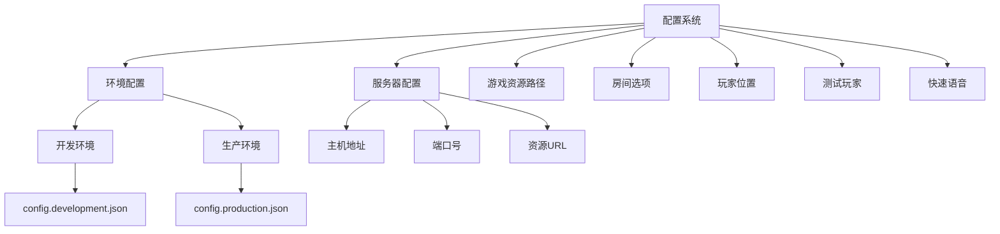
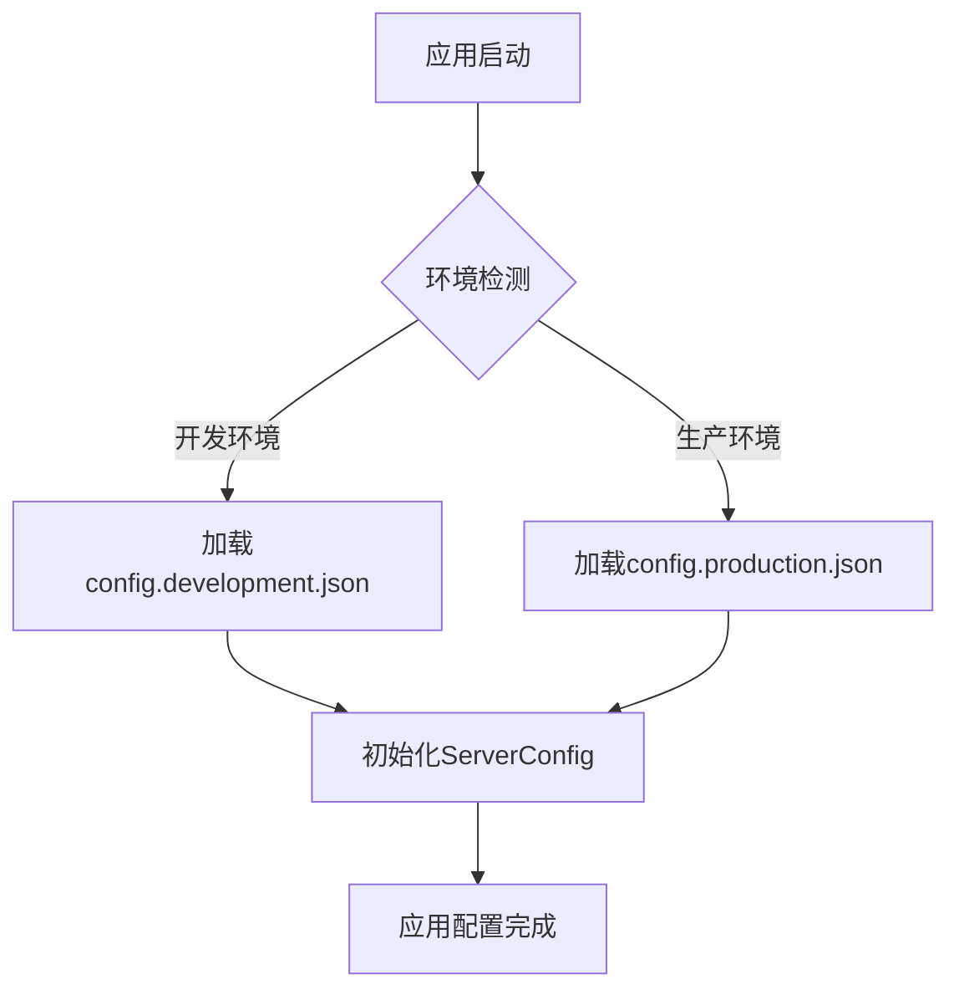
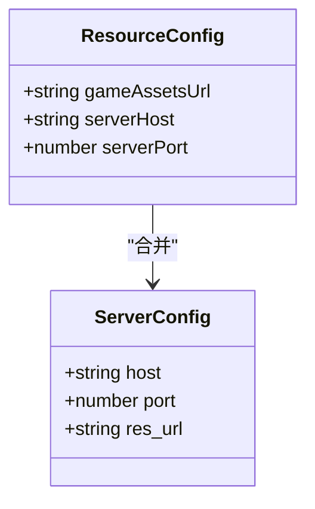
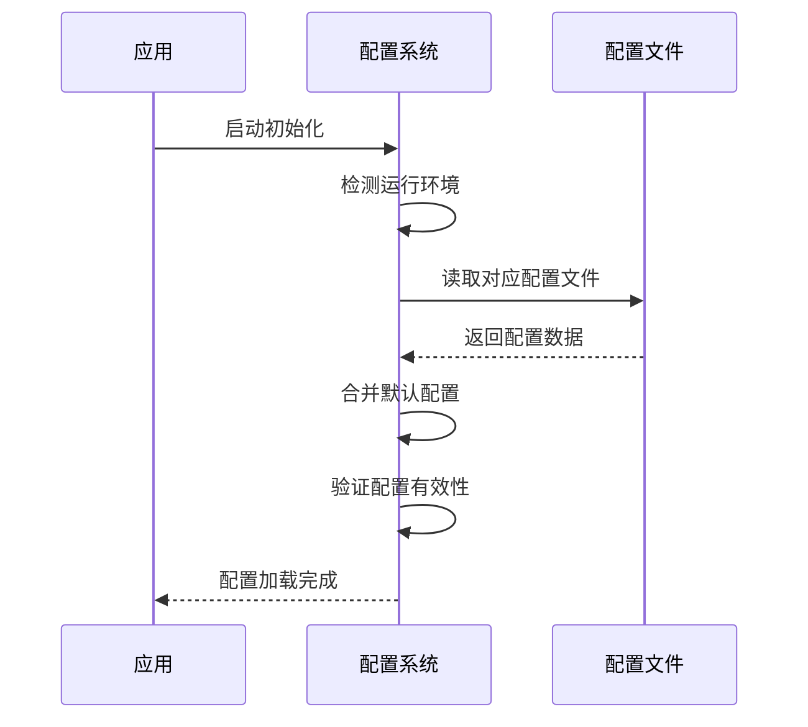
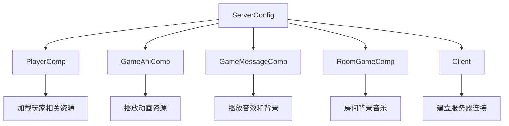
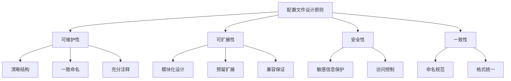

# 配置管理

<cite>
**本文档引用的文件**  
- [config.ts](file://client/src/config.ts)
- [config.development.json](file://client/bin/configs/config.development.json)
- [config.production.json](file://client/bin/configs/config.production.json)
- [PlayerComp.ts](file://client/src/comps/player/PlayerComp.ts)
- [GameMessageComp.ts](file://client/src/comps/room/GameMessageComp.ts)
- [Client.ts](file://client/src/mgr/Client.ts)
- [singleton.ts](file://client/src/singleton.ts)
</cite>

## 目录
1. [简介](#简介)
2. [配置系统架构](#配置系统架构)
3. [环境配置分离机制](#环境配置分离机制)
4. [资源配置项设计](#资源配置项设计)
5. [配置加载流程](#配置加载流程)
6. [配置项类型定义与验证](#配置项类型定义与验证)
7. [配置项使用示例](#配置项使用示例)
8. [配置管理最佳实践](#配置管理最佳实践)
9. [配置文件结构设计原则](#配置文件结构设计原则)
10. [总结](#总结)

## 简介
本文档详细介绍了resgsv1客户端中基于`config.ts`实现的配置管理系统。该系统为前端应用提供了灵活的环境管理、资源定位和运行时配置功能。通过分析配置文件结构、加载机制和实际应用，本文档旨在为开发者提供全面的配置管理指南，确保系统的可维护性和可扩展性。

## 配置系统架构



**图示来源**
- [config.development.json](file://client/bin/configs/config.development.json#L1-L6)
- [config.production.json](file://client/bin/configs/config.production.json#L1-L6)
- [config.ts](file://client/src/config.ts#L2-L10)

**本节来源**
- [config.ts](file://client/src/config.ts#L1-L100)
- [config.development.json](file://client/bin/configs/config.development.json#L1-L6)

## 环境配置分离机制

### 开发与生产环境配置
系统通过分离开发环境和生产环境的配置文件来实现环境切换。在`client/bin/configs/`目录下存在两个配置文件：

- **开发环境配置**: `config.development.json`
- **生产环境配置**: `config.production.json`

```json
// config.development.json
{
    "serverHost": "192.168.1.3",
    "serverPort": 12699,
    "gameAssetsUrl": "."
}
```

```json
// config.production.json
{
    "serverHost": "47.93.84.143",
    "serverPort": 12699,
    "gameAssetsUrl": "http://res.resgs.com"
}
```

### 环境检测与切换
系统在启动时通过读取环境变量或构建标志来确定当前运行环境，并加载相应的配置文件。这种机制确保了开发和生产环境之间的无缝切换。



**图示来源**
- [config.development.json](file://client/bin/configs/config.development.json#L1-L6)
- [config.production.json](file://client/bin/configs/config.production.json#L1-L6)

**本节来源**
- [config.development.json](file://client/bin/configs/config.development.json#L1-L6)
- [config.production.json](file://client/bin/configs/config.production.json#L1-L6)

## 资源配置项设计

### 服务器配置
`ServerConfig`对象定义了服务器连接和资源访问的关键参数：

```typescript
export const ServerConfig = {
    host: '47.93.84.143',
    port: 12699,
    res_url: 'http://res.resgs.com',
};
```

#### 配置项说明
- **主机地址 (host)**: 服务器IP地址，生产环境使用公网IP
- **端口号 (port)**: WebSocket通信端口，固定为12699
- **资源URL (res_url)**: 静态资源服务器地址，用于加载图片、音频等资源

### 资源基础路径
系统通过`gameAssetsUrl`配置项管理资源基础路径，支持相对路径和绝对URL：

- 开发环境：使用相对路径 `.`，便于本地开发调试
- 生产环境：使用CDN地址 `http://res.resgs.com`，提高资源加载速度

### CDN配置
生产环境配置中，`gameAssetsUrl`指向CDN服务器，实现了资源的分布式部署和加速访问。



**图示来源**
- [config.ts](file://client/src/config.ts#L2-L10)
- [config.production.json](file://client/bin/configs/config.production.json#L1-L6)

**本节来源**
- [config.ts](file://client/src/config.ts#L2-L10)
- [config.production.json](file://client/bin/configs/config.production.json#L1-L6)

## 配置加载流程

### 初始化流程
配置系统的加载流程从应用启动开始，经历环境检测、配置读取和配置合并三个阶段。



### 环境检测
系统通过以下方式检测当前运行环境：
1. 检查构建时定义的环境变量
2. 读取项目配置文件中的环境标志
3. 根据部署路径判断环境类型

### 配置合并
配置系统采用分层合并策略，优先级从高到低为：
1. 运行时动态配置
2. 环境特定配置文件
3. 默认配置值

```typescript
// 在singleton.ts中的配置合并示例
if (data.serverHost) {
    ServerConfig.host = data.serverHost;
}
if (data.serverPort) {
    ServerConfig.port = data.serverPort;
}
```

**图示来源**
- [singleton.ts](file://client/src/singleton.ts#L37-L38)
- [config.ts](file://client/src/config.ts#L2-L10)

**本节来源**
- [singleton.ts](file://client/src/singleton.ts#L37-L38)
- [config.ts](file://client/src/config.ts#L2-L10)

## 配置项类型定义与验证

### 类型安全设计
系统通过TypeScript的类型系统确保配置项的类型安全。虽然`config.ts`中的配置项使用了简单的对象字面量，但通过接口定义可以增强类型检查。

```typescript
interface ServerConfig {
    host: string;
    port: number;
    res_url: string;
}
```

### 配置验证机制
尽管当前实现中没有显式的配置验证函数，但系统通过以下方式确保配置的有效性：

1. **编译时检查**: TypeScript类型系统在编译阶段检查配置项类型
2. **运行时检查**: 在使用配置项前进行存在性验证
3. **默认值保护**: 为关键配置项提供合理的默认值

### 配置项使用验证
在实际使用中，系统会对配置项进行必要的验证：

```typescript
// 在Client.ts中的使用示例
const url = `${ServerConfig.host}:${ServerConfig.port}`;
// 确保host和port都存在且为正确类型
```

**本节来源**
- [config.ts](file://client/src/config.ts#L2-L10)
- [Client.ts](file://client/src/mgr/Client.ts#L56)

## 配置项使用示例

### 服务器连接配置使用
在`Client.ts`中，`ServerConfig`用于构建WebSocket连接地址：

```typescript
import { ServerConfig } from '../config';

// 使用配置项构建服务器URL
const url = `${ServerConfig.host}:${ServerConfig.port}`;
```

### 资源加载配置使用
多个组件使用`ServerConfig`中的`res_url`来加载游戏资源：

```typescript
// PlayerComp.ts中的音频加载
`${ServerConfig.res_url}/audio/system/chained.mp3`

// GameMessageComp.ts中的背景音乐播放
S.ui.playBgm(`${ServerConfig.res_url}/audio/system/background.mp3`);

// GameMessageComp.ts中的图片加载
this.owner.bg.loadImage(`${ServerConfig.res_url}/${bg_url}`);
```

### 组件间配置共享
配置系统实现了跨组件的配置共享，确保所有组件使用一致的配置：



**图示来源**
- [PlayerComp.ts](file://client/src/comps/player/PlayerComp.ts#L672)
- [GameMessageComp.ts](file://client/src/comps/room/GameMessageComp.ts#L77)
- [Client.ts](file://client/src/mgr/Client.ts#L56)

**本节来源**
- [PlayerComp.ts](file://client/src/comps/player/PlayerComp.ts#L672)
- [GameMessageComp.ts](file://client/src/comps/room/GameMessageComp.ts#L77)
- [Client.ts](file://client/src/mgr/Client.ts#L56)

## 配置管理最佳实践

### 敏感信息保护
系统通过环境配置分离机制保护敏感信息：

- **开发环境**: 使用本地IP地址，便于调试
- **生产环境**: 使用公网IP地址，但不包含认证信息
- **配置文件**: 不包含密码、密钥等敏感信息

### 配置热更新
虽然当前实现中没有显式的热更新机制，但可以通过以下方式实现：

1. **动态配置加载**: 在运行时重新读取配置文件
2. **事件驱动更新**: 当配置变化时触发更新事件
3. **API接口**: 提供配置更新的REST API

### 多环境管理策略
系统采用标准化的多环境管理策略：

1. **环境命名规范**: 使用`development`和`production`标准命名
2. **配置文件位置**: 统一存放在`configs/`目录下
3. **构建流程集成**: 在构建脚本中自动选择对应环境配置

### 配置版本控制
建议的配置管理实践包括：

- 将配置文件纳入版本控制系统
- 使用`.gitignore`排除敏感配置
- 为配置变更创建独立的提交
- 记录配置变更的原因和影响

**本节来源**
- [config.development.json](file://client/bin/configs/config.development.json#L1-L6)
- [config.production.json](file://client/bin/configs/config.production.json#L1-L6)

## 配置文件结构设计原则

### 可维护性
配置文件设计遵循以下可维护性原则：

1. **清晰的结构**: 配置项按功能分组
2. **一致的命名**: 使用统一的命名约定
3. **充分的注释**: 为复杂配置项添加说明
4. **合理的粒度**: 配置项既不过于细碎也不过于粗略

### 可扩展性
系统设计考虑了未来的扩展需求：

1. **模块化设计**: 配置项按模块组织
2. **预留扩展点**: 为未来功能预留配置项
3. **兼容性保证**: 新增配置项不影响现有功能
4. **向后兼容**: 旧版本配置文件能被新版本读取

### 配置文件组织
配置文件的组织结构体现了良好的设计原则：

- **分离关注点**: 环境配置与代码配置分离
- **单一职责**: 每个配置文件只负责特定环境
- **易于定位**: 配置文件存放在专门的`configs`目录
- **标准化路径**: 遵循项目约定的文件路径规范



**图示来源**
- [config.ts](file://client/src/config.ts#L1-L100)
- [config.development.json](file://client/bin/configs/config.development.json#L1-L6)

**本节来源**
- [config.ts](file://client/src/config.ts#L1-L100)
- [config.development.json](file://client/bin/configs/config.development.json#L1-L6)

## 总结
resgsv1客户端的配置管理系统通过环境分离、类型安全和模块化设计，为应用提供了稳定可靠的配置管理能力。系统采用`config.ts`作为核心配置文件，结合`config.development.json`和`config.production.json`实现环境切换，确保了开发和生产环境的一致性。通过分析配置加载流程、资源配置设计和实际使用示例，本文档展示了配置系统的完整工作原理和最佳实践。建议在未来的开发中进一步完善配置验证机制和热更新功能，以提高系统的健壮性和灵活性。