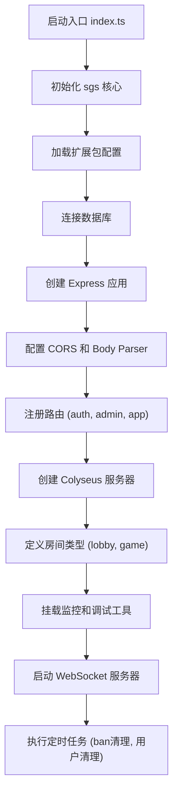
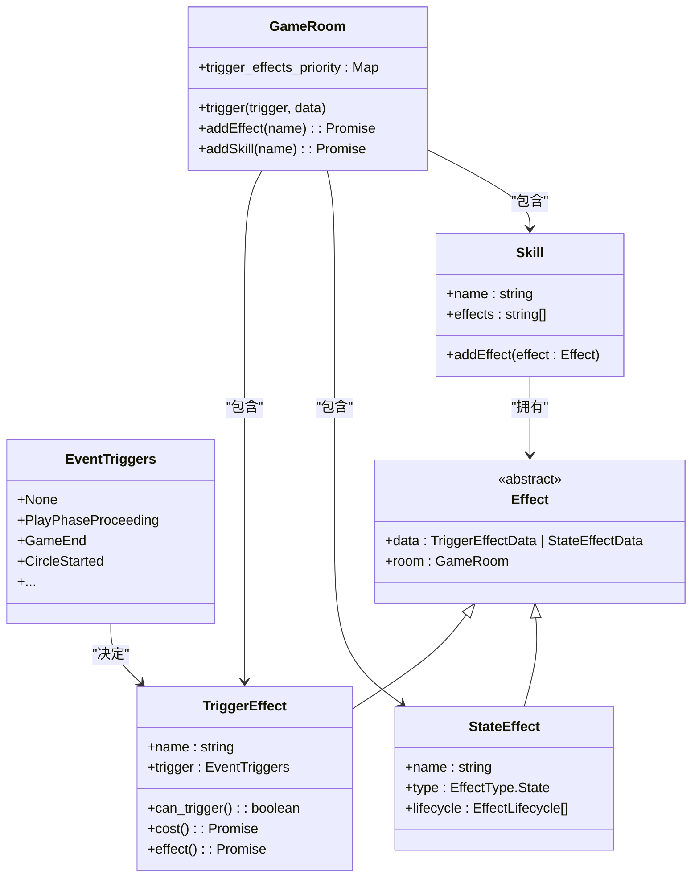
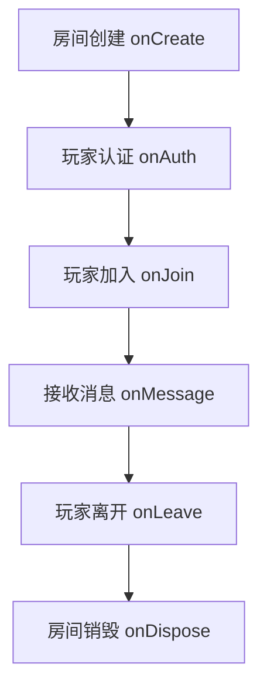
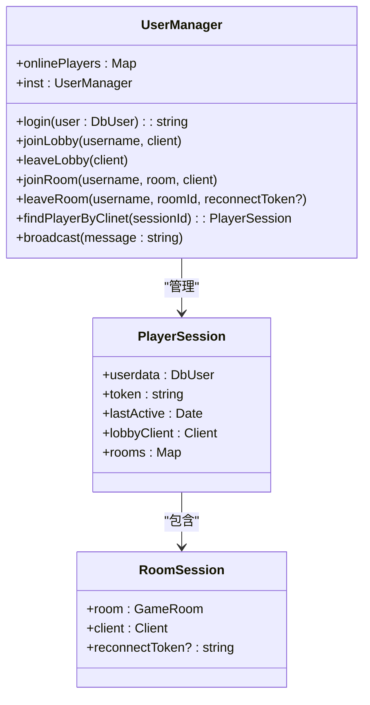
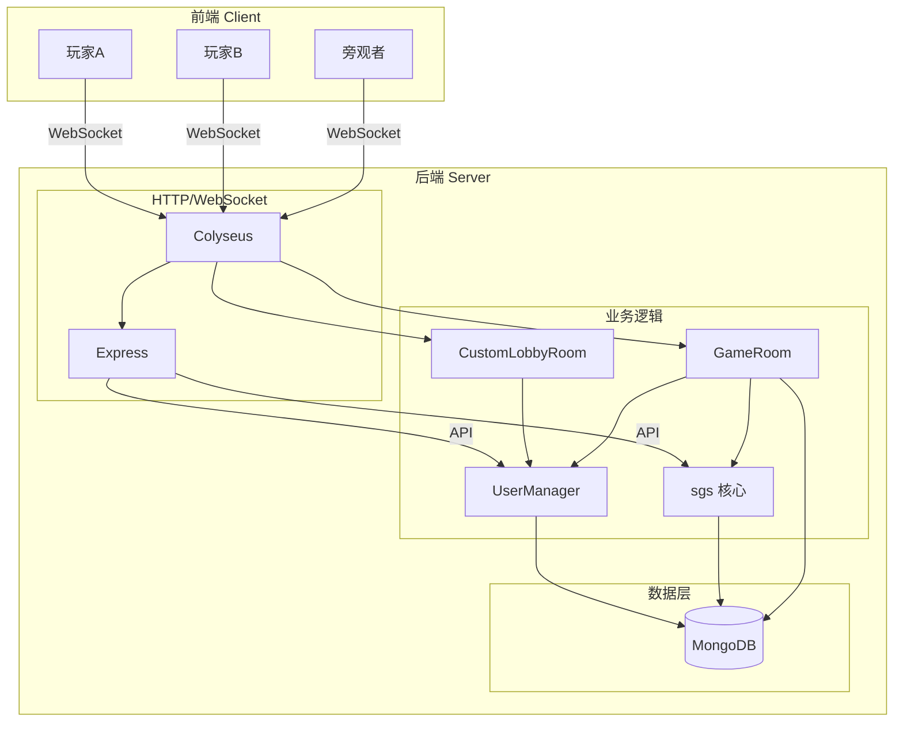

# 后端架构

<cite>
**本文档中引用的文件**  
- [index.ts](file://server/src/index.ts#L0-L102)
- [ecosystem.config.js](file://server/ecosystem.config.js#L0-L23)
- [sgs.ts](file://server/src/core/sgs.ts#L0-L799)
- [game.ts](file://server/src/rooms/game.ts#L0-L799)
- [lobby.ts](file://server/src/rooms/lobby.ts#L0-L58)
- [UserManager.ts](file://server/src/UserManager.ts#L0-L149)
- [room.ts](file://server/src/core/room/room.ts#L0-L799)
- [player.ts](file://server/src/core/player/player.ts#L0-L799)
</cite>

## 目录
1. [项目结构](#项目结构)  
2. [服务启动流程](#服务启动流程)  
3. [核心游戏逻辑](#核心游戏逻辑)  
4. [房间系统](#房间系统)  
5. [用户管理系统](#用户管理系统)  
6. [系统架构图](#系统架构图)  
7. [可扩展性设计](#可扩展性设计)

## 项目结构

项目分为 `client` 和 `server` 两个主要目录。`client` 目录包含前端资源，如动画、配置文件、UI 脚本等。`server` 目录是后端服务的核心，基于 Node.js 和 Colyseus 框架构建。

`server` 目录结构如下：
- `src`: 源代码目录
  - `core`: 核心游戏逻辑，包括卡牌、武将、技能、事件等
  - `db`: 数据库相关服务和模型
  - `extensions`: 游戏扩展包
  - `middleware`: 中间件
  - `models`: 房间和大厅的状态模型
  - `rooms`: Colyseus 房间实现
  - `routes`: API 路由
  - `scripts`: 定时任务脚本
  - `utils`: 工具函数
  - `UserManager.ts`: 用户管理核心类
  - `index.ts`: 服务入口点
- `build`: 编译后的 JavaScript 文件
- `loadtest`: 压力测试脚本
- `test`: 单元测试
- `ecosystem.config.js`: PM2 进程管理配置
- `package.json`: 项目依赖和脚本

**Section sources**
- [index.ts](file://server/src/index.ts#L0-L102)
- [ecosystem.config.js](file://server/ecosystem.config.js#L0-L23)

## 服务启动流程

服务的启动流程始于 `server/src/index.ts` 文件，该文件是整个后端服务的入口点。

**Diagram sources**
- [index.ts](file://server/src/index.ts#L0-L102)

**Section sources**
- [index.ts](file://server/src/index.ts#L0-L102)

### 详细流程

1.  **初始化核心 (`sgs.init`)**: 调用 `sgs.init('server', ...)` 初始化核心游戏库。此函数会混入各种 Mixin（如广播、玩家、技能等），并加载默认的游戏模式和规则。
2.  **加载扩展包**: 根据 `extensions.config.ts` 中的配置，动态加载所有游戏扩展包（如标准包、神话包等）。
3.  **数据库连接**: 使用 `connectToDatabase()` 函数异步连接 MongoDB 数据库。如果连接失败，服务将退出。
4.  **创建 HTTP 服务器**: 使用 Express 框架创建一个 HTTP 服务器，并配置 CORS 以允许来自特定前端域名的请求。
5.  **注册 API 路由**: 将认证 (`/auth`)、管理 (`/admin`) 和应用 (`/app`) 路由挂载到 Express 应用上。
6.  **创建 Colyseus 服务器**: 使用 `WebSocketTransport` 将 Colyseus 服务器与 Express 服务器绑定，实现 WebSocket 通信。
7.  **定义游戏房间**: 通过 `gameServer.define()` 方法注册 `CustomLobbyRoom`（大厅）和 `GameRoom`（游戏房间）两种房间类型。
8.  **启动监听**: 服务器在指定端口（12699）上开始监听，等待客户端连接。
9.  **执行定时任务**: 启动后，异步执行 `setupBanCleanup` 和 `setupUserCleanup` 等定时任务，用于清理过期的封禁和用户会话。

## 核心游戏逻辑

核心游戏逻辑位于 `server/src/core` 目录下，以 `sgs.ts` 文件为入口，实现了游戏的状态机、事件处理和规则引擎。

### 游戏状态机

游戏状态由 `GameState` 枚举定义，主要状态包括：
- `Wating`: 等待玩家加入
- `Gaming`: 游戏进行中
- `Ending`: 游戏结束

`GameRoom` 类的 `gameState` 属性负责管理当前状态。游戏开始时，状态从 `Wating` 变为 `Gaming`；游戏结束时，变为 `Ending`。

### 事件处理

事件系统是游戏逻辑的核心，它采用“时机-触发-效果”的模式。

**Diagram sources**
- [sgs.ts](file://server/src/core/sgs.ts#L0-L799)
- [room.ts](file://server/src/core/room/room.ts#L0-L799)

**Section sources**
- [sgs.ts](file://server/src/core/sgs.ts#L0-L799)

#### 事件处理流程

1.  **时机 (Triggers)**: 事件由特定的时机触发，如 `PlayPhaseProceeding`（出牌阶段进行中）、`GameEnd`（游戏结束）等。
2.  **触发效果 (TriggerEffect)**: 当一个时机被触发时，系统会遍历所有已注册的 `TriggerEffect`。每个效果都有一个 `can_trigger` 函数来判断是否应该被激活。
3.  **执行效果 (effect)**: 如果 `can_trigger` 返回 `true`，则执行 `cost`（成本函数，通常用于询问玩家是否发动）和 `effect`（实际效果函数）。
4.  **优先级**: 效果按优先级排序（`PriorityType`），确保武将技能、装备技能、卡牌技能等按正确顺序处理。

### 规则引擎

规则引擎通过 `GameMode` 和 `Skill` 实现。`sgs.ts` 中定义了默认的游戏模式和规则技能。游戏模式 (`GameMode`) 决定了最大玩家数、规则技能等。规则技能本身也是一个 `Skill`，它包含了游戏的基础规则，如回合流程。

## 房间系统

房间系统基于 Colyseus 框架构建，管理游戏的整个生命周期，包括创建、玩家加入、状态同步和销毁。

### 房间类型

系统定义了两种房间：
- `CustomLobbyRoom`: 大厅房间，用于玩家匹配和房间列表展示。
- `GameRoom`: 游戏房间，承载实际的游戏逻辑。

### 生命周期

**Diagram sources**
- [game.ts](file://server/src/rooms/game.ts#L0-L799)
- [lobby.ts](file://server/src/rooms/lobby.ts#L0-L58)

**Section sources**
- [game.ts](file://server/src/rooms/game.ts#L0-L799)
- [lobby.ts](file://server/src/rooms/lobby.ts#L0-L58)

#### 详细流程

1.  **创建 (`onCreate`)**:
    - 为 `GameRoom` 生成唯一的 `roomId`。
    - 初始化 `RoomState`，这是一个继承自 `@colyseus/schema` 的 Schema，用于高效同步状态。
    - 设置房间元数据（选项、玩家数量、状态）。
    - 注册所有消息处理函数（如 `ready`, `start`, `chat`）。

2.  **认证 (`onAuth`)**:
    - 验证玩家的用户名和 Token。
    - 检查玩家是否已在房间中（用于断线重连）。
    - 验证房间密码、测试资格、旁观权限等。

3.  **加入 (`onJoin`)**:
    - 为新玩家创建 `PlayerState` 并添加到 `state.players` Map 中。
    - 更新元数据中的玩家数量，并通知大厅更新。
    - 如果是旁观者，则添加到 `state.spectates`。

4.  **状态同步**:
    - Colyseus 会自动将 `RoomState` 的变更同步给所有客户端。
    - 服务端通过调用 `this.broadcast()` 发送自定义消息（如游戏内消息 `game_message`）。

5.  **离开 (`onLeave`)**:
    - 从 `state.players` 或 `state.spectates` 中移除玩家。
    - 处理断线重连逻辑：如果 `consented` 为 `false`（非主动离开），则生成一个 `ReconnectToken` 并存储，允许玩家在一定时间内重连。
    - 如果房主离开，则将房主权限转移给下一个玩家。
    - 如果所有玩家都离开，则调用 `disconnect()` 销毁房间。

6.  **销毁 (`onDispose`)**:
    - 房间被销毁时触发，用于清理资源。

## 用户管理系统

用户管理系统由 `UserManager.ts` 类实现，负责用户的在线状态、会话管理和跨房间通信。

### 核心功能

**Diagram sources**
- [UserManager.ts](file://server/src/UserManager.ts#L0-L149)

**Section sources**
- [UserManager.ts](file://server/src/UserManager.ts#L0-L149)

#### 详细说明

- **单例模式**: `UserManager` 使用静态属性 `_inst` 实现单例，确保全局只有一个实例。
- **在线用户映射**: `onlinePlayers` 是一个以用户名为键的映射，存储每个在线用户的会话信息。
- **登录 (`login`)**: 当用户登录时，`UserManager` 会生成一个 JWT Token 并存储用户信息。如果用户已在线，则更新其会话。
- **会话管理**: 通过 `joinLobby`/`leaveLobby` 和 `joinRoom`/`leaveRoom` 方法，精确跟踪用户在大厅和各个游戏房间中的客户端连接。
- **断线重连**: `reconnectToken` 字段是实现断线重连的关键。当玩家非主动离开时，系统会生成一个临时 Token 并存储。玩家重连时，可通过此 Token 找到之前的会话，恢复游戏状态。
- **广播通信**: `broadcast` 方法可以向所有在线用户（包括大厅和所有房间）发送系统消息。

## 系统架构图

**Diagram sources**
- [index.ts](file://server/src/index.ts#L0-L102)
- [game.ts](file://server/src/rooms/game.ts#L0-L799)
- [lobby.ts](file://server/src/rooms/lobby.ts#L0-L58)
- [UserManager.ts](file://server/src/UserManager.ts#L0-L149)
- [sgs.ts](file://server/src/core/sgs.ts#L0-L799)

## 可扩展性设计

系统设计具有良好的可扩展性，主要体现在以下几个方面：

1.  **模块化扩展包**: 通过 `extensions` 目录，可以轻松添加新的游戏模式、武将、卡牌和技能。`extensions.config.ts` 文件定义了所有可用的扩展包，`sgs.loadPackage` 会动态加载它们。
2.  **插件式技能系统**: 技能 (`Skill`) 和效果 (`Effect`) 的设计是插件式的。新的技能可以通过 `sgs.Skill()` 和 `sgs.TriggerEffect()` 等工厂方法创建，并自动注册到全局系统中。
3.  **灵活的房间定义**: Colyseus 框架允许定义多种房间类型。未来可以添加 `RankRoom`（排位赛房间）、`PracticeRoom`（练习房）等，只需继承 `Room` 类并实现相应逻辑。
4.  **状态同步机制**: 使用 `@colyseus/schema` 的 `Schema` 类进行状态同步，不仅高效，而且易于扩展。可以在 `RoomState` 或 `PlayerState` 中添加新的字段来支持新功能。
5.  **事件驱动架构**: 基于事件的处理机制使得添加新规则和交互变得简单。只需定义新的 `EventTriggers` 和 `TriggerEffect`，即可在不修改核心流程的情况下实现新功能。