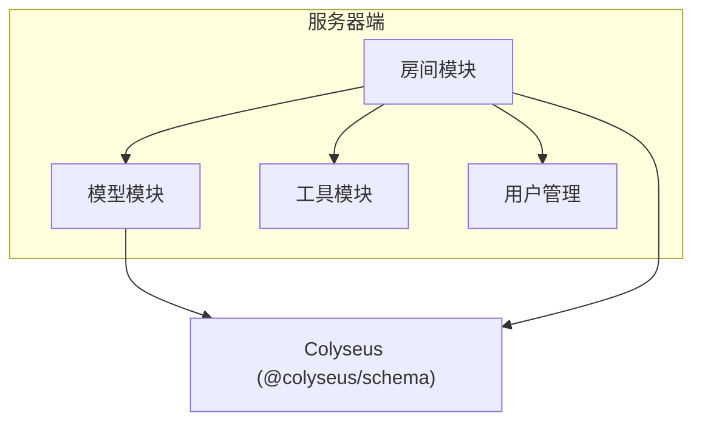
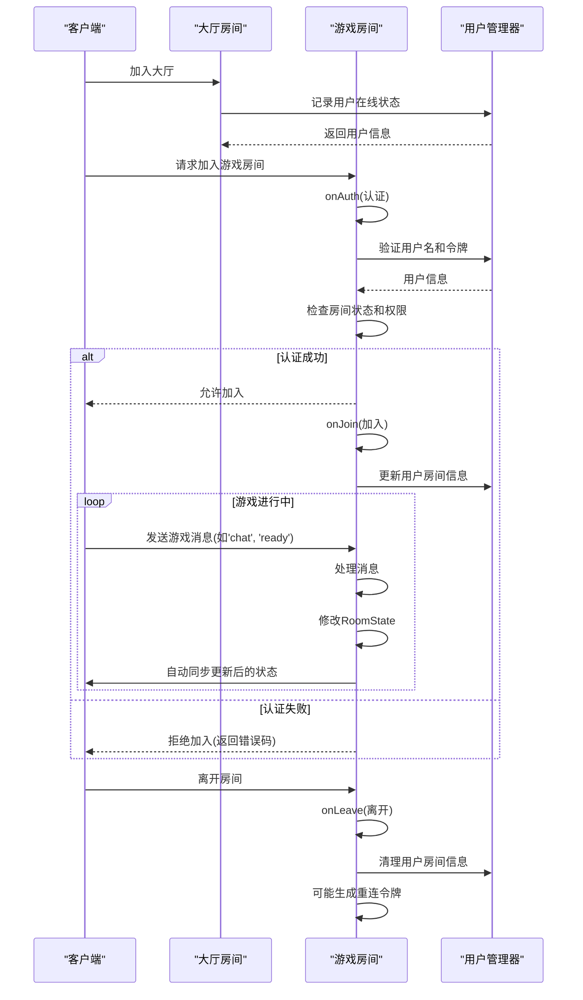
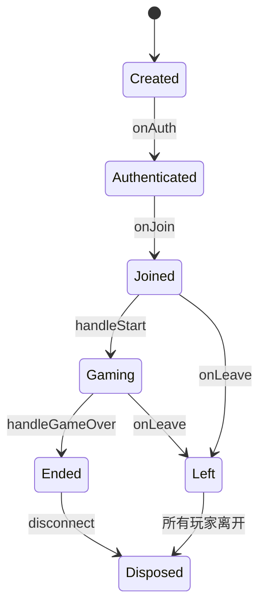
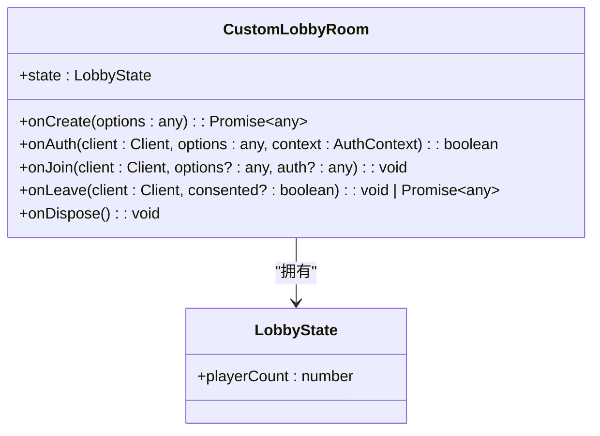
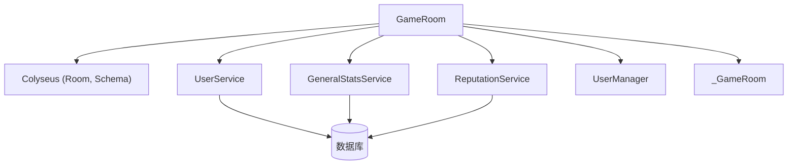

# 房间系统

<cite>
**本文档引用的文件**  
- [game.ts](file://server/src/rooms/game.ts)
- [lobby.ts](file://server/src/rooms/lobby.ts)
- [RoomStata.ts](file://server/src/models/RoomStata.ts)
- [LobbyState.ts](file://server/src/models/LobbyState.ts)
- [GenerateRoomId.ts](file://server/src/utils/GenerateRoomId.ts)
- [UserManager.ts](file://server/src/UserManager.ts)
</cite>

## 目录
1. [简介](#简介)
2. [项目结构](#项目结构)
3. [核心组件](#核心组件)
4. [架构概述](#架构概述)
5. [详细组件分析](#详细组件分析)
6. [依赖分析](#依赖分析)
7. [性能考虑](#性能考虑)
8. [故障排除指南](#故障排除指南)
9. [结论](#结论)

## 简介
本项目是一个基于 Colyseus 框架的多人在线游戏服务器系统，核心功能围绕游戏房间（GameRoom）和大厅房间（LobbyRoom）展开。系统实现了完整的房间生命周期管理、玩家状态同步、权限控制和实时通信机制。游戏房间支持玩家加入、准备、开始游戏、聊天、投降、举报等核心功能，同时具备断线重连和信誉分系统。大厅房间负责管理在线玩家总数和重连逻辑。整个系统采用 TypeScript 编写，利用 Colyseus 的状态同步机制实现高效的数据传输和实时性。

## 项目结构
项目分为客户端（client）和服务器端（server）两大部分。服务器端是本分析的重点，其核心功能集中在 `server/src/rooms` 目录下，主要包含 `game.ts` 和 `lobby.ts` 两个文件，分别定义了游戏房间和大厅房间的逻辑。模型定义位于 `server/src/models` 目录，如 `RoomStata.ts` 和 `LobbyState.ts`，用于定义房间状态数据结构。工具函数（如 `GenerateRoomId.ts`）和用户管理（`UserManager.ts`）等辅助模块支撑着核心房间逻辑。



**图示来源**
- [game.ts](file://server/src/rooms/game.ts)
- [lobby.ts](file://server/src/rooms/lobby.ts)
- [RoomStata.ts](file://server/src/models/RoomStata.ts)
- [LobbyState.ts](file://server/src/models/LobbyState.ts)

## 核心组件
系统的核心是 `GameRoom` 和 `CustomLobbyRoom` 两个类，它们都继承自 Colyseus 的 `Room` 基类。`GameRoom` 管理单个游戏对局的所有状态和逻辑，包括玩家、旁观者、游戏进程和聊天记录。`CustomLobbyRoom` 则作为一个中央大厅，跟踪所有在线玩家和房间信息。`PlayerState` 和 `SpectateState` 等模型类定义了在房间内同步给客户端的数据结构。`UserManager` 单例负责全局的用户会话管理。

**本节来源**
- [game.ts](file://server/src/rooms/game.ts)
- [lobby.ts](file://server/src/rooms/lobby.ts)
- [RoomStata.ts](file://server/src/models/RoomStata.ts)

## 架构概述
系统采用典型的客户端-服务器架构。客户端通过 WebSocket 连接到服务器。服务器端使用 Colyseus 框架来管理多个独立的 `Room` 实例。每个 `GameRoom` 是一个独立的游戏对局，拥有自己的状态（`RoomState`），该状态会自动同步给房间内的所有客户端。`CustomLobbyRoom` 作为一个特殊的房间，所有玩家在进入游戏房间前都会先加入此大厅。用户认证和权限检查在 `onAuth` 钩子中完成。游戏逻辑（如出牌、技能）由 `GameRoom` 内部的 `GameRoom` 实例处理，并通过 `broadcast` 方法将结果广播给所有玩家。



**图示来源**
- [game.ts](file://server/src/rooms/game.ts#L100-L300)
- [lobby.ts](file://server/src/rooms/lobby.ts#L20-L40)
- [UserManager.ts](file://server/src/UserManager.ts)

## 详细组件分析

### 游戏房间分析
`GameRoom` 类是游戏逻辑的核心。它通过重写 Colyseus 的生命周期钩子（`onCreate`, `onAuth`, `onJoin`, `onLeave`）来管理房间的整个生命周期。

#### 生命周期管理


**图示来源**
- [game.ts](file://server/src/rooms/game.ts)

#### 类结构
```mermaid
classDiagram
class GameRoom {
-reconnectTokens : ReconnectToken[]
-surrenders : { [key : string] : boolean }
-jubaos : { [key : string] : string[] }
-pingbis : { [key : string] : string[] }
-timeout : NodeJS.Timeout
-robotid : number
-chatMessages : any[]
+onCreate(options : RoomJoinData) : Promise~void~
+onAuth(client : Client, options : RoomJoinData, context : AuthContext) : Promise~boolean~
+onJoin(client : Client, options? : RoomJoinData) : Promise~any~
+onLeave(client : Client, consented? : boolean) : Promise~any~
-generateReconnectToken(playerId : string, username : string) : ReconnectToken
-chat(client : Client, message : string) : void
-handleReady(client : Client, message : any) : void
-handleStart(client : Client, message : any) : void
-handleGameOver(wins : GamePlayer[], reason : string) : Promise~void~
}
class PlayerState {
+playerId : string
+username : string
+avatar : string
+total : number
+win : number
+escape : number
+isOwner : boolean
+ready : boolean
}
class SpectateState {
+playerId : string
+username : string
+avatar : string
+total : number
+win : number
+escape : number
+spectateBy : string
}
class RoomState {
+players : ArraySchema~PlayerState~
+spectates : ArraySchema~SpectateState~
+options : RoomOptionState
+game : _GameRoom
}
GameRoom --> RoomState : "拥有"
GameRoom --> PlayerState : "创建"
GameRoom --> SpectateState : "创建"
```

**图示来源**
- [game.ts](file://server/src/rooms/game.ts)
- [RoomStata.ts](file://server/src/models/RoomStata.ts)

**本节来源**
- [game.ts](file://server/src/rooms/game.ts)
- [RoomStata.ts](file://server/src/models/RoomStata.ts)

### 大厅房间分析
`CustomLobbyRoom` 继承自 Colyseus 的 `LobbyRoom`，用于管理所有在线玩家。

#### 类结构


**图示来源**
- [lobby.ts](file://server/src/rooms/lobby.ts)
- [LobbyState.ts](file://server/src/models/LobbyState.ts)

**本节来源**
- [lobby.ts](file://server/src/rooms/lobby.ts)

## 依赖分析
`GameRoom` 依赖于多个外部模块和服务：
- **Colyseus**: 提供房间管理、状态同步和 WebSocket 通信的基础框架。
- **UserService, GeneralStatsService, ReputationService**: 负责与数据库交互，处理用户数据、战绩统计和信誉分。
- **UserManager**: 全局单例，管理所有在线用户的会话和状态。
- **_GameRoom**: 封装了具体的游戏逻辑（如出牌、判定），`GameRoom` 通过它来驱动游戏进程。



**图示来源**
- [game.ts](file://server/src/rooms/game.ts#L5-L20)
- [UserManager.ts](file://server/src/UserManager.ts)

**本节来源**
- [game.ts](file://server/src/rooms/game.ts)
- [UserManager.ts](file://server/src/UserManager.ts)

## 性能考虑
1. **状态同步优化**: `GameRoom` 设置了 `patchRate = 50`，即每秒同步50次状态，平衡了实时性和网络开销。
2. **内存管理**: 在 `onLeave` 钩子中，当玩家离开且房间无玩家时，调用 `disconnect()` 销毁房间，避免内存泄漏。
3. **批量操作**: 使用 `ArraySchema` 和 `MapSchema` 等 Colyseus 提供的可同步数据结构，确保状态变更能高效地增量同步。
4. **异步处理**: 数据库操作（如记录战绩、增减信誉分）均使用 `async/await`，避免阻塞主线程。

## 故障排除指南
- **玩家无法加入房间**: 检查 `onAuth` 方法中的认证逻辑，确认用户名、令牌、房间密码、测试资格和管理员权限是否正确。
- **状态不同步**: 确保所有需要同步的数据都定义在 `RoomState` 或其子类中，并使用 `@type` 装饰器。检查 `patchRate` 设置。
- **断线重连失败**: 确认 `reconnectTokens` 数组的管理和 `onJoin` 中的重连逻辑是否正确执行。
- **内存泄漏**: 确保 `autoDispose = true` 已设置，并在 `onLeave` 中正确清理 `UserManager` 中的用户信息。

**本节来源**
- [game.ts](file://server/src/rooms/game.ts)
- [lobby.ts](file://server/src/rooms/lobby.ts)

## 结论
resgsv1 的房间系统设计清晰，职责分明。通过继承 Colyseus 的 `Room` 类，实现了游戏房间和大厅房间的完整生命周期管理。系统利用状态同步机制，高效地处理了多玩家间的实时数据交互。`UserManager` 单例模式确保了用户状态的全局一致性。整体架构可扩展性强，通过模块化的设计（如分离游戏逻辑 `_GameRoom`）便于维护和功能迭代。未来可进一步优化重连机制和增加房间配置的灵活性。