# 服务架构

<cite>
**本文档中引用的文件**  
- [index.ts](file://server/src/index.ts#L1-L102)
- [ecosystem.config.js](file://server/ecosystem.config.js#L1-L23)
- [game.ts](file://server/src/rooms/game.ts#L1-L799)
- [lobby.ts](file://server/src/rooms/lobby.ts#L1-L58)
- [UserManager.ts](file://server/src/UserManager.ts#L1-L149)
- [sgs.ts](file://server/src/core/sgs.ts#L1-L799)
- [extensions.config.ts](file://server/src/core/extensions.config.ts#L1-L10)
- [auth.ts](file://server/src/routes/auth.ts#L1-L59)
</cite>

## 目录
1. [简介](#简介)
2. [项目结构](#项目结构)
3. [核心组件](#核心组件)
4. [系统架构概述](#系统架构概述)
5. [详细组件分析](#详细组件分析)
6. [依赖关系分析](#依赖关系分析)
7. [性能与可扩展性设计](#性能与可扩展性设计)
8. [进程管理与故障恢复](#进程管理与故障恢复)
9. [日志与监控](#日志与监控)
10. [生产环境部署建议](#生产环境部署建议)

## 简介
本文档详细介绍了基于Node.js和Colyseus框架的resgsv1服务器端系统架构设计。文档从`index.ts`入口点开始，深入解析了服务启动流程、路由配置、中间件加载机制以及基于PM2的进程管理策略。系统采用WebSocket实现实时通信，支持游戏房间集群和数据库交互，具备良好的可扩展性和高可用性。通过分析系统架构图，展示了HTTP服务器、WebSocket网关、游戏房间和数据库之间的关系，并提供了性能监控和日志记录的最佳实践。

## 项目结构
resgsv1项目采用分层模块化设计，主要分为客户端（client）和服务器端（server）两大模块。服务器端基于TypeScript开发，使用Colyseus作为实时游戏服务器框架，实现了游戏房间、用户管理、认证授权等核心功能。

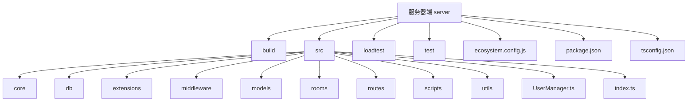

**Diagram sources**
- [server](file://server)
- [src](file://server/src)

**Section sources**
- [project_structure](file://project_structure)

## 核心组件
resgsv1服务器的核心组件包括：`index.ts`作为服务入口，`UserManager.ts`负责用户会话管理，`game.ts`和`lobby.ts`定义游戏房间和大厅逻辑，`sgs.ts`提供游戏核心数据和逻辑，`auth.ts`处理用户认证，以及`ecosystem.config.js`配置PM2进程管理。

**Section sources**
- [index.ts](file://server/src/index.ts#L1-L102)
- [UserManager.ts](file://server/src/UserManager.ts#L1-L149)
- [game.ts](file://server/src/rooms/game.ts#L1-L799)
- [lobby.ts](file://server/src/rooms/lobby.ts#L1-L58)
- [sgs.ts](file://server/src/core/sgs.ts#L1-L799)
- [auth.ts](file://server/src/routes/auth.ts#L1-L59)

## 系统架构概述
resgsv1采用微服务架构思想，以Colyseus为核心构建实时游戏服务器。系统通过HTTP服务器接收客户端请求，经由WebSocket网关建立持久连接，游戏房间集群处理具体游戏逻辑，数据库存储用户数据和游戏状态。

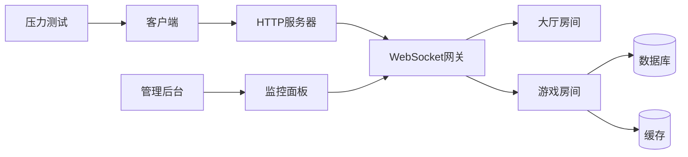

**Diagram sources**
- [index.ts](file://server/src/index.ts#L1-L102)
- [game.ts](file://server/src/rooms/game.ts#L1-L799)
- [lobby.ts](file://server/src/rooms/lobby.ts#L1-L58)

## 详细组件分析

### 服务启动流程分析
系统启动流程从`index.ts`文件开始，初始化Express应用，配置CORS和body-parser中间件，注册认证、管理、应用路由，创建Colyseus服务器实例，并定义大厅和游戏房间。

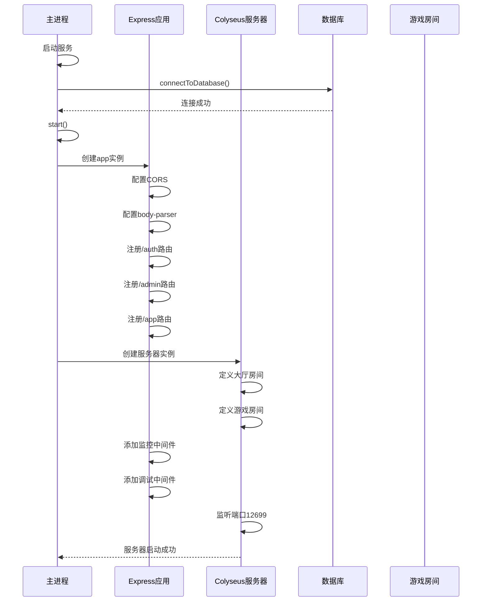

**Diagram sources**
- [index.ts](file://server/src/index.ts#L1-L102)

**Section sources**
- [index.ts](file://server/src/index.ts#L1-L102)

### 用户管理组件分析
`UserManager`类负责管理在线用户会话，包括用户登录、加入大厅、加入房间、离开房间等操作。它维护了一个全局的在线用户映射表，存储用户数据、令牌、最后活动时间和房间信息。

```mermaid
classDiagram
class UserManager {
+static inst : UserManager
+onlinePlayers : { [username : string] : PlayerSession }
+login(user : DbUser) : string
+joinLobby(username : string, client : Client) : void
+leaveLobby(client : Client) : void
+joinRoom(username : string, room : GameRoom, client : Client) : void
+leaveRoom(username : string, roomId : string, reconnectToken? : string) : void
+getPlayerRooms(username : string) : RoomInfo[]
+findPlayerByClinet(sessionId : string) : PlayerSession | null
+broadcast(message : string) : void
}
class PlayerSession {
+userdata : DbUser
+token : string
+lastActive : Date
+lobbyClient : Client | null
+rooms : { [roomId : string] : RoomConnection }
}
class RoomConnection {
+room : GameRoom
+client : Client
+reconnectToken? : string
}
class DbUser {
+_id : string
+username : string
+profile : UserProfile
+privileges : UserPrivileges
+status : UserStatus
+statsByMode : { [mode : string] : GameStats }
}
class UserProfile {
+avatar : string
+title : string
}
class UserPrivileges {
+admin : boolean
+betaTester : boolean
}
class UserStatus {
+isMuted : boolean
+muteExpires? : Date
+isGameBanned : boolean
+gameBanExpires? : Date
}
class GameStats {
+matches : number
+wins : number
+escapes : number
}
UserManager "1" --> "0..*" PlayerSession : 包含
PlayerSession "1" --> "1" DbUser : 关联
PlayerSession "1" --> "0..*" RoomConnection : 包含
```

**Diagram sources**
- [UserManager.ts](file://server/src/UserManager.ts#L1-L149)

**Section sources**
- [UserManager.ts](file://server/src/UserManager.ts#L1-L149)

### 游戏房间组件分析
`GameRoom`类继承自Colyseus的Room类，处理游戏房间的生命周期事件和消息通信。它管理玩家状态、旁观者、投降、举报、屏蔽等游戏逻辑，并与数据库交互记录游戏结果。

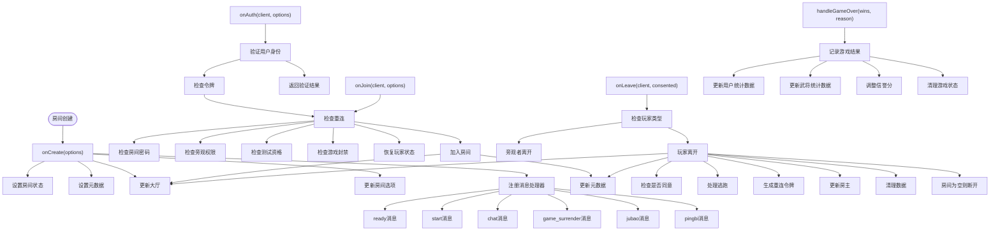

**Diagram sources**
- [game.ts](file://server/src/rooms/game.ts#L1-L799)

**Section sources**
- [game.ts](file://server/src/rooms/game.ts#L1-L799)

### 大厅房间组件分析
`CustomLobbyRoom`类继承自Colyseus的LobbyRoom类，管理大厅房间的用户连接和断开事件，维护在线玩家数量，并处理用户重连逻辑。

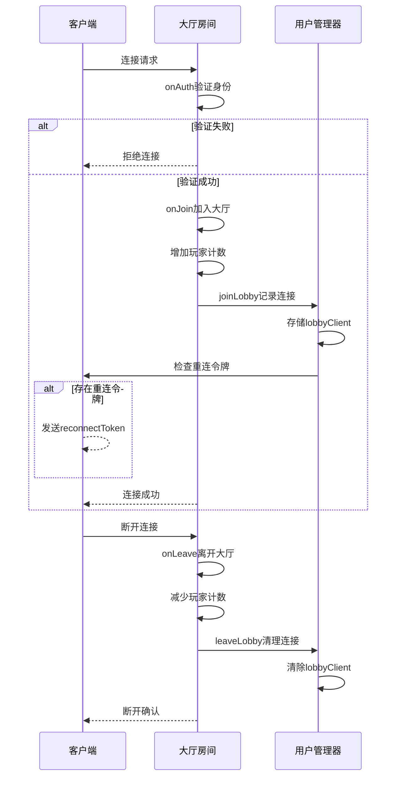

**Diagram sources**
- [lobby.ts](file://server/src/rooms/lobby.ts#L1-L58)

**Section sources**
- [lobby.ts](file://server/src/rooms/lobby.ts#L1-L58)

## 依赖关系分析
系统各组件之间存在明确的依赖关系，通过依赖注入和模块化设计实现松耦合。核心依赖关系包括：`index.ts`依赖`UserManager`、`UserService`等服务类；`game.ts`依赖`UserManager`、`UserService`、`ReputationService`等；`auth.ts`依赖`UserService`和`UserManager`。

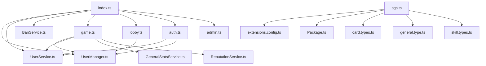

**Diagram sources**
- [index.ts](file://server/src/index.ts#L1-L102)
- [game.ts](file://server/src/rooms/game.ts#L1-L799)
- [auth.ts](file://server/src/routes/auth.ts#L1-L59)
- [lobby.ts](file://server/src/rooms/lobby.ts#L1-L58)
- [sgs.ts](file://server/src/core/sgs.ts#L1-L799)
- [extensions.config.ts](file://server/src/core/extensions.config.ts#L1-L10)

**Section sources**
- [index.ts](file://server/src/index.ts#L1-L102)
- [game.ts](file://server/src/rooms/game.ts#L1-L799)
- [auth.ts](file://server/src/routes/auth.ts#L1-L59)

## 性能与可扩展性设计
系统采用多种设计模式提升性能和可扩展性。通过Colyseus的实时状态同步机制减少网络传输量，使用内存缓存频繁访问的数据，支持水平扩展的房间集群架构。

### 可扩展性设计
系统通过配置文件和环境变量支持灵活的资源分配和实例扩展。PM2配置允许根据CPU核心数自动调整工作进程数量，实现负载均衡。

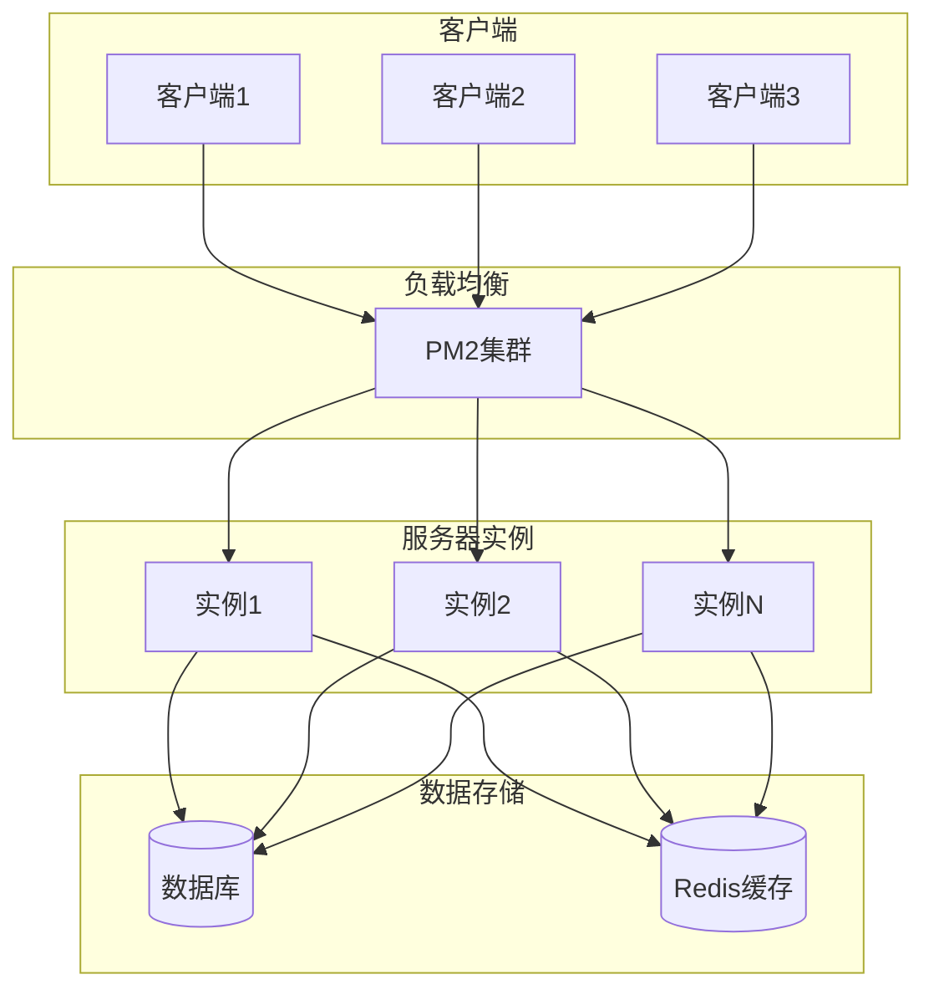

**Diagram sources**
- [ecosystem.config.js](file://server/ecosystem.config.js#L1-L23)

**Section sources**
- [ecosystem.config.js](file://server/ecosystem.config.js#L1-L23)

### 性能优化策略
系统采用多项性能优化策略，包括：
- 状态差异同步：仅传输状态变化部分
- 消息批处理：合并多个消息减少网络开销
- 内存缓存：缓存用户数据和房间状态
- 异步处理：非关键操作异步执行

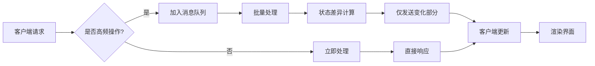

**Diagram sources**
- [game.ts](file://server/src/rooms/game.ts#L1-L799)
- [index.ts](file://server/src/index.ts#L1-L102)

## 进程管理与故障恢复
系统使用PM2进行进程管理和故障恢复，通过`ecosystem.config.js`配置文件定义应用运行参数，实现自动重启、负载均衡和日志管理。

### PM2配置分析
PM2配置文件定义了应用名称、脚本路径、实例数量、执行模式等关键参数，确保服务的高可用性和稳定性。

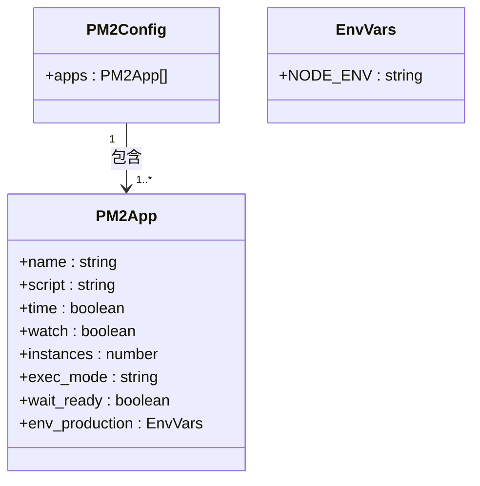

**Diagram sources**
- [ecosystem.config.js](file://server/ecosystem.config.js#L1-L23)

**Section sources**
- [ecosystem.config.js](file://server/ecosystem.config.js#L1-L23)

### 故障恢复策略
系统实现多层次的故障恢复机制，包括：
- 进程级恢复：PM2自动重启崩溃的进程
- 连接级恢复：WebSocket断线重连和状态恢复
- 数据级恢复：数据库事务和备份机制

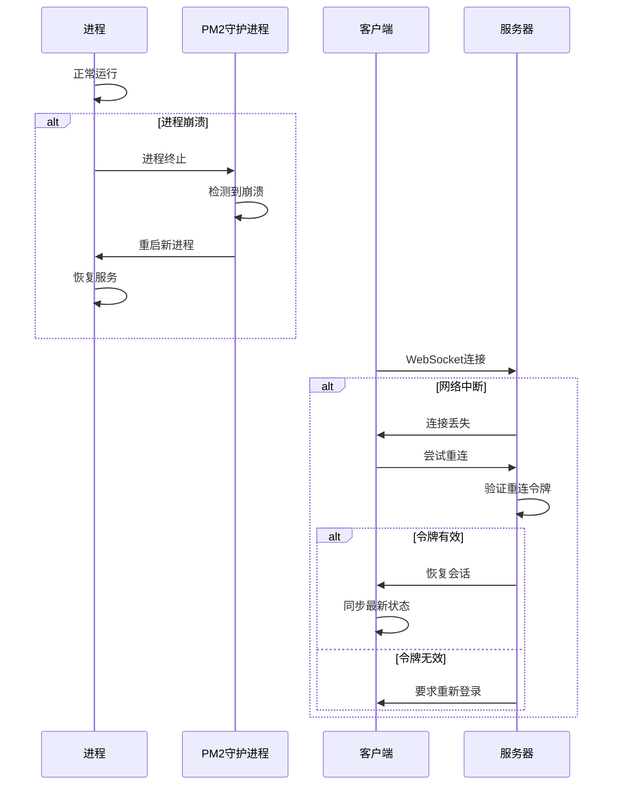

**Diagram sources**
- [ecosystem.config.js](file://server/ecosystem.config.js#L1-L23)
- [game.ts](file://server/src/rooms/game.ts#L1-L799)
- [UserManager.ts](file://server/src/UserManager.ts#L1-L149)

## 日志与监控
系统集成Colyseus Monitor和Playground工具，提供实时监控和调试功能。同时通过console.log输出关键日志，便于问题排查。

### 监控面板功能
Colyseus Monitor提供房间状态、客户端连接、消息统计等实时监控数据，帮助开发者了解服务器运行状况。

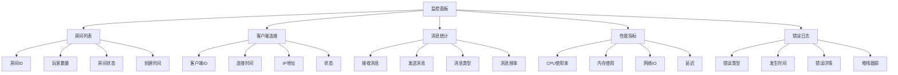

**Diagram sources**
- [index.ts](file://server/src/index.ts#L1-L102)

**Section sources**
- [index.ts](file://server/src/index.ts#L1-L102)

## 生产环境部署建议
为确保系统在生产环境的稳定运行，建议采取以下部署策略：

### 部署架构
采用多实例部署架构，通过负载均衡器分发流量，确保高可用性和可扩展性。

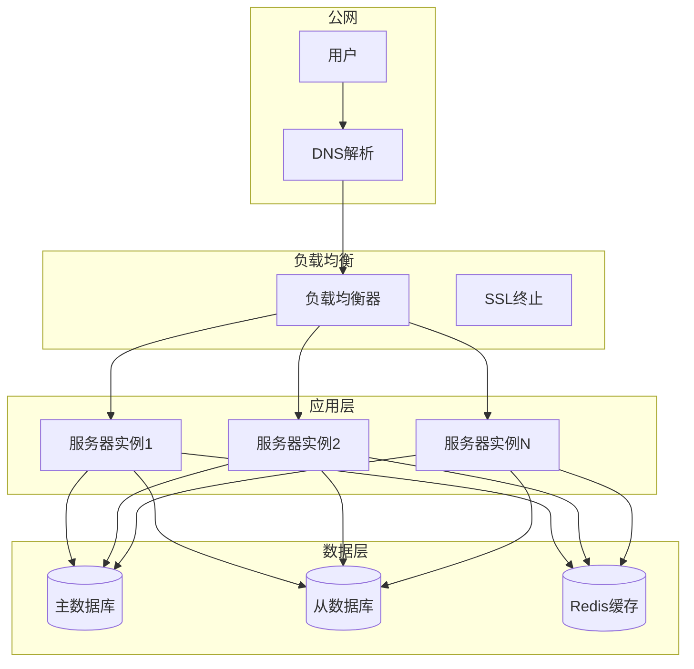

### 最佳实践
1. **安全配置**：启用HTTPS，配置安全的CORS策略
2. **性能调优**：根据实际负载调整PM2实例数量
3. **监控告警**：设置关键指标的监控和告警
4. **备份策略**：定期备份数据库和重要配置
5. **灰度发布**：采用蓝绿部署或金丝雀发布策略
6. **日志管理**：集中收集和分析日志数据

**Section sources**
- [index.ts](file://server/src/index.ts#L1-L102)
- [ecosystem.config.js](file://server/ecosystem.config.js#L1-L23)
- [README.md](file://server/README.md#L1-L29)