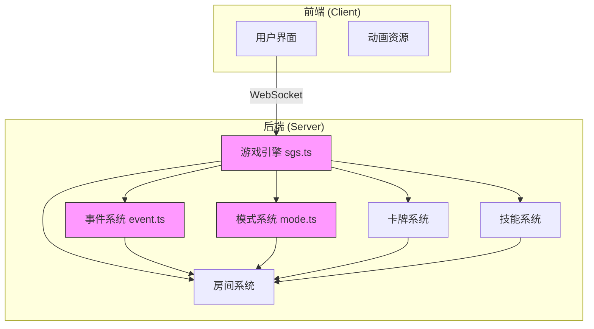
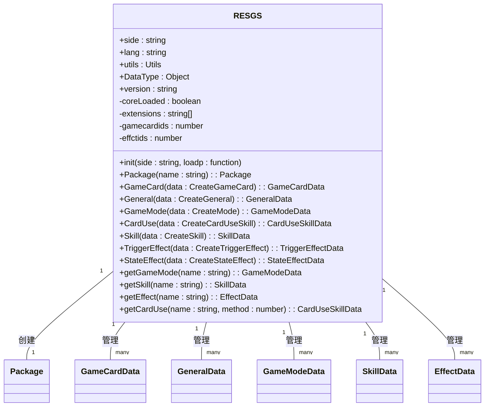
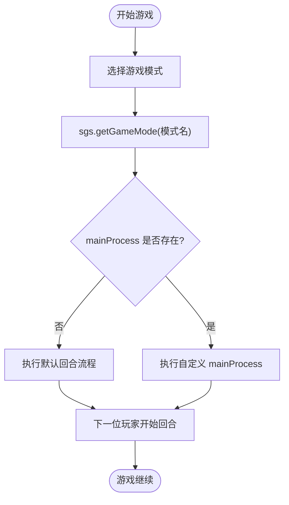
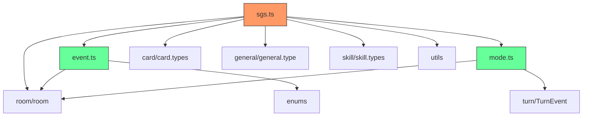

# 游戏逻辑

<cite>
**本文档引用的文件**
- [sgs.ts](file://server/src/core/sgs.ts)
- [event.ts](file://server/src/core/event/event.ts)
- [mode.ts](file://server/src/core/mode/mode.ts)
</cite>

## 目录
1. [简介](#简介)
2. [项目结构](#项目结构)
3. [核心组件](#核心组件)
4. [架构概览](#架构概览)
5. [详细组件分析](#详细组件分析)
6. [依赖分析](#依赖分析)
7. [性能考虑](#性能考虑)
8. [故障排除指南](#故障排除指南)
9. [结论](#结论)

## 简介
本文档深入分析了 `resgsv1` 核心游戏引擎的实现，重点介绍游戏逻辑的核心模块。文档详细阐述了游戏状态机（sgs.ts）、事件系统（event.ts）和模式系统（mode.ts）的设计与实现机制。通过本分析，读者将全面理解游戏阶段转换、回合管理、事件驱动架构以及多模式支持的技术细节。文档结合代码结构、数据流和交互逻辑，为开发者提供清晰的系统认知，便于后续功能扩展和维护。

## 项目结构
`resgsv1` 项目采用前后端分离的架构。前端位于 `client` 目录，主要负责用户界面、动画资源和客户端逻辑。后端位于 `server` 目录，是游戏逻辑的核心，其中 `server/src/core` 是游戏引擎的主干。

游戏逻辑的核心文件位于 `server/src/core` 目录下：
- `sgs.ts`：游戏引擎的主类，负责初始化、管理全局数据和提供创建游戏元素的工厂方法。
- `event/`：事件系统，定义了事件的基类、触发机制和各种具体事件类型。
- `mode/mode.ts`：模式系统，定义了游戏模式的数据结构和配置方式。
- `card/`：卡牌系统，定义卡牌类型、属性和使用逻辑。
- `skill/`：技能系统，定义技能和效果的结构。
- `room/`：房间系统，管理游戏房间的状态、玩家和流程。

这种模块化的设计使得各个系统职责清晰，便于独立开发和测试。

## 核心组件
`resgsv1` 的游戏逻辑由三个核心组件构成：游戏引擎（`sgs.ts`）、事件系统（`event.ts`）和模式系统（`mode.ts`）。游戏引擎是全局单例，负责协调和管理所有其他组件。它通过工厂方法（如 `GameCard`, `Skill`, `GameMode`）来创建游戏中的各种实体。事件系统是驱动游戏规则的核心，采用事件驱动架构，通过发布-订阅模式处理游戏中的各种动作和状态变化。模式系统则提供了对不同游戏规则的支持，允许通过配置来切换标准模式、战争模式等。

**Section sources**
- [sgs.ts](file://server/src/core/sgs.ts#L1-L991)
- [event.ts](file://server/src/core/event/event.ts#L1-L169)
- [mode.ts](file://server/src/core/mode/mode.ts#L1-L30)

## 架构概览


**Diagram sources**
- [sgs.ts](file://server/src/core/sgs.ts#L1-L991)
- [event.ts](file://server/src/core/event/event.ts#L1-L169)
- [mode.ts](file://server/src/core/mode/mode.ts#L1-L30)

## 详细组件分析

### 游戏引擎 (sgs.ts) 分析
`RESGS` 类是整个游戏引擎的入口和核心。它采用单例模式，确保全局只有一个实例。该类的主要职责包括：
1.  **初始化 (`init`)**：在游戏启动时调用，负责混合（mixins）各种功能到核心类（如 `GameRoom`, `GameCard`），并加载默认的游戏模式和规则。
2.  **数据管理**：通过 `Map` 对象集中管理所有游戏数据，如 `cards`（卡牌）、`generals`（武将）、`skills`（技能）、`modes`（模式）等。
3.  **工厂方法**：提供一系列 `public` 方法（如 `GameCard`, `General`, `Skill`, `GameMode`）来创建游戏中的各种实体。这些方法不仅创建对象，还会将其自动注册到全局的 `Map` 中，并返回一个带有附加功能（如 `addEffect`）的对象。
4.  **全局访问**：通过 `globalThis.sgs = RESGS.getInstance()` 将自身暴露到全局作用域，方便代码其他部分访问。



**Diagram sources**
- [sgs.ts](file://server/src/core/sgs.ts#L1-L991)

**Section sources**
- [sgs.ts](file://server/src/core/sgs.ts#L1-L991)

### 事件系统 (event.ts) 分析
事件系统是 `resgsv1` 实现游戏规则的核心驱动力。它基于事件驱动架构，通过 `EventProcess` 抽象类来定义事件的通用行为。

**关键机制：**
1.  **事件流程 (`exec`)**：`exec` 方法是事件处理的核心。它在一个循环中依次触发 `eventTriggers` 数组中的每个时机（Triggers），直到事件结束。处理完成后，再触发 `endTriggers` 中的结束时机。
2.  **时机触发 (`trigger_func`)**：该方法负责执行一个具体的时机。它会先调用 `*_Before` 钩子函数，然后通过 `room.trigger` 通知房间系统，最后调用 `*_After` 钩子函数。
3.  **事件结束处理 (`processCompleted`)**：当事件处理完毕后，此方法会被调用。它负责清理工作，例如将处理区（processingArea）的卡牌移动到弃牌堆，并从事件队列中移除自身。
4.  **动态插入时机 (`insert`)**：允许在事件处理过程中动态地向 `eventTriggers` 或 `endTriggers` 中插入新的时机，这为实现复杂的连锁反应（如“闪”响应“杀”）提供了基础。

```mermaid
sequenceDiagram
participant Event as EventProcess
participant Room as GameRoom
participant Effect as Effect
Event->>Event : exec()
loop 处理每个时机
Event->>Event : check_event()
alt 事件未结束
Event->>Event : trigger_func(下一个时机)
Event->>Event : 调用 *_Before 钩子
Event->>Room : trigger(时机, 事件)
Room->>Effect : 执行监听该时机的效果
Effect->>Event : 可能调用 insert() 插入新时机
Event->>Event : 调用 *_After 钩子
else 事件结束
break
end
end
Event->>Event : processCompleted()
Event->>Room : moveCards(处理区->弃牌堆)
Event->>Room : 从事件队列移除自身
```

**Diagram sources**
- [event.ts](file://server/src/core/event/event.ts#L1-L169)

**Section sources**
- [event.ts](file://server/src/core/event/event.ts#L1-L169)

### 模式系统 (mode.ts) 分析
模式系统通过 `GameModeData` 接口来定义一个游戏模式的配置。其核心设计允许游戏支持多种不同的玩法。

**关键属性：**
- `name`: 模式的唯一标识符。
- `maxPlayer`: 该模式支持的最大玩家数量。
- `settings`: 额外的设置项，可用于配置模式的特定规则。
- `rules`: 指向一个技能（Skill）的名称，这个技能包含了该模式特有的核心规则。
- `mainProcess`: 一个可选的异步函数，用于自定义游戏的主流程逻辑（即回合交替的规则）。如果不提供，则使用默认的顺时针轮转。

通过 `sgs.GameMode()` 工厂方法可以创建并注册新的游戏模式。游戏引擎通过 `getGameMode()` 方法根据名称获取对应的模式配置，从而在游戏开始时应用相应的规则。



**Diagram sources**
- [mode.ts](file://server/src/core/mode/mode.ts#L1-L30)

**Section sources**
- [mode.ts](file://server/src/core/mode/mode.ts#L1-L30)

## 依赖分析


**Diagram sources**
- [sgs.ts](file://server/src/core/sgs.ts#L1-L991)
- [event.ts](file://server/src/core/event/event.ts#L1-L169)
- [mode.ts](file://server/src/core/mode/mode.ts#L1-L30)

## 性能考虑
虽然当前代码未直接体现性能优化，但其架构设计为性能优化提供了良好基础：
1.  **事件队列**：使用 `room.events` 数组作为事件队列，保证了事件处理的顺序性。
2.  **Map 数据结构**：使用 `Map` 而非普通对象来存储大量游戏数据（如卡牌、技能），提供了更高效的查找性能（O(1)）。
3.  **异步处理**：所有关键方法（如 `exec`, `trigger_func`）都声明为 `async`，允许非阻塞的异步操作，避免了长时间运行的同步代码阻塞游戏主线程。
4.  **内存管理**：`processCompleted` 方法在事件结束后主动清理引用，有助于垃圾回收。

## 故障排除指南
- **问题：新创建的卡牌/技能/模式未生效。**
  - **检查点**：确认是否通过 `sgs` 实例的工厂方法（如 `sgs.GameCard()`）创建。直接 `new` 对象不会被注册到全局管理器中。
- **问题：事件没有被触发。**
  - **检查点**：检查 `eventTriggers` 数组是否被正确初始化。确认 `room.trigger()` 调用的时机（Triggers）与事件监听的时机匹配。
- **问题：游戏模式切换后规则未改变。**
  - **检查点**：确认 `GameModeData.rules` 字段指向的技能名称是正确的，并且该技能已通过 `sgs.Skill()` 方法创建并注册。

**Section sources**
- [sgs.ts](file://server/src/core/sgs.ts#L1-L991)
- [event.ts](file://server/src/core/event/event.ts#L1-L169)

## 结论
`resgsv1` 的游戏逻辑设计精巧，通过 `sgs.ts`、`event.ts` 和 `mode.ts` 三个核心文件构建了一个灵活、可扩展的框架。事件驱动架构解耦了游戏动作与规则响应，使得添加新技能和效果变得简单。模式系统的设计支持了游戏的多样性。整体代码结构清晰，职责分明，为开发复杂的游戏规则提供了坚实的基础。未来可在此架构上进一步完善状态持久化、网络同步和更复杂的AI逻辑。