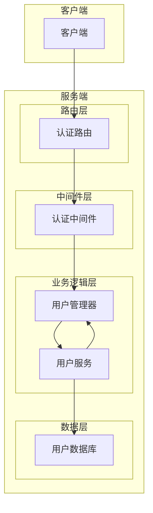
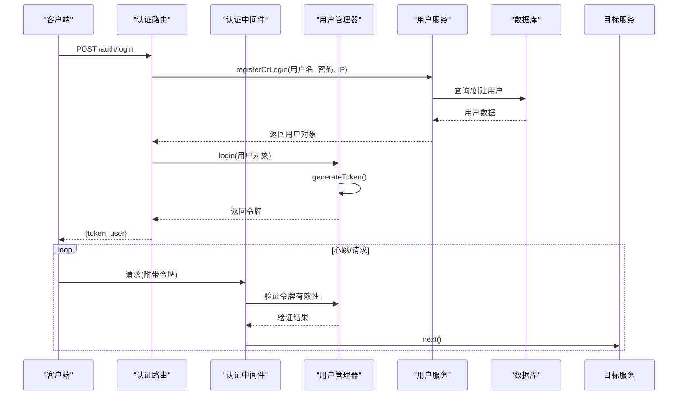
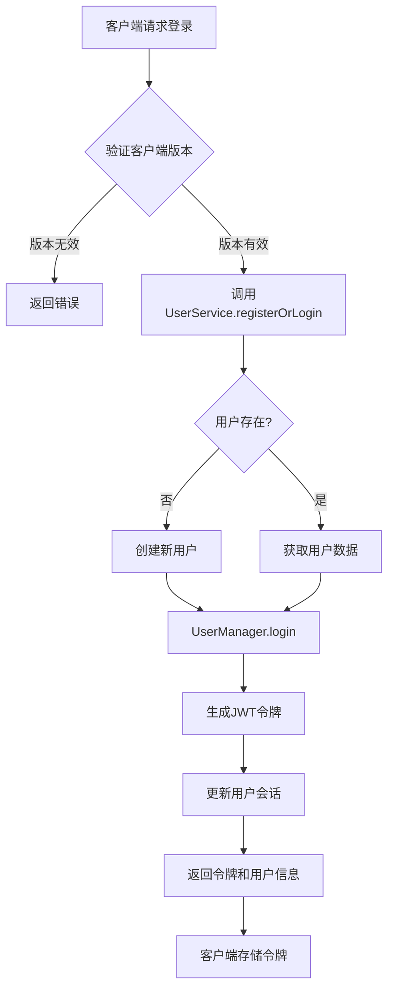
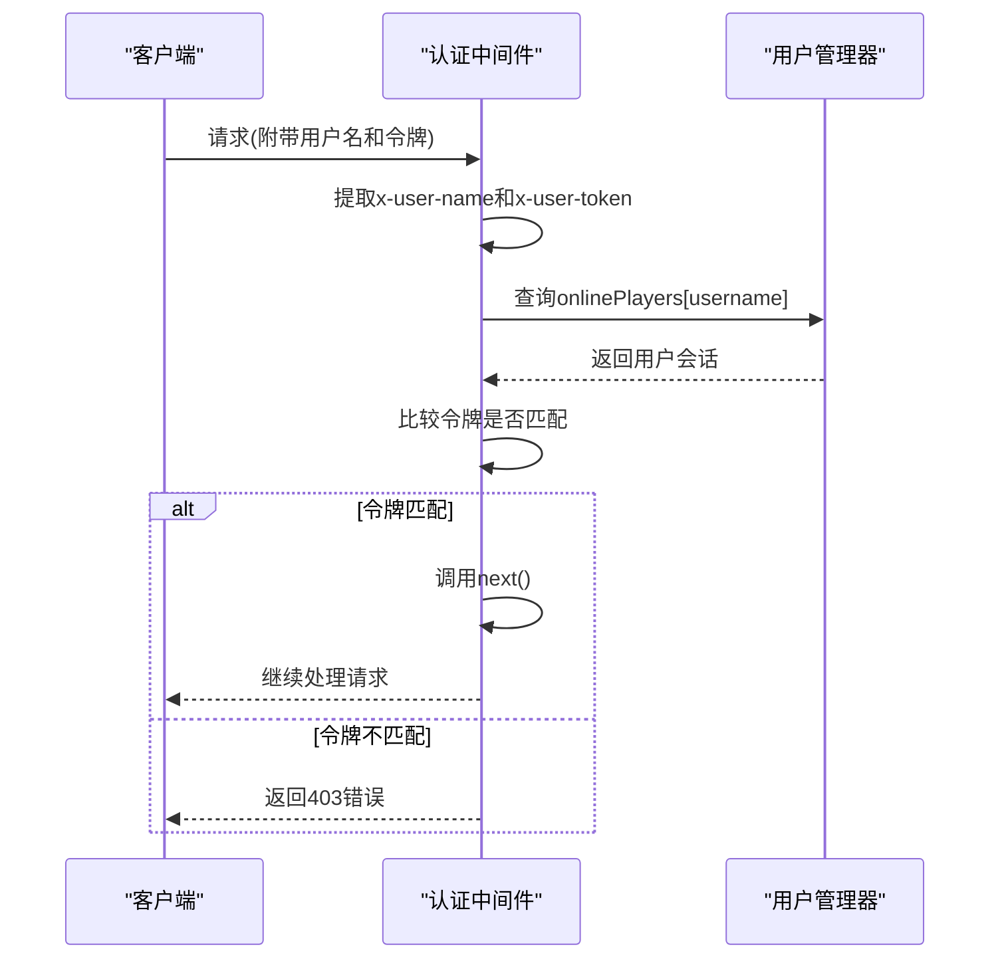
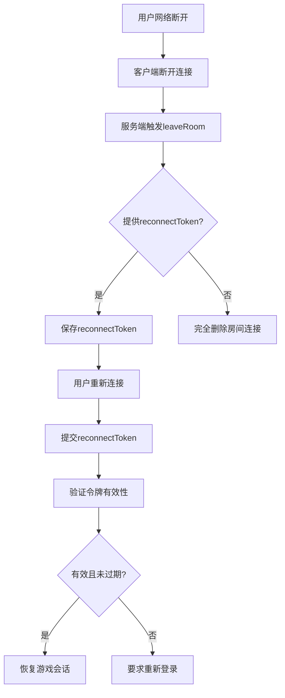

# 用户管理

<cite>
**本文档引用文件**  
- [UserManager.ts](file://server/src/UserManager.ts#L1-L150)
- [auth.ts](file://server/src/middleware/auth.ts#L1-L53)
- [auth.ts](file://server/src/routes/auth.ts#L1-L60)
- [ReconnectToken.ts](file://server/src/models/ReconnectToken.ts#L1-L9)
- [User.ts](file://server/src/db/models/User.ts)
- [UserService.ts](file://server/src/db/services/UserService.ts)
</cite>

## 目录
1. [简介](#简介)
2. [项目结构](#项目结构)
3. [核心组件](#核心组件)
4. [架构概览](#架构概览)
5. [详细组件分析](#详细组件分析)
6. [依赖分析](#依赖分析)
7. [性能考虑](#性能考虑)
8. [故障排除指南](#故障排除指南)
9. [结论](#结论)

## 简介
本文档详细介绍了resgsv1项目中用户管理系统的实现机制，重点涵盖用户认证、会话管理、断线重连、权限控制和安全防护等核心功能。系统基于Node.js和Express框架构建，采用内存存储与JWT令牌相结合的方式实现高效、安全的用户状态管理。文档将深入分析UserManager类的设计原理、认证中间件的工作流程以及断线重连机制的实现细节，为开发者提供全面的技术参考。

## 项目结构
用户管理系统主要分布在服务器端的`src`目录下，其核心组件包括用户管理器、认证中间件、路由处理、数据模型和服务层。系统采用分层架构设计，各组件职责明确，耦合度低。



**图示来源**  
- [UserManager.ts](file://server/src/UserManager.ts#L1-L150)
- [auth.ts](file://server/src/middleware/auth.ts#L1-L53)
- [auth.ts](file://server/src/routes/auth.ts#L1-L60)

## 核心组件
用户管理系统的核心组件包括UserManager（用户管理器）、认证中间件(auth.ts)、认证路由(auth.ts)和ReconnectToken模型。UserManager负责维护在线用户状态，实现用户登录、房间加入、在线状态跟踪等核心功能。认证中间件负责验证用户身份，确保请求的合法性。认证路由处理用户登录和注册请求，协调用户服务和用户管理器完成认证流程。ReconnectToken模型用于支持断线重连功能，确保用户在网络中断后能够安全恢复游戏会话。

**本节来源**  
- [UserManager.ts](file://server/src/UserManager.ts#L1-L150)
- [auth.ts](file://server/src/middleware/auth.ts#L1-L53)
- [auth.ts](file://server/src/routes/auth.ts#L1-L60)
- [ReconnectToken.ts](file://server/src/models/ReconnectToken.ts#L1-L9)

## 架构概览
用户管理系统的整体架构采用典型的分层设计模式，从前端客户端到后端数据存储，各层之间通过明确定义的接口进行通信。系统的核心是UserManager单例对象，它作为内存中的用户状态中心，维护所有在线用户的信息。



**图示来源**  
- [UserManager.ts](file://server/src/UserManager.ts#L1-L150)
- [auth.ts](file://server/src/middleware/auth.ts#L1-L53)
- [auth.ts](file://server/src/routes/auth.ts#L1-L60)

## 详细组件分析

### 用户管理器分析
UserManager类是用户管理系统的核心，采用单例模式实现，确保全局唯一实例。它负责维护在线用户的状态信息，包括用户数据、认证令牌、最后活跃时间、大厅客户端连接和房间连接等。

```mermaid
classDiagram
class UserManager {
+static _inst : UserManager
+static get inst() : UserManager
+onlinePlayers : { [username : string] : PlayerSession }
+DISCONNECT_GRACE_PERIOD : number
-generateToken(user : DbUser) : string
+login(user : DbUser) : string
+joinLobby(username : string, client : Client) : void
+leaveLobby(client : Client) : void
+joinRoom(username : string, room : GameRoom, client : Client) : void
+leaveRoom(username : string, roomId : string, token? : string) : void
+getPlayerRooms(username : string) : RoomInfo[]
+findPlayerByClinet(sessionId : string) : PlayerSession | null
+broadcast(message : string) : void
}
class PlayerSession {
+userdata : DbUser
+token : string
+lastActive : Date
+lobbyClient : Client | null
+rooms : { [roomId : string] : RoomConnection }
}
class RoomConnection {
+room : GameRoom
+client : Client
+reconnectToken? : string
}
class ReconnectToken {
+token : string
+roomId : string
+playerId : string
+username : string
+createdAt : number
+expiresAt : number
}
UserManager --> PlayerSession : "包含"
PlayerSession --> RoomConnection : "包含"
UserManager --> ReconnectToken : "生成"
```

**图示来源**  
- [UserManager.ts](file://server/src/UserManager.ts#L1-L150)
- [ReconnectToken.ts](file://server/src/models/ReconnectToken.ts#L1-L9)

#### 用户数据结构设计
UserManager中的`onlinePlayers`对象是核心数据结构，采用用户名作为键的哈希表设计，实现O(1)时间复杂度的用户查找。每个用户会话包含以下信息：
- **userdata**: 用户数据库对象，包含用户基本信息和配置
- **token**: JWT认证令牌，用于身份验证
- **lastActive**: 最后活跃时间，用于在线状态跟踪
- **lobbyClient**: 大厅客户端连接，用于大厅通信
- **rooms**: 用户加入的游戏房间映射，支持多房间同时在线

这种设计支持用户在大厅和多个游戏房间之间无缝切换，同时保持单一的认证状态。

#### 内存管理策略
系统采用内存存储用户会话信息，具有高性能优势。为防止内存泄漏，系统通过以下机制管理用户状态：
1. 用户离开大厅或房间时，及时清理对应的客户端引用
2. 通过`lastActive`时间戳跟踪用户活跃状态，可结合定时任务清理长时间未活跃的用户
3. 用户重新登录时，自动更新现有会话，避免重复登录

#### 用户注册与登录机制
用户登录流程在`routes/auth.ts`中实现，具体步骤如下：
1. 客户端发送包含用户名、密码和客户端版本的登录请求
2. 服务端验证客户端版本，防止不兼容的客户端接入
3. UserService调用`registerOrLogin`方法，根据用户名查找用户，若不存在则创建新用户
4. UserManager调用`login`方法，生成JWT令牌并更新用户会话
5. 将令牌和用户信息返回给客户端



**图示来源**  
- [UserManager.ts](file://server/src/UserManager.ts#L1-L150)
- [auth.ts](file://server/src/routes/auth.ts#L1-L60)

### 认证中间件分析
认证中间件(auth.ts)负责保护API端点，确保只有经过认证的用户才能访问受保护的资源。系统提供了两种认证方式：普通用户认证和管理员认证。

#### 普通用户认证流程
`authenticateUser`中间件通过以下步骤验证用户身份：
1. 从请求头中提取用户名(`x-user-name`)和令牌(`x-user-token`)
2. 在UserManager的`onlinePlayers`映射中查找对应用户
3. 验证存储的令牌与请求提供的令牌是否匹配
4. 如果验证通过，调用`next()`进入下一个处理程序；否则返回403错误

这种基于内存的令牌验证方式避免了每次请求都访问数据库，显著提高了性能。

#### 管理员认证流程
`authenticateAdmin`中间件在普通用户认证的基础上增加了权限检查：
1. 首先执行与普通用户相同的用户名提取和存在性验证
2. 调用UserService的`checkAdmin`方法检查用户是否具有管理员权限
3. 只有同时通过身份验证和权限检查的请求才能继续执行



**图示来源**  
- [auth.ts](file://server/src/middleware/auth.ts#L1-L53)
- [UserManager.ts](file://server/src/UserManager.ts#L1-L150)

### 断线重连机制分析
断线重连机制是游戏系统的关键功能，确保用户在网络不稳定的情况下能够恢复游戏会话。该机制通过ReconnectToken模型和UserManager的房间管理功能协同实现。

#### ReconnectToken模型设计
ReconnectToken接口定义了断线重连所需的关键信息：
- **token**: 重新连接令牌，用于身份验证
- **roomId**: 目标房间ID
- **playerId**: 玩家ID
- **username**: 用户名
- **createdAt**: 创建时间戳
- **expiresAt**: 过期时间戳

该模型支持令牌的时效性管理，防止重放攻击。

#### 使用场景
当用户从游戏房间断开连接时，系统调用`UserManager.leaveRoom`方法，并传入`reconnectToken`参数。此时，系统不会立即删除房间连接信息，而是保留`reconnectToken`，允许用户在一定时间内使用该令牌重新连接到同一房间。



**图示来源**  
- [UserManager.ts](file://server/src/UserManager.ts#L1-L150)
- [ReconnectToken.ts](file://server/src/models/ReconnectToken.ts#L1-L9)

### 用户权限管理与安全防护
系统实现了多层次的安全防护机制，确保用户数据和游戏环境的安全。

#### 会话劫持防护
系统通过以下措施防止会话劫持：
1. **令牌绑定**: JWT令牌与特定用户绑定，无法在不同用户间共享
2. **内存验证**: 服务端在内存中维护当前有效的令牌，即使攻击者获取了令牌，如果服务端已将其标记为无效，则无法通过验证
3. **HTTPS传输**: 假设生产环境中使用HTTPS加密传输，防止令牌在传输过程中被窃取

#### 暴力破解防护
虽然当前代码未直接实现暴力破解防护，但系统架构支持以下防护措施：
1. **客户端版本检查**: 在登录接口中验证`client_version`，可以阻止自动化脚本使用旧版本客户端进行攻击
2. **IP记录**: UserService在`registerOrLogin`方法中接收IP参数，可基于此实现IP频率限制
3. **账户锁定**: 可扩展UserService实现失败登录次数统计和账户临时锁定功能

## 依赖分析
用户管理系统与其他组件的集成主要通过清晰的接口定义实现，降低了耦合度。

```mermaid
graph TD
UserManager --> UserService : "依赖"
UserManager --> GameRoom : "引用"
UserManager --> Client : "管理"
AuthMiddleware --> UserManager : "查询状态"
AuthRouter --> UserManager : "更新状态"
AuthRouter --> UserService : "用户验证"
GameRoom --> UserManager : "状态查询"
```

**图示来源**  
- [UserManager.ts](file://server/src/UserManager.ts#L1-L150)
- [auth.ts](file://server/src/middleware/auth.ts#L1-L53)
- [auth.ts](file://server/src/routes/auth.ts#L1-L60)

### 与房间系统的集成
UserManager与房间系统(game.ts)通过`joinRoom`和`leaveRoom`方法紧密协作。当用户加入游戏房间时，房间系统调用`joinRoom`方法注册连接；当用户离开时，调用`leaveRoom`方法注销连接。这种设计使得UserManager能够准确跟踪用户在各个房间的状态，支持跨房间消息广播等功能。

### 与游戏逻辑的集成
游戏逻辑组件可以通过UserManager的`findPlayerByClinet`方法，根据客户端会话ID快速定位用户，实现精准的用户操作处理。`broadcast`方法支持向所有在线用户发送系统消息，增强了游戏的社交互动性。

## 性能考虑
在大规模用户并发访问场景下，当前的用户管理方案具有以下性能特点：

### 优势
1. **内存存储**: 用户会话信息存储在内存中，读写速度极快，适合高并发场景
2. **O(1)查找**: 基于哈希表的用户查找，时间复杂度为常数级别
3. **无数据库查询**: 令牌验证不依赖数据库，减少了I/O开销

### 潜在瓶颈与优化方案
1. **内存占用**: 随着在线用户数增加，内存占用线性增长。优化方案包括：
   - 实现会话过期机制，定期清理长时间未活跃的用户
   - 对于超大规模系统，可考虑使用Redis等分布式缓存替代内存存储

2. **单点故障**: 当前UserManager为单实例，存在单点故障风险。优化方案包括：
   - 采用集群部署，使用分布式状态管理
   - 将用户状态持久化到数据库，支持实例故障恢复

3. **水平扩展**: 内存状态难以在多个服务实例间共享。优化方案包括：
   - 引入Redis集群作为共享状态存储
   - 使用粘性会话(Sticky Session)确保同一用户的请求路由到同一实例

## 故障排除指南
### 常见问题及解决方案
1. **用户无法登录**
   - 检查客户端版本是否匹配服务端要求('1.0.92')
   - 验证用户名和密码是否正确
   - 检查UserService是否能正常访问数据库

2. **认证失败(403错误)**
   - 确认客户端正确发送了`x-user-name`和`x-user-token`请求头
   - 检查UserManager中的令牌是否已过期或被覆盖
   - 验证JWT令牌的签名是否正确

3. **断线重连失败**
   - 确认`leaveRoom`调用时是否正确生成了`reconnectToken`
   - 检查令牌是否在有效期内
   - 验证重新连接时提供的令牌是否与存储的令牌匹配

4. **内存泄漏**
   - 检查`leaveLobby`和`leaveRoom`方法是否被正确调用
   - 实现监控机制，定期报告`onlinePlayers`的大小
   - 添加定时任务，清理`lastActive`时间过久的用户会话

**本节来源**  
- [UserManager.ts](file://server/src/UserManager.ts#L1-L150)
- [auth.ts](file://server/src/middleware/auth.ts#L1-L53)
- [auth.ts](file://server/src/routes/auth.ts#L1-L60)

## 结论
resgsv1的用户管理系统设计合理，实现了用户认证、会话管理、断线重连等核心功能。系统采用内存存储和JWT令牌相结合的方式，在保证安全性的同时提供了高性能的用户体验。通过清晰的分层架构和模块化设计，系统具有良好的可维护性和扩展性。对于大规模部署场景，建议引入分布式缓存解决方案以克服单机内存限制，进一步提升系统的可扩展性和可靠性。