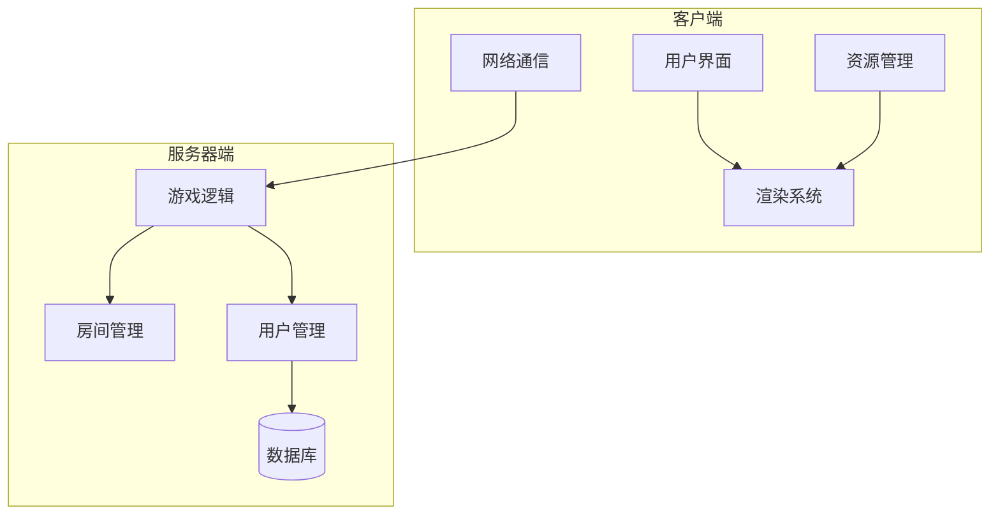
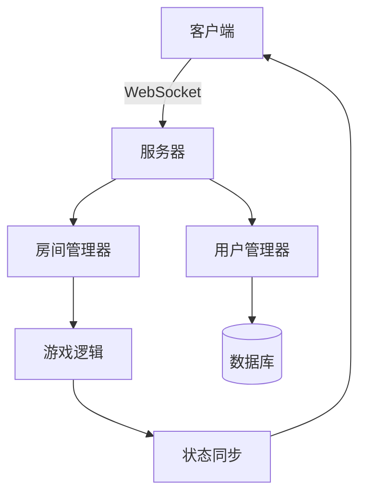
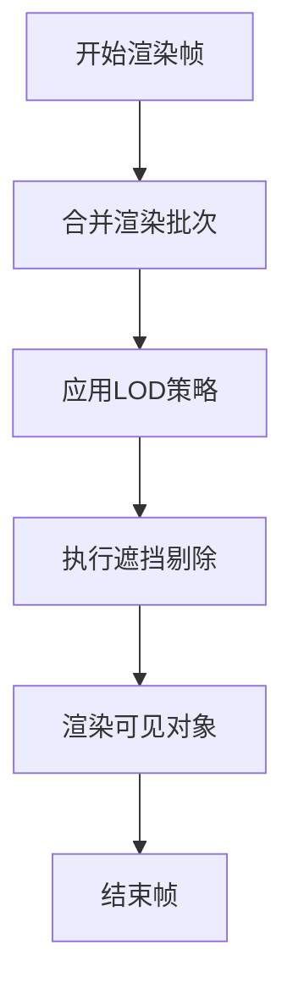
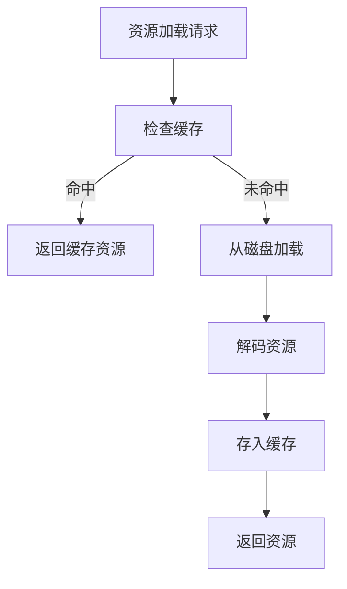
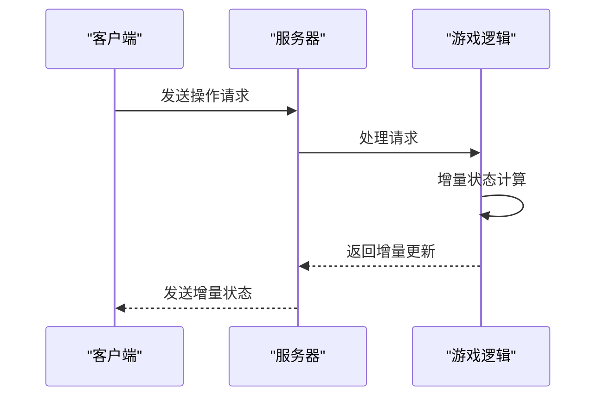
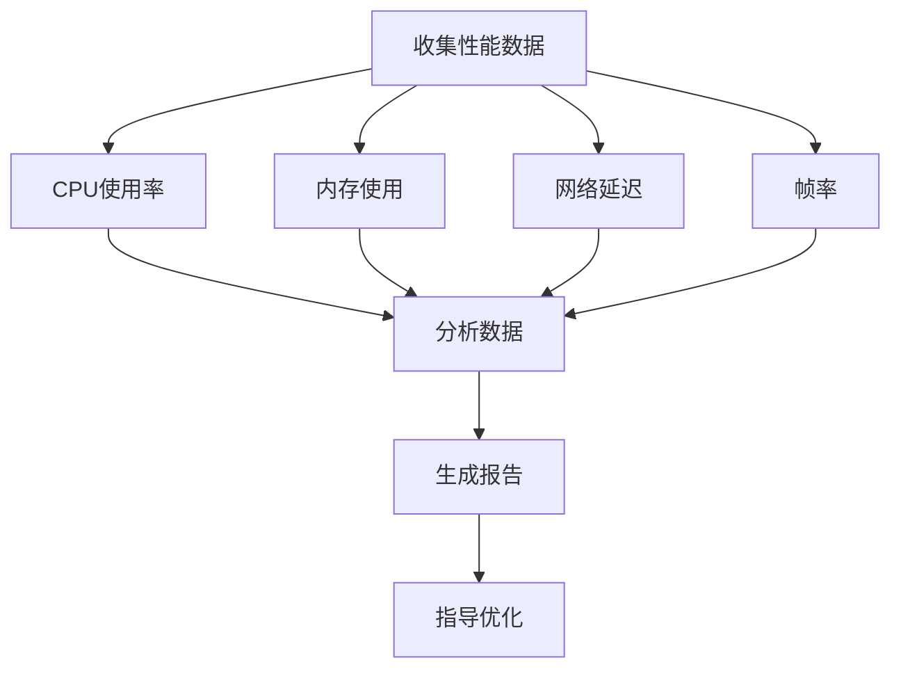
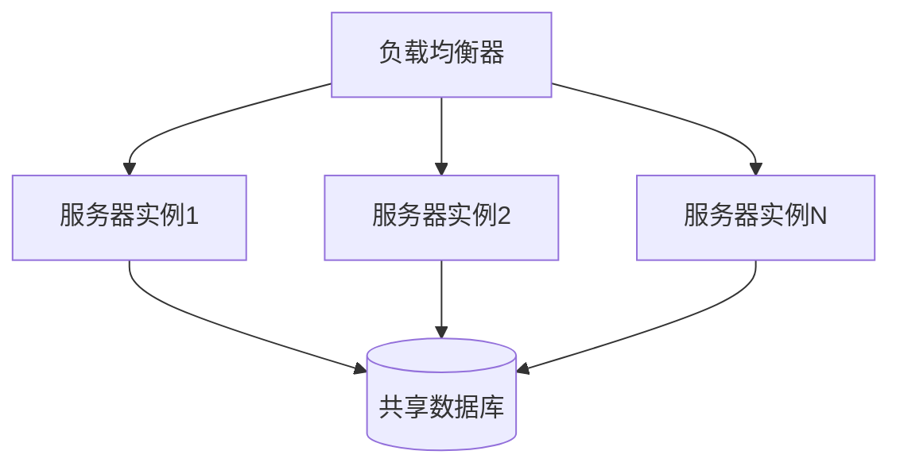
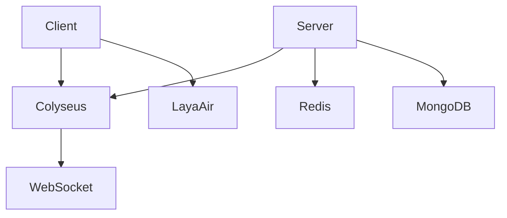

# 性能优化

<cite>
**本文档引用文件**  
- [Main.ts](file://client/src/Main.ts)
- [Client.ts](file://client/src/mgr/Client.ts)
- [Resources.ts](file://client/src/mgr/Resources.ts)
- [RoomStata.ts](file://client/src/models/RoomStata.ts)
- [room.ts](file://server/src/core/room/room.ts)
- [game.ts](file://server/src/rooms/game.ts)
- [lobby.ts](file://server/src/rooms/lobby.ts)
- [UserManager.ts](file://server/src/UserManager.ts)
- [index.ts](file://server/src/index.ts)
- [config.ts](file://client/src/config.ts)
</cite>

## 目录
1. [引言](#引言)
2. [项目结构](#项目结构)
3. [核心组件](#核心组件)
4. [架构概览](#架构概览)
5. [详细组件分析](#详细组件分析)
6. [依赖分析](#依赖分析)
7. [性能考虑](#性能考虑)
8. [故障排除指南](#故障排除指南)
9. [结论](#结论)

## 引言

本技术文档旨在全面阐述resgsv1项目在客户端与服务器端的性能优化策略。文档将深入探讨渲染优化、资源管理、游戏逻辑优化、网络同步、性能监控及可扩展性设计等关键领域。通过结合代码示例与架构分析，为开发者提供一套完整的性能调优方案，以应对高并发、大规模玩家同步等核心挑战。

## 项目结构

resgsv1项目采用典型的客户端-服务器分离架构，前端基于LayaAir引擎构建，后端使用Node.js配合Colyseus框架实现实时同步。



**图表来源**
- [Main.ts](file://client/src/Main.ts)
- [index.ts](file://server/src/index.ts)

**章节来源**
- [Main.ts](file://client/src/Main.ts)
- [index.ts](file://server/src/index.ts)

## 核心组件

项目的核心组件包括客户端的渲染引擎、资源管理器和网络客户端，以及服务器端的房间管理、用户管理和游戏逻辑处理器。客户端通过Colyseus协议与服务器建立实时连接，实现状态同步。

**章节来源**
- [Client.ts](file://client/src/mgr/Client.ts)
- [room.ts](file://server/src/core/room/room.ts)

## 架构概览

系统采用分层架构，客户端负责用户交互与视觉呈现，服务器端负责权威状态管理与逻辑计算。



**图表来源**
- [Client.ts](file://client/src/mgr/Client.ts)
- [UserManager.ts](file://server/src/UserManager.ts)
- [room.ts](file://server/src/core/room/room.ts)

## 详细组件分析

### 客户端性能优化

#### 渲染优化

客户端采用LayaAir引擎，通过批处理（Batching）、细节层次（LOD）和遮挡剔除（Occlusion Culling）技术提升渲染效率。



**图表来源**
- [Main.ts](file://client/src/Main.ts)

##### 批处理（Batching）
通过合并具有相同材质和纹理的渲染对象，减少Draw Call次数。LayaAir引擎自动处理静态批处理，动态对象需手动管理。

```typescript
// 示例：优化UI元素渲染
class GameUI {
    private container: Laya.Sprite;
    
    // 合并静态UI元素
    private batchStaticElements() {
        // 将背景、边框等静态元素合并
        this.container.addChild(staticBg);
        this.container.addChild(staticBorder);
        // 开启静态合批
        this.container.cacheAs = "bitmap";
    }
}
```

##### 细节层次（LOD）
根据对象与摄像机的距离，动态切换不同精度的模型或特效。

```typescript
// 示例：LOD实现
class CharacterRenderer {
    private highDetail: Laya.Sprite;
    private lowDetail: Laya.Sprite;
    
    updateLOD(distance: number) {
        if (distance < 100) {
            this.highDetail.visible = true;
            this.lowDetail.visible = false;
        } else {
            this.highDetail.visible = false;
            this.lowDetail.visible = true;
        }
    }
}
```

##### 遮挡剔除
通过空间分区（如四叉树）判断对象是否被其他对象遮挡，避免渲染不可见对象。

```typescript
// 示例：简单遮挡检测
class OcclusionCuller {
    private quadTree: QuadTree;
    
    cullObjects(camera: Camera, objects: RenderObject[]): RenderObject[] {
        const visibleArea = camera.getVisibleRect();
        return this.quadTree.query(visibleArea);
    }
}
```

**章节来源**
- [Main.ts](file://client/src/Main.ts)
- [config.ts](file://client/src/config.ts)

#### 资源管理优化

通过预加载、缓存策略和内存管理，优化资源加载性能。



**图表来源**
- [Resources.ts](file://client/src/mgr/Resources.ts)

##### 资源预加载
在游戏启动或场景切换时，预先加载必要资源。

```typescript
// 示例：资源预加载
class ResourceManager {
    async preloadAssets(assetList: string[]) {
        const promises = assetList.map(asset => 
            Laya.loader.load(asset, Laya.Loader.IMAGE)
        );
        await Promise.all(promises);
    }
}
```

##### 缓存策略
采用LRU（最近最少使用）算法管理资源缓存，防止内存溢出。

```typescript
// 示例：LRU缓存实现
class LRUCache<T> {
    private cache: Map<string, T>;
    private maxSize: number;
    
    constructor(maxSize: number = 100) {
        this.cache = new Map();
        this.maxSize = maxSize;
    }
    
    get(key: string): T | undefined {
        const value = this.cache.get(key);
        if (value) {
            // 移动到末尾（最近使用）
            this.cache.delete(key);
            this.cache.set(key, value);
        }
        return value;
    }
    
    set(key: string, value: T) {
        if (this.cache.size >= this.maxSize) {
            // 删除最久未使用的项
            const firstKey = this.cache.keys().next().value;
            this.cache.delete(firstKey);
        }
        this.cache.set(key, value);
    }
}
```

##### 内存管理
定期清理未使用的资源，监控内存使用情况。

```typescript
// 示例：内存清理
class MemoryManager {
    private resourceCache: LRUCache<any>;
    
    cleanup() {
        // 清理长时间未使用的资源
        const now = Date.now();
        for (const [key, value] of this.resourceCache.entries()) {
            if (now - value.lastUsed > 300000) { // 5分钟
                this.resourceCache.delete(key);
                value.dispose();
            }
        }
    }
}
```

**章节来源**
- [Resources.ts](file://client/src/mgr/Resources.ts)

### 服务器端性能优化

#### 游戏逻辑优化

通过算法复杂度优化和增量更新，提升游戏逻辑处理效率。



**图表来源**
- [room.ts](file://server/src/core/room/room.ts)
- [game.ts](file://server/src/rooms/game.ts)

##### 算法复杂度优化
优化关键算法的时间复杂度，如卡牌选择、技能判定等。

```typescript
// 示例：优化卡牌选择算法
class CardSelector {
    // 优化前：O(n^2) - 暴力搜索
    private findValidCards_slow(player: Player, target: Player): Card[] {
        const validCards: Card[] = [];
        for (const card of player.handCards) {
            for (const targetCard of target.equipment) {
                if (this.canUseCard(card, targetCard)) {
                    validCards.push(card);
                    break;
                }
            }
        }
        return validCards;
    }
    
    // 优化后：O(n) - 使用哈希表
    private findValidCards_fast(player: Player, target: Player): Card[] {
        // 预计算目标装备的类型集合
        const targetTypes = new Set(target.equipment.map(c => c.type));
        
        return player.handCards.filter(card => 
            this.effectiveTypes.has(card.type) && 
            this.intersects(targetTypes, this.effectiveAgainst.get(card.type))
        );
    }
}
```

##### 状态同步的增量更新
仅同步发生变化的状态，而非完整状态。

```typescript
// 示例：增量状态同步
class GameState {
    private lastSyncState: any;
    
    getDeltaState(): any {
        const currentState = this.serialize();
        const delta = this.calculateDelta(this.lastSyncState, currentState);
        this.lastSyncState = currentState;
        return delta;
    }
    
    private calculateDelta(oldState: any, newState: any): any {
        const delta: any = {};
        for (const key in newState) {
            if (oldState[key] !== newState[key]) {
                delta[key] = newState[key];
            }
        }
        return delta;
    }
}
```

##### 网络带宽优化
压缩数据、减少消息频率、合并小消息。

```typescript
// 示例：消息合并
class MessageBatcher {
    private messageQueue: any[] = [];
    private batchSize: number = 10;
    
    sendMessage(message: any) {
        this.messageQueue.push(message);
        if (this.messageQueue.length >= this.batchSize) {
            this.flush();
        }
    }
    
    flush() {
        if (this.messageQueue.length > 0) {
            const batch = { messages: this.messageQueue };
            // 发送批量消息
            this.sendToClient(batch);
            this.messageQueue = [];
        }
    }
}
```

**章节来源**
- [room.ts](file://server/src/core/room/room.ts)
- [game.ts](file://server/src/rooms/game.ts)

#### 关键性能瓶颈分析

##### 高并发下的房间管理
使用对象池和状态机优化房间创建与销毁。

```typescript
// 示例：房间对象池
class RoomPool {
    private pool: Room[] = [];
    private maxPoolSize: number = 100;
    
    acquire(): Room {
        if (this.pool.length > 0) {
            return this.pool.pop()!;
        }
        return new Room();
    }
    
    release(room: Room) {
        room.reset(); // 重置状态
        if (this.pool.length < this.maxPoolSize) {
            this.pool.push(room);
        }
    }
}
```

##### 大量玩家的状态同步
采用分区分步同步策略，避免瞬时高负载。

```typescript
// 示例：分步同步
class StateSynchronizer {
    private players: Player[];
    private batchSize: number = 5;
    
    async syncAllStates() {
        for (let i = 0; i < this.players.length; i += this.batchSize) {
            const batch = this.players.slice(i, i + this.batchSize);
            await this.syncBatch(batch);
            // 微小延迟，避免阻塞
            await this.delay(1);
        }
    }
    
    private delay(ms: number): Promise<void> {
        return new Promise(resolve => setTimeout(resolve, ms));
    }
}
```

**章节来源**
- [lobby.ts](file://server/src/rooms/lobby.ts)
- [game.ts](file://server/src/rooms/game.ts)

### 性能监控工具

#### 性能数据收集与分析



**图表来源**
- [index.ts](file://server/src/index.ts)

##### 监控实现示例

```typescript
// 示例：性能监控器
class PerformanceMonitor {
    private startTime: number;
    private frameCount: number = 0;
    private lastReport: number = 0;
    
    startFrame() {
        this.startTime = performance.now();
        this.frameCount++;
    }
    
    endFrame() {
        const frameTime = performance.now() - this.startTime;
        const now = Date.now();
        
        if (now - this.lastReport > 5000) { // 每5秒报告
            const fps = this.frameCount * 1000 / (now - this.lastReport);
            console.log(`FPS: ${fps.toFixed(2)}, FrameTime: ${frameTime.toFixed(2)}ms`);
            this.frameCount = 0;
            this.lastReport = now;
        }
    }
}
```

**章节来源**
- [Main.ts](file://client/src/Main.ts)
- [index.ts](file://server/src/index.ts)

### 可扩展性设计

#### 水平扩展与负载均衡



**图表来源**
- [index.ts](file://server/src/index.ts)

##### 水平扩展策略
通过Docker容器化部署，配合Kubernetes实现自动伸缩。

##### 负载均衡策略
使用Redis作为共享状态存储，确保会话一致性。

```typescript
// 示例：使用Redis共享状态
import * as redis from 'redis';

class SharedStateManager {
    private redisClient: redis.RedisClientType;
    
    async setPlayerState(playerId: string, state: any) {
        await this.redisClient.set(`player:${playerId}`, JSON.stringify(state));
    }
    
    async getPlayerState(playerId: string): Promise<any> {
        const data = await this.redisClient.get(`player:${playerId}`);
        return data ? JSON.parse(data) : null;
    }
}
```

**章节来源**
- [index.ts](file://server/src/index.ts)
- [UserManager.ts](file://server/src/UserManager.ts)

## 依赖分析

系统依赖关系清晰，各模块职责分明。



**图表来源**
- [package.json](file://client/package.json)
- [package.json](file://server/package.json)

**章节来源**
- [package.json](file://client/package.json)
- [package.json](file://server/package.json)

## 性能考虑

- **客户端**：重点关注渲染效率、内存占用和加载时间。
- **服务器端**：重点关注CPU使用率、内存管理和网络I/O。
- **网络**：优化数据包大小，减少延迟，提高同步效率。
- **数据库**：优化查询性能，合理使用索引，避免N+1查询。

## 故障排除指南

### 常见性能问题

1. **帧率下降**
   - 检查Draw Call数量
   - 分析内存分配
   - 检查脚本执行时间

2. **内存泄漏**
   - 使用内存分析工具
   - 检查事件监听器未移除
   - 确保资源正确释放

3. **网络延迟高**
   - 检查服务器负载
   - 优化状态同步频率
   - 压缩传输数据

4. **CPU占用过高**
   - 分析热点函数
   - 优化算法复杂度
   - 使用对象池减少GC

**章节来源**
- [Main.ts](file://client/src/Main.ts)
- [index.ts](file://server/src/index.ts)

## 结论

resgsv1项目的性能优化需要从客户端渲染、资源管理、服务器逻辑、网络同步和可扩展性等多个维度综合考虑。通过实施批处理、LOD、增量更新、水平扩展等策略，可以有效提升系统性能，支持大规模并发用户。建议持续监控性能指标，建立性能基线，及时发现并解决性能瓶颈。