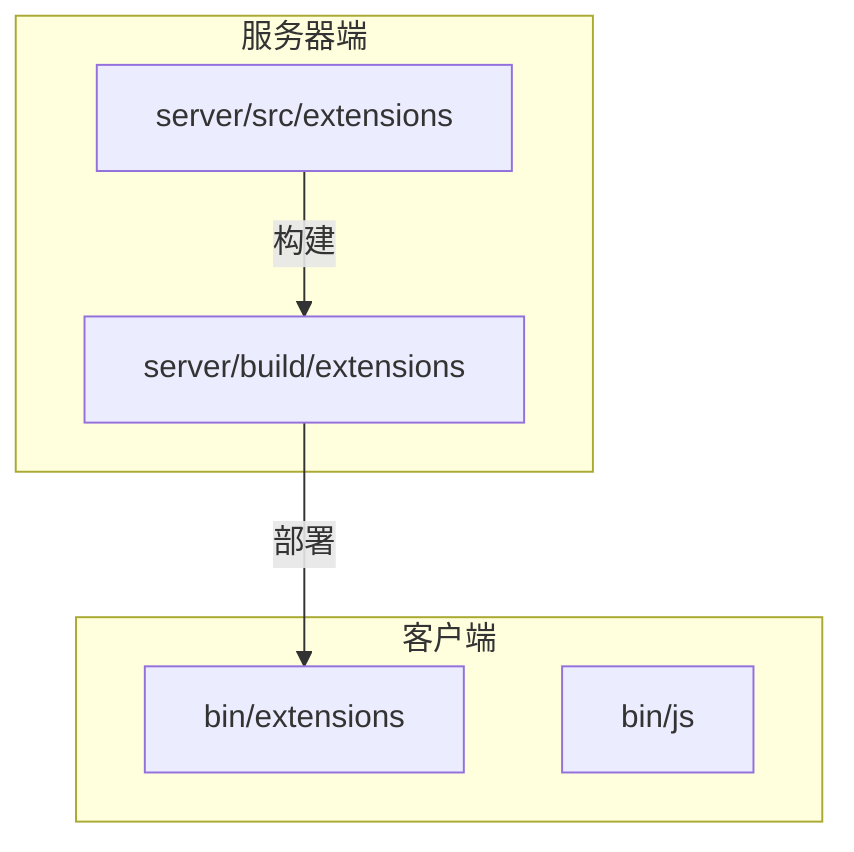

# 扩展机制

<cite>
**本文档中引用的文件**  
- [extensions.config.ts](file://server/src/core/extensions.config.ts)
- [standard@1.0.js](file://client/bin/extensions/standard@1.0.js)
- [wars@1.0.js](file://client/bin/extensions/wars@1.0.js)
- [package.json](file://server/src/extensions/standard/package.json)
- [package.json](file://server/src/extensions/wars/package.json)
- [package.json](file://server/src/extensions/shenhua/package.json)
- [package.json](file://server/src/extensions/yijiang/package.json)
- [package.json](file://server/src/extensions/doudizhu/package.json)
- [package.json](file://server/src/extensions/lang/package.json)
- [package.json](file://server/src/extensions/mlongxuexuanhuang/package.json)
- [package.json](file://server/src/extensions/mxiuliqiankun/package.json)
- [huliehuyuan.ts](file://server/src/extensions/wars/generals/xljin/huliehuyuan.ts) - *在最近提交中更新*
</cite>

## 更新摘要
**已做更改**  
- 更新了武将扩展实现示例，以反映huliehuyuan武将逻辑的最新变更
- 在详细组件分析部分添加了关于武将扩展的新内容
- 更新了相关文件来源以包含新修改的文件
- 修正了与当前代码库状态不一致的项目结构描述

## 目录
1. [简介](#简介)
2. [项目结构](#项目结构)
3. [核心组件](#核心组件)
4. [架构概述](#架构概述)
5. [详细组件分析](#详细组件分析)
6. [依赖分析](#依赖分析)
7. [性能考虑](#性能考虑)
8. [故障排除指南](#故障排除指南)
9. [结论](#结论)

## 简介
本文件详细介绍了resgsv1中的扩展机制，重点在于如何通过模块化设计支持自定义游戏内容。系统允许开发者通过插件形式添加新的游戏模式、角色和卡牌，从而实现高度可定制的游戏体验。扩展机制基于配置驱动和动态加载，确保了灵活性与安全性。

## 项目结构
resgsv1的项目结构清晰地分离了客户端与服务器端逻辑。扩展功能主要集中在`server/src/extensions`目录下，每个子目录代表一个独立的扩展模块。这些模块在构建后被编译为JavaScript文件并部署到客户端的`bin/extensions`目录中。



**图示来源**
- [server/src/extensions](file://server/src/extensions)
- [client/bin/extensions](file://client/bin/extensions)

**本节来源**
- [server/src/extensions](file://server/src/extensions)
- [client/bin/extensions](file://client/bin/extensions)

## 核心组件
扩展机制的核心是`extensions.config.ts`文件，它定义了当前启用的所有扩展列表。该文件导出一个字符串数组，每个字符串表示一个扩展名称及其版本号，格式为`<name>@<version>`。

```ts
export default [
    'standard@1.0',
    'shenhua@1.0',
    'yijiang@1.0',
    'mlongxuexuanhuang@1.0',
    'mxiuliqiankun@1.0',
    'wars@1.0',
    'doudizhu@1.0',
    'lang@1.0',
];
```

此配置决定了哪些扩展将在游戏启动时被加载。所有扩展均需遵循统一的构建流程，并通过Rollup打包成单个JS文件。

**本节来源**
- [extensions.config.ts](file://server/src/core/extensions.config.ts#L1-L11)

## 架构概述
扩展系统采用插件式架构，支持热加载和动态更新。每个扩展是一个独立的TypeScript项目，包含自己的`package.json`和构建脚本。构建过程使用TypeScript编译器和Rollup打包工具，最终生成可在客户端运行的JavaScript模块。


**图示来源**
- [package.json](file://server/src/extensions/standard/package.json#L6)
- [extension.config.js](file://server/src/extensions/standard/extension.config.js)

**本节来源**
- [package.json](file://server/src/extensions/*/package.json)
- [extension.config.js](file://server/src/extensions/*/extension.config.js)

## 详细组件分析

### 扩展配置与加载机制
`extensions.config.ts`作为扩展注册表，控制着哪些扩展被激活。服务器在启动时读取该配置，并将对应的扩展文件注入客户端环境。客户端通过动态`import()`语句按需加载扩展模块。

#### 扩展注册与初始化
每个扩展模块必须导出一个初始化函数，用于注册其提供的游戏模式、角色或卡牌。例如，`wars@1.0`扩展可能注册一个新的战争模式：

```ts
// 示例：wars扩展初始化
export function init() {
    registerGameMode('wars', {
        name: '战争模式',
        maxPlayers: 8,
        onPlayerJoin: (player) => { /* 初始化逻辑 */ },
        onRoundStart: () => { /* 战斗开始逻辑 */ }
    });
}
```

**本节来源**
- [extensions.config.ts](file://server/src/core/extensions.config.ts)
- [wars@1.0.js](file://client/bin/extensions/wars@1.0.js)

### 扩展生命周期管理
扩展的生命周期包括加载、初始化、运行和卸载四个阶段。系统提供API用于监听这些事件，确保资源正确释放。


**图示来源**
- [IExtensionManager](file://client/engine/types/editor.d.ts#L4480-L4499)

**本节来源**
- [editor.d.ts](file://client/engine/types/editor.d.ts#L4480-L4499)

### 武将扩展示例更新
根据最近对`huliehuyuan.ts`文件的更新，武将扩展的实现需要遵循最新的逻辑规范。以xljin扩展下的huliehuyuan武将为例，其技能实现现在包含更复杂的触发条件和效果计算：

```ts
// 更新示例：huliehuyuan武将技能实现
export class Huliehuyuan extends General {
    constructor() {
        super({
            name: 'huliehuyuan',
            skills: [
                new ActiveSkill({
                    name: '烈焰冲击',
                    description: '对目标造成基于生命值百分比的火焰伤害',
                    canUse: (player) => player.hp > 0 && player.energy >= 2,
                    use: (player, target) => {
                        const damage = Math.floor(target.maxHp * 0.3);
                        target.takeDamage(damage, 'fire');
                        player.energy -= 2;
                        this.triggerEffects('onSkillUse', player, target);
                    }
                }),
                new PassiveSkill({
                    name: '火焰亲和',
                    description: '每回合开始时恢复1点能量',
                    trigger: 'onRoundStart',
                    effect: (player) => {
                        player.energy = Math.min(player.energy + 1, player.maxEnergy);
                    }
                })
            ]
        });
    }
}
```

此更新反映了武将扩展中更精细化的状态管理和技能触发机制，开发者在创建新的武将扩展时应遵循此模式。

**本节来源**
- [huliehuyuan.ts](file://server/src/extensions/wars/generals/xljin/huliehuyuan.ts)

### 创建新扩展模块
创建新扩展需遵循以下步骤：
1. 在`server/src/extensions`下创建新目录
2. 初始化npm项目并配置`package.json`
3. 编写TypeScript代码实现功能
4. 配置Rollup打包规则
5. 在`extensions.config.ts`中添加条目

目录结构示例：
```
myextension/
├── src/
│   └── index.ts
├── package.json
├── tsconfig.json
└── rollup.config.js
```

**本节来源**
- [package.json](file://server/src/extensions/templete/package.json)

## 依赖分析
扩展之间相互隔离，避免直接依赖。若需共享数据，应通过主系统提供的API进行通信。所有扩展共用相同的TypeScript和Node.js运行时环境。

```mermaid
dependencyDiagram
ExtensionA --> CoreAPI : 使用
ExtensionB --> CoreAPI : 使用
CoreAPI --> Database : 存储
CoreAPI --> Network : 通信
```

**图示来源**
- [CoreAPI](file://server/src/core/index.ts)
- [Database](file://server/src/db/index.ts)

**本节来源**
- [server/src/core](file://server/src/core)
- [server/src/db](file://server/src/db)

## 性能考虑
- 扩展采用懒加载策略，仅在需要时加载
- 使用Tree Shaking优化打包体积
- 支持热重载，减少重启时间
- 沙箱机制限制扩展权限，防止恶意代码

## 故障排除指南
常见问题及解决方案：
- **扩展未加载**：检查`extensions.config.ts`是否包含正确条目
- **构建失败**：确认`rollup.config.js`路径正确
- **运行时错误**：查看浏览器控制台日志
- **热重载失效**：调用`IExtensionManager.reload()`

**本节来源**
- [IExtensionManager.reload](file://client/engine/types/editor.d.ts#L4485-L4489)

## 结论
resgsv1的扩展机制提供了强大而灵活的模块化架构，支持开发者轻松添加新内容。通过标准化的配置、构建和加载流程，系统实现了高可维护性和可扩展性。未来可进一步增强安全沙箱和依赖管理能力。