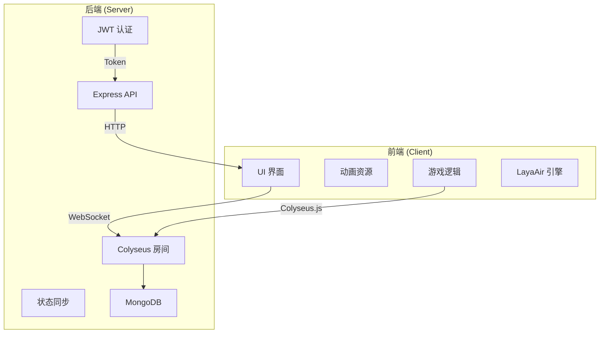
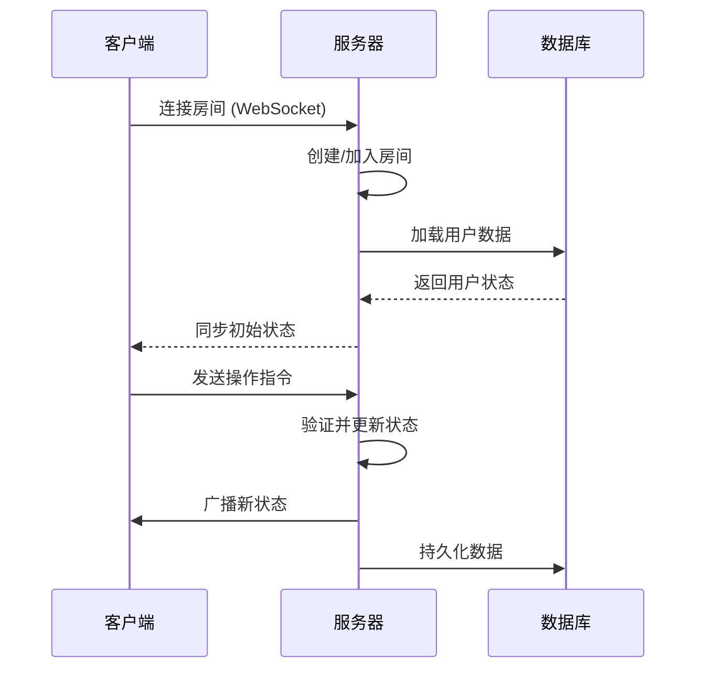
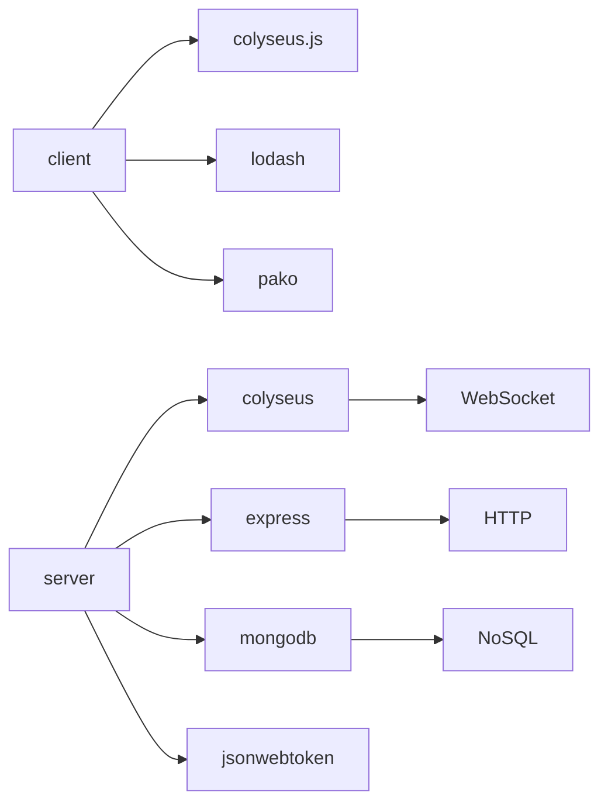

# 技术栈

<cite>
**本文档中引用的文件**  
- [client/package.json](file://client/package.json)
- [server/package.json](file://server/package.json)
- [client/tsconfig.json](file://client/tsconfig.json)
- [server/tsconfig.json](file://server/tsconfig.json)
- [server/src/index.ts](file://server/src/index.ts)
- [client/src/Main.ts](file://client/src/Main.ts)
- [server/src/rooms/game.ts](file://server/src/rooms/game.ts)
- [server/src/db/models/User.ts](file://server/src/db/models/User.ts)
- [server/src/middleware/auth.ts](file://server/src/middleware/auth.ts)
</cite>

## 目录
1. [引言](#引言)
2. [项目结构](#项目结构)
3. [核心组件](#核心组件)
4. [架构概览](#架构概览)
5. [详细组件分析](#详细组件分析)
6. [依赖分析](#依赖分析)
7. [性能考量](#性能考量)
8. [故障排除指南](#故障排除指南)
9. [结论](#结论)

## 引言

本项目 **resgsv1** 是一个基于 TypeScript 构建的实时多人在线游戏系统，采用前后端分离架构。前端使用 LayaAir 引擎实现 2D 游戏界面渲染，后端基于 Node.js 和 Colyseus 框架构建实时通信服务。系统支持玩家匹配、房间管理、状态同步和实时交互，适用于卡牌类游戏场景。本文档将深入解析项目所采用的技术栈及其在系统中的具体应用。

## 项目结构

项目分为 `client`（客户端）和 `server`（服务端）两个主要目录：

- **client**：前端游戏客户端，使用 LayaAir 引擎开发，包含 UI 界面、动画资源、游戏逻辑组件。
- **server**：后端服务器，基于 Node.js 和 Colyseus 框架，负责房间管理、状态同步、数据库交互和用户认证。



**图示来源**
- [client/package.json](file://client/package.json)
- [server/package.json](file://server/package.json)

**本节来源**
- [client/package.json](file://client/package.json)
- [server/package.json](file://server/package.json)

## 核心组件

### TypeScript 作为主要编程语言

TypeScript 在本项目中被统一用于前后端开发，提供了静态类型检查、接口定义和面向对象编程能力，显著提升了代码可维护性和开发效率。

#### 优势分析：
- **类型安全**：减少运行时错误，提升代码可靠性。
- **IDE 支持**：提供智能提示、自动补全和重构支持。
- **模块化开发**：支持 ES6 模块语法，便于组织大型项目。
- **跨平台兼容**：编译为 JavaScript，可在浏览器和 Node.js 中运行。

#### 配置文件示例：
```json
// client/tsconfig.json
{
    "compilerOptions": {
        "module": "ESNext",
        "target": "es6",
        "lib": ["ESNext", "DOM"],
        "strict": true,
        "moduleResolution": "node"
    },
    "include": ["./assets", "./src", "./engine"]
}
```

```json
// server/tsconfig.json
{
    "compilerOptions": {
        "outDir": "build",
        "target": "ESNext",
        "module": "CommonJS",
        "moduleResolution": "node",
        "strict": true
    },
    "include": ["src"]
}
```

**本节来源**
- [client/tsconfig.json](file://client/tsconfig.json)
- [server/tsconfig.json](file://server/tsconfig.json)

## 架构概览

系统采用典型的客户端-服务器架构，结合 WebSocket 实现实时通信，REST API 处理非实时请求。



**图示来源**
- [server/src/index.ts](file://server/src/index.ts)
- [client/src/Main.ts](file://client/src/Main.ts)

**本节来源**
- [server/src/index.ts](file://server/src/index.ts)
- [client/src/Main.ts](file://client/src/Main.ts)

## 详细组件分析

### LayaAir 引擎

LayaAir 是一个高性能的 HTML5 游戏引擎，支持 2D/3D 渲染、动画系统和资源管理。

#### 功能特性：
- **UI 系统**：通过 `.lh` 文件定义界面布局，自动生成 TypeScript 类。
- **资源管理**：支持包加载、版本控制和远程资源加载。
- **动画支持**：集成 Spine、DragonBones 等骨骼动画。

#### 代码示例：
```typescript
// UIChat.generated.ts
export class UIChatBase extends Laya.GWidget {
    public inputChat!: Laya.GTextInput;
    public btn_send!: Laya.GButton;
    public box!: Laya.GWidget;
}
```

#### 初始化流程：
```javascript
// index.js (编译后)
Laya.init(config.resolution).then(() => {
    if (config.stat) Laya.Stat.show();
    Laya.Scene.open(config.startupScene);
});
```

**本节来源**
- [client/src/ui/UIChat.generated.ts](file://client/src/ui/UIChat.generated.ts)
- [client/release/web/js/index-40020.js](file://client/release/web/js/index-40020.js)

### Colyseus 框架

Colyseus 是一个专为实时多人游戏设计的 Node.js 框架，基于 WebSocket 实现低延迟通信。

#### 核心功能：
- **房间管理**：支持创建、加入、离开房间。
- **状态同步**：自动序列化和广播状态变更。
- **客户端 SDK**：提供 `colyseus.js` 用于前端连接。

#### 服务端房间定义：
```typescript
// server/src/rooms/game.ts
export class GameRoom extends Room<GameState> {
    onCreate(options: any) {
        this.setState(new GameState());
    }
}
```

#### 客户端连接：
```typescript
// client/src/Main.ts
const client = new Client("ws://localhost:2567");
const room = await client.joinOrCreate("game");
```

**图示来源**
- [server/src/rooms/game.ts](file://server/src/rooms/game.ts)
- [client/src/Main.ts](file://client/src/Main.ts)

**本节来源**
- [server/src/rooms/game.ts](file://server/src/rooms/game.ts)
- [client/src/Main.ts](file://client/src/Main.ts)

### Node.js 与 Express

Node.js 作为服务器运行时环境，Express 用于构建 RESTful API。

#### 应用示例：
```typescript
// server/src/index.ts
const app = express();
app.use(cors());
app.use(bodyParser.json());
app.use('/auth', createAuthRouter());
```

#### 路由结构：
- `/auth/login`：用户登录
- `/auth/register`：用户注册
- `/admin`：管理员接口

**本节来源**
- [server/src/index.ts](file://server/src/index.ts)

### MongoDB 数据库

MongoDB 作为 NoSQL 数据库存储用户信息、游戏状态和系统配置。

#### 数据模型示例：
```typescript
// server/src/db/models/User.ts
import { Schema, model } from 'mongoose';

const userSchema = new Schema({
    username: String,
    password: String,
    email: String,
    createdAt: Date
});

export const User = model('User', userSchema);
```

#### 连接配置：
```typescript
// server/src/db/index.ts
mongoose.connect(process.env.MONGODB_URI!);
```

**本节来源**
- [server/src/db/models/User.ts](file://server/src/db/models/User.ts)

### JWT 认证机制

使用 JSON Web Token (JWT) 实现安全的用户身份验证。

#### 中间件实现：
```typescript
// server/src/middleware/auth.ts
export const authenticateToken = (req, res, next) => {
    const token = req.header('Authorization')?.split(' ')[1];
    if (!token) return res.sendStatus(401);

    jwt.verify(token, process.env.JWT_SECRET, (err, user) => {
        if (err) return res.sendStatus(403);
        req.user = user;
        next();
    });
};
```

#### 安全考虑：
- **Token 有效期**：设置合理的过期时间。
- **HTTPS 传输**：防止中间人攻击。
- **密钥管理**：使用环境变量存储密钥。

**本节来源**
- [server/src/middleware/auth.ts](file://server/src/middleware/auth.ts)

## 依赖分析



**图示来源**
- [client/package.json](file://client/package.json)
- [server/package.json](file://server/package.json)

**本节来源**
- [client/package.json](file://client/package.json)
- [server/package.json](file://server/package.json)

## 性能考量

- **WebSocket 通信**：相比 HTTP 轮询，显著降低延迟和带宽消耗。
- **状态压缩**：使用 `pako` 库进行数据压缩，减少网络传输量。
- **资源预加载**：客户端启动时预加载必要资源，提升用户体验。
- **数据库索引**：为常用查询字段建立索引，提高查询效率。

## 故障排除指南

### 常见问题
1. **连接失败**：检查服务器地址和端口是否正确。
2. **状态不同步**：确认客户端和服务端状态结构一致。
3. **认证失败**：验证 JWT 密钥和 Token 格式。
4. **资源加载慢**：检查远程资源 URL 和网络状况。

### 调试工具
- **Colyseus Monitor**：可视化监控房间状态。
- **Express Logger**：记录 HTTP 请求日志。
- **MongoDB Compass**：图形化数据库管理工具。

**本节来源**
- [server/package.json](file://server/package.json)

## 结论

resgsv1 项目通过 TypeScript 统一前后端开发，结合 LayaAir 引擎实现高质量游戏界面，利用 Colyseus 框架构建低延迟实时通信系统。Node.js 提供稳定的服务端运行环境，Express 处理 REST API，MongoDB 存储持久化数据，JWT 保障系统安全。该技术栈组合适用于开发复杂的实时多人在线游戏，具备良好的可扩展性和维护性。