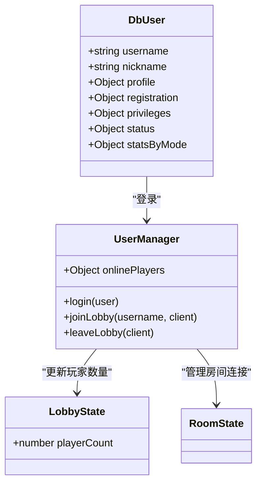
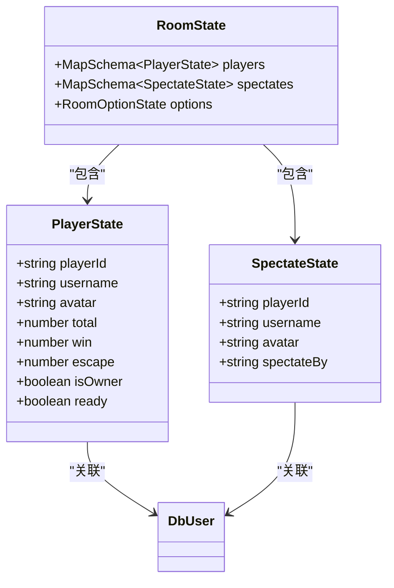
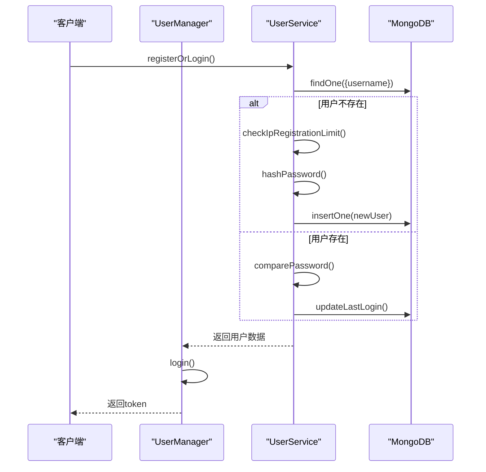
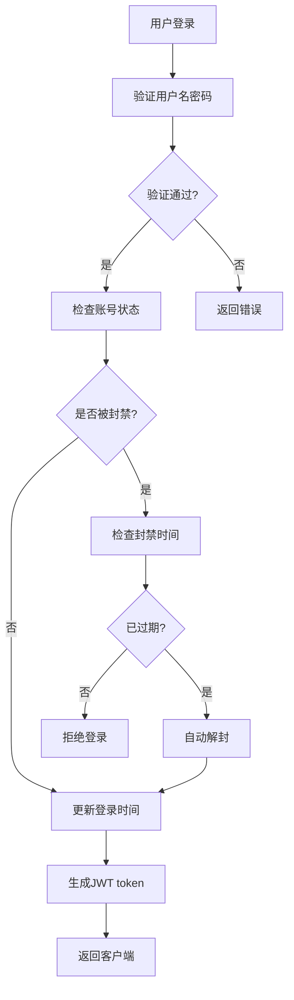

# 数据库模式设计

<cite>
**本文档引用的文件**  
- [User.ts](file://server/src/db/models/User.ts)
- [LobbyState.ts](file://server/src/models/LobbyState.ts)
- [RoomStata.ts](file://server/src/models/RoomStata.ts)
- [UserService.ts](file://server/src/db/services/UserService.ts)
- [UserManager.ts](file://server/src/UserManager.ts)
- [lobby.ts](file://server/src/rooms/lobby.ts)
</cite>

## 目录
1. [简介](#简介)
2. [核心数据模型](#核心数据模型)
3. [用户模型设计](#用户模型设计)
4. [大厅状态模型设计](#大厅状态模型设计)
5. [房间状态模型设计](#房间状态模型设计)
6. [实体关系分析](#实体关系分析)
7. [数据访问与优化](#数据访问与优化)
8. [数据生命周期管理](#数据生命周期管理)
9. [数据安全与隐私保护](#数据安全与隐私保护)

## 简介
本文档详细介绍了resgsv1项目中的数据库模式设计，重点分析了用户、大厅和房间等核心数据模型的结构与关系。通过深入解析各模型的字段定义、约束条件和数据交互逻辑，为系统维护和功能扩展提供技术参考。

## 核心数据模型
系统主要包含三个核心数据模型：用户模型（User）、大厅状态模型（LobbyState）和房间状态模型（RoomState）。这些模型分别存储用户持久化数据、大厅实时状态和房间运行时状态。

**Section sources**
- [User.ts](file://server/src/db/models/User.ts#L1-L103)
- [LobbyState.ts](file://server/src/models/LobbyState.ts#L1-L7)
- [RoomStata.ts](file://server/src/models/RoomStata.ts#L1-L116)

## 用户模型设计
用户模型（DbUser）是系统的核心实体，存储用户的基本信息、认证数据和游戏统计。

### 字段定义与数据类型
```typescript
export interface DbUser {
    _id?: ObjectId;
    username: string; //用户名(唯一)
    nickname: string; //(昵称) 默认与username一致
    passwordHash: string; //密码
    salt: string;
    //基础信息
    profile: {
        reputationScore: number;
        doudizhuScore: number;
        avatar: string; //头像Url
        title?: string; //显示称号
        titles: string[]; //拥有的称号
        lastLogin: Date; //最后登录时间
    };
    //注册信息
    registration: {
        ip: string; // 注册IP
        date: Date; // 注册时间
    };
    //权限相关
    privileges: {
        admin: boolean; // 是否管理员
        childAdmin: boolean;
        betaTester: boolean; // 是否测试白名单
    };
    //封禁和禁言
    status: {
        isBanned: boolean; //是否被封禁
        banReason?: string; //封禁原因
        banExpires?: Date; //封禁到期时间

        isMuted: boolean; // 是否被禁言
        muteReason?: string; // 禁言原因
        muteExpires?: Date; // 禁言过期时间

        isGameBanned: boolean; //是否禁止游戏
        gameBanReason?: string;
        gameBanExpires?: Date;
    };
    statsByMode: {
        //国战模式
        wars_temp_jin?: UserWarsState;
        wars_temp_xl?: UserWarsState;
        doudizhu?: {
            matches: number; //游戏总数
            wins: number; //胜场数
            escapes: number; //逃跑数
            asLandLord: {
                matches: number; //游戏总数
                wins: number; //胜场数
                escapes: number; //逃跑数
            };
            asFarmer: {
                matches: number; //游戏总数
                wins: number; //胜场数
                escapes: number; //逃跑数
            };
        };
    };
    ipHistory: string[]; //IP历史记录
    createdAt: Date; //创建时间
    updatedAt: Date; //更新时间
}
```

### 索引与约束条件
- **唯一性约束**：`username` 字段具有唯一性，确保用户名不重复
- **索引优化**：`username` 字段建立索引，优化登录和查询性能
- **历史记录**：`ipHistory` 数组记录用户登录IP历史，用于安全审计

### 游戏统计数据结构
```typescript
export interface UserWarsState {
    matches: number; //游戏总数
    wins: number; //胜场数
    escapes: number; //逃跑数
    asWei: {
        matches: number; //游戏总数
        wins: number; //胜场数
        escapes: number; //逃跑数
    };
    asShu: { ... };
    asWu: { ... };
    asQun: { ... };
    asJin: { ... };
    asYe: { ... };
}
```

**Section sources**
- [User.ts](file://server/src/db/models/User.ts#L1-L103)
- [UserService.ts](file://server/src/db/services/UserService.ts#L1-L381)

## 大厅状态模型设计
大厅状态模型（LobbyState）管理游戏大厅的实时状态信息。

### 模型结构
```typescript
export class LobbyState extends Schema {
    @type('number')
    playerCount: number = 0;
}
```

### 字段说明
- **playerCount**: 当前大厅在线玩家数量，用于实时显示大厅活跃度

该模型通过Colyseus框架的Schema系统实现，支持实时同步和状态广播。

**Section sources**
- [LobbyState.ts](file://server/src/models/LobbyState.ts#L1-L7)
- [lobby.ts](file://server/src/rooms/lobby.ts#L1-L59)

## 房间状态模型设计
房间状态模型（RoomState）管理游戏房间的完整状态，包括玩家、旁观者和房间配置。

### 模型结构
```typescript
export class RoomState extends Schema {
    @type({ map: PlayerState })
    public players = new MapSchema<PlayerState>();
    @type({ map: SpectateState })
    public spectates = new MapSchema<SpectateState>();
    @type(RoomOptionState)
    public options: RoomOptionState;

    public game: GameRoom;
}
```

### 玩家状态（PlayerState）
```typescript
export class PlayerState extends Schema {
    @type('string') playerId: string;
    @type('string') username: string;
    @type('string') avatar: string;
    @type('number') total: number = 0;
    @type('number') win: number = 0;
    @type('number') escape: number = 0;
    @type('boolean') isOwner: boolean = false;
    @type('boolean') ready: boolean = false;
    prechooses: string[];
}
```

### 旁观者状态（SpectateState）
与PlayerState类似，但包含`spectateBy`字段，记录旁观目标。

### 房间配置（RoomOptionState）
```typescript
export class RoomOptionState extends Schema {
    @type('string') name: string;
    @type('string') password: string;
    @type('string') mode?: string;
    @type('number') playerCountMax: number;
    @type('number') responseTime?: number;
    @type('string') extensions: string;
    @type('string') generals: string;
    @type('number') chooseGeneralCount: number;
    @type('number') luckyCardCount: number;
    @type('string') settings: string;
}
```

**Section sources**
- [RoomStata.ts](file://server/src/models/RoomStata.ts#L1-L116)

## 实体关系分析
系统中的实体通过多种方式相互关联，形成完整的数据网络。

### 用户与大厅关系


**Diagram sources**
- [User.ts](file://server/src/db/models/User.ts#L1-L103)
- [LobbyState.ts](file://server/src/models/LobbyState.ts#L1-L7)
- [UserManager.ts](file://server/src/UserManager.ts#L1-L150)

### 房间与玩家关系


**Diagram sources**
- [RoomStata.ts](file://server/src/models/RoomStata.ts#L1-L116)
- [User.ts](file://server/src/db/models/User.ts#L1-L103)

## 数据访问与优化
系统采用MongoDB作为持久化存储，结合Colyseus的实时状态管理。

### 常用查询优化
- **用户登录查询**：通过`username`索引快速定位用户
- **批量更新**：使用`bulkWrite`操作批量更新游戏结果
- **条件查询**：利用复合条件查询IP注册限制

### 数据访问模式


**Diagram sources**
- [UserService.ts](file://server/src/db/services/UserService.ts#L1-L381)
- [UserManager.ts](file://server/src/UserManager.ts#L1-L150)

## 数据生命周期管理
系统实现了完整的数据生命周期管理机制。

### 数据保留策略
- **用户数据**：永久存储，除非用户主动删除
- **登录历史**：IP历史记录长期保留，用于安全审计
- **会话状态**：内存中的在线状态在用户离线后保留30秒优雅断开期

### 数据归档机制
- **游戏统计**：按游戏模式分类存储，支持历史数据分析
- **状态同步**：Colyseus自动管理房间状态的生命周期

**Section sources**
- [UserService.ts](file://server/src/db/services/UserService.ts#L1-L381)
- [UserManager.ts](file://server/src/UserManager.ts#L1-L150)

## 数据安全与隐私保护
系统实施了多层次的安全和隐私保护措施。

### 敏感信息加密
- **密码存储**：使用bcrypt算法加密存储，包含salt
- **认证令牌**：使用JWT生成7天有效期的token
- **数据传输**：所有敏感数据通过加密通道传输

### 访问控制
- **权限分级**：管理员、子管理员、测试员三级权限
- **封禁系统**：支持账号、发言、游戏三级封禁
- **IP关联**：可基于IP进行批量封禁



**Diagram sources**
- [UserService.ts](file://server/src/db/services/UserService.ts#L1-L381)
- [UserManager.ts](file://server/src/UserManager.ts#L1-L150)