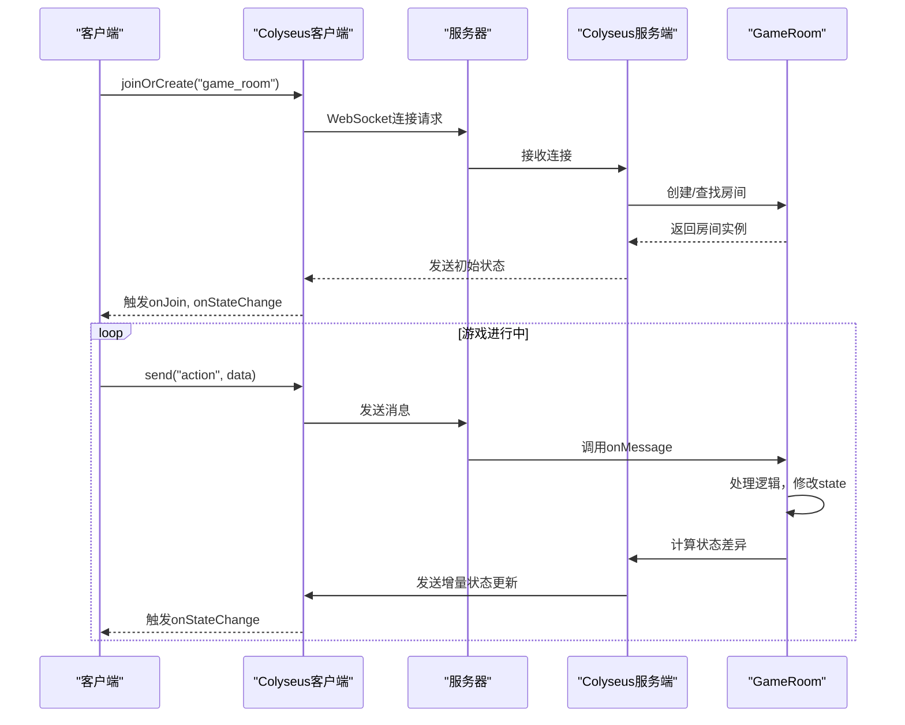
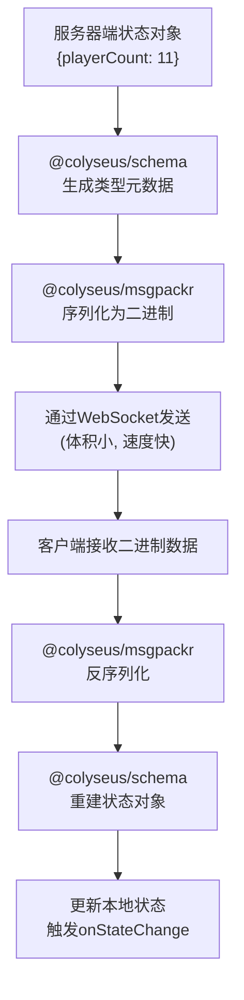
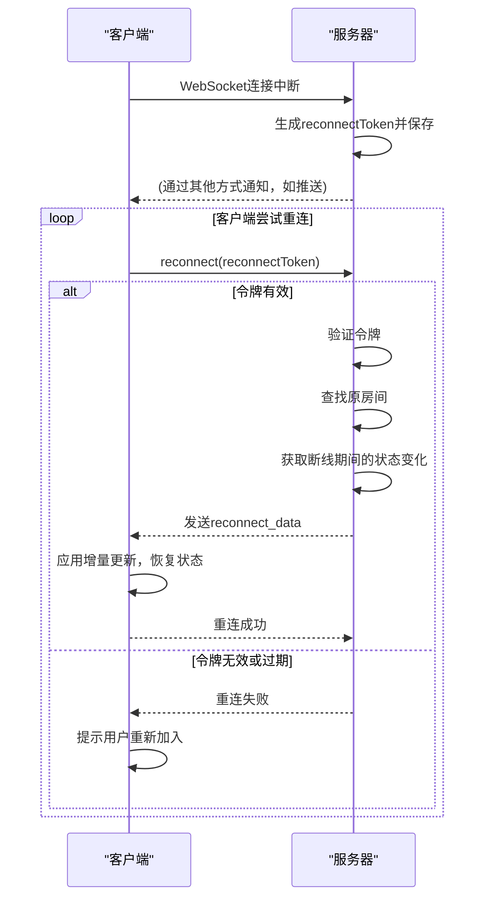

# 数据流与通信

<cite>
**本文档引用文件**  
- [client\package.json](file://client/package.json)
- [server\package.json](file://server/package.json)
- [client\src\mgr\Client.ts](file://client/src/mgr/Client.ts)
- [server\src\rooms\lobby.ts](file://server/src/rooms/lobby.ts)
- [server\src\rooms\game.ts](file://server/src/rooms/game.ts)
- [client\src\models\LobbyState.ts](file://client/src/models/LobbyState.ts)
- [server\src\models\LobbyState.ts](file://server/src/models/LobbyState.ts)
- [client\src\mgr\Replay.ts](file://client/src/mgr/Replay.ts)
- [server\loadtest\example.ts](file://server/loadtest/example.ts)
</cite>

## 目录
1. [引言](#引言)
2. [项目结构](#项目结构)
3. [核心通信机制](#核心通信机制)
4. [WebSocket连接与Colyseus框架](#websocket连接与colyseus框架)
5. [状态同步与数据压缩](#状态同步与数据压缩)
6. [消息格式与数据序列化](#消息格式与数据序列化)
7. [断线重连策略](#断线重连策略)
8. [数据路径分析](#数据路径分析)
9. [性能优化与网络问题处理](#性能优化与网络问题处理)
10. [结论](#结论)

## 引言

本文档详细阐述了resgsv1项目中客户端与服务器之间的实时数据流与通信机制。系统基于WebSocket协议和Colyseus框架构建，实现了高效、低延迟的实时交互。文档将深入分析连接建立、状态同步、消息处理、断线重连等核心流程，并结合代码示例说明数据序列化、完整性保证及性能优化策略。

## 项目结构

resgsv1项目采用典型的客户端-服务器（Client-Server）架构，分为`client`和`server`两个主要目录。

```mermaid
graph TB
subgraph "客户端 (client)"
direction TB
UI[UI界面]
Comps[UI组件]
Mgr[管理器]
Models[数据模型]
UI --> Comps
Comps --> Mgr
Models --> Mgr
Mgr --> ClientSocket["WebSocket客户端"]
end
subgraph "服务器 (server)"
direction TB
LobbyRoom[大厅房间]
GameRoom[游戏房间]
UserManager[用户管理]
State[同步状态]
LobbyRoom --> GameRoom
UserManager --> LobbyRoom
State --> GameRoom
GameRoom --> ClientSocket["WebSocket服务端"]
end
ClientSocket < --> ClientSocket
```

**图示来源**
- [client\src\mgr\Client.ts](file://client/src/mgr/Client.ts)
- [server\src\rooms\lobby.ts](file://server/src/rooms/lobby.ts)
- [server\src\rooms\game.ts](file://server/src/rooms/game.ts)

**本节来源**
- [client\package.json](file://client/package.json)
- [server\package.json](file://server/package.json)

## 核心通信机制

resgsv1的核心通信机制围绕Colyseus框架展开，利用WebSocket实现全双工、低延迟的实时通信。客户端通过`colyseus.js`库连接到服务器，服务器则使用`colyseus`库管理房间和状态同步。

通信流程始于客户端连接至服务器的`LobbyRoom`（大厅房间），在此进行用户身份验证和房间列表同步。当玩家创建或加入游戏房间时，会进入`GameRoom`（游戏房间），此时游戏的核心状态和逻辑在此房间内进行同步。

## WebSocket连接与Colyseus框架

系统使用WebSocket作为底层传输协议，由Colyseus框架进行封装和管理。Colyseus是一个专为实时应用设计的Node.js框架，它简化了WebSocket连接的管理、房间的创建与销毁、以及状态的自动同步。

### 连接建立

客户端通过`colyseus.js`库建立连接：

```typescript
// 示例代码：客户端连接
import { Client } from "colyseus.js";

const client = new Client("ws://localhost:2567");
const room = await client.joinOrCreate("my_room", { /* 选项 */ });
```

服务器端在`src/index.ts`中配置了WebSocket传输层，并定义了房间类型：

```typescript
import { Server } from "colyseus";
import { WebSocketTransport } from "@colyseus/ws-transport";
import { MyRoom } from "./rooms/MyRoom";

const gameServer = new Server({
  transport: new WebSocketTransport({
    // WebSocket 选项
  })
});

gameServer.define("my_room", MyRoom);
```

### Colyseus工作流程



**图示来源**
- [server\loadtest\example.ts](file://server/loadtest/example.ts)
- [server\src\rooms\game.ts](file://server/src/rooms/game.ts)

**本节来源**
- [client\package.json](file://client/package.json)
- [server\package.json](file://server/package.json)

## 状态同步与数据压缩

Colyseus框架的核心优势在于其高效的状态同步机制。它并非每次都将完整的状态对象发送给所有客户端，而是采用**增量更新**和**状态压缩**技术来最小化网络流量。

### 增量更新

当服务器端的`RoomState`对象发生变化时，Colyseus会自动计算出与上一次发送状态的差异（diff），仅将这些变化的部分发送给客户端。这极大地减少了需要传输的数据量。

例如，`LobbyState`类定义如下：

```typescript
// server/src/models/LobbyState.ts
import { Schema, type } from "@colyseus/schema";

export class LobbyState extends Schema {
    @type("number") playerCount: number = 0;
}
```

当`playerCount`从10变为11时，Colyseus只会发送一个包含`playerCount: 11`的补丁（patch），而不是整个`LobbyState`对象。

### 状态压缩

Colyseus使用`@colyseus/schema`和`@colyseus/msgpackr`进行数据序列化。`@colyseus/schema`通过装饰器（如`@type("number")`）为数据结构提供元信息，`@colyseus/msgpackr`则利用MessagePack二进制格式进行高效编码。

MessagePack是一种高效的二进制序列化格式，相比JSON，它具有更小的体积和更快的解析速度。这对于实时游戏至关重要，因为它直接减少了网络带宽消耗和客户端的解析开销。



**图示来源**
- [server\src\models\LobbyState.ts](file://server/src/models/LobbyState.ts)
- [client\src\models\LobbyState.ts](file://client/src/models/LobbyState.ts)

**本节来源**
- [server\package.json](file://server/package.json)
- [client\package.json](file://client/package.json)

## 消息格式与数据序列化

系统中的数据通信分为两种主要类型：**状态同步**和**即时消息**。

### 状态同步

如上所述，状态同步是自动的、基于Schema的增量更新。开发者只需在服务器端修改`this.state`，Colyseus就会自动处理同步。

### 即时消息

对于不需要纳入状态同步的即时通信（如聊天、系统通知、游戏操作确认），系统使用`send`和`broadcast`方法。

#### 消息类型示例

1.  **游戏操作 (Game Action)**:
    ```typescript
    // 客户端发送操作
    room.send("use_card", { cardId: "wuxie", targetId: "player2" });

    // 服务器端接收
    onMessage(client, message) {
        if (message.type === "use_card") {
            // 处理卡牌使用逻辑
            this.handleUseCard(client, message.data);
        }
    }
    ```

2.  **聊天消息 (Chat Message)**:
    ```typescript
    // 客户端发送聊天
    room.send("chat", { text: "大家好！" });

    // 服务器广播给所有客户端
    this.broadcast("chat", { sender: client.sessionId, text: message.data.text });
    ```

3.  **系统通知 (System Notification)**:
    ```typescript
    // 服务器发送系统通知
    client.send("system_notify", { type: "game_start", msg: "游戏即将开始！" });
    ```

### 数据序列化实现

数据的序列化和反序列化由Colyseus框架在底层自动完成。其流程如下：

1.  **发送端**：JavaScript对象 -> `@colyseus/msgpackr` -> MessagePack二进制数据 -> WebSocket帧。
2.  **接收端**：WebSocket帧 -> MessagePack二进制数据 -> `@colyseus/msgpackr` -> JavaScript对象。

这种机制保证了数据的一致性和完整性。MessagePack的强类型特性确保了数据在传输过程中不会因格式错误而损坏。同时，Colyseus的Schema系统在反序列化时会进行类型校验，防止非法数据污染本地状态。

## 断线重连策略

网络中断是实时应用的常见问题。resgsv1通过Colyseus内置的断线重连机制来保证用户体验。

### 重连令牌 (Reconnect Token)

当客户端与服务器的连接意外中断时，服务器会为该客户端生成一个临时的`reconnectToken`，并将其与该客户端所在的房间关联。

```typescript
// server/src/rooms/lobby.ts
onAuth(client, options) {
    const player = UserManager.inst.getPlayer(options.token);
    if (player) {
        const room = Object.values(player.rooms).find((v) => !!v.reconnectToken);
        if (room) {
            // 向客户端发送重连令牌
            client.send('reconnectToken', room.room.roomId);
        }
    }
}
```

### 重连流程

1.  **客户端检测断线**：`colyseus.js`库会监听WebSocket的`onclose`事件。
2.  **请求重连**：客户端使用之前收到的`reconnectToken`调用`room.reconnect()`。
3.  **服务器验证**：服务器验证令牌的有效性。
4.  **恢复状态**：如果验证通过，服务器会将客户端重新加入到之前的房间，并发送自客户端断开连接以来的所有状态更新（reconnection data），使客户端状态与服务器同步。



**图示来源**
- [server\src\rooms\lobby.ts](file://server/src/rooms/lobby.ts)
- [server\src\rooms\game.ts](file://server/src/rooms/game.ts)

**本节来源**
- [server\src\rooms\lobby.ts](file://server/src/rooms/lobby.ts)
- [server\src\rooms\game.ts](file://server/src/rooms/game.ts)

## 数据路径分析

从用户在UI上进行一次操作（如点击“准备”按钮）到最终状态同步给所有玩家，完整的数据路径如下：

1.  **UI操作**：用户点击“准备”按钮，触发`UIRoom.ts`中的事件处理器。
2.  **发送消息**：UI组件调用`Client.ts`中的`send`方法，向服务器发送`"ready"`消息。
    ```typescript
    // client/src/ui/UIRoom.ts
    onReadyButtonClick() {
        Client.getInstance().send("ready", {});
    }
    ```
3.  **网络传输**：`colyseus.js`库将消息通过WebSocket发送至服务器。
4.  **服务器接收**：`GameRoom`的`onMessage`方法接收到`"ready"`消息。
    ```typescript
    // server/src/rooms/game.ts
    onMessage(client, message) {
        if (message.type === "ready") {
            this.handleReady(client);
        }
    }
    ```
5.  **服务器处理**：`handleReady`方法查找对应的`PlayerState`，将其`ready`属性设置为`true`。
    ```typescript
    handleReady(client) {
        const player = this.state.players.get(client.sessionId);
        if (player) {
            player.ready = true; // 修改状态
        }
    }
    ```
6.  **状态同步**：Colyseus检测到`PlayerState.ready`发生变化，计算出状态差异。
7.  **广播更新**：服务器将增量更新广播给房间内所有客户端。
8.  **客户端接收**：`colyseus.js`库接收增量更新，自动更新本地的`room.state`。
9.  **UI更新**：UI组件（如`PlayerComp.ts`）监听`onStateChange`事件，根据新的`player.ready`值更新按钮或头像的显示状态。

这个路径展示了从用户输入到全局状态同步的完整闭环，Colyseus框架在其中扮演了核心的“粘合剂”角色，自动化了大部分通信和同步工作。

**本节来源**
- [client\src\ui\UIRoom.ts](file://client/src/ui/UIRoom.ts)
- [client\src\mgr\Client.ts](file://client/src/mgr/Client.ts)
- [server\src\rooms\game.ts](file://server/src/rooms/game.ts)

## 性能优化与网络问题处理

### 网络延迟与丢包处理

-   **预测与插值**：客户端可以对某些非关键状态（如玩家位置）进行预测或插值，以平滑网络延迟带来的卡顿感。虽然本项目主要为回合制，但此技术可用于动画效果。
-   **消息确认**：对于关键操作（如出牌），服务器在处理成功后应广播一个确认消息（如`"confirm_action"`），客户端收到后才更新UI，避免因网络延迟导致的误操作。
-   **心跳机制**：WebSocket连接内置心跳包，用于检测连接是否存活，及时发现并处理断线。

### 性能优化技巧

1.  **精细的状态定义**：只将需要同步的数据放入`@type`装饰的Schema中，避免不必要的同步开销。
2.  **批量更新**：在短时间内避免频繁修改状态。可以使用`setPatchRate()`调整状态同步的频率，或在逻辑处理完毕后一次性修改状态。
3.  **选择性广播**：使用`room.send()`向特定客户端发送消息，而非`room.broadcast()`向所有人广播，以减少无关客户端的处理负担。
4.  **客户端数据压缩**：对于历史回放等非实时数据，客户端使用`pako`库进行GZIP压缩存储，节省本地存储空间。
    ```typescript
    // client/src/mgr/Replay.ts
    import Pako from 'pako';

    // 存储时压缩
    const compressedData = Pako.gzip(JSON.stringify(gameLog));
    // 读取时解压
    const gameLog = JSON.parse(Pako.gunzip(compressedData, { to: 'string' }));
    ```

**本节来源**
- [client\src\mgr\Replay.ts](file://client/src/mgr/Replay.ts)
- [server\src\rooms\game.ts](file://server/src/rooms/game.ts)

## 结论

resgsv1项目通过Colyseus框架构建了一个高效、可靠的实时通信系统。其核心在于利用WebSocket和MessagePack实现低延迟、低带宽的双向通信，并通过Schema驱动的增量状态同步机制，自动化地处理了绝大部分数据同步的复杂性。断线重连策略保证了良好的用户体验，而清晰的数据路径和合理的性能优化技巧则确保了系统的稳定性和可扩展性。这套通信架构为实现复杂的实时游戏逻辑提供了坚实的基础。