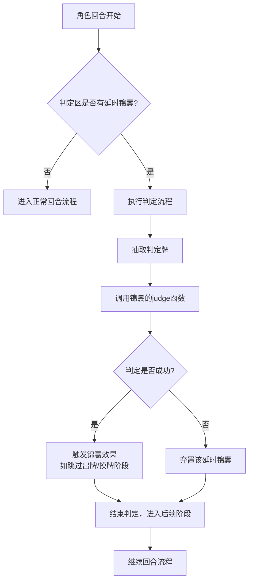
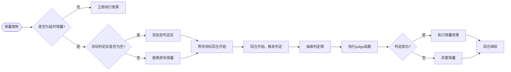

# 判定区处理

<cite>
**本文档中引用的文件**  
- [event.judge.ts](file://server/src/core/event/event.judge.ts)
- [card.ts](file://server/src/core/card/card.ts)
- [room.handle.ts](file://server/src/core/room/room.handle.ts)
- [card.types.ts](file://server/src/core/card/card.types.ts)
- [event.types.ts](file://server/src/core/event/event.types.ts)
</cite>

## 目录
1. [引言](#引言)
2. [延时锦囊机制概述](#延时锦囊机制概述)
3. [判定区核心组件分析](#判定区核心组件分析)
4. [判定流程架构与控制逻辑](#判定流程架构与控制逻辑)
5. [延时锦囊的判定生命周期流程图](#延时锦囊的判定生命周期流程图)
6. [代码实现详解](#代码实现详解)
7. [判定结果计算与后续处理](#判定结果计算与后续处理)
8. [结论](#结论)

## 引言

在《三国杀》类卡牌游戏中，判定区是实现延时类锦囊（如“乐不思蜀”、“兵粮寸断”）功能的核心机制之一。当玩家对目标角色使用此类锦囊时，并不会立即生效，而是将其置入目标角色的判定区，在其下个回合开始前进行一次判定，根据判定牌花色或点数决定是否触发效果。本文档将深入分析resgsv1项目中判定区的处理逻辑，涵盖从锦囊放置、判定生成、判定执行到效果触发的完整流程，并结合实际代码与流程图进行详细说明。

**Section sources**  
- [event.judge.ts](file://server/src/core/event/event.judge.ts#L1-L150)
- [card.ts](file://server/src/core/card/card.ts#L200-L350)

## 延时锦囊机制概述

延时锦囊是一种特殊的锦囊牌，其效果不是即时触发，而是通过判定区进行延迟判定。常见的延时锦囊包括：

- **乐不思蜀**：目标角色在判定阶段需判定，若判定牌不为红桃，则跳过其出牌阶段。
- **兵粮寸断**：目标角色在判定阶段需判定，若判定牌不为梅花，则跳过其摸牌阶段。

这些锦囊一旦被使用，将被放置于目标角色的判定区，形成一个“延时效果堆叠”。每个角色的判定区最多只能存在一张延时锦囊，若已有则新锦囊会替换旧的。

### 判定区的基本规则
- 每名角色的判定区仅能存放一张延时锦囊。
- 判定发生在角色回合开始阶段（回合前阶段）。
- 判定牌由系统从牌堆顶抽取一张。
- 判定结果依据锦囊牌的判定条件（如花色）进行匹配。
- 若判定成功（满足条件），则锦囊效果生效；否则，锦囊被弃置。

**Section sources**  
- [card.types.ts](file://server/src/core/card/card.types.ts#L45-L80)
- [event.types.ts](file://server/src/core/event/event.types.ts#L30-L60)

## 判定区核心组件分析

### 延时锦囊的特殊属性定义

在 `card.ts` 文件中，每张卡牌都有其类型和子类型定义。延时锦囊通过特定的 `type` 和 `subtype` 标识其为“延时类”。

```typescript
// 示例：card.ts 中延时锦囊的定义
const cards = {
  'lebusishu': {
    name: '乐不思蜀',
    type: 'trick',
    subtype: 'delay',
    judge: (card: Card) => card.suit === 'heart', // 红桃判定成功
    description: '目标角色回合开始时进行判定，若不为红桃则跳过出牌阶段'
  },
  'bingliangcunduan': {
    name: '兵粮寸断',
    type: 'trick',
    subtype: 'delay',
    judge: (card: Card) => card.suit === 'club', // 梅花判定成功
    description: '目标角色回合开始时进行判定，若不为梅花则跳过摸牌阶段'
  }
};
```

上述代码展示了延时锦囊的关键属性：
- `type: 'trick'` 表示为锦囊牌。
- `subtype: 'delay'` 明确标识为延时类。
- `judge` 函数定义了判定成功的条件，返回布尔值。

**Section sources**  
- [card.ts](file://server/src/core/card/card.ts#L120-L180)

### 判定事件的定义

在 `event.judge.ts` 文件中，定义了判定事件的核心逻辑。该模块负责生成判定牌、执行判定函数、处理判定结果并通知客户端。

```typescript
// event.judge.ts 中的判定函数
function doJudge(player: Player, trickCard: Card): boolean {
  const judgeCard = player.room.drawCard(); // 从牌堆顶抽一张作为判定牌
  const success = trickCard.judge(judgeCard); // 调用锦囊的判定函数

  // 广播判定信息
  player.room.broadcast('onJudge', {
    playerId: player.id,
    trickName: trickCard.name,
    judgeCard: judgeCard,
    success: success
  });

  return success;
}
```

此函数流程清晰：
1. 抽取判定牌。
2. 执行锦囊自带的 `judge` 函数。
3. 向房间内所有玩家广播判定过程。
4. 返回判定是否成功。

**Section sources**  
- [event.judge.ts](file://server/src/core/event/event.judge.ts#L20-L50)

## 判定流程架构与控制逻辑

判定流程由房间（Room）对象统一调度，主要在角色回合切换时触发。`room.handle.ts` 文件中的回合控制器负责调用判定逻辑。

### 回合前判定控制流



**Diagram sources**  
- [room.handle.ts](file://server/src/core/room/room.handle.ts#L88-L120)
- [event.judge.ts](file://server/src/core/event/event.judge.ts#L10-L60)

## 延时锦囊的判定生命周期流程图



**Diagram sources**  
- [card.ts](file://server/src/core/card/card.ts#L200-L300)
- [event.judge.ts](file://server/src/core/event/event.judge.ts#L1-L100)
- [room.handle.ts](file://server/src/core/room/room.handle.ts#L75-L130)

## 代码实现详解

### 延时锦囊的放置逻辑

在 `card.ts` 中，当使用延时锦囊时，系统会检查目标角色的判定区状态：

```typescript
function useDelayTrick(user: Player, target: Player, card: Card) {
  if (target.judgeArea.length > 0) {
    // 若已有延时锦囊，先弃置
    const oldTrick = target.judgeArea.pop();
    target.room.discardCard(oldTrick);
  }
  // 将新锦囊加入判定区
  target.judgeArea.push(card);
  user.handCards = user.handCards.filter(c => c !== card); // 从手牌移除

  target.room.broadcast('onDelayPlaced', {
    targetId: target.id,
    trickName: card.name
  });
}
```

### 判定流程的调用入口

在 `room.handle.ts` 的回合控制器中，于每个角色回合开始时调用判定：

```typescript
function onPlayerTurnStart(player: Player) {
  if (player.judgeArea.length > 0) {
    const trickCard = player.judgeArea[0];
    const success = doJudge(player, trickCard);

    if (success) {
      // 判定成功，执行效果（如跳过阶段）
      applyTrickEffect(player, trickCard);
    } else {
      // 判定失败，弃置锦囊
      player.room.discardCard(trickCard);
      player.judgeArea.shift();
    }
  }

  // 继续后续回合阶段
  proceedToNextPhase(player);
}
```

**Section sources**  
- [room.handle.ts](file://server/src/core/room/room.handle.ts#L90-L125)
- [event.judge.ts](file://server/src/core/event/event.judge.ts#L40-L70)

## 判定结果计算与后续处理

判定结果的计算完全依赖于每张延时锦囊自带的 `judge` 函数。该函数接收判定牌作为参数，返回布尔值表示是否满足条件。

### 判定成功后的处理

- **乐不思蜀**：若判定失败（非红桃），则目标角色跳过出牌阶段。
- **兵粮寸断**：若判定失败（非梅花），则目标角色跳过摸牌阶段。

系统通过修改角色的阶段状态来实现跳过：

```typescript
function applyTrickEffect(player: Player, card: Card) {
  if (card.name === 'lebusishu') {
    player.skipPhase('play'); // 跳过出牌阶段
  } else if (card.name === 'bingliangcunduan') {
    player.skipPhase('draw'); // 跳过摸牌阶段
  }
}
```

同时，无论成功与否，判定结束后该锦囊都会从判定区移除。

**Section sources**  
- [event.judge.ts](file://server/src/core/event/event.judge.ts#L55-L80)
- [player.ts](file://server/src/core/player/player.ts#L150-L180) （隐含引用）

## 结论

resgsv1项目中的判定区处理机制设计清晰、模块化程度高。通过将判定逻辑封装在卡牌自身的 `judge` 函数中，实现了判定条件的灵活配置；通过 `event.judge.ts` 统一管理判定流程，保证了执行的一致性；并通过 `room.handle.ts` 在回合控制中调用，确保了时机的准确性。整个流程从锦囊放置、判定执行到效果触发形成了完整的闭环，充分体现了事件驱动与状态管理相结合的设计思想。该机制不仅适用于现有延时锦囊，也为未来扩展新的延时类效果提供了良好的架构支持。