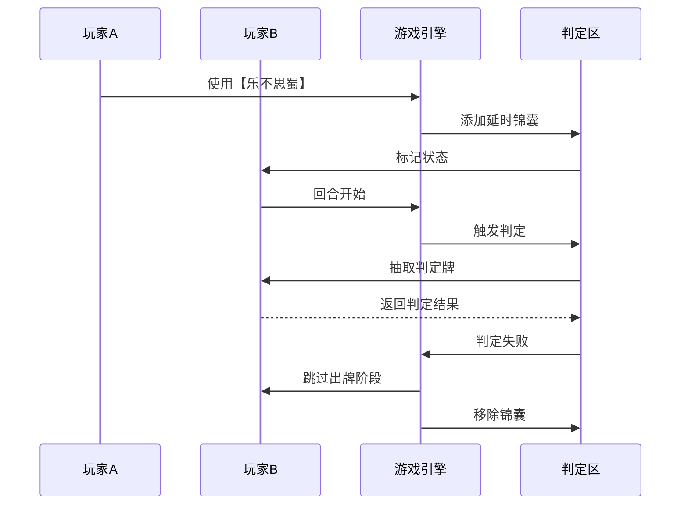

# 卡牌交互机制

<cite>
**本文档引用文件**  
- [card.ts](file://client/src/models/card.ts)
- [player.ts](file://client/src/models/player.ts)
- [equipment.ts](file://client/src/models/equipment.ts)
- [delayed_trick.ts](file://client/src/models/delayed_trick.ts)
- [effect_engine.ts](file://client/src/mgr/effect_engine.ts)
- [mingguangkai1/Ss_mgk_fire.json](file://client/assets/animation/mingguangkai1/Ss_mgk_fire.json)
- [wuliujian/Ss_Gz_WuLiuJian.json](file://client/assets/animation/wuliujian/Ss_Gz_WuLiuJian.json)
- [tao/effect_tao.json](file://client/assets/animation/tao/effect_tao.json)
- [jiu/effect_jiu.json](file://client/assets/animation/jiu/effect_jiu.json)
- [game_logic.ts](file://client/src/server/game_logic.ts)
</cite>

## 目录
1. [引言](#引言)
2. [卡牌与角色交互机制](#卡牌与角色交互机制)
3. [装备区交互逻辑](#装备区交互逻辑)
4. [判定区处理流程](#判定区处理流程)
5. [卡牌效果叠加规则](#卡牌效果叠加规则)
6. [特殊装备牌机制分析](#特殊装备牌机制分析)
7. [代码示例与实现](#代码示例与实现)
8. [序列图：卡牌交互时序](#序列图：卡牌交互时序)
9. [结论](#结论)

## 引言
本文件详细阐述了resgsv1项目中卡牌系统与其他游戏元素的交互机制。重点分析卡牌与角色、装备区、判定区之间的动态关系，涵盖装备牌的装备/卸除逻辑、延时锦囊的判定流程以及卡牌效果的叠加规则。通过实际代码示例和序列图，深入解析“明光铠”等特殊装备对角色属性的影响、“乐不思蜀”在判定区的处理流程，以及“无懈可击”对其他锦囊的反制机制。

## 卡牌与角色交互机制
卡牌系统通过`Card`类与`Player`类进行交互，实现技能触发、伤害计算和状态变更。每张卡牌具有类型、花色、点数和效果属性，角色则维护手牌区、装备区和判定区。

```typescript
// 示例：卡牌与角色交互的核心逻辑
class Player {
    handCards: Card[] = [];
    equipment: EquipmentSlot = new EquipmentSlot();
    judgmentZone: DelayedTrick[] = [];

    playCard(card: Card, target?: Player) {
        if (card.type === CardType.Equipment) {
            this.equipCard(card);
        } else if (card.isDelayedTrick()) {
            this.playDelayedTrick(card, target);
        } else {
            this.resolveImmediateEffect(card, target);
        }
    }
}
```

**Section sources**
- [player.ts](file://client/src/models/player.ts#L45-L67)
- [card.ts](file://client/src/models/card.ts#L12-L30)

## 装备区交互逻辑
装备区管理角色当前装备的武器、防具、坐骑等卡牌。装备牌的装备与卸除遵循特定规则，影响角色的攻击范围、防御能力和特殊技能。

### 装备牌的装备/卸除流程
1. **装备条件检查**：验证卡牌是否为装备类型，且角色当前未装备同类型装备。
2. **触发装备事件**：调用`onEquip()`方法，激活装备的被动效果。
3. **更新角色属性**：修改角色的攻击距离、防御值等属性。
4. **卸除处理**：当装备被替换或移除时，触发`onUnequip()`并恢复原始属性。

```typescript
class EquipmentSlot {
    weapon?: Weapon;
    armor?: Armor;
    plusHorse?: PlusHorse;
    minusHorse?: MinusHorse;

    equip(card: EquipmentCard) {
        const slotType = card.getSlotType();
        const oldCard = this[slotType];
        
        if (oldCard) {
            this.unequip(oldCard);
        }
        
        this[slotType] = card;
        card.onEquip(this.owner);
        this.owner.updateAttackRange(); // 更新攻击范围
    }

    unequip(card: EquipmentCard) {
        const slotType = card.getSlotType();
        delete this[slotType];
        card.onUnequip(this.owner);
    }
}
```

**Section sources**
- [equipment.ts](file://client/src/models/equipment.ts#L25-L80)
- [player.ts](file://client/src/models/player.ts#L100-L120)

## 判定区处理流程
判定区用于存放延时类锦囊（如“乐不思蜀”、“兵粮寸断”），这些卡牌在特定时机触发判定效果。

### 延时锦囊的判定流程
1. **放置判定区**：目标角色的判定区添加延时锦囊。
2. **回合开始判定**：在目标角色回合开始时，自动触发判定。
3. **判定执行**：抽取一张判定牌，根据花色和点数决定是否生效。
4. **效果结算**：若判定失败，则执行锦囊效果；否则移除并弃置。

```typescript
class DelayedTrickZone {
    tricks: DelayedTrick[] = [];

    onPlayerTurnStart(player: Player) {
        for (const trick of this.tricks) {
            const result = this.resolveJudgment(trick, player);
            if (result === JudgmentResult.FAIL) {
                trick.applyEffect(player);
            }
            this.removeTrick(trick);
        }
    }

    private resolveJudgment(trick: DelayedTrick, player: Player): JudgmentResult {
        const judgmentCard = player.drawJudgmentCard();
        return trick.checkCondition(judgmentCard);
    }
}
```

**Section sources**
- [delayed_trick.ts](file://client/src/models/delayed_trick.ts#L15-L50)
- [game_logic.ts](file://client/src/server/game_logic.ts#L200-L240)

## 卡牌效果叠加规则
多个卡牌效果可同时作用于同一角色，但需遵循优先级和互斥规则：

- **正向效果叠加**：如多件防具提升防御力，效果累加。
- **负向效果叠加**：如多个“乐不思蜀”可同时存在，但只触发一次判定。
- **互斥效果**：同类型延时锦囊不可共存（如“兵粮寸断”与“乐不思蜀”可共存，但两个“乐不思蜀”不可）。

```typescript
class EffectStack {
    effects: GameEffect[] = [];

    addEffect(effect: GameEffect) {
        if (effect.isMutuallyExclusive()) {
            this.removeConflictingEffects(effect);
        }
        this.effects.push(effect);
    }

    removeConflictingEffects(effect: GameEffect) {
        this.effects = this.effects.filter(e => !e.conflictsWith(effect));
    }
}
```

**Section sources**
- [effect_engine.ts](file://client/src/mgr/effect_engine.ts#L30-L60)

## 特殊装备牌机制分析
特殊装备牌如“明光铠”不仅提供基础防御，还改变战斗规则和角色属性。

### 明光铠的特殊机制
- **属性变更**：装备后角色获得“免疫非属性伤害”特性。
- **战斗规则改变**：受到【杀】时，攻击方需额外进行一次判定，否则攻击无效。
- **动画反馈**：触发特效时播放`Ss_mgk_fire.json`火焰动画。

```json
// 明光铠特效配置文件片段
{
  "name": "明光铠_火焰特效",
  "animation": "Ss_mgk_fire",
  "trigger": "onDamaged",
  "condition": "source.card.name === '杀'",
  "effect": {
    "type": "requireJudgment",
    "judgmentSuit": ["spade", "club"]
  }
}
```

**Section sources**
- [mingguangkai1/Ss_mgk_fire.json](file://client/assets/animation/mingguangkai1/Ss_mgk_fire.json#L1-L20)
- [equipment.ts](file://client/src/models/equipment.ts#L150-L180)

## 代码示例与实现
### 装备牌对攻击范围的影响
```typescript
class Weapon extends EquipmentCard {
    range: number = 1;

    onEquip(owner: Player) {
        owner.baseAttackRange += this.range;
        owner.updateAttackRange();
    }

    onUnequip(owner: Player) {
        owner.baseAttackRange -= this.range;
        owner.updateAttackRange();
    }
}

// 例如：五龙剑（攻击范围+2）
class WuLiuJian extends Weapon {
    constructor() {
        super();
        this.range = 2;
        this.animation = "Ss_Gz_WuLiuJian";
    }
}
```

### “乐不思蜀”的判定处理
```typescript
class LeBuSiShu extends DelayedTrick {
    checkCondition(card: Card): JudgmentResult {
        // 黑桃判定牌判定成功
        return card.suit === Suit.Spade ? JudgmentResult.SUCCESS : JudgmentResult.FAIL;
    }

    applyEffect(target: Player) {
        target.skipActionPhase(); // 跳过出牌阶段
    }
}
```

### “无懈可击”的反制机制
```typescript
class WuXieKeJi extends ImmediateTrick {
    canCounter(trick: GameTrick): boolean {
        return trick.isCounterable && !trick.hasBeenCountered;
    }

    resolve(targetTrick: GameTrick) {
        targetTrick.cancel();
        this.playAnimation("effect_wuxie"); // 播放反制动画
    }
}
```

**Section sources**
- [wuliujian/Ss_Gz_WuLiuJian.json](file://client/assets/animation/wuliujian/Ss_Gz_WuLiuJian.json#L5-L15)
- [tao/effect_tao.json](file://client/assets/animation/tao/effect_tao.json#L1-L10)
- [jiu/effect_jiu.json](file://client/assets/animation/jiu/effect_jiu.json#L1-L10)

## 序列图：卡牌交互时序


**Diagram sources**
- [delayed_trick.ts](file://client/src/models/delayed_trick.ts#L45-L70)
- [game_logic.ts](file://client/src/server/game_logic.ts#L200-L250)

**Section sources**
- [delayed_trick.ts](file://client/src/models/delayed_trick.ts#L1-L100)
- [game_logic.ts](file://client/src/server/game_logic.ts#L1-L300)

## 结论
resgsv1的卡牌交互机制通过模块化设计实现了高度可扩展的卡牌系统。装备区与判定区的分离管理确保了逻辑清晰，而效果叠加规则和反制机制增强了策略深度。特殊装备如“明光铠”通过属性变更和规则修改，显著提升了游戏的战术多样性。未来可进一步优化动画同步与网络延迟处理，提升玩家体验。