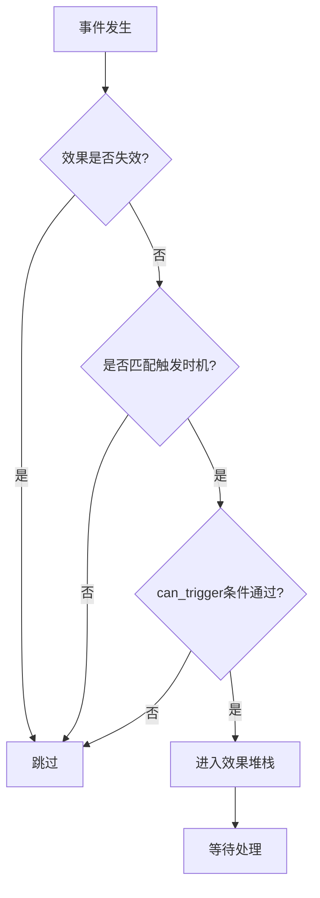
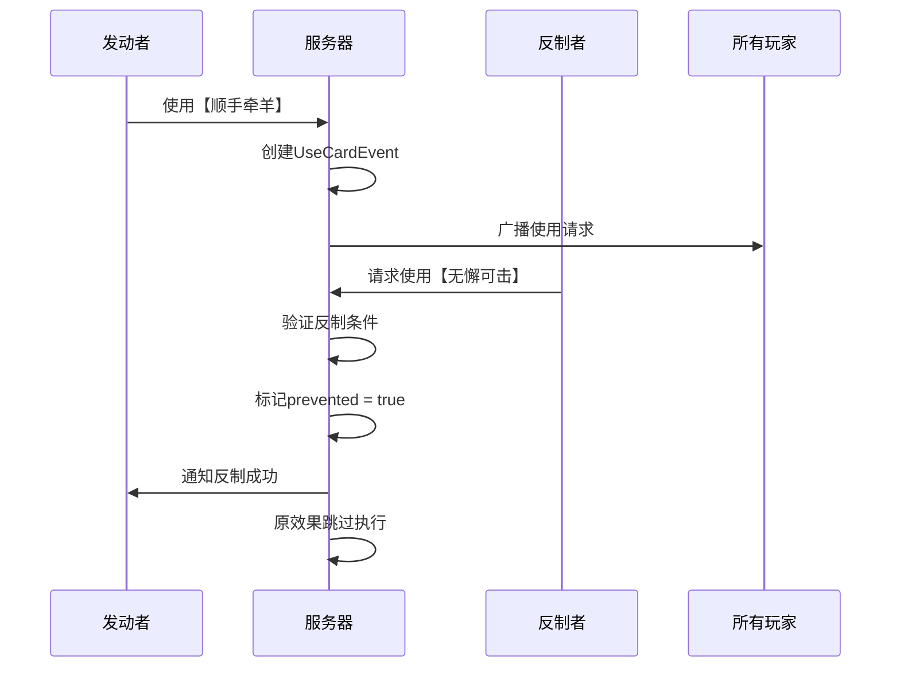
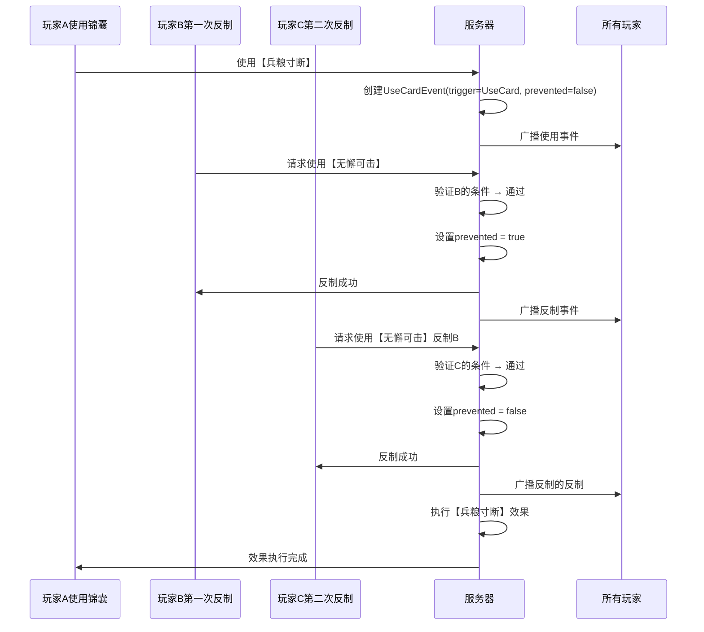

# 效果叠加规则

<cite>
**本文档引用文件**  
- [effect.ts](file://server/src/core/skill/effect.ts)
- [card.use.ts](file://server/src/core/card/card.use.ts)
- [wuxiekeji.ts](file://server/src/extensions/standard/cards/scroll/wuxiekeji.ts)
</cite>

## 目录
1. [引言](#引言)
2. [核心机制概述](#核心机制概述)
3. [效果堆栈与优先级处理](#效果堆栈与优先级处理)
4. [无懈可击的反制逻辑](#无懈可击的反制逻辑)
5. [多重效果叠加规则](#多重效果叠加规则)
6. [时序图：无懈可击的连续反制流程](#时序图无懈可击的连续反制流程)

## 引言

在resgsv1卡牌游戏中，效果叠加与反制机制是决定游戏策略深度的核心系统之一。本文件详细解析了“无懈可击”对其他锦囊牌的反制逻辑、多重效果的叠加规则以及优先级处理机制。通过分析`effect.ts`中的效果堆栈实现、`card.use.ts`中的效果触发顺序控制，以及`wuxiekeji.ts`中反制请求的处理流程，全面揭示了卡牌交互的底层机制。

**Section sources**
- [effect.ts](file://server/src/core/skill/effect.ts#L1-L465)
- [card.use.ts](file://server/src/core/card/card.use.ts#L1-L106)

## 核心机制概述

resgsv1中的卡牌效果分为**触发型效果**（TriggerEffect）和**状态型效果**（StateEffect），两者均继承自基类`Effect`。所有效果均绑定于特定玩家和房间，并具备失效检测、标记管理、技能标签识别等通用能力。

### 效果类型定义

```typescript
abstract class Effect {
    public readonly data: TriggerEffectData | StateEffectData;
    public readonly id: number;
    public readonly room: GameRoom;
    public readonly player: GamePlayer | undefined;
    public readonly skill: Skill | undefined;
    public regardSkills: Map<GamePlayer, Skill[]> = new Map();
    public readonly _invalids: string[] = [];
}
```

- **TriggerEffect**：响应特定事件触发的效果，如使用【杀】、受到伤害等。
- **StateEffect**：持续生效的状态效果，如“免疫火属性伤害”。
- **isInvalid**：判断效果是否失效，考虑技能标签、标记状态及全局状态影响。

**Section sources**
- [effect.ts](file://server/src/core/skill/effect.ts#L15-L100)

## 效果堆栈与优先级处理

### 效果堆栈实现（effect.ts）

效果堆栈通过`GameRoom`中的事件历史与效果管理器协同工作。每个效果在触发前会进行多重校验：

```typescript
public check(data?: EventData): boolean {
    if (this.isInvalid) return false;
    if (this.skill && !this.skill.check()) return false;
    if (this.isLimit) {
        const limit = this.player?.getMark<string>(`@limit:${this.id}`);
        if (!limit || limit === '@limit-false') return false;
    }
    // 其他校验...
    return true;
}
```

#### 优先级处理机制

1. **标签优先级**：`Eternal`（永恒）标签效果不会失效。
2. **状态覆盖**：通过`StateEffectType.Skill_Invalidity`可全局使某技能失效。
3. **触发时机匹配**：`TriggerEffect`必须匹配当前事件的`trigger`类型。
4. **条件函数校验**：`can_trigger`函数决定是否真正触发。



**Diagram sources**
- [effect.ts](file://server/src/core/skill/effect.ts#L100-L150)

**Section sources**
- [effect.ts](file://server/src/core/skill/effect.ts#L100-L200)

## 无懈可击的反制逻辑

### 反制机制实现（wuxiekeji.ts）

“无懈可击”作为反制锦囊，其核心逻辑在于拦截其他锦囊牌的效果。其`condition`函数判断目标锦囊是否可被反制：

```typescript
condition: (
    room: GameRoom,
    from: GamePlayer,
    card: VirtualCard,
    data: EventData
) => {
    // 仅当目标为锦囊牌且未被反制时可使用
    return data.trigger === Triggers.UseCard &&
           card.type === CardType.Scroll &&
           !data.data.prevented;
}
```

### 反制请求处理流程

1. 当玩家使用锦囊牌时，生成`UseCardEvent`事件。
2. 系统广播该事件，允许其他玩家响应“无懈可击”。
3. 响应者需在限定时间内提交反制请求。
4. 若反制成功，原锦囊效果被标记为`prevented: true`。
5. 原锦囊效果执行时检测到`prevented`，则跳过执行。



**Diagram sources**
- [wuxiekeji.ts](file://server/src/extensions/standard/cards/scroll/wuxiekeji.ts#L1-L50)
- [card.use.ts](file://server/src/core/card/card.use.ts#L50-L80)

**Section sources**
- [wuxiekeji.ts](file://server/src/extensions/standard/cards/scroll/wuxiekeji.ts#L1-L50)

## 多重效果叠加规则

### 卡牌使用技能定义（card.use.ts）

卡牌使用行为由`CardUseSkillData`接口定义，包含完整的使用逻辑链：

```typescript
interface CardUseSkillData {
    condition: () => boolean | VirtualCard;
    timeCondition: () => number;
    distanceCondition: () => boolean;
    target: () => ChoosePlayerData;
    onuse: () => Promise<void>;
    effect: () => Promise<void>;
}
```

### 叠加规则

1. **顺序执行**：`onuse` → `effect`，前者在使用前执行（如扣减次数），后者在目标确认后执行。
2. **条件叠加**：
   - `condition`：决定是否可使用（前置条件）
   - `timeCondition`：限制使用次数
   - `distanceCondition`：限制攻击距离
3. **目标选择独立**：`target`方法独立计算可选目标，不受其他条件影响。

### 示例：多重【无懈可击】叠加

当多个玩家连续使用“无懈可击”时，形成反制链：

1. 玩家A使用【乐不思蜀】→ 触发反制窗口
2. 玩家B使用【无懈可击】反制 → 成功，标记`prevented`
3. 玩家C使用【无懈可击】反制B的反制 → 成功，取消`prevented`
4. 原【乐不思蜀】继续执行

此过程体现了效果的**可逆性**与**堆栈性**。

**Section sources**
- [card.use.ts](file://server/src/core/card/card.use.ts#L1-L106)

## 时序图：无懈可击的连续反制流程



**Diagram sources**
- [wuxiekeji.ts](file://server/src/extensions/standard/cards/scroll/wuxiekeji.ts#L1-L50)
- [card.use.ts](file://server/src/core/card/card.use.ts#L30-L60)