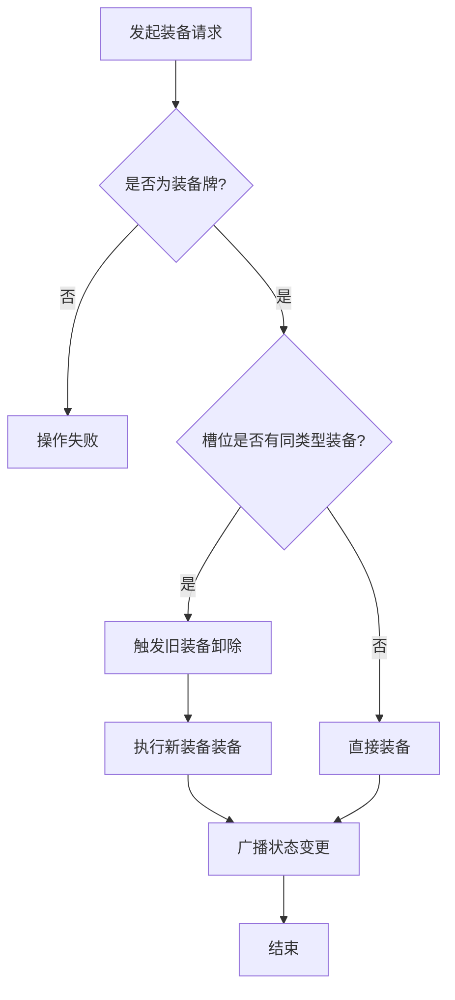
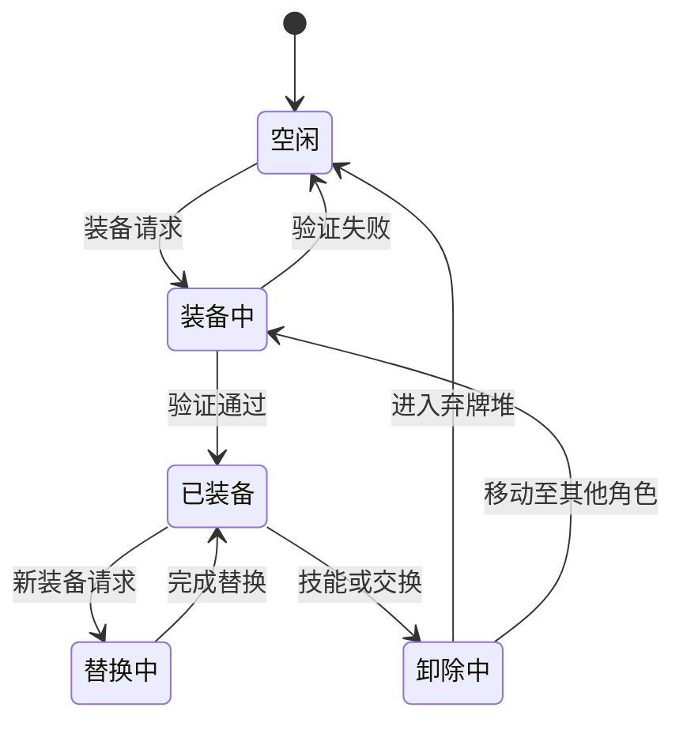

# 装备区管理

<cite>
**本文档引用文件**  
- [area.type.ts](file://server/src/core/area/area.type.ts)
- [card.ts](file://server/src/core/card/card.ts)
- [card.types.ts](file://server/src/core/card/card.types.ts)
- [player.ts](file://server/src/core/player/player.ts)
- [room.ts](file://server/src/core/room/mixins/room.card.ts)
- [muniuliuma.ts](file://server/src/extensions/wars/cards/equip/muniuliuma.ts)
</cite>

## 目录
1. [引言](#引言)
2. [装备区数据结构与槽位限制](#装备区数据结构与槽位限制)
3. [装备牌类型定义](#装备牌类型定义)
4. [装备操作逻辑分析](#装备操作逻辑分析)
5. [同类型装备替换规则](#同类型装备替换规则)
6. [装备区状态转换图](#装备区状态转换图)
7. [实际代码示例](#实际代码示例)

## 引言
本文档详细阐述resgsv1项目中装备区的管理机制，涵盖装备牌的装备、替换和卸除逻辑。通过分析核心代码文件，深入解析装备区的槽位限制、同类型装备的替换规则，并结合实际代码示例展示关键实现。同时提供状态图以直观展示装备区在不同游戏阶段的状态转换过程。

## 装备区数据结构与槽位限制

在resgsv1系统中，装备区作为玩家角色的重要组成部分，用于存放各类装备牌。每个玩家拥有独立的装备区，其数据结构由`Player`类中的`equipArea`字段维护。

根据`area.type.ts`文件定义，装备区的区域类型为`Equip`，其ID为92。装备区支持多种类型的装备，包括武器、防具、坐骑和宝物等。每种装备类型对应一个特定的槽位，确保同一类型装备在同一时间内只能存在一张。

**槽位限制规则如下：**
- 每个玩家仅能装备一张武器（Weapon）
- 每个玩家仅能装备一张防具（Armor）
- 每个玩家可同时装备一匹进攻坐骑（OffensiveMount）和一匹防御坐骑（DefensiveMount）
- 特殊坐骑（SpecialMount）和宝物（Treasure）各自占用独立槽位

该机制通过`Player`类的`getEquip`方法实现，确保对特定子类型的装备查询返回唯一结果。

**Section sources**
- [area.type.ts](file://server/src/core/area/area.type.ts#L1-L30)
- [player.ts](file://server/src/core/player/player.ts#L637-L679)

## 装备牌类型定义

装备牌的分类在`card.types.ts`文件中通过枚举`CardSubType`进行定义。该枚举明确了所有可能的卡牌子类型，其中与装备相关的子类型如下：

```typescript
export const enum CardSubType {
    None = 0,
    Basic = 1,
    InstantScroll = 21,
    DelayedScroll = 22,
    Weapon = 31,
    Armor = 32,
    DefensiveMount = 33,
    OffensiveMount = 34,
    SpecialMount = 35,
    Treasure = 36,
}
```

所有装备牌的主类型均为`CardType.Equip`，其具体功能由子类型决定。通过`Card`类的`type`属性可获取卡牌的主类型，该属性调用`sgs.utils.getCardType(this.name)`方法根据卡牌名称解析类型。

这种设计实现了类型与行为的解耦，使得新增装备牌只需定义名称和子类型，无需修改核心逻辑。

**Section sources**
- [card.types.ts](file://server/src/core/card/card.types.ts#L107-L127)
- [card.ts](file://server/src/core/card/card.ts#L143-L145)

## 装备操作逻辑分析

装备操作包括装备、替换和卸除三种基本行为，均由房间（Room）对象统一管理。`room.card.ts`文件中的事务处理逻辑确保了操作的原子性和一致性。

### 装备流程
1. 玩家选择一张手牌发起装备请求
2. 服务端验证该牌是否为装备牌
3. 检查目标槽位是否已有同类型装备
4. 若有，则触发旧装备的卸除逻辑
5. 将新装备置入装备区，并从手牌区移除
6. 广播状态更新消息

### 卸除逻辑
卸除操作通常由替换或技能触发。被卸除的装备将进入弃牌堆（Discard Area），除非特殊技能指定其他去向。例如，【木牛流马】的技能逻辑中，当装备移动目标区域不符合条件时，会将关联的“辎”牌置入弃牌堆。

**Section sources**
- [room.card.ts](file://server/src/core/room/mixins/room.card.ts)
- [muniuliuma.ts](file://server/src/extensions/wars/cards/equip/muniuliuma.ts#L94-L125)

## 同类型装备替换规则

系统严格遵循“同类型装备互斥”原则。当玩家试图装备一张新装备时，若其对应槽位已有装备，则自动触发替换机制。

替换过程本质上是“先卸除旧装备，再装备新装备”的原子操作。此过程会触发相关技能的时机判定，例如：
- 旧装备的“失去时”技能
- 新装备的“装备时”技能
- 其他角色的“装备变更”响应技能

在`selectors.js`中可见，选择器逻辑会过滤掉已装备同类型装备的目标角色，确保操作的合法性。



**Diagram sources**
- [selectors.js](file://server/build/extensions/standard/selectors.js#L576-L606)
- [room.card.ts](file://server/src/core/room/mixins/room.card.ts)

**Section sources**
- [selectors.js](file://server/build/extensions/standard/selectors.js#L576-L606)

## 装备区状态转换图



**Diagram sources**
- [area.type.ts](file://server/src/core/area/area.type.ts#L1-L30)
- [room.card.ts](file://server/src/core/room/mixins/room.card.ts)

## 实际代码示例

以下代码片段展示了【木牛流马】这一宝物装备的核心逻辑：

```typescript
exports.muniuliuma_skill.addEffect(sgs.TriggerEffect({
    trigger: "PlayPhaseProceeding",
    can_trigger(room, player, data) {
        return this.isOwner(player) && data.isOwner(player);
    },
    getSelectors(room, context) {
        const from = context.from;
        return {
            target: room.createChoosePlayer({
                filter(item, selected) {
                    return item !== from && !item.getEquip(EquipSubType.Treasure);
                }
            })
        };
    },
    options: {
        prompt: "木牛流马：你可以将木牛流马移至其他角色的装备区"
    }
}));
```

此代码定义了在出牌阶段，装备【木牛流马】的玩家可将其转移给其他未装备宝物的角色。过滤器确保目标角色的宝物槽位为空，体现了槽位限制的实际应用。

**Section sources**
- [muniuliuma.ts](file://server/src/extensions/wars/cards/equip/muniuliuma.ts#L94-L125)
- [card.types.ts](file://server/src/core/card/card.types.ts#L107-L127)