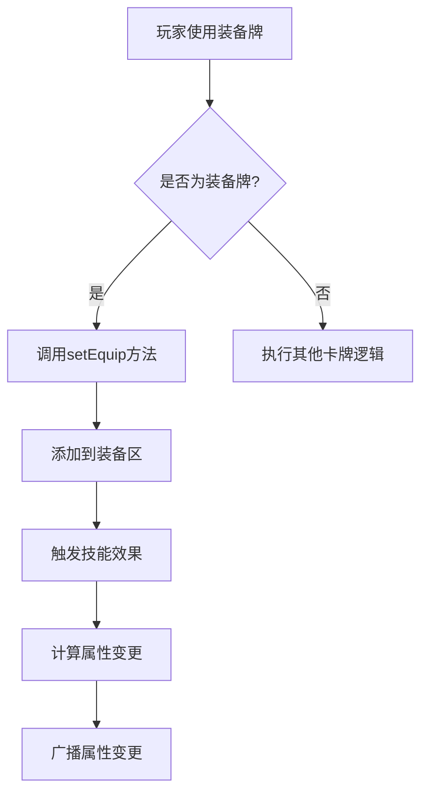
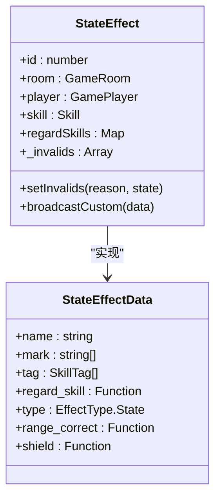
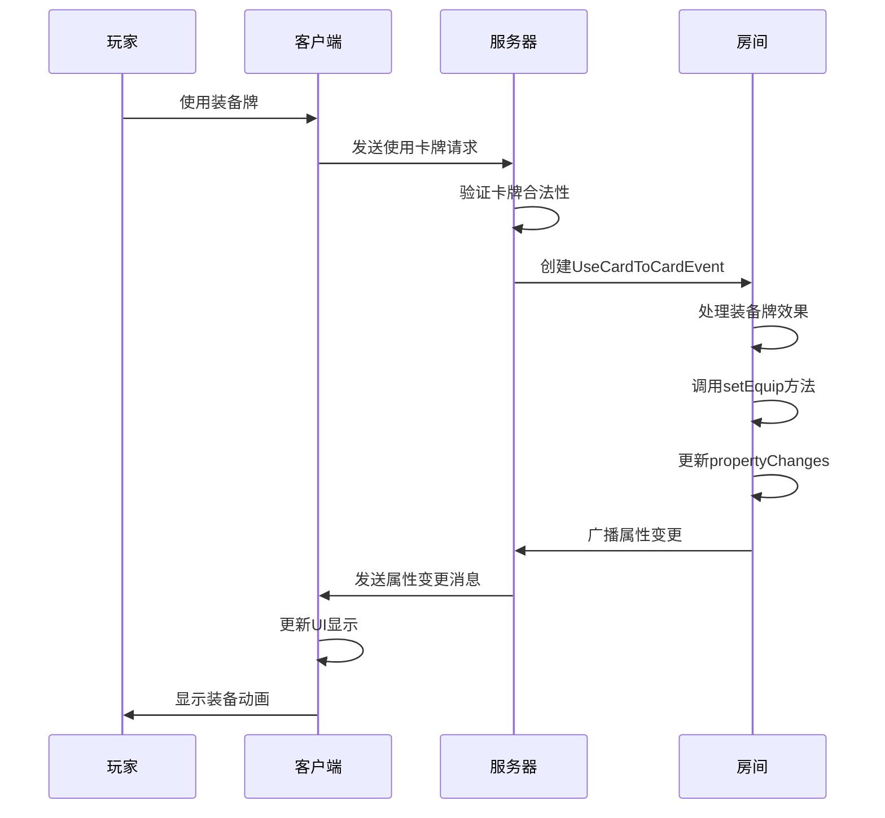

# 角色属性交互

<cite>
**本文档引用文件**   
- [player.ts](file://server/src/core/player/player.ts#L38-L451)
- [card.use.ts](file://server/src/core/card/card.use.ts#L74-L105)
- [room.ts](file://server/src/core/room/room.ts#L110-L148)
- [effect.ts](file://server/src/core/skill/effect.ts#L0-L44)
- [skill.types.ts](file://server/src/core/skill/skill.types.ts#L284-L497)
- [UIEquip.ts](file://client/src/ui/UIEquip.ts#L0-L43)
- [UIEquipSelf.ts](file://client/src/ui/UIEquipSelf.ts#L0-L42)
</cite>

## 目录
1. [角色属性交互概述](#角色属性交互概述)
2. [装备牌对角色属性的影响机制](#装备牌对角色属性的影响机制)
3. [特殊装备牌“明光铠”的技能效果分析](#特殊装备牌明光铠的技能效果分析)
4. [角色属性计算逻辑代码示例](#角色属性计算逻辑代码示例)
5. [卡牌使用时的属性变更处理](#卡牌使用时的属性变更处理)
6. [属性变更的广播机制](#属性变更的广播机制)
7. [卡牌装备时角色属性更新流程序列图](#卡牌装备时角色属性更新流程序列图)

## 角色属性交互概述

在resgsv1系统中，角色属性交互是游戏核心机制的重要组成部分。该机制通过装备牌、技能效果和系统事件的协同作用，实现对角色攻击范围、防御力、体力值等关键属性的动态调整。系统采用基于事件驱动的架构，确保属性变更的实时性和一致性。

**Section sources**
- [player.ts](file://server/src/core/player/player.ts#L38-L91)
- [skill.types.ts](file://server/src/core/skill/skill.types.ts#L284-L313)

## 装备牌对角色属性的影响机制

装备牌通过修改角色的攻击范围、防御力等属性来影响游戏策略。系统将装备牌分为武器、防具、进攻坐骑、防御坐骑和特殊坐骑等类型，每种类型对应不同的属性修改效果。

当玩家装备一张牌时，系统会调用`setEquip`方法将该牌添加到角色的装备区，并触发相应的技能效果。例如，装备武器会增加角色的攻击范围，装备防具会提升角色的护甲值。系统通过`StateEffect`机制来管理这些属性变更，确保变更的可追溯性和可逆性。



**Diagram sources**
- [player.ts](file://server/src/core/player/player.ts#L400-L443)
- [card.use.ts](file://server/src/core/card/card.use.ts#L564-L597)

**Section sources**
- [player.ts](file://server/src/core/player/player.ts#L400-L443)
- [card.use.ts](file://server/src/core/card/card.use.ts#L564-L597)

## 特殊装备牌"明光铠"的技能效果分析

"明光铠"作为特殊装备牌，通过`effect.ts`中的技能效果改变角色状态。其核心机制是通过`StateEffect`类型的效果来修改角色的防御属性和特殊能力。

在代码实现中，"明光铠"的效果被定义为一个`StateEffectData`对象，包含`regard_skill`、`mark`等属性。当角色装备"明光铠"时，系统会创建一个`StateEffect`实例，并将其添加到房间的效果列表中。这个效果会持续影响角色的防御力，并可能赋予角色特殊的免疫能力。



**Diagram sources**
- [effect.ts](file://server/src/core/skill/effect.ts#L0-L44)
- [skill.types.ts](file://server/src/core/skill/skill.types.ts#L284-L313)

**Section sources**
- [effect.ts](file://server/src/core/skill/effect.ts#L0-L44)
- [skill.types.ts](file://server/src/core/skill/skill.types.ts#L284-L313)

## 角色属性计算逻辑代码示例

在`player.ts`中，角色属性的计算逻辑通过一系列getter方法实现。这些方法综合考虑基础属性、装备效果和技能效果，最终得出角色的实际属性值。

以攻击范围计算为例，系统首先获取攻击范围的初始值，然后累加所有修正值，最后应用终值修正。这个过程确保了多个效果可以同时作用于同一属性，且计算结果符合游戏规则。

```typescript
/** 攻击范围 */
public get range() {
    // 终值状态技 会直接返回手牌上限状态技中对终值修改的最大值
    const fixeds = this.room.getStates(StateEffectType.Range_Fixed, [this]);
    if (fixeds.length > 0) {
        return Math.max(...fixeds);
    }
    // 初始值 对初始值修改的最大值
    const inits = this.room.getStates(StateEffectType.Range_Initial, [this]);
    let value = inits.length > 0 ? Math.max(...inits) : 1;
    // 修正值
    this.room
        .getStates(StateEffectType.Range_Correct, [this])
        .forEach((v) => {
            value += v;
        });
    return Math.max(0, value);
}
```

**Section sources**
- [player.ts](file://server/src/core/player/player.ts#L169-L211)

## 卡牌使用时的属性变更处理

在`card.use.ts`中，卡牌使用时的属性变更处理通过事件系统实现。当玩家使用一张装备牌时，系统会创建一个`UseCardToCardEvent`事件，并触发相应的处理逻辑。

处理流程包括：验证卡牌使用合法性、移动卡牌到处理区、应用卡牌效果、更新角色属性等步骤。系统通过`moveCards`方法实现卡牌的移动，并通过`propertyChanges`数组记录属性变更，为后续的广播机制提供数据支持。

```typescript
// 装备牌
else if (this.card.type === CardType.Equip) {
    if (this.targetList.length > 0) {
        const old_equips = this.targetList[0].target
            .getEquipCards()
            .filter((v) => v.subtype === this.card.subtype);
        if (old_equips.length > 0) {
            await this.room.moveCards({
                source: this,
                reason: 'use_equip',
                move_datas: [
                    {
                        cards: old_equips,
                        toArea: this.room.discardArea,
                        reason: MoveCardReason.PutTo,
                    },
                    {
                        cards: [this.card],
                        toArea: this.targetList[0].target.equipArea,
                        reason: MoveCardReason.PutTo,
                    },
                ],
            });
        }
    }
}
```

**Section sources**
- [card.use.ts](file://server/src/core/card/card.use.ts#L564-L597)

## 属性变更的广播机制

在`room.ts`中，属性变更的广播机制通过`broadcast`方法实现。当角色属性发生变更时，系统会将变更信息添加到`propertyChanges`数组中，并通过WebSocket广播给所有客户端。

广播机制确保了所有玩家都能实时看到角色属性的变化，维持了游戏状态的一致性。系统采用增量更新的方式，只广播发生变化的属性，减少了网络传输的数据量。

```typescript
// 设置装备牌
async setEquip(card) {
    if (card.type !== CardType.Equip) return;
    if (!this.equipCards.includes(card)) {
        this.room.propertyChanges.push([
            'player',
            this.playerId,
            'setEquip',
            card.id,
        ]);
        this.equipCards.push(card);
        const skill = await this.room.addSkill(card.name, this, {
            source: `equip:${card.id}`,
            showui: 'none',
        });
        if (skill) {
            skill.sourceEquip = card;
        }
    }
}
```

**Section sources**
- [room.ts](file://server/src/core/room/mixins/room.skill.ts#L110-L148)
- [player.ts](file://server/src/core/player/player.ts#L400-L443)

## 卡牌装备时角色属性更新流程序列图



**Diagram sources**
- [card.use.ts](file://server/src/core/card/card.use.ts#L564-L597)
- [room.ts](file://server/src/core/room/mixins/room.skill.ts#L110-L148)
- [player.ts](file://server/src/core/player/player.ts#L400-L443)

**Section sources**
- [card.use.ts](file://server/src/core/card/card.use.ts#L564-L597)
- [room.ts](file://server/src/core/room/mixins/room.skill.ts#L110-L148)
- [player.ts](file://server/src/core/player/player.ts#L400-L443)