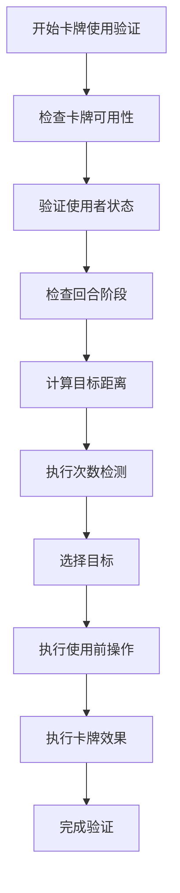
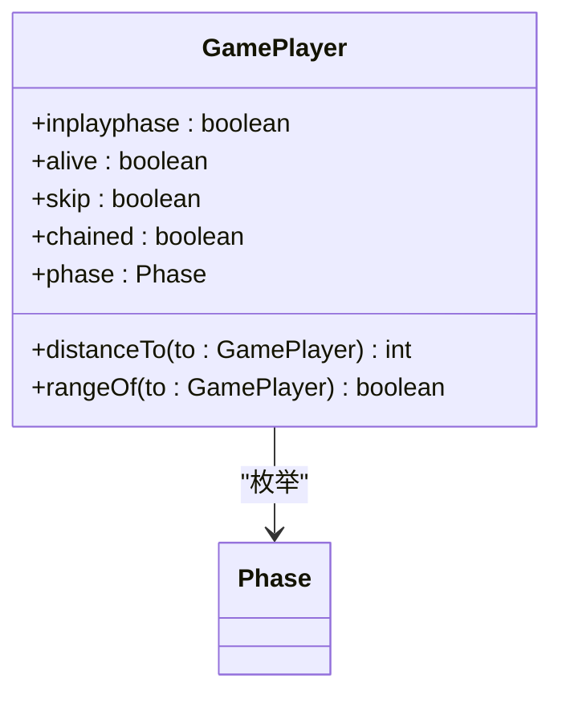
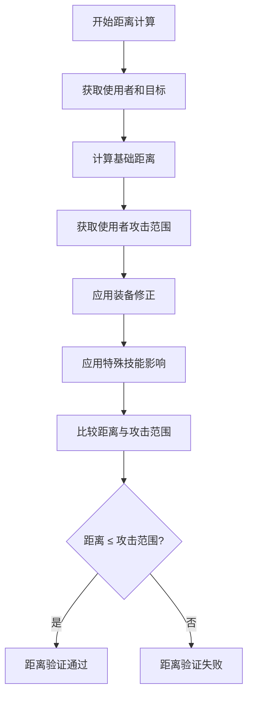
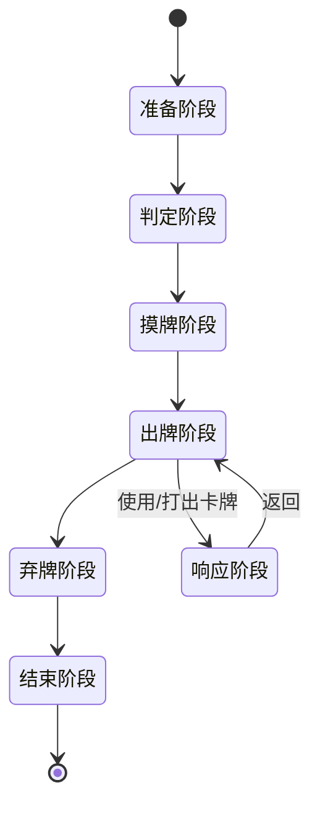
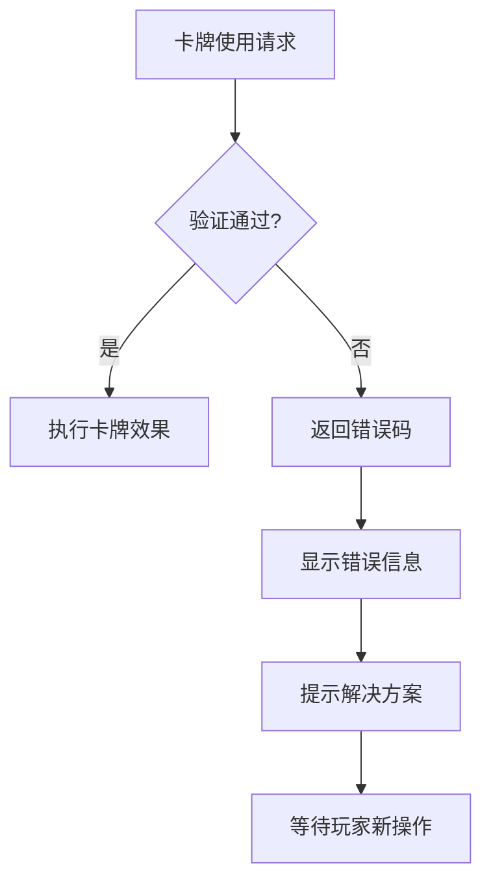

# 使用条件验证

<cite>
**本文档中引用的文件**
- [card.use.ts](file://server/src/core/card/card.use.ts)
- [card.types.ts](file://server/src/core/card/card.types.ts)
- [player.ts](file://server/src/core/player/player.ts)
- [room.ts](file://server/src/core/room/room.ts)
- [vcard.ts](file://server/src/core/card/vcard.ts)
</cite>

## 目录
1. [引言](#引言)
2. [卡牌使用验证机制概述](#卡牌使用验证机制概述)
3. [核心验证函数分析](#核心验证函数分析)
4. [距离计算算法详解](#距离计算算法详解)
5. [卡牌使用限制规则](#卡牌使用限制规则)
6. [常见验证失败场景与处理](#常见验证失败场景与处理)
7. [结论](#结论)

## 引言
本文档详细介绍了resgsv1项目中卡牌使用前的合法性检查机制。重点分析了卡牌使用验证的核心逻辑，包括卡牌可用性检查、使用者状态验证、回合阶段限制和距离计算等关键环节。通过深入解析相关代码实现，为开发者和玩家提供全面的卡牌使用条件验证指南。

## 卡牌使用验证机制概述

卡牌使用验证是游戏核心逻辑的重要组成部分，确保每张卡牌在使用时都符合游戏规则。该机制主要通过`CardUseSkillData`接口定义的多个验证函数来实现，涵盖了从基本可用性到复杂距离计算的全方位检查。



**图示来源**
- [card.use.ts](file://server/src/core/card/card.use.ts#L1-L105)

**本节来源**
- [card.use.ts](file://server/src/core/card/card.use.ts#L1-L105)

## 核心验证函数分析

### validateCardUsage函数实现逻辑

卡牌使用验证的核心在于`CardUseSkillData`接口中定义的多个验证函数。这些函数共同构成了完整的卡牌使用条件检查体系。

#### 卡牌可用性检查
通过`condition`函数检查卡牌是否可以使用。此函数在卡牌尚未被使用时调用，接收虚拟卡牌作为参数。

```typescript
/** 能否使用。此时牌还没有被使用。所以card为一张无实体牌对应的虚拟牌。data为触发需要使用事件的源事件 */
condition: (
    this: CardUseSkillData,
    room: GameRoom,
    from: GamePlayer,
    card: VirtualCard,
    data: EventData
) => boolean | VirtualCard;
```

该函数返回布尔值或虚拟卡牌对象，用于判断卡牌是否满足使用条件。

#### 使用者状态验证
使用者状态验证主要通过玩家对象的多个属性和方法实现，包括：

- `inplayphase`: 检查是否处于出牌阶段
- `alive`: 检查玩家是否存活
- `skip`: 检查是否处于翻面状态
- `chained`: 检查是否处于连环状态



**图示来源**
- [player.ts](file://server/src/core/player/player.ts#L0-L799)

**本节来源**
- [player.ts](file://server/src/core/player/player.ts#L0-L799)
- [card.use.ts](file://server/src/core/card/card.use.ts#L1-L105)

#### 回合阶段限制
回合阶段限制通过`trigger`属性和`phase`属性进行检查。`trigger`定义了卡牌的默认使用时机，而`phase`表示当前玩家所处的阶段。

```typescript
/** 默认使用时机 */
trigger: Triggers;
```

系统会比较当前阶段与卡牌允许的使用时机，确保卡牌只能在合适的阶段使用。

## 距离计算算法详解

### 基础距离计算规则

距离计算是卡牌使用验证中的关键环节，特别是在处理"杀"与"闪"这类需要指定目标的卡牌时。基础距离计算基于玩家的座次关系。

```typescript
/** 右边的玩家 */
public get right() {
    const seat = this.seat === this.room.players.length ? 1 : this.seat + 1;
    return this.room.players.find((v) => v.seat === seat);
}

/** 左边的玩家 */
public get left() {
    const seat = this.seat === 1 ? this.room.players.length : this.seat - 1;
    return this.room.players.find((v) => v.seat === seat);
}
```

### 装备牌对距离的影响

装备牌通过修改玩家的攻击范围来影响距离计算。玩家的`range`属性决定了其攻击范围，该属性会受到装备牌的修正。

```typescript
/** 攻击范围 */
public get range() {
    //终值状态技 会直接返回手牌上限状态技中对终值修改的最大值
    const fixeds = this.room.getStates(StateEffectType.Range_Fixed, [this]);
    if (fixeds.length > 0) {
        return Math.max(...fixeds);
    }
    //初值 对初值修改的最大值
    const inits = this.room.getStates(StateEffectType.Range_Initial, [this]);
    let value = inits.length > 0 ? Math.max(...inits) : 1;
    //修正值
    this.room
        .getStates(StateEffectType.Range_Correct, [this])
        .forEach((v) => {
            value += v;
        });
    return Math.max(0, value);
}
```

### 距离验证算法实现

距离验证通过`distanceCondition`函数实现，该函数检查从使用者到目标玩家的距离是否在允许范围内。

```typescript
/** 距离条件。默认返回true */
distanceCondition: (
    this: CardUseSkillData,
    room: GameRoom,
    from: GamePlayer,
    target: GamePlayer,
    card: VirtualCard
) => boolean;
```

实际的距离计算在`GameRoom`类中完成：

```typescript
/** 与其他角色的距离 */
public distanceTo(to: GamePlayer) {
    return this.room.distance(this, to);
}
```



**图示来源**
- [player.ts](file://server/src/core/player/player.ts#L0-L799)
- [room.ts](file://server/src/core/room/room.ts#L0-L799)

**本节来源**
- [player.ts](file://server/src/core/player/player.ts#L0-L799)
- [room.ts](file://server/src/core/room/room.ts#L0-L799)

## 卡牌使用限制规则

### 杀的使用次数限制

"杀"卡牌通常受到每回合使用次数的限制，这一限制通过`timeCondition`函数实现。

```typescript
/** 次数检测。默认返回Infinity */
timeCondition: (
    this: CardUseSkillData,
    room: GameRoom,
    from: GamePlayer,
    card: VirtualCard
) => number;
```

该函数返回一个数字，表示当前卡牌在当前情况下可以使用的次数。对于"杀"卡牌，通常会根据玩家状态和装备情况返回具体的使用次数。

### 特定卡牌的使用时机要求

不同卡牌有不同的使用时机要求，这些要求通过`trigger`属性定义。

```typescript
/** 默认使用时机 */
trigger: Triggers;
```

例如，基本牌通常只能在出牌阶段使用，而某些锦囊牌可能可以在响应阶段使用。系统会根据这个属性来判断卡牌是否可以在当前时机使用。



**图示来源**
- [card.use.ts](file://server/src/core/card/card.use.ts#L1-L105)
- [room.ts](file://server/src/core/room/room.ts#L0-L799)

**本节来源**
- [card.use.ts](file://server/src/core/card/card.use.ts#L1-L105)

## 常见验证失败场景与处理

### 距离超出限制

当目标玩家超出使用者的攻击范围时，验证会失败。处理方式包括：

1. 提示玩家选择其他目标
2. 建议玩家装备增加攻击范围的武器
3. 提示玩家使用其他不需要指定目标的卡牌

### 不在允许的使用阶段

如果玩家尝试在不允许的阶段使用卡牌，系统会拒绝并提示正确的使用时机。

```typescript
// 示例：检查是否在出牌阶段
if (!player.inplayphase && card.trigger === Triggers.PlayPhase) {
    return false; // 验证失败
}
```

### 使用次数已达上限

对于有使用次数限制的卡牌，当使用次数达到上限时，系统会阻止再次使用。

```typescript
// 示例：检查杀的使用次数
const availableTimes = card.timeCondition(room, player, card);
if (usedTimes >= availableTimes) {
    return false; // 验证失败
}
```



**图示来源**
- [card.use.ts](file://server/src/core/card/card.use.ts#L1-L105)
- [player.ts](file://server/src/core/player/player.ts#L0-L799)

**本节来源**
- [card.use.ts](file://server/src/core/card/card.use.ts#L1-L105)
- [player.ts](file://server/src/core/player/player.ts#L0-L799)

## 结论

卡牌使用条件验证机制是resgsv1项目中确保游戏规则正确执行的核心组件。通过`CardUseSkillData`接口定义的多个验证函数，系统能够全面检查卡牌使用的各种条件，包括可用性、使用者状态、回合阶段和距离限制等。

距离计算算法充分考虑了基础距离、装备修正和特殊技能等多种因素，确保了游戏的策略性和平衡性。同时，通过清晰的错误处理机制，为玩家提供了友好的反馈和指导。

这套验证机制的设计体现了模块化和可扩展性的原则，便于添加新的卡牌和规则，为游戏的持续发展奠定了坚实的基础。