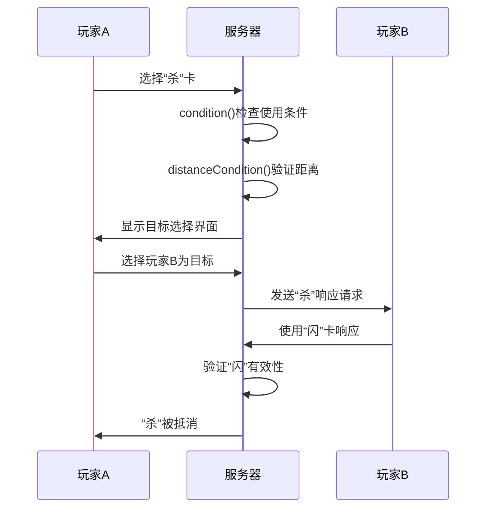
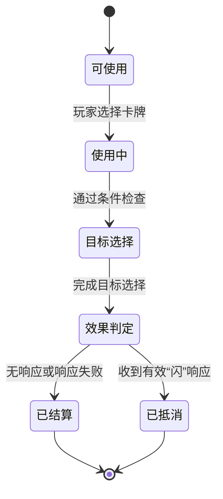

# 卡牌使用流程

<cite>
**本文档引用文件**  
- [card.use.ts](file://server/src/core/card/card.use.ts)
- [sha.ts](file://server/src/extensions/standard/cards/basic/sha.ts)
- [shan.ts](file://server/src/extensions/standard/cards/basic/shan.ts)
- [room.ts](file://server/src/core/room/room.ts)
- [event.use.ts](file://server/src/core/event/types/event.use.ts)
</cite>

## 目录
1. [引言](#引言)
2. [卡牌使用流程概述](#卡牌使用流程概述)
3. [卡牌使用逻辑处理](#卡牌使用逻辑处理)
4. [使用条件检查](#使用条件检查)
5. [目标选择](#目标选择)
6. [效果判定与结算执行](#效果判定与结算执行)
7. [回合规则限制](#回合规则限制)
8. [“杀”卡使用流程示例](#“杀”卡使用流程示例)
9. [卡牌使用状态图](#卡牌使用状态图)

## 引言
本文件详细阐述了resgsv1项目中卡牌从使用到结算的完整生命周期。重点分析了卡牌使用的核心逻辑，包括使用条件、目标选择、距离计算、响应机制和伤害结算等关键环节。通过代码实例和状态图，全面展示卡牌在游戏中的行为流程。

## 卡牌使用流程概述
卡牌使用是游戏回合中的核心交互行为，其流程遵循严格的阶段划分。一张卡牌从被玩家选中到最终生效，需经历四个主要阶段：使用条件检查、目标选择、效果判定和结算执行。整个过程由服务器端逻辑驱动，确保游戏规则的准确执行。

**Section sources**
- [card.use.ts](file://server/src/core/card/card.use.ts#L1-L105)

## 卡牌使用逻辑处理
卡牌使用的核心逻辑定义在`card.use.ts`文件中，通过`CardUseSkillData`接口描述卡牌的完整行为规范。该接口定义了卡牌使用所需的全部方法和条件。

```mermaid
classDiagram
class CardUseSkillData {
+name : string
+method : number
+trigger : Triggers
+sameTime? : boolean
+effects? : string[]
+prompt() : { prompt? : CustomString; thinkPrompt? : CustomString }
+condition() : boolean | VirtualCard
+timeCondition() : number
+distanceCondition() : boolean
+target() : ChoosePlayerData
+onuse() : Promise~void~
+effect() : Promise~void~
}
```

**Diagram sources**
- [card.use.ts](file://server/src/core/card/card.use.ts#L15-L55)

### 核心属性说明
- **name**: 卡牌名称，如“sha”（杀）、“shan”（闪）
- **method**: 使用方法标识
- **trigger**: 默认使用时机，如出牌阶段或响应阶段
- **condition**: 使用条件检查函数
- **timeCondition**: 使用次数限制
- **distanceCondition**: 距离条件检查
- **target**: 目标选择配置
- **onuse**: 使用前执行的逻辑
- **effect**: 卡牌核心效果

**Section sources**
- [card.use.ts](file://server/src/core/card/card.use.ts#L15-L55)

## 使用条件检查
使用条件检查是卡牌使用的第一个环节，由`condition`函数执行。该函数在卡牌被选中但尚未正式使用时调用，用于验证当前状态下是否允许使用该卡牌。

```typescript
condition(room, from, card, data) {
    if (
        data.is(sgs.DataType.UseCardEvent) &&
        data.card.name === 'sha' &&
        data.current.target === from
    ) {
        return data.card;
    }
}
```

此逻辑确保只有在响应“杀”时，玩家才能使用“闪”进行防御。

**Section sources**
- [shan.ts](file://server/src/extensions/standard/cards/basic/shan.ts#L15-L23)

## 目标选择
目标选择阶段由`target`函数定义，它返回一个`ChoosePlayerData`对象，用于配置目标选择器。系统会根据此配置生成目标选择界面。

```typescript
target(room, from, card) {
    const count =
        room
            .getStates(StateEffectType.TargetMod_CardLimit, [from, card])
            .at(-1) ?? 1;
    return room.createChoosePlayer({
        count,
        filter(item, selected) {
            return from !== item;
        },
    });
}
```

该逻辑限制玩家不能选择自己为目标，并根据状态效果调整可选择目标数量。

**Section sources**
- [sha.ts](file://server/src/extensions/standard/cards/basic/sha.ts#L15-L25)

## 效果判定与结算执行
效果判定与结算由`effect`函数完成，这是卡牌实际产生游戏影响的阶段。

```typescript
async effect(room, target, data: UseCardEvent) {
    const { card, from, current, baseDamage = 1 } = data;
    let damageType = DamageType.None;
    if (card.hasAttr(CardAttr.Thunder)) {
        damageType = DamageType.Thunder;
    }
    if (card.hasAttr(CardAttr.Fire)) {
        damageType = DamageType.Fire;
    }
    await room.damage({
        from,
        to: current.target,
        number: baseDamage,
        damageType,
        channel: card,
        isChain: false,
        source: data,
        reason: this.name,
    });
}
```

此逻辑根据卡牌属性（雷、火）确定伤害类型，并调用`room.damage`执行伤害结算。

**Section sources**
- [sha.ts](file://server/src/extensions/standard/cards/basic/sha.ts#L45-L75)

## 回合规则限制
玩家在回合中使用卡牌受到多项规则限制：

### 距离计算
距离由`room.distance`方法计算，考虑玩家位置和装备效果：
```typescript
public distance(from: GamePlayer, to: GamePlayer) {
    if (from.notDistanceCalc || to.notDistanceCalc) return Infinity;
    if (from === to) return 0;
    // 计算顺时针和逆时针距离，取最小值
    let initright = 0;
    for (let next = from.right; ; next = next.right) {
        if (next.notDistanceCalc) continue;
        initright++;
        if (next === to) break;
    }
    // ... 逆时针计算
    return Math.min(initright, initleft);
}
```

### 目标数量限制
通过`timeCondition`和状态系统限制使用次数：
```typescript
timeCondition(room, from, card) {
    return 1;
}
```

### 使用时机
由`trigger`属性定义，如`PlayPhaseProceeding`表示出牌阶段。

**Section sources**
- [room.ts](file://server/src/core/room/room.ts#L1149-L1181)
- [sha.ts](file://server/src/extensions/standard/cards/basic/sha.ts#L10-L13)

## “杀”卡使用流程示例
以“杀”卡为例，展示完整使用流程：

1. **条件检查**：验证是否在出牌阶段，且有足够使用次数
2. **距离验证**：调用`distanceCondition`检查目标是否在攻击范围内
3. **目标选择**：生成目标选择器，玩家选择一名其他角色
4. **闪的响应**：目标玩家有机会使用“闪”进行响应
5. **伤害结算**：若无有效响应，则执行`effect`函数造成伤害



**Diagram sources**
- [sha.ts](file://server/src/extensions/standard/cards/basic/sha.ts)
- [shan.ts](file://server/src/extensions/standard/cards/basic/shan.ts)

## 卡牌使用状态图
卡牌使用具有明确的生命周期状态，从可使用到已结算的完整转换过程如下：



**Diagram sources**
- [event.use.ts](file://server/src/core/event/types/event.use.ts#L1002-L1049)